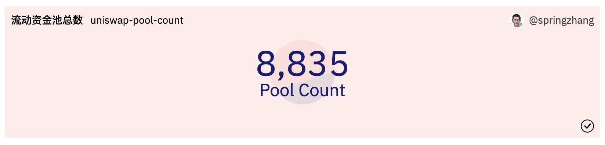
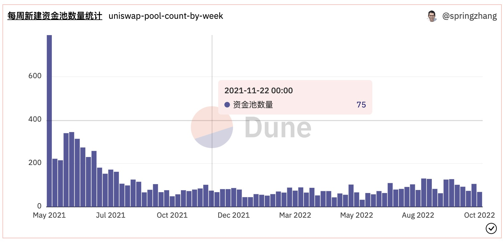

# 新手上路--创建第一个Dune数据看板

## 0. 写在前面

我们的教程偏重实战，结合日常链上数据分析的场景与需求来编写。本文将结合Uniswap协议的一个已解析表来带领大家做一个简单的数据看板。本教程为入门级，主要面向希望学习数据分析的新手用户。我们假定您之前并无编写SQL查询的经验，有SQL经验但不熟悉Dune平台的用户也可快速浏览本教程。本教程主要包括以下内容：Dune平台简介，SQL查询快速入门、编写查询并创建可视化图表、使用查询图表创建数据看板。完成后的数据看板的示例：[https://dune.com/sixdegree/uniswap-v3-pool-tutorial](https://dune.com/sixdegree/uniswap-v3-pool-tutorial)。

我们相信，只要你有信心并跟随我们的教程动手实践，你也可以做出高质量的数据看板，迈出成为链上数据分析师的第一步。

## 1. Dune 平台简介

### Dune平台是什么
[Dune](https://dune.com/)是一个强大的区块链数据分析平台，以SQL数据库的方式提供原始区块链数据和已解析的数据。通过使用SQL查询，我们可以从Dune的数据库中快速搜索和提取各种区块链信息，然后将其转换为直观的可视化图表。以此来获得信息和见解。

### Dune的数据看板和查询

数据看板（Dashboard）是Dune上内容的载体，由各种小部件（Widget）组成。这些小部件可以是从Query查询结果生成的可视化图表或文本框，你还可以在文本框中嵌入图像、链接等。查询（Query）是Dune数据面板的主要数据来源。我们通过编写SQL语句，执行查询并在结果集上生成可视化图表，再将图表添加到对应的数据看板中。

使用Dune处理数据的一般过程可以概括为：编写SQL查询显示数据 -》可视化查询结果 -》在数据看板中组装可视化图表 -》调整美化数据看板。关于Dune平台的使用，可以查看其[官方文档](https://dune.com/docs/)。Dune最新文档的中文版本目前正在翻译整理中，你可以在这里找到V1版本的[Dune中文文档](https://docs.dune.com/v/chinese/)。

## 2. 数据库基础知识

在开始编写我们的数据看板所需的第一个SQL查询之前，我们需要先了解一些必备的SQL查询基础知识。

### 数据库的基本概念介绍

**数据库（Database）**：数据库是结构化信息或数据的有序集合，是按照数据结构来组织、存储和管理数据的仓库。Dune平台目前提供了多个数据库，分别支持来自不同区块链的数据。本教程使用Dune平台的“Dune Engine V2 (Beta)”数据库，通常被称为V2 Engine或者简称V2。与此对照，Dune平台支持的其他数据库也被统称为V1。

**模式（Schema）**：同一个数据库中，可以定义多个模式。我们暂时可以将模式简单理解为数据表的拥有者（Owner）。不同的模式下可以存在相同名称的数据表。

**数据表（Table）**：数据表是由表名、表中的字段和表的记录三个部分组成的。数据表是我们编写SQL查询访问的主要对象。Dune将来自不同区块链的数据分别存贮到不同模式下的多个数据表中供我们查询使用。使用数据表编写查询时，我们用`schema_name.table_name`的格式来指定查询要使用的数据表名称。例如`ethereum.transactions`表示`ethereum`模式下的`transactions`表，即以太坊的交易表。同一个模式下的数据表名称必须唯一，但是相同名称的数据表可以同时存在于多个不同的模式下。例如V2中同时存在`ethereum.transactions`和`bnb.transactions`表。

**数据列（Column）**：数据列也称为字段（Field），有时也简称为“列”，是数据表存贮数据的基本单位。每一个数据表都包含一个或多个列，分别存贮不同类型的数据。编写查询时，我们可以返回全部列或者只返回需要的数据列。通常，只返回需要的最少数据可以提升查询的效率。

**数据行（Row）**：数据行也称为记录（Record）。每一个记录包括数据表定义的多个列的数据。SQL查询执行得到的结果就是一个或多个记录。查询输出的记录集通常也被称为结果集（Results）。

### 本教程使用的数据表

在本节的SQL查询示例中，我们使用ERC20代币表`token.erc20`做例子。ERC20代币表是由Dune社区用户通过魔法书（Spellbook）方式生成的抽象数据表（Spells，也称为Abstractions）。除了生成方式不同，这种类型的数据表的使用方式跟其他表完全一样。ERC20代币表保存了Dune支持检索的不同区块链上面的兼容ERC20标准的主流代币的信息。对于每种代币，分别记录了其归属的区块链、代币合约地址、代币支持的小数位数和代币符号信息。

ERC20代币表`token.erc20`的结构如下：

| **列名**                 | **数据类型**   | **说明**                                    |
| ----------------------- | ------------- | ------------------------------------------ |
| blockchain              | string        | 代币归属的区块链名称                           |
| contract\_address       | string        | 代币的合约地址                                |
| decimals                | integer       | 代币支持的小数位数                             |
| symbol                  | string        | 代币的符号                                    |

## SQL查询快速入门

广义的SQL查询语句类型包括新增（Insert）、删除（Delete）、修改（Update）、查找（Select）等多个类型。狭义的SQL查询主要指使用Select语句进行数据检索。链上数据分析绝大多数时候只需使用Select语句就能完成工作，所以我们这里只介绍Select查询语句。后续内容中我们会交替使用查询、Query、Select等词汇，如无特别说明，都是指使用Select语句编写Query进行数据检索。

### 编写第一个查询

下面的SQL可以查询所有的ERC20代币信息：

```sql
select * from tokens.erc20
```

### Select 查询语句基本语法介绍

一个典型的SQL查询语句的结构如下所示：

```sql
select 字段列表
from 数据表
where 筛选条件
order by 排序字段
limit 返回记录数量
```

**字段列表**可以逐个列出查询需要返回的字段（数据列），多个字段之间用英文逗号分隔，比如可以这样指定查询返回的字段列表`contract_address, decimals, symbol`。也可以使用通配符`*`来表示返回数据表的全部字段。如果查询用到了多个表并且某个字段同时存在于这些表中，我们就需要用`table_name.field_name`的形式指定需要返回的字段属于哪一个表。

**数据表**以`schema_name.table_name`的格式来指定，例如`token.erc20`。我们可以用`as alias_name`的语法给表指定一个别名，例如：`from token.erc20 as t`。这样就可以同一个查询中用别名`t`来访问表`token.erc20`和其中的字段。

**筛选条件**用于按指定的条件筛选返回的数据。对于不同数据类型的字段，适用的筛选条件语法各有不同。字符串（`string`）类型的字段，可以用`=`，`like`等条件做筛选。日期时间（`datetime`）类型的字段可以用`>=`，`<=`，`between ... and ...`等条件做筛选。使用`like`条件时，可以用通配符`%`匹配一个或多个任意字符。多个筛选条件可以用`and`（表示必须同时满足）或`or`（表示满足任意一个条件即可）连接起来。

**排序字段**用于指定对查询结果集进行排序的判断依据，这里是一个或多个字段名称，加上可选的排序方向指示（`asc`表示升序，`desc`表示降序）。多个排序字段之间用英文逗号分隔。Order By排序子句还支持按照字段在Select子句中出现的位置来指定排序字段，比如`order by 1`表示按照Select子句中出现的第一个字段进行排序（默认升序）。

**返回记录数量**用于指定（限制）查询最多返回多少条满足条件的记录。区块链保存的是海量数据，通常我们需要添加返回记录数量限制来提高查询的效率。

下面我们举例说明如何使用查询的相关部分。注意，在SQL语句中，我们可以`--`添加单行注释说明。还可以使用`/*`开头和`*/`结尾将多行内容标记为注释说明。注释内容不会被执行。

**指定返回的字段列表：**

```sql
select blockchain, contract_address, decimals, symbol   -- 逐个指定需要返回的列
from tokens.erc20
```

**添加筛选条件：**

```sql
select blockchain, contract_address, decimals, symbol
from tokens.erc20
where blockchain = 'ethereum'   -- 只返回以太坊区块链的ERC20代币信息
```

**使用多个筛选条件：**

```sql
select blockchain, contract_address, decimals, symbol
from tokens.erc20
where blockchain = 'ethereum'   -- 返回以太坊区块链的ERC20代币信息
    and symbol like 'E%'    -- 代币符号以字母E开头
```

**指定排序字段：**

```sql
select blockchain, contract_address, decimals, symbol
from tokens.erc20
where blockchain = 'ethereum'   -- 返回以太坊区块链的ERC20代币信息
    and symbol like 'E%'    -- 代币符号以字母E开头
order by symbol asc -- 按代币符号升序排列
```

**指定多个排序字段：**

```sql
select blockchain, contract_address, decimals, symbol
from tokens.erc20
where blockchain = 'ethereum'   -- 返回以太坊区块链的ERC20代币信息
    and symbol like 'E%'    -- 代币符号以字母E开头
order by decimals desc, symbol asc  -- 先按代币支持的小数位数降序排列，再按代币符号升序排列
```

**使用Limit子句限制返回的最大记录数量：**

```sql
select *
from tokens.erc20
limit 10
```

### Select查询常用的一些函数和关键词

#### As定义别名

可以通过使用“as”子句给表、字段定义别名。别名对于表名（或字段名）较长、包含特殊字符或关键字等情况，或者需要对输出字段名称做格式化时，非常实用。别名经常用于计算字段、多表关联、子查询等场景中。

```sql
select t.contract_address as `代币合约地址`,
    t.decimals as `代币小数位数`,
    t.symbol as `代币符号`
from tokens.erc20 as t
limit 10
```
实际上为了书写更加简洁，定义别名时`as`关键词可以省略，可以直接将别名跟在表名或字段名后，用一个空格分隔。下面的查询，功能和上一个查询完全相同。

```sql
-- 定义别名时，as 关键词可以省略
select t.contract_address `代币合约地址`,
    t.decimals `代币小数位数`,
    t.symbol `代币符号`
from tokens.erc20 t
limit 10
```

#### Distinct筛选唯一值

通过使用`distinct`关键词，我们可以筛选出出现在Select子句列表中的字段的唯一值。当Select子句包含多个字段时，返回的是这些字段的唯一值当组合。

```sql
select distinct blockchain
from tokens.erc20
```

#### Now 获取当前系统日期时间

使用`now()`可以获得当前系统的日期时间值。我们还可以使用`current_date`来得到当前系统日期，注意这里不需要加括号。

```sql
select now(), current_date
```

#### Date_Trunc 截取日期

区块链中的日期时间字段通常是以“年-月-日 时:分:秒”的格式保存的。如果要按天、按周、按月等进行汇总统计，可以使用`date_trunc()`函数对日期先进行转换。例如：`date_trunc('day', block_time`将block_time的值转换为以“天”表示的日期值，`date_trunc('month', block_time`将block_time的值转换为以“月”表示的日期值。

```sql
select now(),
    date_trunc('day', now()) as today,
    date_trunc('month', now()) as current_month
```

#### Interval获取时间间隔

使用`interval '2 days'`这样的语法，我们可以指定一个时间间隔。支持多种不同的时间间隔表示方式，比如：`'12 hours'`，`'7 days'`，`'3 months'`, `'1 year'`等。时间间隔通常用来在某个日期时间值的基础上增加或减少指定的间隔以得到某个日期区间。

```sql
select now() as current_time, 
    (now() - interval '2 hours') as two_hours_ago, 
    (now() - interval '2 days') as two_days_ago,
    (current_date - interval '1 year') as one_year_ago
```

#### Concat连接字符串

我们可以使用`concat()`函数将多个字符串连接到一起的到一个新的值。还可以使用更简洁的连接操作符`||`。

```sql
select concat('Hello ', 'world!') as hello_world,
    'Hello' || ' ' || 'world' || '!' as hello_world_again
```

#### Cast转换字段数据类型

SQL查询种的某些操作要求相关的字段的数据类型一致，比如concat()函数就需要参数都是字符串`string`类型。如果需要将不同类型的数据连接起来，我们可以用`cast()`函数强制转换为需要的数据类型，比如：`cast(25 as string)`将数字25转换为字符串“25”。还可以使用`::data_type`操作符方式完成类型转换，比如：`'123'::numeric`将字符串转换为数值类型。

```sql
select (cast(25 as string) || ' users') as user_counts,
    ('123'::numeric + 55) as digital_count
```

#### Power求幂

区块链上的ERC20代币通常都支持很多位的小数位。以太坊的官方代币ETH支持18位小数，因为相关编程语言的限制，代币金额通常是以整数形式存贮的，使用时必须结合支持的小数位数进行换算才能得到正确的金额。使用`power()`函数，或者`pow()`可以进行求幂操作实现换算。在Dune V2中，可以用简洁的形式表示10的N次幂，例如`1e18`等价于`power(10, 18)`。

```sql
select 1.23 * power(10, 18) as raw_amount,
    1230000000000000000 / pow(10, 18) as original_amount,
    7890000 / 1e6 as usd_amount
```

### Select查询进阶

#### Group By分组与常用汇总函数

SQL中有一些常用的汇总函数，`count()`计数，`sum()`求和，`avg()`求平均值，`min()`求最小值，`max()`求最大值等。除了对表中所有数据汇总的情况外，汇总函数通常需要结合分组语句`group by`来使用，按照某个条件进行分组汇总统计。Group By分组子句的语法为`group by field_name`，还可以指定多个分组字段`group by field_name1. field_name2`。与Order By子句相似，也可以按字段在Select子句中出现的位置来指定分组字段，这样可以让我们的SQL更加简洁。例如`group by 1`表示按第一个字段分组，`group by 1, 2`表示同时按第一个和第二个字段分组。我们通过一些例子来说明常用汇总函数的用法。

**统计目前支持的各个区块链的ERC20代币类型数量：**

```sql
select blockchain, count(*) as token_count
from tokens.erc20
group by blockchain
```

**统计支持的所有区块链的代币类型总数量、平均值、最小值、最大值：**

```sql
-- 这里为了演示相关函数，使用了子查询
select count(*) as blockchain_count,
    sum(token_count) as total_token_count,
    avg(token_count) as average_token_count,
    min(token_count) as min_token_count,
    max(token_count) as max_token_count
from (
    select blockchain, count(*) as token_count
    from tokens.erc20
    group by blockchain
)
```

#### 子查询（Sub Query）

子查询（Sub Query）是嵌套在一个Query中的Query，子查询会返回一个完整的数据集供外层查询（也叫父查询、主查询）进一步查询使用。当我们需要必须从原始数据开始通过多个步骤的查询、关联、汇总操作才能得到理想的输出结果时，我们就可以使用子查询。将子查询放到括号之中并为其赋予一个别名后，就可以像使用其他数据表一样使用子查询了。

在前面的例子中就用到了子查询`from ( 子查询语句 )`，这里不再单独举例。

#### 多表关联（Join）

当我们需要从相关的多个表分别取数据，或者从同一个表分别取不同的数据并连接到一起时，就需要使用多表关联。多表关联的基本语法为：`from table_a inner join table_b on table_a.field_name = table_b.field_name`。其中`table_a`和`table_b`可以是不同的表，也可以是同一个表，可以有不同的别名。

下面的查询使用`tokens.erc20`与其自身关联，来筛选出同时存在于以太坊区块链和币安区块链上且代币符号相同的记录：

```sql
select a.symbol,
    a.decimals,
    a.blockchain as blockchain_a,
    a.contract_address as contract_address_a,
    b.blockchain as blockchain_b,
    b.contract_address as contract_address_b
from tokens.erc20 a
inner join tokens.erc20 b on a.symbol = b.symbol
where a.blockchain = 'ethereum'
    and b.blockchain = 'bnb'
```

#### 集合（Union）

当我们需要将来自不同数据表的记录合并到一起，或者将由同一个数据表取出的包含不同字段的结果集合并到一起时，可以使用`Union`或者`Union All`集合子句来实现。`Union`会自动去除合并后的集合里的重复记录，`Union All`则不会做去重处理。对于包括海量数据的链上数据库表，去重处理有可能相当耗时，所以建议尽可能使用`Union All`以提升查询效率。

因为暂时我们尽可能保持简单，下面演示集合的SQL语句可能显得意义不大。不过别担心，这里只是为了显示语法。后续我们在做数据看板的部分有更合适的例子：

```sql
select contract_address, symbol, decimals
from tokens.erc20
where blockchain = 'ethereum'

union all

select contract_address, symbol, decimals
from tokens.erc20
where blockchain = 'bnb'
```

#### Case 语句

使用Case语句，我们可以基于某个字段的值来生成另一种类型的值，通常是为了让结果更直观。举例来说，ERC20代币表有一个`decimals`字段，保存各种代币支持的小数位数。如果我们想按支持的小数位数把各种代币划分为高精度、中等精度和低精度、无精度等类型，则可以使用Case语句进行转换。

```sql
select (case when decimals >= 10 then 'High precision'
            when decimals >= 5 then 'Middle precision'
            when decimals >= 1 then 'Low precision'
            else 'No precision'
        end) as precision_type,
    count(*) as token_count
from tokens.erc20
group by 1
order by 2 desc
```

#### CTE公共表表达式
公共表表达式，即CTE（Common Table Expression），是一种在SQL语句内执行（且仅执行一次）子查询的好方法。数据库将执行所有的WITH子句，并允许你在整个查询的后续任意位置使用其结果。

CTE的定义方式为`with cte_name as ( sub_query )`，其中`sub_query`就是一个子查询语句。我们也可以在同一个Query中连续定义多个CTE，多个CTE之间用英文逗号分隔即可。按定义的先后顺序，后面的CTE可以访问使用前面的CTE。在后续数据看板部分的“查询6”中，你可以看到定义多个CTE的示例。将前面子查询的例子用CTE格式改写：

```sql
with blockchain_token_count as (
    select blockchain, count(*) as token_count
    from tokens.erc20
    group by blockchain
)

select count(*) as blockchain_count,
    sum(token_count) as total_token_count,
    avg(token_count) as average_token_count,
    min(token_count) as min_token_count,
    max(token_count) as max_token_count
from blockchain_token_count
```

## 3. 创建数据看板

到此为止，我们已经了解了创建第一个Dune数据看板所需要的全部知识点。下面将进入新的阶段，让我们一起来编写查询创建一个Dune数据看板。为了帮助大家更快上手实践，我们这个数据看板将结合具体的项目来制作。开始创建看板之前，我们还需要了解一些额外的背景知识。

请注意，我们不会详细描述每一个操作步骤。关于如何使用Dune的查询编辑器（Query Editor）和数据看板（Dashboard）的基础知识，你可以通过以下方式来学习：
- [Dune平台的官方文档](https://dune.com/docs/)（Dune）
- [Dune入门指南](https://mirror.xyz/0xa741296A1E9DDc3D6Cf431B73C6225cFb5F6693a/iVzr5bGcGKKCzuvl902P05xo7fxc2qWfqfIHwmCXDI4)（SixDegreeLab成员Louis Wang翻译）
- [Dune Analytics零基础极简入门指南](https://mirror.xyz/gm365.eth/OE_CGx6BjCd-eQ441139sjsa3kTyUsmKVTclgMv09hY)（Dune社区用户gm365撰写）

### 背景知识

Uniswap是最流行的去中心化金融（DeFi）协议之一，是一套持久的且不可升级的智能合约，它们共同创建了一个自动做市商（AMM），该协议主要提供以太坊区块链上的点对点ERC20代币的交换。
Uniswap工厂合约（Factory）部署新的智能合约来创建流动资金池（Pool），将两个ERC20代币资产进行配对，同时设置不同的费率（fee）。流动性（Liquidity）是指存储在Uniswap资金池合约中的数字资产，可供交易者进行交易。流动性提供者（Liquidity Provider，简称LP）是将其拥有的ERC20代币存入给定的流动性池的人。流动性提供者获得交易费用的补偿作为收益，同时也承担价格波动带来的风险。普通用户（Swapper）通过可以在流动资金池中将自己拥有的一种ERC20代币兑换为另一种代币，同时支付一定的服务费。比如你可以在费率为0.30%的USDC-WETH流动资金池中，将自己的USDC兑换为WETH，或者将WETH兑换为USDC，仅需支付少量的服务费即可完成兑换。Uniswap V3协议的工作方式可以简要概括为：工厂合约创建流动资金池（包括两种ERC20代币） -》 LP用户添加对应资产到流动资金池 -》 其他用户使用流动资金池兑换其持有的代币资产，支付服务费 -》 LP获得服务费奖励。

初学者可能对这部分引入的一些概念比较陌生，不过完全不用紧张，你无需了解更多DeFi的知识就可以顺利完成本教程的内容。本篇教程不会深入涉及DeFi协议的各种细节，我们只是想通过实际的案例，让你对“链上数据分析到底分析什么”有一个更感性的认识。在我们将要创建的这个数据看板中，主要使用Uniswap V3的流动资金池作为案例. 对应的数据表为`uniswap_v3_ethereum.Factory_evt_PoolCreated`。同时，部分查询也用到了前面介绍过的`token.erc20`表。开始之前，你只需要了解这些就足够了：可以创建很多个不同的流动资金池（Pool），每一个流动资金池包含两种不同的ERC20代币（称之为代币对，Pair），有一个给定的费率；相同的代币对（比如USDC-WETH）可以创建多个流动资金池，分别对应不同的收费费率。

### Uniswap流动资金池表

流动资金池表`uniswap_v3_ethereum.Factory_evt_PoolCreated`的结构如下：

| **列名**                 | **数据类型**   | **说明**                                    |
| ----------------------- | ------------- | ------------------------------------------ |
| contract\_address       | string        | 合约地址                                    |
| evt\_block\_number      | long          | 区块编号                                    |
| evt\_block\_time        | timestamp     | 区块被开采的时间                             |
| evt\_index              | integer       | 事件的索引编号                               |
| evt\_tx\_hash           | string        | 事件归属交易的唯一哈希值                      |
| fee                     | integer       | 流动资金池的收费费率（以“百万分之N”的形式表示）   |
| pool                    | string        | 流动资金池的地址                             |
| tickSpacing             | integer       | 刻度间距                                    |
| token0                  | string        | 资金池中的第一个ERC20代币地址                  |
| token1                  | string        | 资金池中的第二个ERC20代币地址                  |

流动资金池表的部分数据如下图所示（这里只显示了部分字段）：


### 数据看板的主要内容

我们的第一个Dune数据看板将包括以下查询内容。每个查询会输出1个或多个可视化图表。
- 查询流动资金池总数
- 不同费率的流动资金池数量
- 按周汇总的新建流动资金池总数
- 最近30天的每日新建流动资金池总数
- 按周汇总的新建流动资金池总数-按费率分组
- 统计资金池数量最多的代币Token
- 最新的100个流动资金池记录

### 查询1: 查询流动资金池总数

通过使用汇总函数Count()，我们可以统计当前已创建的全部资金池的数量。

```sql
select count(*) as pool_count
from uniswap_v3_ethereum.Factory_evt_PoolCreated
```

我们建议你复制上面的代码，创建并保存查询。保存查询时为其起一个容易识别的名称，比如我使用“uniswap-pool-count”作为这个查询的名称。当然你也可以直接Fork下面列出的参考查询。Fork查询的便利之处是可以了解更多可视化图表的细节。

本查询在Dune上的参考链接：[https://dune.com/queries/1454941](https://dune.com/queries/1454941)

### 创建数据看板并添加图表

#### 创建看板

首先请登录进入[Dune网站](https://dune.com/)。然后点击头部导航栏中的“My Creation”，再点击下方的“Dashboards”，进入到已创建的数据看板页面[https://dune.com/browse/dashboards/authored](https://dune.com/browse/dashboards/authored)。要创建新的数据看板，点击右侧边栏中的“New dashboard”按钮即可。在弹出对话框中输入Dashboard的名称，然后点击“Save and open”按钮即可创建新数据看板并进入预览界面。我这里使用“Uniswap V3 Pool Tutorial”作为这个数据看板的名称。

#### 添加查询图表

新创建的数据看板是没有内容的，预览页面会显示“This dashboard is empty.”。我们可以将上一步“查询1”中得到的资金池数量转为可视化图表并添加到数据看板中。在一个新的浏览器Tab中打开“My Creations”页面[https://dune.com/browse/queries/authored](https://dune.com/browse/queries/authored)，找到已保存的“查询1”Query，点击名称进入编辑页面。因为查询已经保存并执行过，我们可以自己点击“New visualization”按钮来新建一个可视化图表。单个数值类型的的查询结果，通常使用计数器（Counter）类型的可视化图表。从下拉列表“Select visualization type”中选择“Counter”，再点击“Add Visualization”按钮。然后可以给这个图表命名，将Title值从默认的“Counter”修改为“流动资金池总数”。最后，通过点击“Add to dashboard“按钮，并在弹出对话框中点击对应数据看板右边的“Add”按钮，就把这个计数器类型的图表添加到了数据看板中。

此时我们可以回到数据看板页面，刷新页面可以看到新添加的可视化图表。点击页面右上方的“Edit”按钮可以对数据看板进行编辑，包括调整各个图表的大小、位置，添加文本组件等。下面是对“流动资金池总数”这个计数器图表调整了高度之后的截图。



#### 添加文本组件

在数据看板的编辑页面，我们可以通过点击“Add text widget”按钮，添加文本组件到看板中。文本组件可以用来为数据看板的核心内容添加说明，添加作者信息等。文本组件支持使用Markdown语法实现一些格式化处理，在添加文本组件的对话框中点击“Some markdown is supported”展开可以看到支持的相关语法。请根据需要自行添加相应的文本组件，这里就不详细说明了。

### 查询2：不同费率的流动资金池数量

根据我们需要的结果数据的格式，有不同的方式来统计。如果想使用计数器（Counter）类型的可视化图表，可以把相关统计数字在同一行中返回。如果想用一个扇形图（Pie Chart）来显示结果，则可以选择使用Group By分组，将结果数据以多行方式返回。

**使用Filter子句：**
```sql
select count(*) filter (where fee = 100) as pool_count_100,
    count(*) filter (where fee = 500) as pool_count_500,
    count(*) filter (where fee = 3000) as pool_count_3000,
    count(*) filter (where fee = 10000) as pool_count_10000
from uniswap_v3_ethereum.Factory_evt_PoolCreated
```

本查询在Dune上的参考链接：[https://dune.com/queries/1454947](https://dune.com/queries/1454947)

这个查询返回了4个输出值，我们为他们添加相应的计数器组件，分别命名为“0.01%资金池数量”、“0.05%资金池数量”等。然后添加到数据看板中，在数据看板编辑界面调整各组件的大小和顺序。调整后的显示效果如下图所示：


**使用Group By子句：**
```sql
select fee,
    count(*) as pool_count
from uniswap_v3_ethereum.Factory_evt_PoolCreated
group by 1
```

费率“fee”是数值形式，代表百万分之N的收费费率。比如，3000，代表3000/1000000，即“0.30%”。用`fee`的值除以10000 （1e4）即可得到用百分比表示的费率。
将数值转换为百分比表示的费率更加直观。我们可以使用修改上面的查询来做到这一点：
```sql
select concat((fee / 1e4)::string, '%') as fee_tier,
    count(*) as pool_count
from uniswap_v3_ethereum.Factory_evt_PoolCreated
group by 1
```
其中，`concat((fee / 1e4)::string, '%') as fee_tier`部分的作用是将费率转换为百分比表示的值，再连接上“%”符号，使用别名`fee_tier`输出。

本查询在Dune上的参考链接：[https://dune.com/queries/1455127](https://dune.com/queries/1455127)

我们为这个查询添加一个扇形图图表。点击“New visualization”，从图表类型下拉列表选择“Pie Chart”扇形图类型，点击“Add visualization”。将图表的标题修改为“不同费率的资金池数量”。图表的水平坐标轴（X Column）选择“fee_tier“，垂直坐标轴“Y Column 1”选择“pool_count”。勾选左侧的“Show data label”选项。然后用“Add to dashboard”把这个可视化图表添加到数据看板中。其显示效果如下：


### 查询3：按周汇总的新建流动资金池总数

要实现汇总每周新建的流动资金池数量的统计，我们可以先在一个子查询中使用date_trunc()函数将资金池的创建日期转换为每周的开始日期（星期一），然后再用Group By进行汇总统计。

```sql
select block_date, count(pool) as pool_count
from (
    select date_trunc('week', evt_block_time) as block_date,
        evt_tx_hash,
        pool
    from uniswap_v3_ethereum.Factory_evt_PoolCreated
)
group by 1
order by 1
```

本查询在Dune上的参考链接：[https://dune.com/queries/1455311](https://dune.com/queries/1455311)

按时间统计的数据，适合用条形图、面积图、折线图等形式来进行可视化，这里我们用条形图。点击“New visualization”，从图表类型下拉列表选择“Bar Chart”条形图类型，点击“Add visualization”。将图表的标题修改为“每周新建资金池数量统计”。图表的水平坐标轴（X Column）选择“block_date“，垂直坐标轴“Y Column 1”选择“pool_count”。取消勾选左侧的“Show chart legend”选项。然后用“Add to dashboard”把这个可视化图表添加到数据看板中。其显示效果如下：




### 查询4：最近30天的每日新建流动资金池总数

类似的，要实现汇总每天新建的流动资金池数量的统计，我们可以先在一个子查询中使用date_trunc()函数将资金池的创建日期转换为天（不含时分秒值），然后再用Group By进行汇总统计。这里我们使用公共表表达式（CTE）的方式来查询。与使用子查询相比，CTE能让查询逻辑更加直观易懂、定义后可以多次重用以提升效率、也更方便调试。后续的查询都会倾向于使用CTE方式。

```sql
with pool_details as (
    select date_trunc('day', evt_block_time) as block_date,
        evt_tx_hash, pool
    from uniswap_v3_ethereum.Factory_evt_PoolCreated
    -- 下面的代码中，now()存贮了当前日期+时间，当天的数据已包含在内
    where evt_block_time >= now() - interval '29 days'
)

select block_date, count(pool) as pool_count
from pool_details
group by 1
order by 1
```

本查询在Dune上的参考链接：[https://dune.com/queries/1455382](https://dune.com/queries/1455382)

我们同样使用条形图来做可视化。添加一个条形图类型的新图表，将标题修改为“近30天每日新增资金池数量”。图表的水平坐标轴（X Column）选择“block_date“，垂直坐标轴“Y Column 1”选择“pool_count”。取消勾选左侧的“Show chart legend”选项，同时勾选上“Show data labels”选项。然后把这个可视化图表添加到数据看板中。其显示效果如下：


### 查询5：按周汇总的新建流动资金池总数-按费率分组

我们可以对分组统计的维度做进一步的细分，按费率来汇总统计每周内新建的流动资金池数量。这样我们可以对比不同费率在不同时间段的流行程度。这个例子中我们演示Group by多级分组，可视化图表数据的条形图的叠加等功能。

```sql
with pool_details as (
    select date_trunc('week', evt_block_time) as block_date,
        fee,
        evt_tx_hash,
        pool
    from uniswap_v3_ethereum.Factory_evt_PoolCreated
)

select block_date,
    concat((fee / 1e4)::string, '%') as fee_tier,
    count(pool) as pool_count
from pool_details
group by 1, 2
order by 1, 2
```

本查询在Dune上的参考链接：[https://dune.com/queries/1455535](https://dune.com/queries/1455535)

我们同样使用条形图来做可视化。添加一个条形图类型的新图表，将标题修改为“不同费率每周新建流动资金池数量”。图表的水平坐标轴（X Column）选择“block_date“，垂直坐标轴“Y Column 1”选择“pool_count”。同时，我们需要在“Group by”中选择“fee_tier”作为可视化图表的分组来实现分组显示，同时勾选左侧的“Enable stacking”选项让同一日期同一分组的数据叠加到一起显示。把这个可视化图表添加到数据看板中的显示效果如下：


### 查询6：统计资金池数量最多的代币Token

如果想分析哪些ERC20代币在Uniswap资金池中更流行（即它们对应的资金池数量更多），我们可以按代币类型来做分组统计。

每一个Uniswap流动资金池都由两个ERC20代币组成（token0和token1），根据其地址哈希值的字母顺序，同一种ERC20代币可能保存在token0中，也可能保存在token1中。所以，在下面的查询中，我们通过使用集合（Union）来得到完整的资金池详细信息列表。

另外，资金池中保存的是ERC20代币的合约地址，直接显示不够直观。Dune社区用户提交的魔法书生成的抽象数据表`tokens.erc20`保存了ERC20代币的基本信息。通过关联这个表，我们可以取到代币的符号（Symbol），小数位数（Decimals）等。这里我们只需使用代币符号。

因为Uniswap V3 一共有8000多个资金池，涉及6000多种不同的ERC20代币，我们只关注资金池最多的100个代币的数据。下面的查询演示以下概念：多个CTE，Union，Join，Limit等。

```sql
with pool_details as (
    select token0 as token_address,
        evt_tx_hash, pool
    from uniswap_v3_ethereum.Factory_evt_PoolCreated

    union all

    select token1 as token_address,
        evt_tx_hash, pool
    from uniswap_v3_ethereum.Factory_evt_PoolCreated
),

token_pool_summary as (
    select token_address,
        count(pool) as pool_count
    from pool_details
    group by 1
    order by 2 desc
    limit 100
)

select t.symbol, p.token_address, p.pool_count
from token_pool_summary p
inner join tokens.erc20 t on p.token_address = t.contract_address
order by 3 desc
```

本查询在Dune上的参考链接：[https://dune.com/queries/1455706](https://dune.com/queries/1455706)

我们同样使用条形图来做可视化。添加一个条形图类型的新图表，将标题修改为“不同ERC20代币的资金池数量（Top 100）”。图表的水平坐标轴（X Column）选择“symbol“，垂直坐标轴“Y Column 1”选择“pool_count”。为了保持排序顺序（按数量从多到少），取消勾选右侧的“Sort values”选项。虽然我们限定了只取前面的100个代币的数据，从查询结果中仍然可以看到，各种Token的资金池数量差异很大，最多的有5000多个，少的则只有几个。为了让图表更直观，请勾选右侧的“Logarithmic”选项，让图表数据以对数化后显示。把这个可视化图表添加到数据看板中的显示效果如下：


由于对数化显示处理从视觉上弱化了差异值，我们可以同时添加一个“Table“数据表类型的可视化图表，方便用户查看实际的数值。继续为这个查询添加新的可视化图表，选择“Table”图表类型。标题设置为“前100种ERC20代币的资金池数量统计”。可以根据需要对这个可视化表格的相关选项做调整，然后将其添加到Dashboard中。


你可能留意到表格返回的数据实际上没有100行，这是因为部分新出现的代币可能还未被添加到到Dune到数据表中。


### 查询7：最新的100个流动资金池记录

当某个项目方发行了新的ERC20代币并支持上市流通时，Uniswap用户可能会在第一时间创建相应的流动资金池，以让其他用户进行兑换。比如，XEN代币就是近期的一个比较轰动的案例。

我们可以通过查询最新创建的资金池来跟踪新的趋势。下面的查询同样关联`tokens.erc20`表获，通过不同的别名多次关联相同的表来获取不同代币的符号。本查询还演示了输出可视化表格，连接字符串生成超链接等功能。

```sql
with last_crated_pools as (
    select p.evt_block_time,
        t0.symbol as token0_symbol,
        p.token0,
        t1.symbol as token1_symbol,
        p.token1,
        p.fee,
        p.pool,
        p.evt_tx_hash
    from uniswap_v3_ethereum.Factory_evt_PoolCreated p
    inner join tokens.erc20 t0
        on p.token0 = t0.contract_address and t0.blockchain = 'ethereum'
    inner join tokens.erc20 t1
        on p.token1 = t1.contract_address and t1.blockchain = 'ethereum'
    order by p.evt_block_time desc
    limit 100
)

select evt_block_time,
    token0_symbol || '-' || token1_symbol || ' '
        || (fee / 1e4)::string || '%' as pool_name,
    '<a href=https://etherscan.io/address/' || pool
        || ' target=_blank>' || pool || '</a>' as pool_link,
    token0,
    token1,
    fee,
    evt_tx_hash
from last_crated_pools
order by evt_block_time desc
```

本查询在Dune上的参考链接：[https://dune.com/queries/1455897](https://dune.com/queries/1455897)

我们为查询添加一个“Table“数据表类型的可视化图表，将标题设置为“最新创建的资金流动池列表”。可以根据需要对这个可视化表格的相关选项做调整，然后将其添加到Dashboard中。


## 总结

至此，我们就完成了第一个Dune数据看板的创建。这个数据看板的完整界面显示效果如下图所示：


为了避免内容太过深奥难懂，我们只是做了一些基本的查询，整个数据看板的图表看起来可能不一定那么炫酷。但是这个并不重要，我们更关心的是你能否通过这篇教程开始走上自己的链上数据分析之路。加油！欢迎大家将自己的数据看板链接分享到Dune交流微信群、Dune的Discord中文频道。

## SixDegreeLab介绍

SixDegreeLab（[@SixdegreeLab](https://twitter.com/sixdegreelab)）是专业的链上数据团队，我们的使命是为用户提供准确的链上数据图表、分析以及洞见，并致力于普及链上数据分析。通过建立社区、编写教程等方式，培养链上数据分析师，输出有价值的分析内容，推动社区构建区块链的数据层，为未来广阔的区块链数据应用培养人才。

欢迎访问[SixDegreeLab的Dune主页](https://dune.com/sixdegree)。

本文由SixDegreeLab成员Spring Zhang（[@superamscom](https://twitter.com/superamscom)）撰稿。因水平所限，不足之处在所难免。如有发现任何错误，敬请指正。
