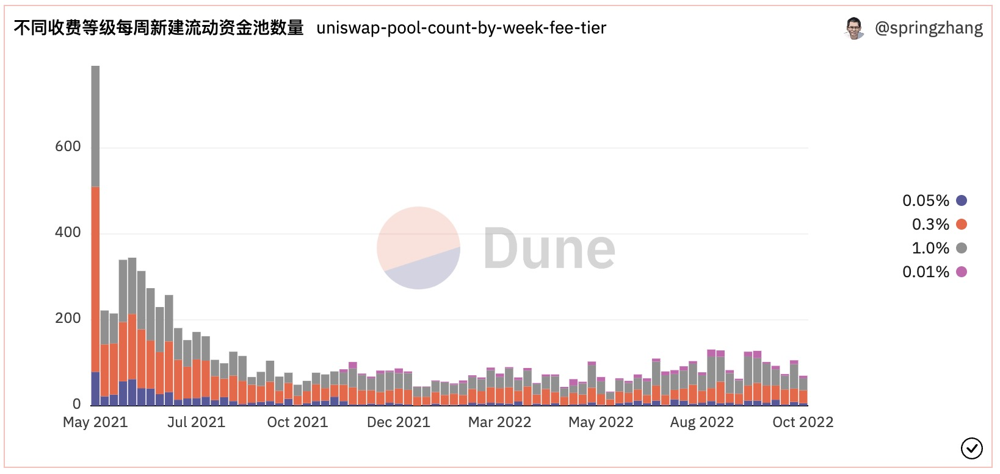

# 创建第一个Dune数据看板

在上一篇“[新手上路](02_get_started/readme.md)”中，我们学习了创建第一个数据看板需要的预备知识，掌握了基础SQL查询的编写技巧。现在让我们一起来编写查询并创建一个Dune数据看板。为了帮助大家更快上手实践，我们这个数据看板将结合具体的项目来制作。完成后的数据看板的示例：[https://dune.com/sixdegree/uniswap-v3-pool-tutorial](https://dune.com/sixdegree/uniswap-v3-pool-tutorial)。

我们不会详细描述每一个操作步骤。关于如何使用Dune的查询编辑器（Query Editor）和数据看板（Dashboard）的基础知识，你可以通过[Dune平台的官方文档](https://dune.com/docs/)来学习。

## 背景知识

开始创建看板之前，我们还需要了解一些额外的背景知识。Uniswap是最流行的去中心化金融（DeFi）协议之一，是一套持久的且不可升级的智能合约，它们共同创建了一个自动做市商（AMM），该协议主要提供以太坊区块链上的点对点ERC20代币的交换。Uniswap工厂合约（Factory）部署新的智能合约来创建流动资金池（Pool），将两个ERC20代币资产进行配对，同时设置不同的费率（fee）。流动性（Liquidity）是指存储在Uniswap资金池合约中的数字资产，可供交易者进行交易。流动性提供者（Liquidity Provider，简称LP）是将其拥有的ERC20代币存入给定的流动性池的人。流动性提供者获得交易费用的补偿作为收益，同时也承担价格波动带来的风险。普通用户（Swapper）通过可以在流动资金池中将自己拥有的一种ERC20代币兑换为另一种代币，同时支付一定的服务费。比如你可以在费率为0.30%的USDC-WETH流动资金池中，将自己的USDC兑换为WETH，或者将WETH兑换为USDC，仅需支付少量的服务费即可完成兑换。Uniswap V3协议的工作方式可以简要概括为：工厂合约创建流动资金池（包括两种ERC20代币） -》 LP用户添加对应资产到流动资金池 -》 其他用户使用流动资金池兑换其持有的代币资产，支付服务费 -》 LP获得服务费奖励。

初学者可能对这部分引入的一些概念比较陌生，不过完全不用紧张，你无需了解更多DeFi的知识就可以顺利完成本教程的内容。本篇教程不会深入涉及DeFi协议的各种细节，我们只是想通过实际的案例，让你对“链上数据分析到底分析什么”有一个更感性的认识。在我们将要创建的这个数据看板中，主要使用Uniswap V3的流动资金池作为案例. 对应的数据表为`uniswap_v3_ethereum.Factory_evt_PoolCreated`。同时，部分查询也用到了前面介绍过的`token.erc20`表。开始之前，你只需要了解这些就足够了：可以创建很多个不同的流动资金池（Pool），每一个流动资金池包含两种不同的ERC20代币（称之为代币对，Pair），有一个给定的费率；相同的代币对（比如USDC-WETH）可以创建多个流动资金池，分别对应不同的收费费率。

## Uniswap流动资金池表

流动资金池表`uniswap_v3_ethereum.Factory_evt_PoolCreated`的结构如下：

| **列名**                 | **数据类型**   | **说明**                                    |
| ----------------------- | ------------- | ------------------------------------------ |
| contract\_address       | string        | 合约地址                                    |
| evt\_block\_number      | long          | 区块编号                                    |
| evt\_block\_time        | timestamp     | 区块被开采的时间                             |
| evt\_index              | integer       | 事件的索引编号                               |
| evt\_tx\_hash           | string        | 事件归属交易的唯一哈希值                      |
| fee                     | integer       | 流动资金池的收费费率（以“百万分之N”的形式表示）   |
| pool                    | string        | 流动资金池的地址                             |
| tickSpacing             | integer       | 刻度间距                                    |
| token0                  | string        | 资金池中的第一个ERC20代币地址                  |
| token1                  | string        | 资金池中的第二个ERC20代币地址                  |

流动资金池表的部分数据如下图所示（这里只显示了部分字段）：


## 数据看板的主要内容

我们的第一个Dune数据看板将包括以下查询内容。每个查询会输出1个或多个可视化图表。
- 查询流动资金池总数
- 不同费率的流动资金池数量
- 按周汇总的新建流动资金池总数
- 最近30天的每日新建流动资金池总数
- 按周汇总的新建流动资金池总数-按费率分组
- 统计资金池数量最多的代币Token
- 最新的100个流动资金池记录

## 查询1: 查询流动资金池总数

通过使用汇总函数Count()，我们可以统计当前已创建的全部资金池的数量。

```sql
select count(*) as pool_count
from uniswap_v3_ethereum.Factory_evt_PoolCreated
```

我们建议你复制上面的代码，创建并保存查询。保存查询时为其起一个容易识别的名称，比如我使用“uniswap-pool-count”作为这个查询的名称。当然你也可以直接Fork下面列出的参考查询。Fork查询的便利之处是可以了解更多可视化图表的细节。

本查询在Dune上的参考链接：[https://dune.com/queries/1454941](https://dune.com/queries/1454941)

## 创建数据看板并添加图表

### 创建看板

首先请登录进入[Dune网站](https://dune.com/)。然后点击头部导航栏中的“My Creation”，再点击下方的“Dashboards”，进入到已创建的数据看板页面[https://dune.com/browse/dashboards/authored](https://dune.com/browse/dashboards/authored)。要创建新的数据看板，点击右侧边栏中的“New dashboard”按钮即可。在弹出对话框中输入Dashboard的名称，然后点击“Save and open”按钮即可创建新数据看板并进入预览界面。我这里使用“Uniswap V3 Pool Tutorial”作为这个数据看板的名称。

### 添加查询图表

新创建的数据看板是没有内容的，预览页面会显示“This dashboard is empty.”。我们可以将上一步“查询1”中得到的资金池数量转为可视化图表并添加到数据看板中。在一个新的浏览器Tab中打开“My Creations”页面[https://dune.com/browse/queries/authored](https://dune.com/browse/queries/authored)，找到已保存的“查询1”Query，点击名称进入编辑页面。因为查询已经保存并执行过，我们可以自己点击“New visualization”按钮来新建一个可视化图表。单个数值类型的的查询结果，通常使用计数器（Counter）类型的可视化图表。从下拉列表“Select visualization type”中选择“Counter”，再点击“Add Visualization”按钮。然后可以给这个图表命名，将Title值从默认的“Counter”修改为“流动资金池总数”。最后，通过点击“Add to dashboard“按钮，并在弹出对话框中点击对应数据看板右边的“Add”按钮，就把这个计数器类型的图表添加到了数据看板中。

此时我们可以回到数据看板页面，刷新页面可以看到新添加的可视化图表。点击页面右上方的“Edit”按钮可以对数据看板进行编辑，包括调整各个图表的大小、位置，添加文本组件等。下面是对“流动资金池总数”这个计数器图表调整了高度之后的截图。


### 添加文本组件

在数据看板的编辑页面，我们可以通过点击“Add text widget”按钮，添加文本组件到看板中。文本组件可以用来为数据看板的核心内容添加说明，添加作者信息等。文本组件支持使用Markdown语法实现一些格式化处理，在添加文本组件的对话框中点击“Some markdown is supported”展开可以看到支持的相关语法。请根据需要自行添加相应的文本组件，这里就不详细说明了。

## 查询2：不同费率的流动资金池数量

根据我们需要的结果数据的格式，有不同的方式来统计。如果想使用计数器（Counter）类型的可视化图表，可以把相关统计数字在同一行中返回。如果想用一个扇形图（Pie Chart）来显示结果，则可以选择使用Group By分组，将结果数据以多行方式返回。

**使用Filter子句：**
```sql
select count(*) filter (where fee = 100) as pool_count_100,
    count(*) filter (where fee = 500) as pool_count_500,
    count(*) filter (where fee = 3000) as pool_count_3000,
    count(*) filter (where fee = 10000) as pool_count_10000
from uniswap_v3_ethereum.Factory_evt_PoolCreated
```

本查询在Dune上的参考链接：[https://dune.com/queries/1454947](https://dune.com/queries/1454947)

这个查询返回了4个输出值，我们为他们添加相应的计数器组件，分别命名为“0.01%资金池数量”、“0.05%资金池数量”等。然后添加到数据看板中，在数据看板编辑界面调整各组件的大小和顺序。调整后的显示效果如下图所示：


**使用Group By子句：**
```sql
select fee,
    count(*) as pool_count
from uniswap_v3_ethereum.Factory_evt_PoolCreated
group by 1
```

费率“fee”是数值形式，代表百万分之N的收费费率。比如，3000，代表3000/1000000，即“0.30%”。用`fee`的值除以10000 （1e4）即可得到用百分比表示的费率。
将数值转换为百分比表示的费率更加直观。我们可以使用修改上面的查询来做到这一点：
```sql
select concat((fee / 1e4)::string, '%') as fee_tier,
    count(*) as pool_count
from uniswap_v3_ethereum.Factory_evt_PoolCreated
group by 1
```
其中，`concat((fee / 1e4)::string, '%') as fee_tier`部分的作用是将费率转换为百分比表示的值，再连接上“%”符号，使用别名`fee_tier`输出。

本查询在Dune上的参考链接：[https://dune.com/queries/1455127](https://dune.com/queries/1455127)

我们为这个查询添加一个扇形图图表。点击“New visualization”，从图表类型下拉列表选择“Pie Chart”扇形图类型，点击“Add visualization”。将图表的标题修改为“不同费率的资金池数量”。图表的水平坐标轴（X Column）选择“fee_tier“，垂直坐标轴“Y Column 1”选择“pool_count”。勾选左侧的“Show data label”选项。然后用“Add to dashboard”把这个可视化图表添加到数据看板中。其显示效果如下：


## 查询3：按周汇总的新建流动资金池总数

要实现汇总每周新建的流动资金池数量的统计，我们可以先在一个子查询中使用date_trunc()函数将资金池的创建日期转换为每周的开始日期（星期一），然后再用Group By进行汇总统计。

```sql
select block_date, count(pool) as pool_count
from (
    select date_trunc('week', evt_block_time) as block_date,
        evt_tx_hash,
        pool
    from uniswap_v3_ethereum.Factory_evt_PoolCreated
)
group by 1
order by 1
```

本查询在Dune上的参考链接：[https://dune.com/queries/1455311](https://dune.com/queries/1455311)

按时间统计的数据，适合用条形图、面积图、折线图等形式来进行可视化，这里我们用条形图。点击“New visualization”，从图表类型下拉列表选择“Bar Chart”条形图类型，点击“Add visualization”。将图表的标题修改为“每周新建资金池数量统计”。图表的水平坐标轴（X Column）选择“block_date“，垂直坐标轴“Y Column 1”选择“pool_count”。取消勾选左侧的“Show chart legend”选项。然后用“Add to dashboard”把这个可视化图表添加到数据看板中。其显示效果如下：


## 查询4：最近30天的每日新建流动资金池总数

类似的，要实现汇总每天新建的流动资金池数量的统计，我们可以先在一个子查询中使用date_trunc()函数将资金池的创建日期转换为天（不含时分秒值），然后再用Group By进行汇总统计。这里我们使用公共表表达式（CTE）的方式来查询。与使用子查询相比，CTE能让查询逻辑更加直观易懂、定义后可以多次重用以提升效率、也更方便调试。后续的查询都会倾向于使用CTE方式。

```sql
with pool_details as (
    select date_trunc('day', evt_block_time) as block_date,
        evt_tx_hash, pool
    from uniswap_v3_ethereum.Factory_evt_PoolCreated
    -- 下面的代码中，now()存贮了当前日期+时间，当天的数据已包含在内
    where evt_block_time >= now() - interval '29 days'
)

select block_date, count(pool) as pool_count
from pool_details
group by 1
order by 1
```

本查询在Dune上的参考链接：[https://dune.com/queries/1455382](https://dune.com/queries/1455382)

我们同样使用条形图来做可视化。添加一个条形图类型的新图表，将标题修改为“近30天每日新增资金池数量”。图表的水平坐标轴（X Column）选择“block_date“，垂直坐标轴“Y Column 1”选择“pool_count”。取消勾选左侧的“Show chart legend”选项，同时勾选上“Show data labels”选项。然后把这个可视化图表添加到数据看板中。其显示效果如下：


## 查询5：按周汇总的新建流动资金池总数-按费率分组

我们可以对分组统计的维度做进一步的细分，按费率来汇总统计每周内新建的流动资金池数量。这样我们可以对比不同费率在不同时间段的流行程度。这个例子中我们演示Group by多级分组，可视化图表数据的条形图的叠加等功能。

```sql
with pool_details as (
    select date_trunc('week', evt_block_time) as block_date,
        fee,
        evt_tx_hash,
        pool
    from uniswap_v3_ethereum.Factory_evt_PoolCreated
)

select block_date,
    concat((fee / 1e4)::string, '%') as fee_tier,
    count(pool) as pool_count
from pool_details
group by 1, 2
order by 1, 2
```

本查询在Dune上的参考链接：[https://dune.com/queries/1455535](https://dune.com/queries/1455535)

我们同样使用条形图来做可视化。添加一个条形图类型的新图表，将标题修改为“不同费率每周新建流动资金池数量”。图表的水平坐标轴（X Column）选择“block_date“，垂直坐标轴“Y Column 1”选择“pool_count”。同时，我们需要在“Group by”中选择“fee_tier”作为可视化图表的分组来实现分组显示，同时勾选左侧的“Enable stacking”选项让同一日期同一分组的数据叠加到一起显示。把这个可视化图表添加到数据看板中的显示效果如下：




## 查询6：统计资金池数量最多的代币Token

如果想分析哪些ERC20代币在Uniswap资金池中更流行（即它们对应的资金池数量更多），我们可以按代币类型来做分组统计。

每一个Uniswap流动资金池都由两个ERC20代币组成（token0和token1），根据其地址哈希值的字母顺序，同一种ERC20代币可能保存在token0中，也可能保存在token1中。所以，在下面的查询中，我们通过使用集合（Union）来得到完整的资金池详细信息列表。

另外，资金池中保存的是ERC20代币的合约地址，直接显示不够直观。Dune社区用户提交的魔法书生成的抽象数据表`tokens.erc20`保存了ERC20代币的基本信息。通过关联这个表，我们可以取到代币的符号（Symbol），小数位数（Decimals）等。这里我们只需使用代币符号。

因为Uniswap V3 一共有8000多个资金池，涉及6000多种不同的ERC20代币，我们只关注资金池最多的100个代币的数据。下面的查询演示以下概念：多个CTE，Union，Join，Limit等。

```sql
with pool_details as (
    select token0 as token_address,
        evt_tx_hash, pool
    from uniswap_v3_ethereum.Factory_evt_PoolCreated

    union all

    select token1 as token_address,
        evt_tx_hash, pool
    from uniswap_v3_ethereum.Factory_evt_PoolCreated
),

token_pool_summary as (
    select token_address,
        count(pool) as pool_count
    from pool_details
    group by 1
    order by 2 desc
    limit 100
)

select t.symbol, p.token_address, p.pool_count
from token_pool_summary p
inner join tokens.erc20 t on p.token_address = t.contract_address
order by 3 desc
```

本查询在Dune上的参考链接：[https://dune.com/queries/1455706](https://dune.com/queries/1455706)

我们同样使用条形图来做可视化。添加一个条形图类型的新图表，将标题修改为“不同ERC20代币的资金池数量（Top 100）”。图表的水平坐标轴（X Column）选择“symbol“，垂直坐标轴“Y Column 1”选择“pool_count”。为了保持排序顺序（按数量从多到少），取消勾选右侧的“Sort values”选项。虽然我们限定了只取前面的100个代币的数据，从查询结果中仍然可以看到，各种Token的资金池数量差异很大，最多的有5000多个，少的则只有几个。为了让图表更直观，请勾选右侧的“Logarithmic”选项，让图表数据以对数化后显示。把这个可视化图表添加到数据看板中的显示效果如下：


由于对数化显示处理从视觉上弱化了差异值，我们可以同时添加一个“Table“数据表类型的可视化图表，方便用户查看实际的数值。继续为这个查询添加新的可视化图表，选择“Table”图表类型。标题设置为“前100种ERC20代币的资金池数量统计”。可以根据需要对这个可视化表格的相关选项做调整，然后将其添加到Dashboard中。


你可能留意到表格返回的数据实际上没有100行，这是因为部分新出现的代币可能还未被添加到到Dune到数据表中。


## 查询7：最新的100个流动资金池记录

当某个项目方发行了新的ERC20代币并支持上市流通时，Uniswap用户可能会在第一时间创建相应的流动资金池，以让其他用户进行兑换。比如，XEN代币就是近期的一个比较轰动的案例。

我们可以通过查询最新创建的资金池来跟踪新的趋势。下面的查询同样关联`tokens.erc20`表获，通过不同的别名多次关联相同的表来获取不同代币的符号。本查询还演示了输出可视化表格，连接字符串生成超链接等功能。

```sql
with last_crated_pools as (
    select p.evt_block_time,
        t0.symbol as token0_symbol,
        p.token0,
        t1.symbol as token1_symbol,
        p.token1,
        p.fee,
        p.pool,
        p.evt_tx_hash
    from uniswap_v3_ethereum.Factory_evt_PoolCreated p
    inner join tokens.erc20 t0
        on p.token0 = t0.contract_address and t0.blockchain = 'ethereum'
    inner join tokens.erc20 t1
        on p.token1 = t1.contract_address and t1.blockchain = 'ethereum'
    order by p.evt_block_time desc
    limit 100
)

select evt_block_time,
    token0_symbol || '-' || token1_symbol || ' '
        || (fee / 1e4)::string || '%' as pool_name,
    '<a href=https://etherscan.io/address/' || pool
        || ' target=_blank>' || pool || '</a>' as pool_link,
    token0,
    token1,
    fee,
    evt_tx_hash
from last_crated_pools
order by evt_block_time desc
```

本查询在Dune上的参考链接：[https://dune.com/queries/1455897](https://dune.com/queries/1455897)

我们为查询添加一个“Table“数据表类型的可视化图表，将标题设置为“最新创建的资金流动池列表”。可以根据需要对这个可视化表格的相关选项做调整，然后将其添加到Dashboard中。


# 总结

至此，我们就完成了第一个Dune数据看板的创建。这个数据看板的完整界面显示效果如下图所示：


为了避免内容太过深奥难懂，我们只是做了一些基本的查询，整个数据看板的图表看起来可能不一定那么炫酷。但是这个并不重要，我们更关心的是你能否通过这篇教程开始走上自己的链上数据分析之路。
希望大家在看完之后动手尝试一下，选例Uniswap是一个DEX，类似的我们可以对任意链上的DEX进行分析。结合上一讲中的技巧，大家可以尝试对其他DEX，甚至同一Dex不同链上数据进行分析比较（如UniSwap在Ethereum和Optimism上的数据）。成为链上数据分析师，看板就是你的简历，认真做起来吧！

# 作业内容
结合教程内容，制作对任意DEX进行不少于5个查询的数据看板，看板命名格式为SixdegreeAssignment1-称呼，如SixdegreeAssignment1-Spring，方便大家互相学习，也方便我们把握教学质量。为了鼓励大家积极动手制作看板，我们将对作业完成情况和质量进行记录，之后追溯为大家提供一定的奖励，包括但不限于Dune社区身份，周边实物，Api免费额度，POAP，各类合作的数据产品会员，Dune线下活动优先报名资格以及Sixdegree社区奖励等。

加油！欢迎大家将自己的数据看板链接分享到Dune交流微信群、Dune的Discord中文频道。

## SixDegreeLab介绍

SixDegreeLab（[@SixdegreeLab](https://twitter.com/sixdegreelab)）是专业的链上数据团队，我们的使命是为用户提供准确的链上数据图表、分析以及洞见，并致力于普及链上数据分析。通过建立社区、编写教程等方式，培养链上数据分析师，输出有价值的分析内容，推动社区构建区块链的数据层，为未来广阔的区块链数据应用培养人才。

欢迎访问[SixDegreeLab的Dune主页](https://dune.com/sixdegree)。

本文由SixDegreeLab成员Spring Zhang（[@superamscom](https://twitter.com/superamscom)）撰稿。因水平所限，不足之处在所难免。如有发现任何错误，敬请指正。
