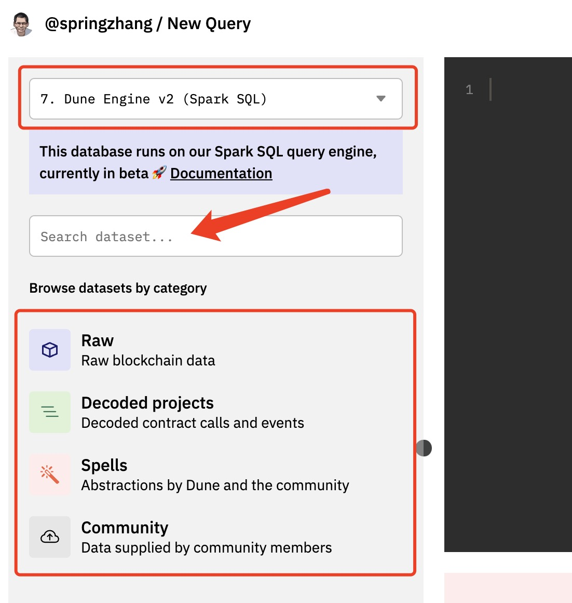
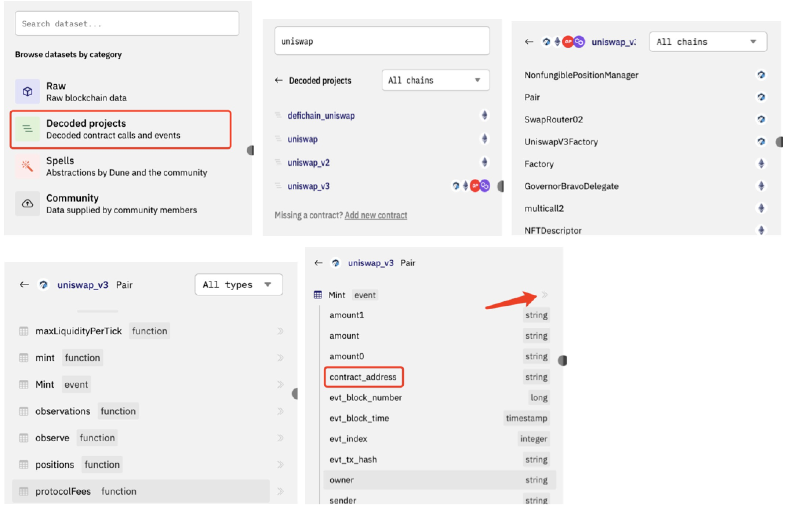

# 熟悉数据表

以Dune为代表的数据平台大多将区块链数据索引保存到数据库中从而可以使用SQL查询来访问数据。数据分析师针对具体项目的需求，通过编写SQL从相应的数据表中查询数据进行分析。目前市面上流行的区块链越来越多，全新的区块链还在不断涌现，每个链上面的各种类型的项目也层出不穷。如何快速找到要分析的项目对应的数据表是哪些，如何理解对应数据表里每个字段的含义、用途等，是每一个分析师必须掌握的技能。

目前我们熟悉的几个数据平台提供的基础数据集的整体结构基本相似，我们这里只围绕Dune平台来讲解。如果你更偏好使用其他平台，可以通过该平台对应的文档了解详情。由于Dune已经停止升级V1版本的数据引擎（目前仍然在做数据索引），我们只介绍其基于Spark SQL的V2中的数据集。

## Dune V2数据引擎数据表介绍

Dune 平台的数据集分为几种不同的类型：
- **原始数据（Raw）**：存储了未经编辑的、原始编码的区块链数据。包括blocks、transactions、traces等数据表。这些原始表保存了最原始的链上数据，可用于灵活的数据分析。
- **已解析项目（Decoded Projects）**：存储了经过解码后的智能合约事件及调用数据表。比如Uniswap V3相关的表，Opensea Seaport相关的表等。Dune使用智能合约的 ABI(Application Binary Interface) 和标准化代币智能合约的接口标准（ERC20、ERC721 等）来解码数据。
- **魔法表（Spells）**：魔法表在Dune V1中也叫抽象表（Abstractions），是Dune和社区用户一起通过spellbook github存储库来建设和维护并编译生成的数据表，这些数据表通常使用起来更为便捷高效。
- **社区贡献数据（Community）**：这部分是由第三方合作组织提供的数据源，自动接入到Dune的数据集里共分析师使用。目前Dune上主要有`flashbots`和`reservoir`两个数据集。
- **用户生成的数据表（User Generated Tables）**：目前Dune V2引擎尚未开放此功能，只能通过魔法表的方式来上传（生成）自定义数据表。V1引擎下用户可以通过SQL来创建表或视图。

在Dune平台的Query编辑页面，我们可以通过左边栏来选择或搜索需要的数据表。这部分界面如下图所示：




图片中间的文本框可以用于搜索对应的模式或数据表。你可以用来搜索筛选那些包含了输入字符的模式和表。比如，输入`erc721`将筛选出名称包含这个字符串的所有魔法表和已解析项目表。图片中上方的红框部分用于选择要使用的数据集，途中显示的“Dune Engine V2 (Spark SQL)”就是我们通常说的“V2 引擎”、“V2 Engine”或者“V2”，其他的则统称为“V1”。Dune V2 引擎基于Spark SQL（Databricks Spark），V1则是Postgresql，两种数据库引擎在SQL语法、支持的数据类型等方面有一些比较明显的区别。比如，在V1中，地址、交易哈希值这些是以`bytea`类型保存的，而在V2中，不存在`bytea`数据类型，地址、交易哈希值这些都是以小写字符串形势保存的。再如，V1中字符串对应的类型是`text`且不区分大小写，而在V2中字符串类型是`string`并且要区分大小写。

上图中下方的红框圈出的是前面所述Dune V2 引擎目前支持的几大类数据集。点击粗体分类标签文字即可进入下一级浏览该类数据集中的各种数据模式（Schema）以及各模式下具体的表格。点击分类标签进入下一级后，你还可以看到一个默认选项为“All Chains”的下拉列表，可以用来筛选你需要的区块链下的数据模式和数据表。当进入到表格层级时，点击表名可以展开查看表中的字段列表。点击表名右边的“》”图标可以将表名（格式为`schema_name.table_name`插入到查询编辑器中光标所在位置。分级浏览的同时你也可以输入关键字在当前浏览的层级进一步搜索过滤。不同类型的数据表有不同的层次深度，下图为已解析数据表的浏览示例。



## 原始数据表

区块链中典型的原始数据表包括：区块表（Blocks）、交易表（Transactions）、内部合约调用表（Traces）、事件日志表（Logs）以及合约创建跟踪表（creation_traces）。原始数据表的命名格式为`blockchain_name.table_name`，例如arbitrum.logs，bnb.blocks，ethereum.transactions，optimism.traces等。部分区块链有更多或者更少的原始数据表，我们以以太坊为例做简单介绍。

### 区块表（ethereum.blocks）
区块（Block）是区块链的基本构建组件。一个区块包含多个交易记录。区块表记录了每一个区块生成的日期时间(block time)、对应的区块编号(block number)、区块哈希值、难度值、燃料消耗等信息。除了需要分析整个区块链的区块生成状况、燃料消耗等场景外，我们一般并不需要关注和使用区块表。其中最重要的区块生成日期时间和区块编号几乎都已经保存到了其他所有表中，只是对应的字段名称不同。

### 交易表（ethereum.transactions）

交易表保存了区块链上发生的每一个交易的详细信息（同时包括了成功或失败的交易）。以太坊的交易表结构如下图所示：


交易表中最常用的字段包括block_time（或block_number）、from、to、value、hash、success等。Dune V2引擎是基于列存贮的数据库，每个表里的数据是按列存贮的。按列存贮的数据表无法使用传统意义上的索引，而是依赖于保存有“最小值/最大值”属性的元数据来提升查询性能。对于数值类型或者日期时间类型，可以很容易计算出一组值中的最小值/最大值。相反，对于字符串类型，因为长度可变，很难高效计算出一组字符串数据中的最小值/最大值。这就导致V2引擎在做字符串类型的查询时比较低效，所以我们通常需要同时结合使用日期时间类型或者数值类型的过滤条件来提升查询执行性能。如前所述，block_time, block_number字段几乎存在于所有的数据表中（在不同类型数据表中名称不同），我们应充分利用它们来筛选数据确保查询可以高效执行。更多的相关信息可以查看[Dune V2查询引擎工作方式](https://docs.dune.com/dune-engine-v2-beta/query-engine#changes-in-how-the-database-works)来了解。

### 内部合约调用表（ethereum.traces）

一个交易（Transactions）可以触发更多的内部调用操作。这些操作执行的信息会被记录到内部合约调用表。内部合约调用表主要包括block_time、block_number、tx_hash、success、from、to、value、type等字段。

内部合约调用表有两个最常见的用途：
1. 用于跟踪区块链原生代币（Token）的转账详情或者燃料消耗。比如，对于以太坊，用户可能通过某个Dapp的只能合约将ETH转账到一个（或者多个）地址。这种情况下，`ethereum.transactions`表的`value`字段并没有保存转账的ETH的金额数据，实际的转账金额只保存在内部合约调用表的`value`值中。另外，由于原生代币不属于ERC20代币，所以也无法通过ERC20协议的Transfer事件来跟踪转账详情。区块链交易的燃料费用也是用原生代币来支付的，燃料消耗数据同时保存于交易表和内部合约调用表。一个交易可能有多个内部合约调用，调用内部还可以发起新的调用，这就导致每个调用的`from`，`to`并不一致，也就意味着具体支付调用燃料费的账户地址不一致。所以，当我们需要计算某个地址或者一组地址的原生代币ETH余额时，只有使用`thereum.traces`表才能计算出准确的余额。 这个查询有计算ETH余额的示例：[ETH顶级持有者余额](https://dune.com/queries/1001498/1731554)
2. 用于筛选区分合约地址。以太坊上的地址分为两大类型，外部地址（External Owned Address, EOA）和合约地址（Contract Address）。EOA外部地址是指由以太坊用户拥有的地址，而合约地址是通过部署智能合约的交易来创建的。部署新的智能合约时，`thereum.traces`表中的`type`字段保存的值为`create`。我们可以使用这个特征筛选出智能合约地址。Dune V2里面，已经将创建只能合约的内部调用记录整理出来，单独放到了表`ethereum.creation_traces`中。

### 事件日志表（ethereum.logs）

事件日志表存储了智能合约生成的所有事件日志。它对于查询尚未被解码或者无法解码的合约（由于代码非开源等原因）非常有用。我们建议优先使用已解析的数据表，这样通常可以提高效率并降低在查询中引入错误的可能性。但是，有时由于时效性（合约还未来得及被解码）或者合约本身不支持被解码的原因，我们也需要直接访问事件日志表来查询数据。

事件日志表主要包括block_time、block_number、tx_hash、contract_address、topic1、topic2、topic3、topic4、data等字段。使用时需要注意的要点包括：
- `topic1` 存贮的是事件对应的方法签名的哈希值。也就是说，相同的事件的哈希值也一定完全相同。
- `topic2`、`topic3`、`topic4` 存贮的是最多3个事件中的可索引参数（主题）。当索引主题参数不足3个时，剩余的字段不保存任何值。具体到每一个事件，这几个主题参数所保存的值可能各不相同。一个简单的方法是结合EtherScan这样的区块链浏览器上显示的日志来对照确认每一个主题参数代表什么含义。或者也可以查阅对应智能合约的源代码来了解事件参数的详细定义。
- `data`存贮的是事件参数中为标记为索引主题类型的其他字段的16进制值，字符串格式，以`0x`开头，每个参数包括64个字符，实际参数值不足64位则在左侧填充`0`来补足位数。当我们需要从data里面解析数据时，就要按照上述特征，从第3个字符开始，每64个字符为一组拆分开，然后再按其实际存贮的数据类型进行转换处理（转为地址、转为数值或者字符串等）。

这个直接解析logs表的示例查询：[https://dune.com/queries/956896](https://dune.com/queries/956896)。你可以复制查询结果中的tx_hash值访问EtherScan站点，并切换到“Logs”标签页进行对照。下图显示了EtherScan上的例子：


## 已解析项目表

已解析项目表是数量最庞大的数据表类型。当智能合约被提交到Dune进行解析时，Dune为其中的每一个方法调用（Call）和事件日志（Event）生成一个对应的专用数据表。在Dune的查询编辑器的左边栏中，这些已解析项目数据表按如下层级来逐级展示：

```
category name -> project name (namespace) -> contract name -> function name / event name

-- Sample
Decoded projects -> uniswap_v3 -> Factory -> PoolCreated
```

已解析项目表的命名规则为：`projectname_blockchain.contractName_evt_eventName` （事件日志）或者`projectname_blockchain.contractName_call_functionName`（函数调用）。例如，上面的Uniswap V3 的 PoolCreated 事件对应的表名为`uniswap_v3_ethereum.Factory_evt_PoolCreated`。

TODO：
知道名称 -》 搜索名称
不知道名称知道地址 -》 检查 表


## 魔法表

简要说明创建方式

重点说明其中常用的表


## 社区贡献数据和用户生成数据表

参考文档链接


## SixDegreeLab介绍

SixDegreeLab（[@SixdegreeLab](https://twitter.com/sixdegreelab)）是专业的链上数据团队，我们的使命是为用户提供准确的链上数据图表、分析以及洞见，并致力于普及链上数据分析。通过建立社区、编写教程等方式，培养链上数据分析师，输出有价值的分析内容，推动社区构建区块链的数据层，为未来广阔的区块链数据应用培养人才。

欢迎访问[SixDegreeLab的Dune主页](https://dune.com/sixdegree)。

本文由SixDegreeLab成员Spring Zhang（[@superamscom](https://twitter.com/superamscom)）撰稿。因水平所限，不足之处在所难免。如有发现任何错误，敬请指正。
