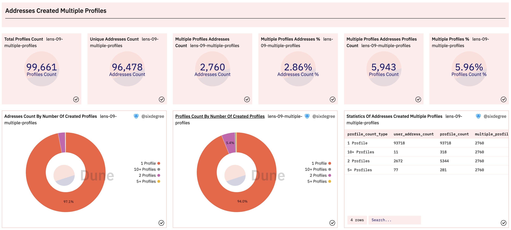

# 实践案例：制作Lens Protocol的数据看板（二）

在上一篇教程中，我们给大家介绍了Lens协议，并为其制作了一个初步的看板，分析了包括总交易数量和总用户数量、按天统计的交易数量和独立用户数量、创作者个人资料（Profile）分析、Lens域名分析、已注册域名搜索等相关内容。让我们继续给这个数据看板添加新的查询和可视化图表。我们将分析以下内容：同一个地址创建多个Profile、关注数据、发帖数据、评论数据、收藏数据、镜像数据、创作者的操作综合情况、普通用户地址的操作综合情况。


## 分析同一个地址创建多个Profile

Lens协议允许统一地址创建多个Profile。我们可以编写一个查询来统计创建了多个Profile的地址的数据分布概况。在下面的查询中，我们先用CTE `profile_created`取得所有创建的Profile的数据详情，然后使用`multiple_profiles_addresses`来统计每一个地址创建的账号数量。最后，我们使用CASE语句，按每个地址创建的Profile的数量对其进行归类，返回综合的统计数据。

```sql
with profile_created as (
    select vars:to as user_address,
        vars:handle as handle_name,
        call_block_time,
        output_0 as profile_id,
        call_tx_hash
    from lens_polygon.LensHub_call_createProfile
    where call_success = true    
),

multiple_profiles_addresses as (
    select user_address,
        count(profile_id) as profile_count
    from profile_created
    group by 1
    order by 2 desc
)

select (case when profile_count >= 10 then '10+ Profiles'
            when profile_count >= 3 then '5+ Profiles'
            when profile_count = 2 then '2 Profiles'
            else '1 Profile'
        end) as profile_count_type,
    count(user_address) as user_address_count,
    sum(profile_count) as profile_count
from multiple_profiles_addresses
group by 1
```

做这类数据统计时，通常我们也需要得到一些Counter类型的统计值，比如创建过多个Profile的地址总数、这些地址一共创建了多少个Profile，这些Profile在所有已创建的Profile中的占比等等。查询这些数据时可以共用上面的查询代码，所以我们对其少做修改，添加了两个额外的CTE来统计这些Counter类型的数值。然后为这个查询添加可视化图表并分别加入到数据看板中。显示效果如下：



以上查询在Dune上的参考链接：
- [https://dune.com/queries/1562662](https://dune.com/queries/1562662)
- [https://dune.com/queries/1553030](https://dune.com/queries/1553030)


## 发帖数据分析

### 发帖最多的账号数据分析

Lens的创作者有两种发帖（Post）的方式，一直是直接用自己的账号发布Post，另一种是委托其他账号或者通过API的方式来发布。Post数据分别保存在`LensHub_call_post`和`LensHub_call_postWithSig`表中。每一个主题Post的内容以JSON字符串的形式保存在字段`vars`中，包括作者的ProfileID，帖子内容的URL等信息。对于字符串形式的JSON内容，我们可以使用`:`操作符来访问其中的值。下面的查询可以获得部分示范数据：

```sql
select call_block_time,
    call_tx_hash,
    output_0 as post_id,
    vars:profileId as profile_id,
    vars:contentURI as content_url,
    vars:collectModule as collection_module,
    vars:referenceModule as reference_module,
    vars
from lens_polygon.LensHub_call_post
where call_success = true
limit 10
```

鉴于发帖的Profile数量很多，我们可以像前面分析“同一个地址创建多个Profile”那样，对不同发帖数量的Profile做一个分类统计，也可以关注头部用户，即发帖最多的那些账号的数据。这里我们对发帖最多的账号进行分析，同时将这部分账号的发帖数量和总体发帖数量的进行对照输出Counter图表。完整的SQL如下：

```sql
with post_data as (
    select call_block_time,
        call_tx_hash,
        output_0 as post_id,
        vars:profileId as profile_id,
        vars:contentURI as content_url,
        vars:collectModule as collection_module,
        vars:referenceModule as reference_module
    from lens_polygon.LensHub_call_post
    where call_success = true
    
    union all
    
    select call_block_time,
        call_tx_hash,
        output_0 as post_id,
        vars:profileId as profile_id,
        vars:contentURI as content_url,
        vars:collectModule as collection_module,
        vars:referenceModule as reference_module
    from lens_polygon.LensHub_call_postWithSig
    where call_success = true
),

posts_summary as (
    select count(*) as total_post_count,
        count(distinct profile_id) as posted_profile_count
    from post_data
),

top_post_profiles as (
    select profile_id,
        count(*) as post_count
    from post_data
    group by 1
    order by 2 desc
    limit 1000
)

select profile_id,
    post_count,
    sum(post_count) over () as top_profile_post_count,
    total_post_count,
    posted_profile_count,
    (sum(post_count) over ()) / total_post_count * 100 as top_profile_posts_ratio
from top_post_profiles
inner join posts_summary on true
order by 2 desc
```

以上SQL解读：因为Post数据分别保存在两个表里，在CTE `post_data`中，我们使用`union all`将两个表中取出的数据合并到一起。我们通过`posts_summary`来统计所有发帖的Profile数量和他们累计发布的Post数量。在`top_post_profiles`中，我们按照每个Profile的发帖数量最多的1000个Profile的数据。最后，我们关联查询`top_post_profiles`和`posts_summary`，输出发帖最多的账号数据以及它们和总发帖数据的对比。将查询结果可视化并加入数据看板后的显示效果如下：


以上查询在Dune上的参考链接：
- [https://dune.com/queries/1554541](https://dune.com/queries/1554541)

### 每日新发帖数量统计

Lens用户每日的新发帖数量是观察整体活跃度变化的一个重要指标，我们编写一个查询来统计每天的发帖数量。这个查询中的`post_data` CTE与之前的完全相同，所以我们在下面的代码中省略它的详情。因为我们还希望将每天的发帖数量进行累加返回累计发帖数量，我们定义`post_daily_summary` CTE作为中间步骤，以让SQL代码简单易懂。对应的SQL如下：

```sql
with post_data as (
    -- Get post data from LensHub_call_post and LensHub_call_postWithSig tables
),

post_daily_summary as (
    select date_trunc('day', call_block_time) as block_date,
        count(*) post_count,
        count(distinct profile_id) as profile_count
    from post_data
    group by 1
)

select block_date,
    post_count,
    profile_count,
    sum(post_count) over (order by block_date) as accumulate_post_count
from post_daily_summary
order by block_date
```

将查询结果可视化并加入数据看板后的显示效果如下：


以上查询在Dune上的参考链接：
- [https://dune.com/queries/1555124](https://dune.com/queries/1555124)


### 近30天发帖最活跃的Profile统计

同样，我们可能关心最近一段时间内发帖最活跃的Profile的具体情况。为此我们只需要在前述`post_data` CTE中，分别添加日期过滤条件来筛选最近30天内的发帖，然后按日期统计即可。

```sql
with post_data as (
    select call_block_time,
        call_tx_hash,
        output_0 as post_id,
        vars:profileId as profile_id,
        vars:contentURI as content_url,
        vars:collectModule as collection_module,
        vars:referenceModule as reference_module
    from lens_polygon.LensHub_call_post
    where call_success = true
        and call_block_time >= now() - interval '30 days'
    
    union all
    
    select call_block_time,
        call_tx_hash,
        output_0 as post_id,
        vars:profileId as profile_id,
        vars:contentURI as content_url,
        vars:collectModule as collection_module,
        vars:referenceModule as reference_module
    from lens_polygon.LensHub_call_postWithSig
    where call_success = true
        and call_block_time >= now() - interval '30 days'
)

select profile_id,
    count(*) as post_count
from post_data
group by 1
order by 2 desc
limit 100
```

我们可以分别添加一个柱状图来显示这100个过去30天内发帖最多的账号的发帖数量，同时添加一个Table类型的图表来输出详情。相关图表加入数据看板后的显示效果如下：


以上查询在Dune上的参考链接：
- [https://dune.com/queries/1559981](https://dune.com/queries/1559981)


## 评论数据分析

## 镜像数据分析

## 收藏数据分析

## 关注数据分析

## 创作者操作综合分析

## 普通用户操作综合分析


## 总结与作业

现在，我们已经完成了对Lens协议的整体分析。不过，由于篇幅问题，仍然有很多值得分析的指标我们尚未涉及，包括NFT的相关数据分析、创作者的收益分析、Profile账号的转移情况分析等。

请结合教程内容，继续完善你自己的Lens协议数据看板，你可以Fork本教程的查询去修改，可以按自己的理解做任何进一步的扩展。请大家积极动手实践，创建数据看板并分享到社区。我们将对作业完成情况和质量进行记录，之后追溯为大家提供一定的奖励，包括但不限于Dune社区身份，周边实物，API免费额度，POAP，各类合作的数据产品会员，区块链数据分析工作机会推荐，社区线下活动优先报名资格以及其他Sixdegree社区激励等。

## SixDegreeLab介绍

SixDegreeLab（[@SixdegreeLab](https://twitter.com/sixdegreelab)）是专业的链上数据团队，我们的使命是为用户提供准确的链上数据图表、分析以及洞见，并致力于普及链上数据分析。通过建立社区、编写教程等方式，培养链上数据分析师，输出有价值的分析内容，推动社区构建区块链的数据层，为未来广阔的区块链数据应用培养人才。

欢迎访问[SixDegreeLab的Dune主页](https://dune.com/sixdegree)。

因水平所限，不足之处在所难免。如有发现任何错误，敬请指正。
