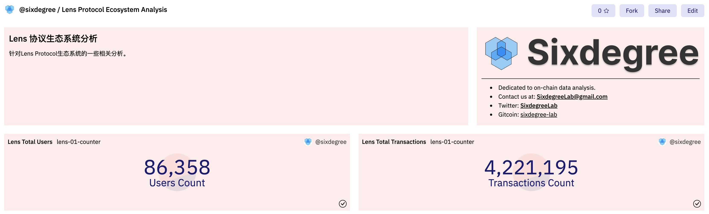
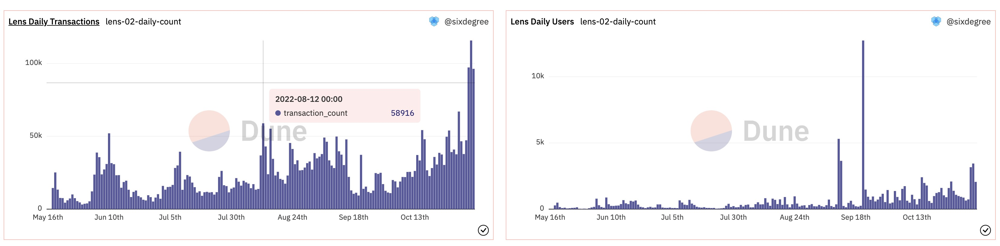
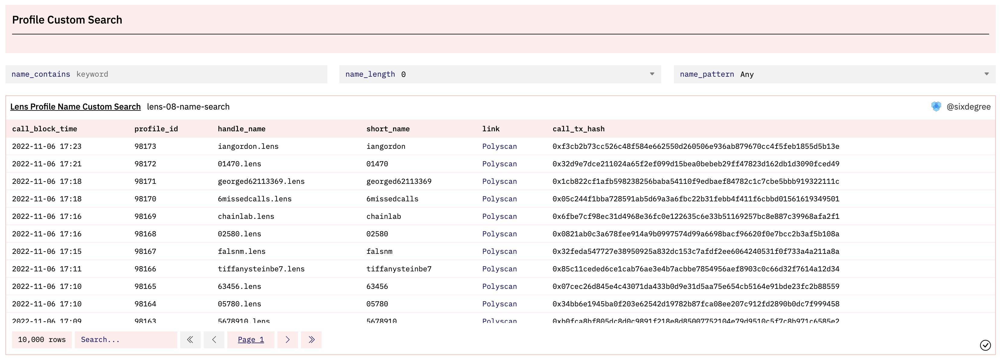

# 实践案例：制作Lens Protocol的数据看板

为了让大家尽快上手开始数据分析，我们会将一些偏理论的内容放到教程的后续部分，前半部分则更多讲解一些可以结合起来实践的内容。本篇教程我们一起来为Lens Protocol项目制作一个基础的数据看板。

## Lens协议是什么？

来自[Lens官网](https://docs.lens.xyz/docs/what-is-lens)的介绍翻译整理如下：
Lens协议（Lens Protocol，简称 Lens）是Polygon区块链上的 Web3 社交图谱生态系统。它旨在让创作者拥有自己与社区之间的联系，形成一个完全可组合的、用户拥有的社交图谱。该协议从一开始就考虑到了模块化，允许添加新功能和修复问题，同时确保用户拥有的内容和社交关系不可变。Lens旨在解决现有社交媒体网络中的一些主要问题。Web2 网络都从其专有的集中式数据库中读取数据。用户的个人资料、朋友关系和内容被锁定在特定网络中，其所有权归网络运营商拥有。各网络之间互相竞争，争夺用户注意力，变成一种零和游戏。Lens通过成为用户拥有的、任何应用程序都可以接入的开放社交图谱来纠正这一点。由于用户拥有自己的数据，他们可以将其带到任何基于Lens协议构建的应用程序中。作为其内容的真正所有者，创作者不再需要担心基于单个平台的算法和政策的突发奇想而失去他们的内容、观众和收入来源。此外，使用Lens协议的每个应用程序都有益于整个生态系统，将零和游戏变成了协作游戏。开发人员可以设计有意义的社交体验，而无需求助于反馈机制来锁定用户的注意力。

Lens协议里面主要涉及以下角色（实体）：个人资料（Profile）、出版物（Publication）、评论（Comment）、镜像（Mirror）、收藏（Collect)）、关注（Follow）。同时，协议里面存在3种类型的NFT，即：个人资料NFT（Profile NFT）、关注NFT（Follow NFT）、收藏NFT（Collect NFT）。

Lens上的用户行为可以简单概括为：

- 创作者首先注册创建他们的Profile，铸造其专属的ProfileNFT。可以设置个性化名称（Profile Handle Name，可简单类比为域名，即“Lens域名”）。同时，可以设置账号头像图片URL、被关注时的规则（通过设置特殊的规则，可以产生收益，比如可以设置用户需要支付一定的费用才能关注Profile）。
- 创作者发布内容出版物（Publication），包括文章（帖子，Post）、镜像（Mirror）、评论（Comment）等。
- 普通用户可以关注创作者，收藏感兴趣的出版物
- 在相关操作步骤中，3中NFT被分别铸造并传输给不同的用户地址。

## 数据看板的主要分析内容

针对Lens这样的项目，我们可以从整体上分析其概况，也可以从不同角度、针对其中的不同角色类型进行数据分析。以下是一些可以分析的内容的概况：
- 总用户数量、总的创作者数量、创作者占比
- 总出版物数量、总评论数量、总镜像数量、总关注数量、总收藏数量
- 用户相关的分析：每日新增用户数量、每日新增创作者数量、每日活跃用户数量、活跃创作者数量、用户整体活跃度的变化趋势等等
- Lens账号个性化域名的相关分析：域名注册数量、不同类型域名的注册情况（纯数字、纯字母、不同长度）等
- 创作者的活跃度分析：发布出版物的数量、被关注的次数、被镜像的次数、最热门创作者等
- 出版物的相关分析：内容发布数量、增长趋势、被关注次数、被收藏次数、最热门出版物等
- 关注的相关分析：关注的数量及其变化趋势、关注者的成本分析、关注创作者最多的用户等
- 收藏的相关分析：每日收藏数量、热门收藏等
- 创作者的收益分析：通过关注产生的收益、其他收益等
- 从NFT的角度进行相关分析：每日铸造数量、涉及的成本（关注费用）等

可以分析的内容非常丰富。在这个看板中，我们仅使用部分内容做案例。其他内容请大家分别去尝试分析。

## 数据表介绍

在Lens的官方文档[已部署的智能合约](https://docs.lens.xyz/docs/deployed-contract-addresses)页面，提示使用LensHub代理（LensHub Proxy）这个智能合约作为交互的主要合约。除了少部分和NFT相关的查询需要用到智能合约FollowNFT下的数据表外，我们基本上主要关注LensHub这个智能合约下面的已解析表就可以了。下图列出了这个智能合约下部分数据表。


在我们之前的教程里已经提过，已解析的智能合约数据表有两大类型：事件日志表(Event Log)和函数调用表（Function Call）。两种类型的表分别以：`projectname_blockchain.contractName_evt_eventName`和：`projectname_blockchain.contractName_call_functionName`格式命名。浏览LensHub合约下的表格列表，我们可以看到下面这些主要的数据表：
- 收藏表（collect/collectWithSig）
- 评论表（comment/commentWithSig）
- 个人资料表（createProfile）
- 关注表（follow/followWithSig）
- 镜像表（mirror/mirrorWithSig）
- 帖子表（post/postWithSig）
- Token传输表（Transfer）

除了Token传输表是事件表之外，上述其他表格都是函数调用表。其中后缀带有`WithSig`的数据表，表示通过签名（Signature）授权来执行的操作。通过签名授权，可以方便地通过API或者允许其他授权方代表某个用户执行某项操作。

大家可以在列表中看到还有其他很多不同方法的数据表，由于这些表全部都是在LensHub智能合约下生成的，所以他们交互的contract_address全部都是LensHub这个地址，即`0xdb46d1dc155634fbc732f92e853b10b288ad5a1d`。当我们要分析Lens的总体用户数据时，应该使用polygon.transactions 原始表，查询其中与这个合约地址交互的数据，这样才能得到完整的数据。

## Lens协议概览分析

通过查看[LensHub智能合约创建交易详情](https://polygonscan.com/tx/0xca69b18b7e2daf4695c6d614e263d6aa9bdee44bee91bee7e0e6e5e5e4262fca)，我们可以看到该智能合约部署与2022年5月16日。当我们查询`polygon.transactions`原始表这样的原始数据表时，通过设置日期时间过滤条件，可以极大地提高查询执行性能。

### 总交易数量和总用户数量
如前所述，最准确的查询用户数量的数据源是`polygon.transactions`原始表，我们可以使用如下的query来查询Lens当前的交易数量和总用户数量。我们直接查询发送给LensHub智能合约的全部交易记录，通过`distinct`关键字来统计独立用户地址数量。由于我们已知该智能合约的创建日期，所以用这个日期作为过滤条件来优化查询性能。

```sql
select count(*) as transaction_count,
    count(distinct `from`) as user_count    -- count unique users
from polygon.transactions
where `to` = '0xdb46d1dc155634fbc732f92e853b10b288ad5a1d'   -- LensHub
    and block_time >= '2022-05-16'  -- contract creation date
```

创建一个新的查询，使用上面的SQL代码，运行查询得到结果后，保存Query。然后为其添加两个`Counter`类型到可视化图表，标题分别设置为“Lens Total Transactions”和“Lens Total Users”。

本查询在Dune上的参考链接：[https://dune.com/queries/1533678](https://dune.com/queries/1533678)

现在我们可以将可视化图表添加到数据看板。由于这是我们的第一个查询，我们可以在添加可视化图表到数据看板的弹出对话框中创建新的数据看板。切换到第一个Counter，点击“Add to dashboard”按钮，在对话框中，点击底部的“New dashboard”按钮，输入数据看板的名称后，点击“Save dashboard”按钮创建空白的数据看板。我这里使用“Lens Protocol Ecosystem Analysis”作为看板的名称。保存之后我们就可以在列表中看到刚创建的数据看板，点击其右边的“Add”按钮，就可以将当前Counter添加到数据看板中。关闭对话框后切换到另一个Counter，也将其添加到新创建的数据看板。

此时，我们可以点击Dune网站头部的“My Creations”链接，再选择“Dashboards” Tab来切换到数据看板列表。点击我们新创建的看板名称，进入看板的预览界面。我们可以看到刚才添加的两个Counter类型可视化图表。在这里，通过点击“Edit”按钮进入编辑模式，你可以对图表的大小、位置做相应的调整，可以通过点击“”按钮来添加文本组件，对数据看板做一些说明或者美化。下图是调整后的数据看板的界面示例。



我们新创建的数据看板的链接是：[Lens Protocol Ecosystem Analysis](https://dune.com/sixdegree/lens-protocol-ecosystem-analysis)

### 按天统计的交易数量和独立用户数量

要想分析Lens协议在活跃度方面的增长变化趋势，我们可以创建一个查询，按日期来统计每天的交易数量和活跃用户地址数量。通过在查询中添加`block_time`字段并使用`date_trunc()`函数将其转换为日期（不含时分秒数值部分），结合`group by`查询子句，我们就可以统计出每天的数据。查询代码如下所示：

```sql
select date_trunc('day', block_time) as block_date,
    count(*) as transaction_count,
    count(distinct `from`) as user_count
from polygon.transactions
where `to` = '0xdb46d1dc155634fbc732f92e853b10b288ad5a1d'   -- LensHub
    and block_time >= '2022-05-16'  -- contract creation date
group by 1
order by 1
```

保存查询并为其添加两个`Bar Chart`类型的可视化图表，`Y column 1`对应的字段分别选择`transaction_count`和`user_count`，可视化图表的标题分别设置为“Lens Daily Transactions”和“Lens Daily Users”。将它们分别添加到数据看板中。效果如下图所示：



通常在按日期统计查询到时候，我们可以按日期将相关数据汇总到一起，计算其累计值并将其与每日数据添加到同一张可视化图表中，以便对整体的数据增长趋势有更直观的认识。通过使用`sum() over ()`窗口函数，可以很方便地实现这个需求。为了保持逻辑简单易懂，我们总是倾向于使用CTE来将复杂的查询逻辑分解为多步。将上面的查询修改为：

```sql
with daily_count as (
    select date_trunc('day', block_time) as block_date,
        count(*) as transaction_count,
        count(distinct `from`) as user_count
    from polygon.transactions
    where `to` = '0xdb46d1dc155634fbc732f92e853b10b288ad5a1d'   -- LensHub
        and block_time >= '2022-05-16'  -- contract creation date
    group by 1
    order by 1
)

select block_date,
    transaction_count,
    user_count,
    sum(transaction_count) over (order by block_date) as accumulate_transaction_count,
    sum(user_count) over (order by block_date) as accumulate_user_count
from daily_count
order by block_date
```

查询执行完毕后，我们可以调整之前添加的两个可视化图表。分别在`Y column 2`下选择`accumulate_transaction_count`和`accumulate_user_count`将它们作为第二个指标值添加到图表中。由于累计值跟每天的数值往往不在同一个数量级，默认的图表显示效果并不理想。我们可以通过选择“Enable right y-axis”选项，然后把新添加的第二列设置为使用右坐标轴，同时修改其“Chart Type”为“Area”（或者“Line”，“Scatter”），这样调整后，图表的显示效果就比较理想了。

为了将每日交易数量与每日活跃用户数量做对比，我们可以再添加一个可视化图表，标题设置为“Lens Daily Transactions VS Users”，在Y轴方向分别选择transaction_count和user_count列。同样，因为两项数值不在同一个数量级，我们启用右侧坐标轴，将user_count设置为使用右坐标轴，图表类型选择“Line”。也将这个图表添加到数据看板。通过查看这个图表，我们可以看到，在2022年11月初的几天里，Lens的每日交易量出现了一个新的高峰，但是每日活跃用户数量的增长则没有那么明显。

这里需要额外说明的是，因为同一个用户可能中不同的日期都有使用Lens，当我们汇总多天的数据到一起时，累计得到的用户数量并不代表实际的独立用户总数，而是会大于实际用户总数。如果需要统计每日新增的独立用户数量及其总数，我们可以先取得每个用户最早的交易记录，然后再用相同的方法按天汇总统计。具体这里不再展开说明，请大家自行尝试。另外如果你想按周、按月来统计，只需Fork这个查询，修改`date_trunc()`函数的第一个参数为“week”或者“month”即可实现。作为对比，我们Fork并修改了一个按月统计的查询，只将其中的“”加到了数据看板中。

调整完成后，数据看板中的图表会自动更新为最新的显示结果，如下图所示。


以上两个查询在Dune上的参考链接：
- [https://dune.com/queries/1534604](https://dune.com/queries/1534604)
- [https://dune.com/queries/1534774](https://dune.com/queries/1534774)

## 创作者个人资料（Profile）数据分析

Lens的创作者个人资料账号目前仅限于许可白名单内的用户来创建，创建个人资料的数据保存在`createProfile`表中。用下面的查询，我们可以计算出当前已经创建的个人资料的数量。

```sql
select count(*) as profile_count
from lens_polygon.LensHub_call_createProfile
where call_success = true   -- Only count success calls
```

创建一个Counter类型的可视化图表，Title设置为“Total Profiles”，将其添加到数据看板中。

我们同样关心创作者个人资料随日期的变化和增长情况。用下面的查询可以统计出每日、每月的个人资料创建情况。

```sql
with daily_profile_count as (
    select date_trunc('day', call_block_time) as block_date,
        count(*) as profile_count
    from lens_polygon.LensHub_call_createProfile
    where call_success = true
    group by 1
    order by 1
)

select block_date,
    profile_count,
    sum(profile_count) over (order by block_date) as accumulate_profile_count
from daily_profile_count
order by block_date
```

用类似的方法创建并添加可视化图表到数据看板。显示效果如下图所示：


以上两个查询在Dune上的参考链接：
- [https://dune.com/queries/1534486](https://dune.com/queries/1534486)
- [https://dune.com/queries/1534927](https://dune.com/queries/1534927)
- [https://dune.com/queries/1534950](https://dune.com/queries/1534950)

## 创作者个人资料域名分析

Lens致力于打造一个社交图谱生态系统，每个创作者可以给自己的账号设置一个个性化的名称（Profile Handle Name），这也是通常大家说的Lens域名。与ENS等其他域名系统类似，我们会关注一些短域名、纯数字域名等的注册情况、不同字符长度的域名已注册数量等信息。在`createProfile`表中，字段`vars`以字符串格式保存了一个json对象，里面就包括了用户的个性化域名。在Dune V2中，我们可以直接使用`:`符号来访问json字符串中的元素的值，例如用`vars:handle`获取域名信息。

使用下面的SQL，我们可以获取已注册Lens域名的详细信息：
```sql
select vars:to as user_address,
    vars:handle as handle_name,
    replace(vars:handle, '.lens', '') as short_handle_name,
    call_block_time,
    output_0 as profile_id,
    call_tx_hash
from lens_polygon.LensHub_call_createProfile
where call_success = true   
```

为了统计不同长度、不同类型（纯数字、纯字母、混合）Lens域名的数量以及各类型下已注册域名的总数量，我们可以将上面的查询放到一个CTE中。使用CTE的好处是可以简化逻辑（你可以按顺序分别调试、测试每一个CTE）。同时，CTE一经定义，就可以在同一个查询的后续SQL脚本中多次使用，非常便捷。鉴于查询各类域名的已注册总数量和对应不同字符长度的已注册数量都基于上面的查询，我们可以在同一个查询中将它们放到一起。因为前述统计都需要区分域名类型，我们在这个查询中增加了一个字段`handle_type`来代表域名的类型。修改后的查询代码如下：

```sql
with profile_created as (
    select vars:to as user_address,
        vars:handle as handle_name,
        replace(vars:handle, '.lens', '') as short_name,
        (case when replace(vars:handle, '.lens', '') rlike '^[0-9]+$' then 'Pure Digits'
            when replace(vars:handle, '.lens', '') rlike '^[a-z]+$' then 'Pure Letters'
            else 'Mixed'
        end) as handle_type,
        call_block_time,
        output_0 as profile_id,
        call_tx_hash
    from lens_polygon.LensHub_call_createProfile
    where call_success = true    
),

profiles_summary as (
    select (case when length(short_name) >= 20 then 20 else length(short_name) end) as name_length,
        handle_type,
        count(*) as name_count
    from profile_created
    group by 1, 2
),

profiles_total as (
    select count(*) as total_profile_count,
        sum(case when handle_type = 'Pure Digits' then 1 else 0 end) as pure_digit_profile_count,
        sum(case when handle_type = 'Pure Letters' then 1 else 0 end) as pure_letter_profile_count
    from profile_created
)

select cast(name_length as string) || ' Chars' as name_length_type,
    handle_type,
    name_count,
    total_profile_count,
    pure_digit_profile_count,
    pure_letter_profile_count
from profiles_summary
join profiles_total on true
order by handle_type, name_length
```

修改后的查询代码相对比较复杂，解读如下：
1. CTE `profile_created`通过使用“:“符号来从保存于`vars`字段中的json字符串里面提取出Profile的域名信息和域名归属的用户地址。由于保存的域名包括了`.lens`的后缀，我们通过`replace()`方法将后缀部分清除并命名新的字段为`short_name`，方便后面计算域名的字符长度。进一步，我们通过一个CASE语句，结合正则表达式匹配操作符`rlike`来判断域名是否由纯数字或者纯字母组成，并赋予一个字符串名称值，命名此字段为`handle_type`。可参考[rlike operator](https://docs.databricks.com/sql/language-manual/functions/rlike.html)了解正则表达式匹配的更多信息。
2. CTE `profiles_summary`基于`profile_created`执行汇总查询。我们首先使用`length()`函数计算出每一个域名的字符长度。因为存在少量特别长的域名，我们使用一个CASE语句，将长度大于20个字符的域名统一按20来对待。然后我们基于域名长度`name_length`和`handle_type`执行`group by`汇总统计，计算各种域名的数量。
3. CTE `profiles_total`中，我们统计域名总数量、纯数字域名的数量和纯字母域名的数量。
4. 最后，我们将`profiles_summary`和`profiles_total`这两个CTE关联到一起输出最终查询结果。由于`profiles_total`只有一行数据，我们直接使用`true`作为JOIN的条件即可。另外，因为`name_length`是数值类型，我们将其转换为字符串类型，并连接到另一个字符串来得到可读性更强的域名长度类型名称。我们将输出结果按域名类型和长度进行排序。

执行查询并保存之后，我们为其添加下列可视化图表并分别添加到数据看板中：
1. 添加两个Counter，分别输出纯数字域名的数量和纯字母域名的数量。因为之前已经有一个域名注册总数量的Counter，我们可以将这两个新的Counter图表跟它放置到同一行。
2. 添加一个域名类型分布的扇形图（Pie Chart），Title设置为“Profiles Handle Name Type Distribution”，“X Column“选择`handle_type`字段，“Y Column 1”选择`name_count`字段。
3. 添加一个域名长度分布的扇形图（Pie Chart），Title设置为“Profiles Handle Name Length Distribution”，“X Column“选择`name_length_type`字段，“Y Column 1”选择`name_count`字段。
4. 添加一个域名长度分布的柱状图（Bar Chart），Title设置为“Profiles Handle Name Count By Length”，“X Column“选择`name_length_type`字段，“Y Column 1”选择`name_count`字段，“Group by”选择`handle_type`字段。同时取消勾选“Sort values”选项，再勾选“Enable stacking”选项。
5. 添加一个域名长度分布的面积图（Area Chart），Title设置为“Profile Handle Name Count Percentage By Type”，“X Column“选择`name_length_type`字段，“Y Column 1”选择`name_count`字段，“Group by”选择`handle_type`字段。取消勾选“Sort values”选项，再勾选“Enable stacking”选项，另外再勾选“Normalize to percentage”选项。

将上述可视化图表全部添加到数据看板中，调整显示顺序后，如下图所示：


域名搜索




## 作业

TODO

## SixDegreeLab介绍

SixDegreeLab（[@SixdegreeLab](https://twitter.com/sixdegreelab)）是专业的链上数据团队，我们的使命是为用户提供准确的链上数据图表、分析以及洞见，并致力于普及链上数据分析。通过建立社区、编写教程等方式，培养链上数据分析师，输出有价值的分析内容，推动社区构建区块链的数据层，为未来广阔的区块链数据应用培养人才。

欢迎访问[SixDegreeLab的Dune主页](https://dune.com/sixdegree)。

因水平所限，不足之处在所难免。如有发现任何错误，敬请指正。
