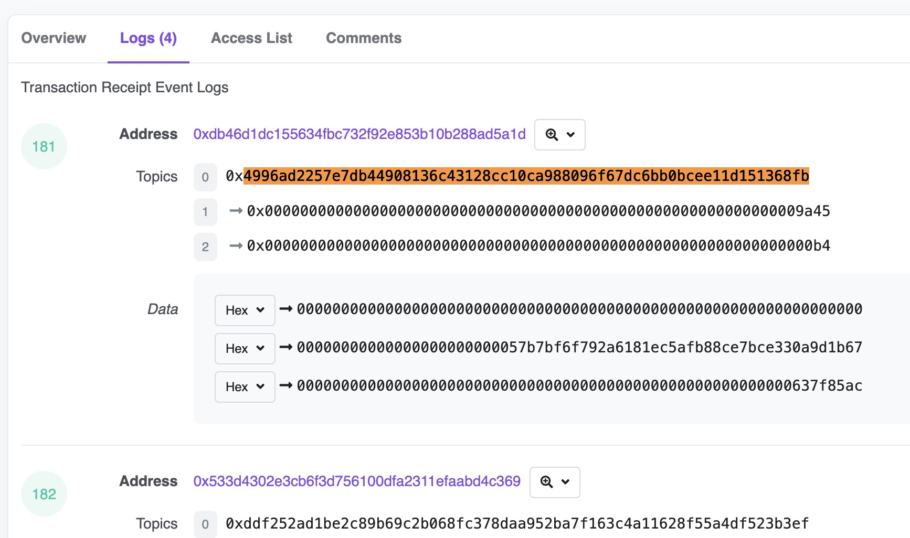

# 常见查询三：杂项

在常见查询的前面两个部分，我们分别介绍了ERC20代币的价格查询、持有者、持有余额等常见的一些查询方法。在这一部分，我们再介绍一些其他方面的常用查询。

## 使用CTE自定义数据表

Dune V2目前还不支持用户自定义表和视图，对于一些来源外部数据源的数据或者手动整理的少量数据，我们可以考虑在查询内使用CTE来生成自定义数据列表。经过测试，对于只包括几个字段的情况，可以支持包含上千行数据的自定义CTE数据表，只要不超过Dune查询请求的最大数据量限制，就能成功执行。下面介绍两种自定义CTE数据表的方式：

第一种语法示例：
```sql
with raydium_lp_pairs(account_key, pair_name) as (
    values
    ('58oQChx4yWmvKdwLLZzBi4ChoCc2fqCUWBkwMihLYQo2', 'SOL/USDC'),
    ('7XawhbbxtsRcQA8KTkHT9f9nc6d69UwqCDh6U5EEbEmX', 'SOL/USDT'),
    ('AVs9TA4nWDzfPJE9gGVNJMVhcQy3V9PGazuz33BfG2RA', 'RAY/SOL'),
    ('6UmmUiYoBjSrhakAobJw8BvkmJtDVxaeBtbt7rxWo1mg', 'RAY/USDC'),
    ('DVa7Qmb5ct9RCpaU7UTpSaf3GVMYz17vNVU67XpdCRut', 'RAY/USDT'),
    ('GaqgfieVmnmY4ZsZHHA6L5RSVzCGL3sKx4UgHBaYNy8m', 'RAY/SRMSOL'),
    ('6a1CsrpeZubDjEJE9s1CMVheB6HWM5d7m1cj2jkhyXhj', 'STSOL/USDC'),
    ('43UHp4TuwQ7BYsaULN1qfpktmg7GWs9GpR8TDb8ovu9c', 'APEX4/USDC')
)

select * from raydium_lp_pairs
```

第二种语法示例：

```sql
with token_plan as (
    select token_name, hook_amount from (
        values
        ('Token Type','BEP-20 on BNB Chain'),
        ('Total Token Supply','500,000,000 HOOK'),
        ('Private Sale Allocation','100,000,000 HOOK'),
        ('Private Sale Token Price','0.06 USD to 0.12 USD / HOOK'),
        ('Private Sale Amount Raised','~ 6,000,000 USD'),
        ('Binance Launchpad Sale Allocation','25,000,000 HOOK'),
        ('Binance Launchpad Sale Price','0.10 USD / HOOK'),
        ('Binance Launchpad Amount to be Raised','2,500,000 USD'),
        ('Initial Circ. Supply When Listed on Binance','50,000,000 HOOK (10.00%)')
    ) as tbl(token_name, hook_amount)
)

select * from token_plan
```

当然，对于第二种语法，如果碰巧你只需要返回这部分自定义的数据，则可以省略CTE定义，直接使用其中的SELECT查询。

以上查询的示例链接：
- [https://dune.com/queries/781862](https://dune.com/queries/781862)
- [https://dune.com/queries/1650640](https://dune.com/queries/1650640)

## 从事件日志原始表解析数据

之前在讲解计算ERC20代币价格时，我们介绍过从事件日志原始表（logs）解析计算价格的例子。这里再举例说明一下其他需要直接从logs解析数据的情况。当遇到智能合约未被Dune解析，或者因为解析时使用的ABI数据不完整导致没有生成对应事件的解析表的情况，我们就可能需要直接从事件日志表解析查询数据。以Lens 协议为例，我们发现在Lens的智能合约源代码中（[Lens Core](https://github.com/lens-protocol/core)），几乎每个操作都有发生生成事件日志，但是Dune解析后的数据表里面仅有少数几个Event相关的表。进一步的研究发现时因为解析时使用的ABI缺少了这些事件的定义。我们当然可以重新生成或者找Lens团队获取完整的ABI，提交给Dune去再次解析。不过这里的重点是如何从未解析的日志里面提取数据。

在Lens智能合约的源代码里，我们看到了`FollowNFTTransferred`事件定义，[代码链接](https://github.com/lens-protocol/core/blob/main/contracts/libraries/Events.sol#L347)。代码里面也有`Followed`事件，但是因为其参数用到了数组，解析变得复杂，所以这里用前一个事件为例。从事件名称可以推断，当一个用户关注某个Lens Profile时，将会生成一个对应的关注NFT （FollowNFT）并把这个NFT转移到关注者的地址。那我们可以找到一个关注的交易记录，来看看里面的logs，示例交易：[https://polygonscan.com/tx/0x30311c3eb32300c8e7e173c20a6d9c279c99d19334be8684038757e92545f8cf](https://polygonscan.com/tx/0x30311c3eb32300c8e7e173c20a6d9c279c99d19334be8684038757e92545f8cf)。在浏览器打开这个交易记录页面并切换到“Logs”标签，我们可以看到一共有4个事件日志。对于一些事件，区块链浏览器可以显示原始的事件名称。我们查看的这个Lens交易没有显示原始的名称，那我们怎么确定哪一个是对应`FollowNFTTransferred`事件日志记录的呢？这里我们可以结合第三方的工具，通过生成事件定义的keccak256哈希值来比较。[Keccak-256](https://emn178.github.io/online-tools/keccak_256.html)这个页面可以在线生成Keccak-256哈希值。我们将源代码中`FollowNFTTransferred`事件的定义整理为精简模式（去除参数名称，去除空格），得到`FollowNFTTransferred(uint256,uint256,address,address,uint256)`，然后将其粘贴到Keccak-256工具页面，生成的哈希值为`4996ad2257e7db44908136c43128cc10ca988096f67dc6bb0bcee11d151368fb`。


使用这个哈希值在Polygonscan的交易日志列表中搜索，即可找到匹配项。可以看到第一个日志记录正好就是我们要找的。



找到了对应的日志记录，剩下的就简单了。结合事件的定义，我们可以很容易的进行数据解析：

```sql
select block_time,
    tx_hash,
    conv(substring(topic2, 3), 16, 10) as profile_id, -- 关注的Profile ID
    conv(substring(topic3, 3), 16, 10) as follower_token_id, -- 关注者的NFT Token ID
    '0x' || right(substring(data, 3, 64), 40) as from_address, -- NFT转出地址
    '0x' || right(substring(data, 3 + 64, 64), 40) as to_address -- NFT转入地址（也就是关注者的地址）
from polygon.logs
where contract_address = '0xdb46d1dc155634fbc732f92e853b10b288ad5a1d' -- Lens合约地址
    and block_time >= '2022-05-01' -- Lens合约部署在此日期之后，此条件用于改善查询速度
    and topic1 = '0x4996ad2257e7db44908136c43128cc10ca988096f67dc6bb0bcee11d151368fb'   -- 事件主题 FollowNFTTransferred
limit 10
```

以上查询的示例链接：
- [https://dune.com/queries/1652759](https://dune.com/queries/1652759)
- [Keccak-256 Tool](https://emn178.github.io/online-tools/keccak_256.html)


## 读取数组数据

## 读取JSON字符串数据


## 清除异常值

least greatest


## SixDegreeLab介绍

SixDegreeLab（[@SixdegreeLab](https://twitter.com/sixdegreelab)）是专业的链上数据团队，我们的使命是为用户提供准确的链上数据图表、分析以及洞见，并致力于普及链上数据分析。通过建立社区、编写教程等方式，培养链上数据分析师，输出有价值的分析内容，推动社区构建区块链的数据层，为未来广阔的区块链数据应用培养人才。

欢迎访问[SixDegreeLab的Dune主页](https://dune.com/sixdegree)。

因水平所限，不足之处在所难免。如有发现任何错误，敬请指正。
