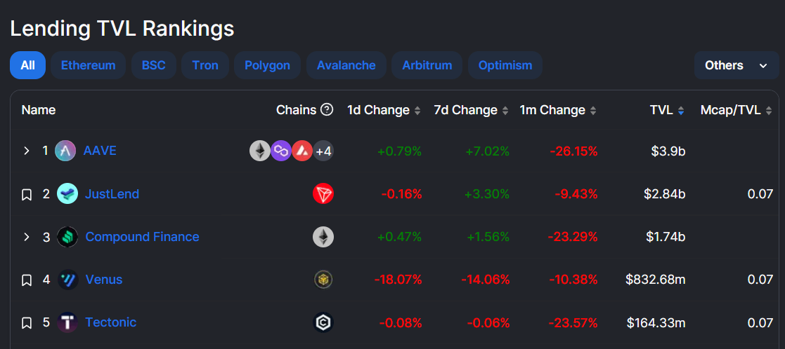

# 借贷协议数据分析

## 背景知识
去中心化金融（DeFi）是区块链的金融创新。通过各协议之间的可组合性、互操作性，DeFi乐高就此诞生。2020年6月，DeFi借贷协议Compound开启流动性挖矿，不仅拉开了DeFi Summer的序幕，也给DeFi借贷赛道注入新活力、新思路、新用户，借贷业务成为DeFi的三大核心之一。

### 借贷协议的意义
借贷协议是DeFi的银行。传统银行中，用户可以向银行存款收取利息，也可以向银行借款，最后连本带利一起归还。类似的，在DeFi的借贷协议中用户可以向协议存钱、借钱，不同的是没有了中心化的托管机构，而是用户和借贷协议的智能合约直接交互，靠代码的运行确保一切有条不紊地进行。CeFi中的借贷，贷款担保方式分为信用、保证以及抵押贷款。尽管银行的风险偏好较低，抵押贷款在各类贷款中占比仍是最高的，但是得益于大数据信用体系建设，信用借贷越来越普遍，不过需要大量的审查、资质证明等。


而DeFi中的借贷是匿名的，无需信任的，从模式上讲基本都处于抵押贷款方式，普遍采用的方式是超额抵押。也就是说，我抵押200块的资产，可以从你这借走不足200块的资金，这样你就无需担心我借钱跑路，可以放心地借钱给我了。这种以币借币，甚至越借越少的行为看似非常愚蠢，但是实际上它是存在切实需求的：
1. 交易活动的需求：包括套利、杠杆、做市等交易活动
例如做市商需要借资金来满足大量的交易；在DEX上买币只能做多，但是通过借币可以做空；通过抵押资产加杠杆，甚至可以通过循环贷不断增加杠杆（抵押ETH借USDC买ETH再抵押再借再买…）

2. 获得被动收入：闲置资金/屯币党在屯币的过程中可以通过借出资产获得额外收益

3. 代币激励：除了流动性挖矿，头部 DeFi 协议推出基于其原生代币的质押服务，代币持有者可质押获得更多原生代币。代币激励是面对借贷协议所有参与者的，借方可以通过交互获得代币奖励，通过交易获得的代币，偿还一部分债务。

相比传统房车类型抵押贷款，需要人力验证资产所有人，还款违约还需要人力及时间进行资产拍卖。DeFi中的当铺模式只需要在抵押率过低停止抵押，对资产清算即可结束贷款合同。

### 借贷协议的运作模式
加密资产的价格浮动往往会比较剧烈，借贷协议采用的超额抵押方式有助于避免资不抵债的情况发生，如下图所示：不同的抵押率对应不同的费率和质押要求。


但是当极端情况来临，借贷协议会发生什么呢？比如现在ETH价格是1000 usd，我通过质押1个ETH借出800 usdc，突然ETH价格暴跌，这时候借贷协议要如何避免坏账呢？答案是清算。
我们以AAVE为例，看借贷协议是如何进行清算的。
首先介绍一个概念叫健康因子（Health Factor），健康因子和账户的抵押物、借款金额有关，表达资不抵债的可能性。如何计算健康因子？

1、查看抵押物的清算线（LiquidationThreshold），比如此时USDC是0.89；


2、健康因子 = 抵押金额 * 清算线/ 借出资产，以此刻为例，5794 * 0.89/ 4929 = 1.046；


注：LTV（Loan to Value）为最大可借比例，比如USDC的LTV为0.87，那么上图示例最大可借出 5794 * 0.87 = 5040

3、如果抵押物价格下跌，或者借出资产价格上涨，导致健康因子<1，则会执行清算Liquidation，具体清算过程如下：


那么实际的不等式是：借出资产金额 <= 抵押金额 * LTV < 抵押金额 * 清算线。
清算时，超出清算线的部分会拿去拍卖，清算者（liquidators）购买抵押物，拍卖获得的资金用于归还负债，多出部分就作为清算者的奖赏。
清算过程依赖于预言机的喂价，目前AAVE取的是Chainlink。

简单总结，大部分的借贷协议目前采用的方式是超额抵押，当价格波动时由健康因子监控是否需要清算，以及清算多少。这里我们只讲了最简单最基本的借贷业务，实际上各个协议之间也各有特色，如Compound是去中心化的点对点模式，资金池运用模式使池内资金达到了极高的利用值；AAVE首先提出了闪电贷，借款+操作+还款在一个区块内完成，原子性决定了这笔交易要么全部成功，要么全部失败；AAVE V3更提出了资产跨链流动的功能；而Euler，Kashi和Rari等借贷平台通过无许可的借贷池更好地满足长尾资产的需求。


## 重点关注指标
搞明白链上借贷协议的业务逻辑之后，就可以着手分析了，接下来我将列出一些常用于评估借贷协议的一些指标。需要注意的是，在智能合约中资金的流动难以区分，虽然只有入、出两个方向，但是所代表的意义有所不同，需要结合智能合约、区块链浏览器来辅助判断。

### 1.总锁仓量 TVL（Total Value Locked）

即有多少金额锁定在借贷协议的智能合约中，TVL代表了协议的流动性。从[defillama](https://defillama.com/protocols/lending)数据来看，整体借贷市场TVL超过$10 B，前五的TVL总和约为$9.5 B，其中AAVE独占$3.9 B。


我们以Arbitrum上的AAVE V3为例，做[TVL](https://dune.com/queries/1042816/1798270)的查询，基本思路是：提供给合约的资金减去已被取走的资金，剩下的就是锁定资产。从log表中选择发往AAVE V3合约的交易，定义`存入`和`提取`这两个动作（action_type）。打开[Arbscan](https://arbiscan.io/address/0x794a61358d6845594f94dc1db02a252b5b4814ad)找到AAVE一笔[交易](https://arbiscan.io/tx/0x6b8069b62dc762e81b41651538d211f9a1a33009bcb41798e673d715867b2f29#eventlog)为例，打开log可以看到topic0 = '0x2b627736bca15cd5381dcf80b0bf11fd197d01a037c52b927a881a10fb73ba61' 对应智能合约中'Supply'的行为


类似的，topic0 = '0x3115d1449a7b732c986cba18244e897a450f61e1bb8d589cd2e69e6c8924f9f7' 时对应'Withdraw'的行为（注，在Dune中topic1指的是etherscan中的topic0）。存入为正提款为负，相加之后就是在合约内锁定的代币。用`concat`函数拼接'0x'和topic中的字符得到转账token的地址和转账人的地址，用`bytea2numeric_v2`函数得到转账token对应的数量（非usd计价金额）。
```sql
with aave_v3_transactions as (
    select 'Supply' as action_type,
        block_time,
        concat('0x', right(topic2, 40)) as token_address, --拼接得到token地址
        concat('0x', right(topic3, 40)) as user_address,
        bytea2numeric_v2(substring(data, 3 + 64, 64)) as raw_amount, --从第3个字符开始，使用Substring()函数分别截取对应位置的64个字符，使用bytea2numeric_v2()函数转换为10进制值
        tx_hash
    from arbitrum.logs
    where contract_address = '0x794a61358d6845594f94dc1db02a252b5b4814ad'   -- Aave: Pool V3
        and topic1 = '0x2b627736bca15cd5381dcf80b0bf11fd197d01a037c52b927a881a10fb73ba61' -- Supply
        and block_time > '2022-03-16' -- First transaction date
    
    union all
    
    select 'Withdraw' as action_type, --withdraw处理类似
        block_time,
        concat('0x', right(topic2, 40)) as token_address,
        concat('0x', right(topic3, 40)) as user_address,
        (-1) * bytea2numeric_v2(substring(data, 3, 64)) as raw_amount, --在数值前面加负号
        tx_hash
    from arbitrum.logs
    where contract_address = '0x794a61358d6845594f94dc1db02a252b5b4814ad'   -- Aave: Pool V3
        and topic1 = '0x3115d1449a7b732c986cba18244e897a450f61e1bb8d589cd2e69e6c8924f9f7' -- Withdraw
        and block_time > '2022-03-16' -- First transaction date
),

aave_v3_transactions_daily as (
    select date_trunc('day', block_time) as block_date,
        token_address,
        sum(raw_amount) as raw_amount_summary
    from aave_v3_transactions
    group by 1, 2
    order by 1, 2
),
```

到此我们得到了锁定在智能合约中的token数量，要得到美元计价的TVL，我们还需要将token和其价格匹配，这里我们手动选取了一些主流的币种：
```sql
token_mapping_to_ethereum(aave_token_address, ethereum_token_address, token_symbol) as (
    values
    ('0xfd086bc7cd5c481dcc9c85ebe478a1c0b69fcbb9', '0xdac17f958d2ee523a2206206994597c13d831ec7', 'USDT'),
    ('0x2f2a2543b76a4166549f7aab2e75bef0aefc5b0f', '0x2260fac5e5542a773aa44fbcfedf7c193bc2c599', 'WBTC'),
    ('0xd22a58f79e9481d1a88e00c343885a588b34b68b', '0xdb25f211ab05b1c97d595516f45794528a807ad8', 'EURS'),
    ('0xff970a61a04b1ca14834a43f5de4533ebddb5cc8', '0xa0b86991c6218b36c1d19d4a2e9eb0ce3606eb48', 'USDC'),
    ('0xf97f4df75117a78c1a5a0dbb814af92458539fb4', '0x514910771af9ca656af840dff83e8264ecf986ca', 'LINK'),
    ('0x82af49447d8a07e3bd95bd0d56f35241523fbab1', '0xc02aaa39b223fe8d0a0e5c4f27ead9083c756cc2', 'WETH'),
    ('0xda10009cbd5d07dd0cecc66161fc93d7c9000da1', '0x6b175474e89094c44da98b954eedeac495271d0f', 'DAI'),
    ('0xba5ddd1f9d7f570dc94a51479a000e3bce967196', '0x7fc66500c84a76ad7e9c93437bfc5ac33e2ddae9', 'AAVE')
),

latest_token_price as (
    select date_trunc('hour', minute) as price_date,
        contract_address,
        symbol,
        decimals,
        avg(price) as price
    from prices.usd
    where contract_address in (
        select ethereum_token_address
        from token_mapping_to_ethereum
    )
    and minute > now() - interval '1 day'
    group by 1, 2, 3, 4
),

latest_token_price_row_num as (
    select  price_date,
        contract_address,
        symbol,
        decimals,
        price,
        row_number() over (partition by contract_address order by price_date desc) as row_num
    from latest_token_price
),

current_token_price as (
    select contract_address,
        symbol,
        decimals,
        price
    from latest_token_price_row_num
    where row_num = 1
),
```
用raw amount除以对应token的小数位（decimal）（例如ETH的decimal是18，USDT的是6），得到实际token有多少枚，再和对应价格相乘得到以usd为计价单位的金额，求和后得到总的TVL。
```sql
daily_liquidity_change as (
    select d.block_date,
        p.symbol,
        d.token_address,
        d.raw_amount_summary / power(10, coalesce(p.decimals, 0)) as original_amount,
        d.raw_amount_summary / power(10, coalesce(p.decimals, 0)) * coalesce(p.price, 1) as usd_amount
    from aave_v3_transactions_daily d
    inner join token_mapping_to_ethereum m on d.token_address = m.aave_token_address
    left join current_token_price p on m.ethereum_token_address = p.contract_address
    order by 1, 2
)

select sum(usd_amount) / 1e6 as total_value_locked_usd
from daily_liquidity_change
```

### 2.未尝贷款（Outstanding loan）
即外借了多少钱还没还回来

## 常用表说明


## NFT综合看板示例

## 参考
1. https://foresightnews.pro/article/detail/17638
2. https://learnblockchain.cn/article/5036
3. https://twitter.com/0xhiger/status/1595076528697905157

## SixDegreeLab介绍

SixDegreeLab（[@SixdegreeLab](https://twitter.com/sixdegreelab)）是专业的链上数据团队，我们的使命是为用户提供准确的链上数据图表、分析以及洞见，并致力于普及链上数据分析。通过建立社区、编写教程等方式，培养链上数据分析师，输出有价值的分析内容，推动社区构建区块链的数据层，为未来广阔的区块链数据应用培养人才。

欢迎访问[SixDegreeLab的Dune主页](https://dune.com/sixdegree)。

因水平所限，不足之处在所难免。如有发现任何错误，敬请指正。
