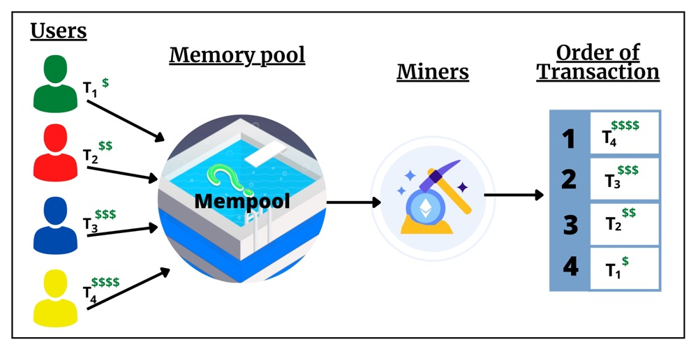
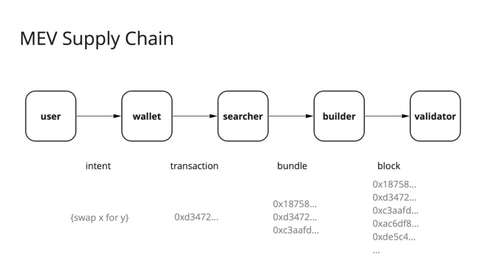
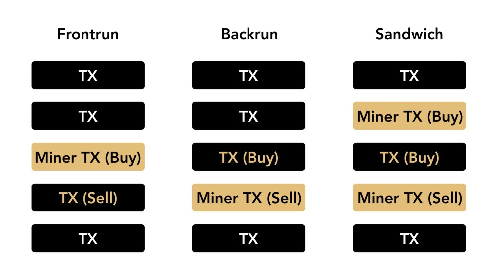
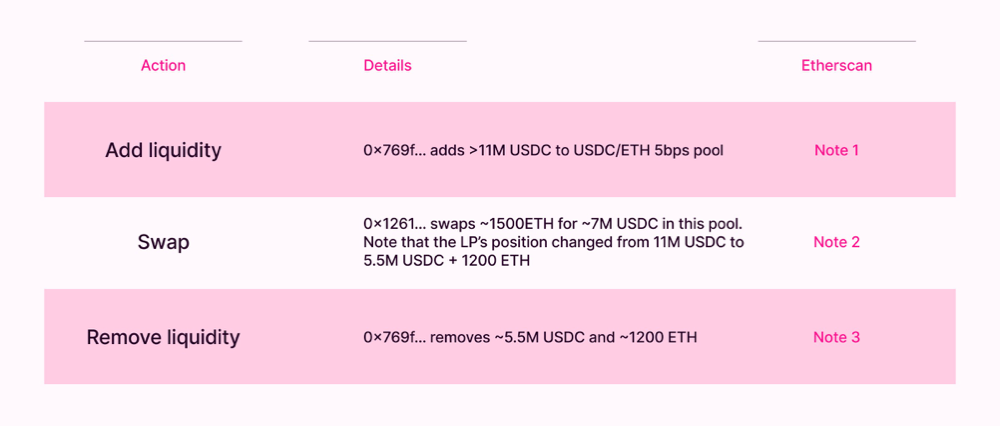
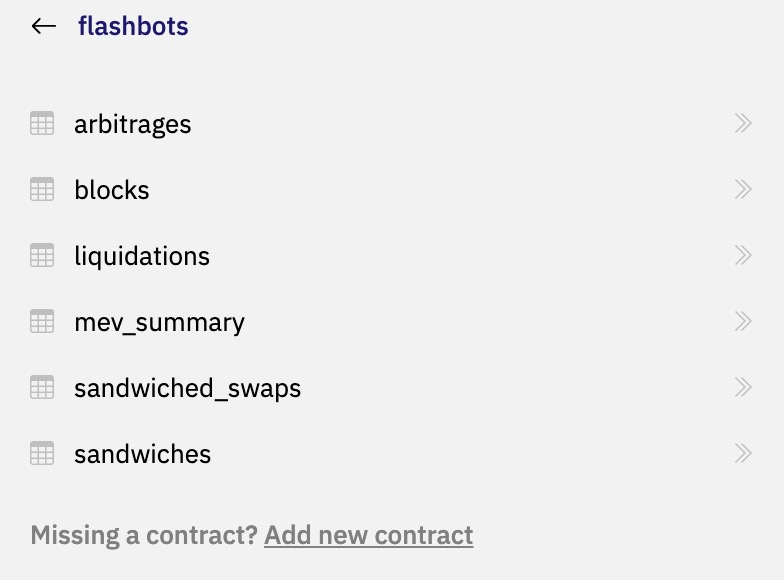
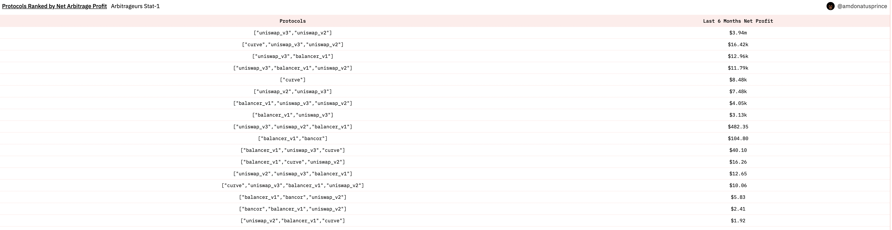

# MEV研究——以Uniswap为例

## 什么是MEV？

MEV（miner-extractable value）的概念最早出现在2019年的Flashboy 2.0一文中，指的是矿工通过包含、重新排序、插入或忽略交易可以获得的额外利润。随着近两年区块链的发展和链上研究活动的推进，MEV现在已经延伸到最大可提取价值（maximal extractable value）。

以太坊是链上活动最丰富、最活跃的主网，讨论以太坊上MEV诞生的几个前提：

1. 以太坊的Gas机制本质上是拍卖机制，价高者得，且设计交易是串行的。即谁出的gas高，矿工/验证者会先打包哪个交易进块，以此达到收益最大化。这是以太坊为人诟病的gas昂贵、拥堵的原因之一，也为MEV的出现带来可能：一旦发现有利可图的交易，可以通过贿赂矿工（提高gas）的方法率先执行。

2. 区块链内存池Mempool的设计。所有发送出去的交易都需要暂时进入内存池，而不是由矿工直接打包。内存池中充满了待处理的交易，并且是公开的，这意味着任何人都可以监控内存池中的每笔交易和调用的每个函数，这为攻击者提供了监视交易的条件。



3. 根据 [Etherscan](https://etherscan.io/blocks) 数据，在POS合并之后出出块时间固定为12 s，在POS合并之前是13.5 s左右。较长的出块时间出于节点同步的安全性考虑，也为攻击者提供了执行时间。

总结来说，**MEV攻击者可以在公开的mempool中看到所有待执行的交易，有充足的时间去进行预演，看这笔交易是否能带来利润，如果确定有利可图，可以通过抬高gas费用来达到优先执行的效果，从而窃取别人的利益。**


这里有个意思的问题，Solana既没有mempool，出块速度又快，不应该没有MEV吗？实际上Solana也有MEV，在此先不做讨论，仅讨论以太坊上的MEV。

那么谁是MEV的受益者呢？首先矿工/验证者躺赢，买家之间的竞争使卖家的收入最大化，区块空间市场也不例外；其次MEV攻击的发起者受益，这很显然。那么矿工/验证者可以自己下场做MEV吗？答案当然是可以的。最优的情况当然是矿工/验证者出块时恰好自己又发起了MEV交易。当然实际上这种几率实在够低，MEV的出现也有些看运气，运气好的验证者出的块可能正好包含大量MEV，运气差些的可能完全没有。根据[Post-Merge MEV: Modelling Validator Returns](https://pintail.xyz/posts/post-merge-mev/)文章中计算结果，有些验证者在一年中几乎没有收到 MEV，而有些验证者的年回报率则远远超过 100%。平均来说，MEV会为验证者平均多带来1.5% - 3%的年回报。算上区块奖励，验证者中位数年回报率大致在6.1%到7.6%（基于 MEV “淡季”和“旺季”的数据集）。

## MEV的提取过程
在 MEV 提取过程中，科学家会计算利润和套利路径，并把执行逻辑都写成合约代码，使用机器人来完成调用。这时如果没有人发现并执行同一套利路径，那么只需要向矿工缴纳正常的 GAS 费用；如果有别人发现并执行同一套利路径，那么就必须支付比别人更高的 GAS 以确保自己的交易优先完成。

由于区块链上的交易都是公开的，利润稍大的套利路径都能被筛选并研究出来，从而导致激烈的 GAS 竞争。而区块链上的 GAS 竞价都是公开的，因此给矿工的 GAS 往往能在一个块的时间内翻上好几倍。最终如果没有人退出，往往需要将全部的利润都给矿工，直到有一方结束内耗。



## MEV的分类
MEV 机器人根据它们创建者的旨意进行着链上活动, 将交易包装好后送给不知情的矿工出块。从好的角度来看, 它们是保证市场稳定和 DApp 活跃度的重要角色; 从不好的角度来看, 它们以自己天生的优势 ( 可以监视整个Mempool), 对普通用户进行着不平等的剥削。

考虑本文主要介绍使用Dune进行MEV分析，这里基于Dune的相关内容对MEV进行简单的分类：

### 1. 套利
套利是 MEV 最常见的形式。当同一资产在不同交易所的价格不同时，就存在套利机会。与在传统金融市场寻找套利机会的高频交易员类似，搜寻者（Searcher，即挖掘MEV的人）部署机器人来发现去中心化交易所(DEX) 上的任何潜在套利机会。AMM机制天然地欢迎套利交易，因为成交价不再由挂单方决定，由池内交易决定，那么套利行为就等同于手动将一个DEX的交易对与其他DEX/CEX交易对价格进行同步，确保市场公平稳定，同时为协议贡献交易量、活跃度，所以这类MEV被认为是“好“的MEV。注意，只有发现别人套利并通过提高gas插队替换该笔交易时，套利才被视为MEV。

### 2.清算
DeFi借贷平台目前采用超额抵押借贷的模式。自然地，用作抵押品的资产价格会随时间波动，如果资产跌破特定价格，则抵押品将被清算。通常，抵押品会被打折出售，购买走这部分抵押品的人称为清算人，清算完成后还会得到借贷平台的奖励。只要找到清算机会，就可以出现替换清算交易的情况，存在 MEV 机会。搜寻者注意到传入交易池中的清算交易，然后创建与初始清算交易相同的交易，插入他们自己的交易，于是搜寻者称为清算头寸并收取赏金的人。

这类MEV加速了DeFi的流动性，为借贷平台的正常运行提供保障，也被认为是“好”的MEV。

### 3. Frontrunning、Backrunning 和 Sandwich(ing)
抢跑是MEV机器人支付稍高的gas fee来抢先在Mempool的某交易前执行交易, 比如以更低的价格 Swap 代币。回跑是机器人在一笔交易造成价格大幅错位之后尝试不同的套利, 清算, 或交易。



三明治攻击是前两种攻击的结合, 对交易进行前后夹击，通常被称为夹子。例如 MEV 机器人在交易前放一个买单, 在交易后放一个卖单, 让用户的交易在更差的价格执行，只要交易滑点设置得不合理，就很容易遭受到三明治攻击，这类MEV显然是“坏”的。


### 4. Just-in-Time liquidity attack
JIT流动性是一种特殊形式的流动性提供。在DEX中流动性提供者会分得交易手续费，JIT指的是在一笔较大的Swap发生前添加流动性以得到该笔交易手续费的分成，在交易结束后立即退出流动性。这听起来会有点奇怪，一直提供流动性不是一直能收到手续费吗？但是LP会带来无常损失，而瞬时的流动性提供所带来的无常损失几乎可以忽略不计。JIT攻击类似于三明治攻击，因为它们都涉及到受害者交易的前置和后置，但在JIT的情况下，攻击者增加和删除流动性，而不是购买和出售。这类MEV增加了DEX流动性，也未对交易者产生伤害，所以也是“好”的MEV。




## 用Dune做MEV的分析

用Dune做MEV分析这里分享两种思路。

### 1. 利用来自Flashbots的`社区贡献表`。
 
如下图所示，Dune的四类数据表中，社区贡献表是由外部组织提供的数据源，其中包括Flashbots提供的数据。




[Flashbots](https://www.flashbots.net/)是一个MEV研究和开发组织，它的成立是为了减轻MEV对区块链造成的负外部性，目前超过百分之九十的以太坊验证者节点在运行Flashbots程序。关于Flashbots，感兴趣的朋友可以自行查看他们的[研究和文档](https://boost.flashbots.net/)，这里只需要知道他们是一个mev研究组织，提供mev相关的数据供用户在Dune上做查询和分析即可。

之前很长一段时间，flashbots的社区表都停更在2022.9.15，在写这篇文章时我又检查了一下，发现从2023.01.09开始该表居然又开始更新了，那会方便我们做一些MEV的查询，具体每个表包含的内容，各列数据对应的含义，都可以通过Dune的[文档查询](https://github.com/duneanalytics/docs/tree/master/zh/docs/reference/tables/v2/community/flashbots)。

以**flashbots.mev\_summary**表为例，查询矿工收益：

| **列名称**                      | **类型**  | **描述**                                        |
| ------------------------------------ | --------- | ------------------------------------------------------ |
| block\_timestamp                     | timestamp | 区块时间戳                                        |
| block\_number                        | bigint    | 区块号                                           |
| base\_fee\_per\_gas                  | bigint    | 单位gas费用                                       |
| coinbase\_transfer                   | bigint    | 直接给到矿工的矿工费                     |
| error                                | string    | 错误                                       |
| gas\_price                           | bigint    | gas费                                       |
| gas\_price\_with\_coinbase\_transfer | bigint    | 总消耗的gas+直接给到矿工的矿工费 |
| gas\_used                            | bigint    | gas消耗量                                     |
| gross\_profit\_usd                   |  double    | 从交易中获取的总收益（美金）               |
| miner\_address                       | string    | 矿工地址                                   |
| miner\_payment\_usd                  |  double    | 矿工收益（美金）                   |
| protocol                             | string    | 主要交互的协议                               |
| protocols                            | string    | 交易中涉及到的协议          |
| transaction\_hash                    | string    | 交易哈希                                |
| type                                 | string    | MEV类型（比如套利）                       |
| timestamp                            | timestamp | 文件最后更新的时间戳             |


这里我们以日为单位作统计，将支付给矿工的费用求和，并按MEV类型分类，即每日各类MEV支付给矿工的矿工费统计，用线图表示：

```sql
SELECT type, 
date_trunc('day',block_timestamp), 
SUM(mev_summary.miner_payment_usd)
FROM flashbots.mev_summary
WHERE block_timestamp > '2021-03-01 00:00'
GROUP BY 2,1
ORDER BY 2 DESC;
```


可以发现一flashbots的数据确实是最近才开始更新了，二套利的机会和竞争，都比清算的激烈多，支付给矿工的小费自然也多。


参考query：https://dune.com/queries/625974/1167301

接下来的例子查询，哪个项目上套利所产生的利润最多：将arbitrage表和summary表联合取交集筛选出套利的交易，条件是交易哈希相同。从summary表中获取套利相关的收益，即用毛利gross_profit减去支付给矿工的费用。

```sql
SELECT 
mev.`protocols`,
SUM(mev.`gross_profit_usd`-mev.`miner_payment_usd`) 
FROM flashbots.arbitrages as arbs
INNER JOIN flashbots.mev_summary mev ON arbs.transaction_hash = mev.transaction_hash
WHERE mev.`block_timestamp` > NOW() - interval '6 months'
AND arbs.error is NULL
GROUP BY 1
ORDER BY 2 DESC
```

选择MEV设计的项目名称，利润，过滤时间六个月内以提高查询效率，并按项目分类，按MEV利润排序就可以获得以下结果：



绘制饼图，可以发现六个月内，98%的套利利润来自于Uniswap的V2、V3，获利金额超$3.9 M。


参考query：https://dune.com/queries/1498537/2524835


### 2. 将Labels的Spellbook表与DeFi的Spellbook表联合建立查询。以Uniswap为例说明：

如果不依赖于flashbots社区表，尤其是它的维护可能会出现中断的情况下，我们还可以使用Spellbook中的labels表，按分类选择`arbitrage_traders`，就获得了套利交易者的地址表。

```sql
with 
 arb_labels as (
    SELECT address 
    from labels.all 
    where category = 'arbitrage_traders'
    and array_contains(blockchain, 'ethereum')
  ),
```

接着将uniswap_v3_ethereum.trades表与套利交易者表联合，筛选其中的吃单者（taker），即交易者，为套利交易者的交易。接下来就可以统计交易笔数，总的交易金额，平均交易金额，统计独立的交易机器人个数等MEV套利信息。

```sql
daily_data as (
        with arb_data as (
            select 
                block_date as day, 
                COUNT(*) as arb_txs, 
                SUM(amount_usd) as arb_volume,
                AVG(amount_usd) as arb_tx_size,
                COUNT(distinct u.taker) as arb_bots_unique,
                true as is_arb,
                false as is_sandwich
            from uniswap_v3_ethereum.trades u
            where 
                u.taker in (select address from arb_labels) 
                and u.block_date > now() - interval '6 months'
            group by 1
        )    
 ```
 
具体内容可以参考query：https://dune.com/queries/1493954/2518698

## 如何分析MEV

## 参考
1. Understanding the Full Picture of MEV https://huobi-ventures.medium.com/understanding-the-full-picture-of-mev-4151160b7583
2. Foresight Ventures：描绘，分类，支配 MEV https://foresightnews.pro/article/detail/10011
3. Flashboy 2.0 https://arxiv.org/pdf/1904.05234.pdf
4. Post-Merge MEV: Modelling Validator Returns https://pintail.xyz/posts/post-merge-mev/
5. https://dune.com/amdonatusprince/mev-sandwich-attacks-and-jit
6. https://dune.com/alexth/uniswap-v3-mev-activity

## SixDegreeLab介绍

SixDegreeLab（[@SixdegreeLab](https://twitter.com/sixdegreelab)）是专业的链上数据团队，我们的使命是为用户提供准确的链上数据图表、分析以及洞见，并致力于普及链上数据分析。通过建立社区、编写教程等方式，培养链上数据分析师，输出有价值的分析内容，推动社区构建区块链的数据层，为未来广阔的区块链数据应用培养人才。

欢迎访问[SixDegreeLab的Dune主页](https://dune.com/sixdegree)。

因水平所限，不足之处在所难免。如有发现任何错误，敬请指正。
