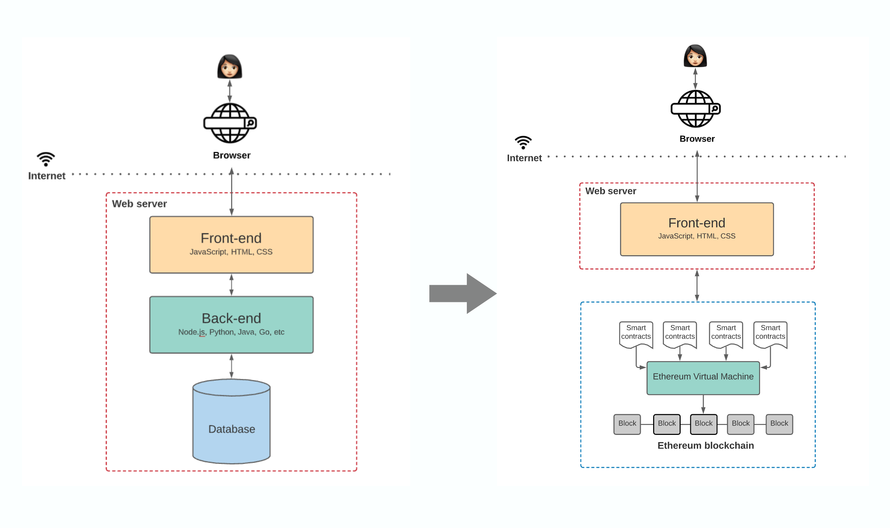
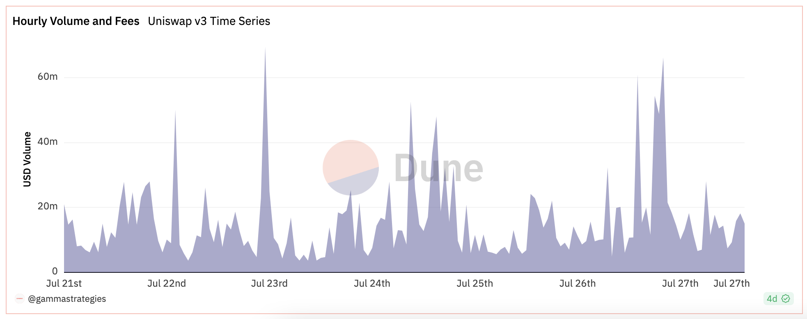

---
# title: ""
# author: []
# date: ""
# subject: "Markdown"
# keywords: [Markdown, Example]
# subtitle: "Aesculeae domus vincemur et Veneris adsuetus lapsum"
lang: "en"
titlepage: true,
titlepage-background: "./assets/bookcover-en.pdf"
...

# 00 Becoming an Onchain Data Analyst #

**TLDR**

- The richness of Onchain data stems from the maturity of blockchain technology and the innovation of projects
- Mastering the perspective of Onchain data helps to reduce information asymmetry and adds an extra layer of protection when navigating the dark forest
- Onchain data truly reflects the flow of value, so the insights gained from analysis are more valuable
- Data analysis provides a quantifiable perspective to support decision-making; analysis is a process, not an end
- Good data analysis comes from data thinking, the ability to abstract things, and requires deepening industry understanding

## What is Onchain Data
Most people, when first introduced to blockchain, get this concept: blockchain is a public, tamper-proof ledger and all transfers as well as transaction records are transparent and trustworthy. However, this is not the only function of blockchain. It is just the initial point of departure from the "peer-to-peer electronic cash system" - that is, the "ledger". With the development of smart contracts, blockchain is actually becoming a large database. The following diagram compares the architecture of traditional web2 and web3 applications: smart contracts replace the backend and blockchain also takes on some of the functions of the database. More and more Onchain projects are emerging and our interactions Onchain are becoming more frequent, such as how much liquidity we added in DeFi protocols, which NFTs we minted, and even which social accounts we follow can be recorded Onchain. All of our interactions with blockchain will be recorded in this database and these records will belong to Onchain data.

**Onchain data is roughly divided into three categories:**

1. Transaction data.
Such as sending and receiving addresses, transfer amount, address balance, etc.

1. Block data.
For example, timestamps, miner fees, miner rewards, etc.

1. Smart contract code.
That is, the business logic coded on the blockchain.

Onchain data analysis is to extract the desired information from these three types of data for interpretation. 
From the perspective of the data stack, blockchain data products can be divided into data sources, data development tools, and data apps.

Flexible use of various data products will provide us with a new perspective in the crypto world.

Although we always say that Onchain data is public and transparent, it is difficult for us to directly read this data, because a simple swap transaction Onchain may look like this:

We can see some raw Onchain data in the blockchain browser, but if my question is how much is the UniswapV3 trading volume today, this does not solve my problem!

The original Onchain data cannot give us the answer, so we need to go through a series of data ingestion processes such as indexing, processing, storage and then aggregate the corresponding data according to the question raised to find an answer.

To start from scratch, we may need to set up our own nodes to receive blockchain data 
and then process it, but this is obviously very time-consuming and laborious. 
Fortunately, there are many data platforms such as Dune, Flipside, Footprint, which after processing, take the original Onchain data obtained by indexing and store it in the data warehouse managed and updated by the respective platform. In other words, the entire blockchain data is made into many relational data tables by these platforms. What we need to do is to select some data we want from the table to build our analysis data. Furthermore, data products such as Nansen, Messari, and DeBank not only organize the data, but also package it according to the needs of the user, convenient for direct use.

|Category | Application Example|
|--------|:---------------:|
|Data Application | Nansen, Messari, DeBank..|
|Data Platform |Dune, FLipside, Footprint.. |
|Data Node | Infura, Quick Node..|

## The Importance of Onchain Data
With the prosperity of the Onchain ecosystem, rich interactive behaviors have brought a huge amount of data. 
This Onchain data corresponds to the flow of value Onchain and in turn the insights derived from the analysis become extremely valuable. Through transparent and truthful Onchain data, we can infer the psychological state and expectations of traders, and even the market as a whole, to help us make more advantageous decisions. It can also provide a beacon of light for us in the dark forest, illuminating the way forward to protect ourselves.

Take the familiar DeFi protocol liquidity mining as an example: you add liquidity to earn rewards, the pool increases depth, users enjoy lower slippage, everyone has a bright future, and you securely lock your money in the contract. One day, the black swan quietly arrives, smart money with insider information immediately retreats, and you are just an ordinary investor; by the time you see the negative news and think about withdrawing, the rewards in your hand are almost worthless, and the severe impermanent loss makes it hard for you to break even.

But if you have an Onchain data perspective, you might find: the protocol's TVL suddenly drops and the token's dumping volume on Uniswap surges. In other words, smart people get the news or find something wrong, the liquidity in the pool is getting worse and money is running away, and everyone is bearish on the token and selling like crazy - should I exit now?

Of course, this is just an abstract and simple example, but what I want to convey to you is: ordinary investors in the crypto dark forest are always at a disadvantage in terms of information asymmetry. But Onchain data is transparent and truthful. Why is everyone so obsessed with tracking Nansen's Smart Money? Because people with insider information won't tell you the news, but the information will be reflected in Onchain behavior and recorded truthfully. All we have to do is carefully observe this data world, through capturing Onchain details, to some extent make up for the information gap.

After DeFi summer, we started to care about the TVL of the protocol; Axie exploded, we studied the daily increase in users; NFT rose, we studied the mint number; Ethereum's Gas soared, we observed which project was so hot. Did you notice? Our increasing understanding and sensitivity to Onchain data actually comes from the prosperous development of Onchain activities In other words, the importance of Onchain data comes from the maturity of blockchain technology and the boom of applications. More and more Onchain projects give us enough rich interaction space, at the same time, with the maturity and wide application of SBT and OAT. Everything Onchain becomes possible, which means that the future data will be enough to support every user's full Onchain portrait. By then, we can tell better stories about DID, SocialFi.

## Who Will Do Onchain Data Analysis
For most users, mature data products are enough, 
and a good effect can be achieved by flexibly combining multiple data tools. 
For example, using Nansen to help users track the real-time movements of whales; 
using Token Terminal to view the income of various protocols; 
NFT data monitoring platforms are even more varied.
These "finished" data products, while low-threshold and easy to use, 
also have a bottleneck that cannot meet high customization requirements.

For example, you discover through https://ultrasound.money/ 
that the gas consumption on Ethereum suddenly rises, 
driven by this XEN that you've never heard of. 
You keenly realize that this could be an early opportunity! 
Through a Twitter search, you learn that XEN uses a PoP (Proof of Participation) mining mechanism. 
Participants in XEN mining own all the XEN tokens they mine. 
As the number of participants increases, the difficulty of mining increases and the supply decreases. You want to understand the participation situation of everyone,  since just relying on gas consumption is not enough; you also want to know the number of participants, trends, and how long do participants choose to lock. At the same time, you also find that it seems to have no sybil protection. Pay a gas fee to participate - how many scientists are rushing in? Do I still have any profits? When you analyze this, you urgently need data to support your "rush or not" decision; but because it's early, there's no analysis of it in the data app and the app is also unlikely to monitor and analyze every protocol. This is why, despite the existence of many data products, we still need to be able to write some data analysis ourselves: existing products are difficult to meet customized needs.

Through my own data analysis, https://dune.com/sixdegree/xen-crypto-overview, I found out that most people choose short-term pledges, and nearly 70% are new wallets, indicating that they have been exploited by everyone. So I understand that the short-term selling pressure will be very large; if I choose to participate, I will pick the shortest pledge time and sell as soon as possible to see who runs faster. At this point, you have completed the entire process of Onchain data analysis: discover the project, study the project mechanism, abstract the standard for evaluating the project, and finally - perform data processing, visualization, and decision support.

## How to Do Onchain Data Analysis
Although data analysis platforms like Dune have done a lot of sorting work for us, we just need to use SQL-like syntax to extract the parts we need from the data table for construction. Most people's learning path I believe is to rush to "3 Days to Master SQL"; after getting it down, they start to feel lost again and still don't know how to find the thread in the ball of wool. Why is this? The most important thing to learn in data analysis is to cultivate data thinking, and proficiency in programming languages is secondary.

Data analysis provides a quantifiable perspective to ultimately support decision-making - analysis is a process, not an end. The simple steps are to clarify three questions and build data thinking:

**1. What is my purpose?**

Is it to determine whether a coin is a good time to buy now? 
Decide whether to add liquidity to AAVE to earn income? 
Or want to know if it's too late to enter Stepn now?

**2. What is my strategy?**

The strategy for buying coins is to follow Smart money, buy what they buy, enter when they enter, 
exit when they exit; observe if the protocol is operating well, the deposit rate is satisfactory, 
then put the temporarily immobile coins in to earn interest; Stepn is hot recently, 
if the momentum is still up, then I will participate in it.

**3. What data do I need to help me make decisions?**

monitor the holding movements of Smart money addresses and even consider the trading volume and holding distribution of tokens; check the protocol's TVL, outstanding debt amount, capital utilization rate, APR, etc.; consider daily new user numbers, growth trends, daily active user numbers, transaction numbers, player inflow/outflow situation, and the NFT market item sales situation.

- **Three Question before doing data analysis**:
  1. What is my purpose?
  2. What is my strategy?
  3. What data do I need to help me make decisions?

The difficulty of these three questions increases gradually. The first two are easier to answer, but it is difficult to think clearly about the third question, which requires a lot of learning and understanding. This is also the small threshold that distinguishes the level of data analysts. A good analyst should have the following three characteristics:

**1. Understanding and recognition of the track or protocol**

That is, what track is being analyzed? What is the operating mechanism of this project? 
What data will it generate and what does each represent?

**2. The ability to abstract things**

Turn a vague concept into a quantifiable indicator, i.e.

>"Is this DEX protocol good" => "Liquidity" + "Trading Volume" + "Active User Volume" + "Capital Utilization Rate" + "Income Generated by the Protocol"

Then go back to the previous point and find the corresponding data through your understanding of the protocol.

**3. The ability to handle data**

This includes getting data (where does the Onchain data come from), 
processing data (how to find the desired and filter out the irrelevant), 
and data visualization capabilities.

In general, data analysis is just a tool to support research, so don't analyze for the sake of analysis. This process is first out of your desire to research a certain project, concept, or track, then learn and understand the operating mechanism of the project, abstract the quantitative analysis of the qualitative concept, and finally gather data and visualize.

The most important thing in data analysis is always data thinking. 
As for the last step of doing it yourself, it's just a matter of proficiency, which can be divided into two parts:

- Understanding of blockchain data structure. For example, in EVM chains, 
  only EOA accounts can initiate transactions, but smart contracts can transfer ETH when called. 
  These internal calls are recorded in the `traces` table, 
  so when querying the `transactions` table will miss internal call transactions.
- Mastery of languages such as Python, SQL. Mastering the basic database language, 
  whether it's getting data yourself or using a data platform, can be quite handy.

## Conclusion

There are many online resources or tutorials about Onchain data analysis, 
but they are scattered and of varying quality. Web3 is an open university, 
but it's quite painful to spend a lot of energy looking for suitable textbooks.

Therefore, the Sixdegree team will launch a series of tutorials on "**Mastering Onchain Analytics**". Application-oriented, these will be combined with blockchain data structure and SQL syntax to provide everyone with a set of introductory textbooks to help more people master Onchain data analysis skills and maximize the use of blockchain data characteristics, and in turn to a certain extent eliminate information asymmetry. Build more in the bear market, becoming an Onchain data analyst starts here!

## About Us

SixdegreeLab is a professional onchain data analysis team Our mission is to provide users with accurate onchain data charts, analysis, and insights. We are committed to popularizing onchain data analysis. By building a community and writing tutorials, among other initiatives, we train onchain data analysts, output valuable analysis content, promote the community to build the data layer of the blockchain, and cultivate talents for the broad future of blockchain data applications. Welcome to the community exchange!

- Website: [sixdegree.xyz](https://sixdegree.xyz)
- Twitter: [twitter.com/SixdegreeLab](https://twitter.com/SixdegreeLab)
- Dune: [dune.com/sixdegree](https://dune.com/sixdegree)
- Github: [https://github.com/SixdegreeLab](https://github.com/SixdegreeLab)

## Reference
1. [The Capital Efficiency Era of DeFi](https://blog.hashflow.com/the-capital-efficiency-era-of-defi-d8b3427feae4)
2. [Using Onchain Data for Policy Research: Part 1](https://policy.paradigm.xyz/writing/using-Onchain-data-for-policy-research-part-1)
3. [IOSG: Analysis of the Current Situation and Prospects of Onchain Data Analysis Platform](https://foresightnews.pro/article/detail/8473)
4. [An Introduction to «Onchain» Analysis](https://www.blockstar.ch/post/an-introduction-to-Onchain-analysis)
5. [The Architecture of a Web 3.0 application](https://www.preethikasireddy.com/post/the-architecture-of-a-web-3-0-application)
6. [Sixdegree Dune Dashborads](https://dune.com/sixdegree)

