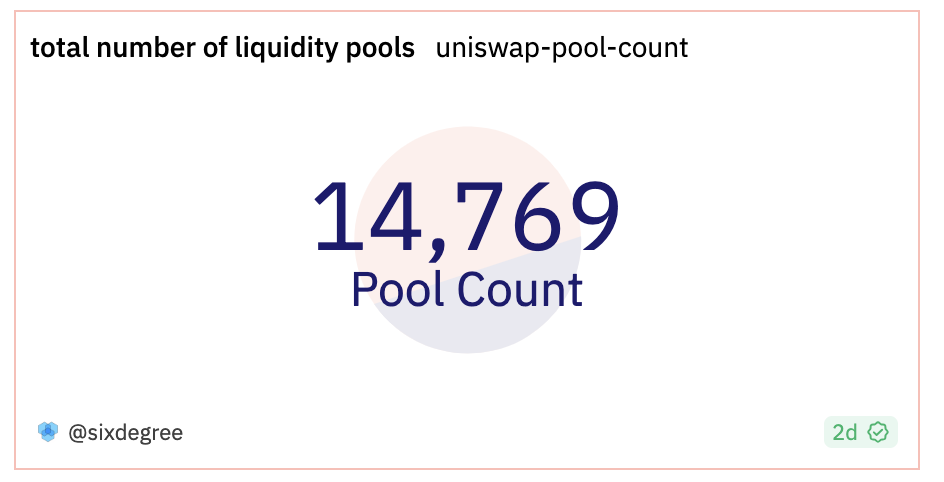
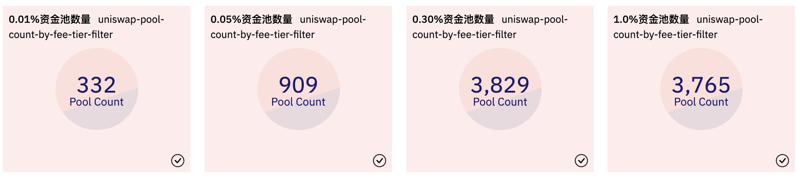
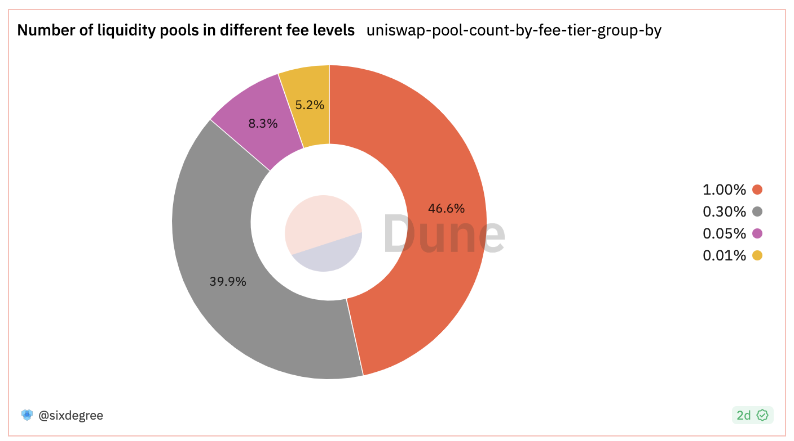
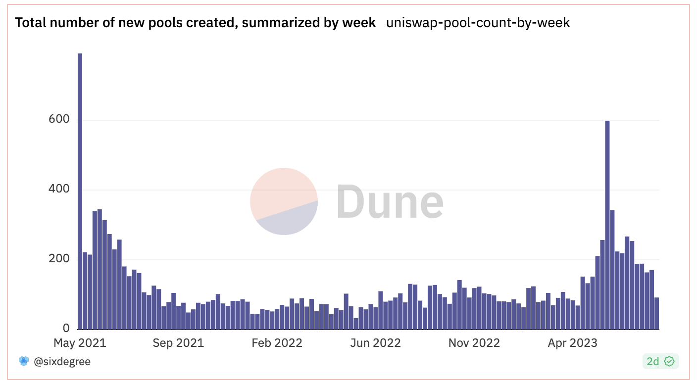
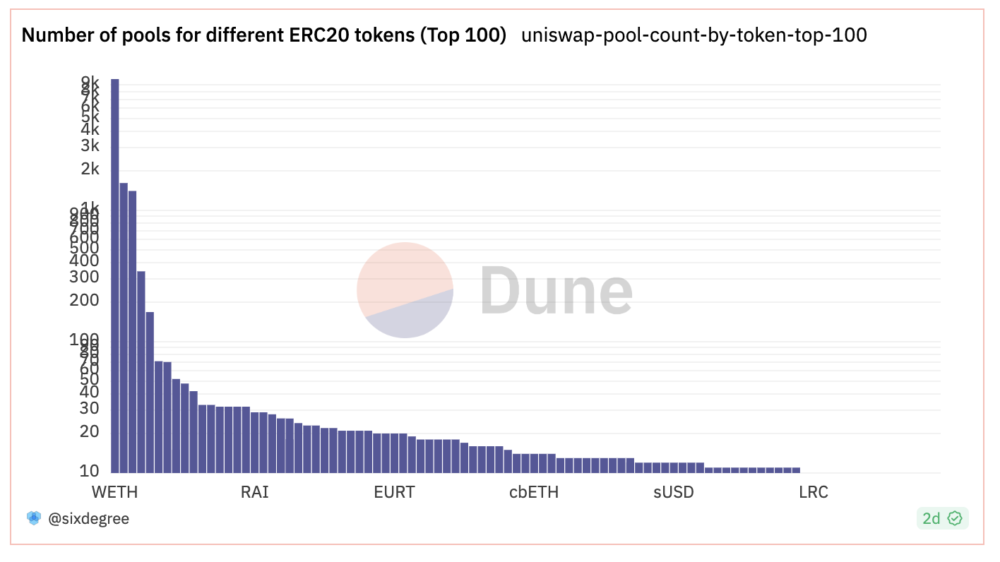
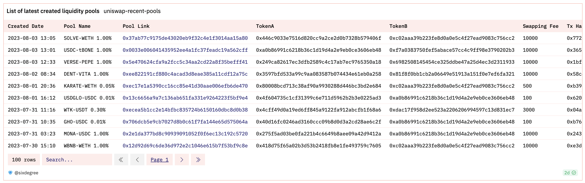
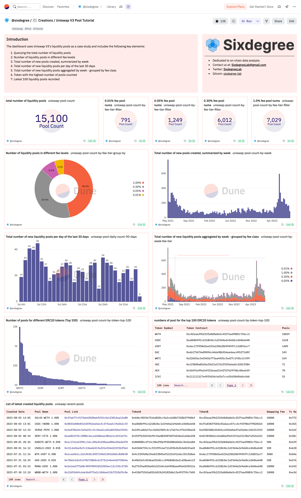

# Creating Your First Dune Data Dashboard

In the previous tutorial, "[Getting Started](../02_get_started/readme.md)," we learned the prerequisites for creating a data dashboard and mastered the basics of writing SQL queries. Now, let's write queries and create a Dune data dashboard together. To help you get started faster, we will create the data dashboard using a specific project as an example. The example of the completed data dashboard can be found here: [https://dune.com/sixdegree/uniswap-v3-pool-tutorial](https://dune.com/sixdegree/uniswap-v3-pool-tutorial).

We won't go into detail about each step of the process. You can learn how to use Dune's Query Editor and Data Dashboard in the official [Dune platform documentation](https://dune.com/docs/).

## Background Knowledge

Before we start creating the dashboard, we need to understand some additional background knowledge. Uniswap is one of the most popular decentralized finance (DeFi) protocols. It is a set of immutable and upgradable smart contracts that collectively create an automated market maker (AMM) protocol. The Uniswap protocol primarily provides peer-to-peer exchange of ERC20 tokens on the Ethereum blockchain. The Uniswap factory contract deploys new smart contracts to create liquidity pools, which pair two ERC20 token assets and set different fees. Liquidity refers to the digital assets stored in Uniswap's liquidity pool contracts, available for traders to trade. Liquidity providers (LPs) are individuals who deposit their ERC20 tokens into a given liquidity pool. LPs receive compensation in the form of trading fees as rewards, while also bearing the risk of price fluctuations. Regular users (swappers) can exchange one ERC20 token they own for another in a liquidity pool, such as exchanging USDC for WETH or vice versa, by paying a small service fee. The Uniswap V3 protocol works as follows: the factory contract creates liquidity pools (including two ERC20 tokens) -> LP users add corresponding assets to the liquidity pools -> other users use the liquidity pools to exchange their held token assets and pay service fees -> LPs receive fee rewards.

Some of these concepts introduced may be unfamiliar to beginners, but there's no need to worry. You don't need to know more about DeFi to successfully complete this tutorial. We're using Uniswap V3 liquidity pools as a case study in the data dashboard we're going to create. The corresponding table is `uniswap_v3_ethereum.Factory_evt_PoolCreated`. Additionally, some queries will utilize the `tokens.erc20` table mentioned in the previous tutorial. Before we start, all you need to know is that you can create many different liquidity pools, each containing two different ERC20 tokens (referred to as a token pair), with a given fee rate. The same token pair (e.g., USDC-WETH) can have multiple liquidity pools with different fee rates.

## Uniswap Liquidity Pool Table

The structure of the liquidity pool table, `uniswap_v3_ethereum.Factory_evt_PoolCreated`, is as follows:

| **Column Name**     | **Data Type** | **Description**                           |
| ------------------- | ------------- | ----------------------------------------- |
| contract_address    | string        | Contract address                          |
| evt_block_number    | long          | Block number                              |
| evt_block_time      | timestamp     | Time the block was mined                   |
| evt_index           | integer       | Index number of the event                  |
| evt_tx_hash         | string        | Unique hash of the event's transaction     |
| fee                 | integer       | Fee rate of the liquidity pool (expressed as "1/1,000,000") |
| pool                | string        | Address of the liquidity pool              |
| tickSpacing         | integer       | Tick spacing                              |
| token0              | string        | Address of the first ERC20 token in the pool  |
| token1              | string        | Address of the second ERC20 token in the pool |

Here is a partial view of the liquidity pool table (displaying only a subset of columns):


## Main Content of the Data Dashboard

Our first Dune data dashboard will include the following queries, each producing one or more visual charts:
- Query 1: Total number of liquidity pools
- Query 2: Number of liquidity pools with different fee rates
- Query 3: Weekly summary of newly created liquidity pools
- Query 4: Daily count of newly created liquidity pools over the last 30 days
- Query 5: Weekly summary of newly created liquidity pools, grouped by fee rate
- Query 6: Statistics on the token with the most liquidity pools
- Query 7: Latest 100 liquidity pool records

## Query 1: Total Number of Liquidity Pools

We can use the COUNT() aggregate function to count the total number of existing pools.

``` sql
SELECT COUNT(*) AS pool_count
FROM uniswap_v3_ethereum.Factory_evt_PoolCreated
```

We suggest copying the code above, creating and saving the query. When saving the query, give it a recognizable name such as "uniswap-pool-count". Of course, you can also directly fork the reference query listed below. The advantage of forking a query is that you can learn more about the details of visual charts.

Reference link to this query in Dune: [https://dune.com/queries/1454941](https://dune.com/queries/1454941)

## Creating a Data Dashboard and Adding Charts

### Creating a Dashboard

First, log in to the [Dune website](https://dune.com/). Then, click on "My Creation" in the top navigation bar, and click "Dashboards" in the bottom section to enter the created data dashboard page: [https://dune.com/browse/dashboards/authored](https://dune.com/browse/dashboards/authored). To create a new data dashboard, click the "New dashboard" button in the right sidebar. In the pop-up dialog, enter a name for the dashboard, and click the "Save and open" button to create the new data dashboard and enter the preview interface. Here, I'm using "Uniswap V3 Pool Tutorial" as the name for this data dashboard.

### Adding Query Charts

A newly created data dashboard has no content and the preview page will display "This dashboard is empty." We can convert the result of the total pool count from the previous step, into a visual chart and add it to the data dashboard. Open the "My Creations" page in a new browser tab: [https://dune.com/browse/queries/authored](https://dune.com/browse/queries/authored), and find the saved "Query 1" query. Click on its name to enter the editing page. Since the query has already been saved and executed, you can click the "New visualization" button to create a new visualization chart. For a single numerical query result, the counter visualization type is usually used. From the "Select visualization type" dropdown list, choose "Counter" and click the "Add Visualization" button. Then, you can give the chart a name and modify the Title value from the default "Counter" to "Total Number of Liquidity Pools". Finally, click "Add to dashboard" in the dialog box, and 
then click the "Add" button next to the corresponding data dashboard to add this counter chart to the data dashboard.

Now we can go back to the data dashboard page. After refreshing the page, you will see the newly added visualization chart. Click the "Edit" button in the upper right corner of the page to edit the data dashboard, including adjusting the size and position of each chart, adding text components, etc. Below is a screenshot of the counter chart for "Total Number of Liquidity Pools" after adjusting the height.



### Adding Text Components

In the data dashboard editing page, you can add text components to the dashboard by clicking the "Add text widget" button. Text components can be used to provide explanations for the core content of the data dashboard or add author information. Text components support Markdown syntax for formatting. Clicking on "Some markdown is supported" in the dialog box will expand to show the supported syntax. Add the necessary text components according to your needs. Here, we won't go into detail on this part.

## Query 2: Number of Liquidity Pools with Different Fee Rates

To count the number of liquidity pools with different fee rates, we can use the FILTER clause. This allows us to count pools with specific fee rates separately and display the results in the same row.

``` sql
SELECT COUNT(*) FILTER (WHERE fee = 100) AS pool_count_100,
    COUNT(*) FILTER (WHERE fee = 500) AS pool_count_500,
    COUNT(*) FILTER (WHERE fee = 3000) AS pool_count_3000,
    COUNT(*) FILTER (WHERE fee = 10000) AS pool_count_10000
FROM uniswap_v3_ethereum.Factory_evt_PoolCreated
```

Reference link to this query in Dune: [https://dune.com/queries/1454947](https://dune.com/queries/1454947)

This query returns four output values. We can add them as separate counter components and name them "Number of 0.01% Pools," "Number of 0.05% Pools," etc. Then, add them to the data dashboard and adjust the size and order of the components in the data dashboard editing page. The display result is shown in the image below:



Alternatively, we can use the GROUP BY clause to group the results and display them in a pie chart.

``` sql
SELECT fee,
    COUNT(*) AS pool_count
FROM uniswap_v3_ethereum.Factory_evt_PoolCreated
GROUP BY 1
```

The fee rate "fee" is a numerical value representing a fee in parts per million (ppm). For example, 3000 represents 3000/1000000, which is "0.30%". To make it more intuitive, we can modify the query to convert the fee rate to a percentage representation.

``` sql
SELECT CONCAT(FORMAT('%,.2f', fee / 1e4), '%') AS fee_tier,
    COUNT(*) AS pool_count
FROM uniswap_v3_ethereum.Factory_evt_PoolCreated
GROUP BY 1
```

Here, `CONCAT(FORMAT('%,.2f', fee / 1e4), '%') AS fee_tier` is used to convert the fee rate to a percentage representation and append the "%" symbol. The result is then output with an alias `fee_tier`. For the specific syntax of the `FORMAT` function, you can refer to the documentation of Trino (Trino is the underlying engine of Dune SQL). Trino documentation link: [https://trino.io/docs/current/functions.html](https://trino.io/docs/current/functions.html).

Reference link to this query in Dune: [https://dune.com/queries/1455127](https://dune.com/queries/1455127)

We can add a pie chart visualization for this query. Click "New visualization" and choose "Pie Chart" from the chart type dropdown list, then click "Add visualization". Modify the title of the chart to "Number of Pools with Different Fee Rates". Select "fee_tier" as the horizontal axis (X Column) and "pool_count" as the vertical axis (Y Column 1) of the chart. Check the "Show data label" option on the left side. Finally, click "Add to dashboard" to add this visualization to the data dashboard. The result will be displayed as shown below:



## Query 3: Weekly Summary of Newly Created Liquidity Pools

To summarize the count of newly created liquidity pools by week, we can use the `date_trunc()` function to convert the creation date of the pools to the start date of each week (Monday), and then use GROUP BY to aggregate the statistics.

``` sql
SELECT block_date, COUNT(pool) AS pool_count
FROM (
    SELECT date_trunc('week', evt_block_time) AS block_date,
        evt_tx_hash,
        pool
    FROM uniswap_v3_ethereum.Factory_evt_PoolCreated
)
GROUP BY 1
ORDER BY 1
```

Reference link to this query in Dune: [https://dune.com/queries/1455311](https://dune.com/queries/1455311)

Data that is grouped by time is suitable for visualizations such as bar charts, area charts, and line charts. Here, we will use a bar chart. Click "New visualization" and choose "Bar Chart" from the chart type dropdown list, then click "Add visualization". Modify the title of the chart to "Weekly Summary of Newly Created Pools". Select "block_date" as the horizontal axis (X Column) and "pool_count" as the vertical axis (Y Column 1) of the chart. Uncheck the "Show chart legend" option on the left side. Finally, click "Add to dashboard" to add this visualization to the data dashboard. The result will be displayed as shown below:




## Query 4: Total Daily Creation of Liquidity Pools in the Last 30 Days

To summarize the daily creation of liquidity pools, we can use a subquery to convert the pool creation dates to days (excluding the time component) using the `date_trunc()` function. Then we can use `GROUP BY` to aggregate and summarize the data. In this case, we will use a Common Table Expression (CTE) for the query. CTEs provide a more intuitive and reusable way of defining queries, improving efficiency and facilitating debugging. Subsequent queries will also use CTEs.

``` sql
WITH pool_details AS (
    SELECT date_trunc('day', evt_block_time) AS block_date, evt_tx_hash, pool
    FROM uniswap_v3_ethereum.Factory_evt_PoolCreated
    WHERE evt_block_time >= NOW() - INTERVAL '29' DAY
)
SELECT block_date, COUNT(pool) AS pool_count
FROM pool_details
GROUP BY 1
ORDER BY 1
```

Reference link for this query on Dune: [https://dune.com/queries/1455382](https://dune.com/queries/1455382)

We can visualize the results using a bar chart. Add a new chart of type "Bar" and modify the title to "Total Daily Creation of Liquidity Pools in the Last 30 Days." Select "block_date" for the X column and "pool_count" for the Y column. Uncheck the "Show chart legend" option on the left and check the "Show data labels" option. Add this visualization chart to the dashboard. The resulting visualization will look like this:


## Query 5: Weekly Summary of Newly Created Liquidity Pools - Grouped by Fee Tiers

To further analyze the newly created liquidity pools, we can group them by fee tiers to compare their popularity during different time periods. This query demonstrates multi-level grouping and stacked bar chart visualization.

``` sql
WITH pool_details AS (
    SELECT date_trunc('week', evt_block_time) AS block_date, fee, evt_tx_hash, pool
    FROM uniswap_v3_ethereum.Factory_evt_PoolCreated
)
SELECT block_date,
    CONCAT(FORMAT('%,.2f', fee / 1e4), '%') AS fee_tier,
    COUNT(pool) AS pool_count
FROM pool_details
GROUP BY 1, 2
ORDER BY 1, 2
```

Reference link for this query on Dune: [https://dune.com/queries/1455535](https://dune.com/queries/1455535)

We can visualize the results using a bar chart. Add a new chart of type "Bar" and modify the title to "Weekly Summary of Newly Created Liquidity Pools - Grouped by Fee Tiers." Select "block_date" for the X column and "pool_count" for the Y column. Additionally, select "fee_tier" in the "Group by" section to enable grouping and stacking of data by fee tiers. Check the "Enable stacking" option on the left to stack data with the same date and fee tier together. Add this visualization chart to the dashboard. The resulting visualization will look like this:


## Query 6: Most Popular Token by Number of Liquidity Pools

To analyze which ERC20 tokens are more popular in Uniswap liquidity pools based on the number of pools associated with them, we can group them by token types.

Each Uniswap liquidity pool consists of two ERC20 tokens (token0 and token1), and based on the alphabetical order of their address hashes, the same ERC20 token may be stored in either token0 or token1. Therefore, in the following query, we use a union operation to get a complete list of liquidity pool details.

Furthermore, the liquidity pools store the contract addresses of ERC20 tokens, which may not be intuitive to display directly. The abstract table `tokens.erc20` generated by the Dune community users' Magic Book provides basic information about ERC20 tokens. By joining this table, we can retrieve the token symbol.

Since Uniswap V3 has over 8,000 liquidity pools involving more than 6,000 different ERC20 tokens, we will focus on the data of the top 100 tokens with the highest number of liquidity pools. The query demonstrates concepts such as multiple CTEs, union, join, and limit.

``` sql
WITH pool_details AS (
    SELECT token0 AS token_address,
        evt_tx_hash, pool
    FROM uniswap_v3_ethereum.Factory_evt_PoolCreated

    UNION ALL

    SELECT token1 AS token_address,
        evt_tx_hash, pool
    FROM uniswap_v3_ethereum.Factory_evt_PoolCreated
),

token_pool_summary AS (
    SELECT token_address,
        COUNT(pool) AS pool_count
    FROM pool_details
    GROUP BY 1
    ORDER BY 2 DESC
    LIMIT 100
)

SELECT t.symbol, p.token_address, p.pool_count
FROM token_pool_summary p
INNER JOIN tokens.erc20 t ON p.token_address = t.contract_address
ORDER BY 3 DESC
```

Reference link for this query on Dune: [https://dune.com/queries/1455706](https://dune.com/queries/1455706)

We can visualize the results using a bar chart. Add a new chart of type "Bar" and modify the title to "Number of Liquidity Pools for Top 100 ERC20 Tokens". Select "symbol" for the X column and "pool_count" for the Y column. To maintain the sorting order (from highest to lowest count), uncheck the "Sort values" option on the right. Although we have limited the data to the top 100 tokens, we can still see significant differences in the number of liquidity pools for different tokens, ranging from over 5,000 to just a few. To make the chart more intuitive, check the "Logarithmic" option on the right to display the data in logarithmic scale. Add this visualization chart to the dashboard. The resulting visualization will look like this:



As the logarithmic scale visually downplays the differences in values, we can also add a "Table" visualization to view the actual numerical values. Continue adding a new visualization chart for this query, select the "Table" chart type. Set the title as "Statistics of the Number of Liquidity Pools for the Top 100 ERC20 Tokens." Adjust the relevant options for the table visualization as needed, and then add it to the dashboard.


You may notice that the table does not return exactly 100 rows of data. This is because some newly appeared tokens may not have been added to the data table in Dune yet.

## Query 7: Latest 100 Liquidity Pool Records

When a project launches a new ERC20 token and supports its listing for trading, Uniswap users may create corresponding liquidity pools to enable exchanges for other users. For example, the XEN token is a recent and notable case.

We can track new trends by querying the latest created liquidity pools. The following query is associated with the `tokens.erc20` table and uses multiple joins with the same table using different aliases to retrieve symbols for different tokens. The query also demonstrates outputting a visualized table, generating hyperlinks using string concatenation, and more.

``` sql
with last_created_pools as (
    select p.evt_block_time,
        t0.symbol as token0_symbol,
        p.token0,
        t1.symbol as token1_symbol,
        p.token1,
        p.fee,
        p.pool,
        p.evt_tx_hash
    from uniswap_v3_ethereum.Factory_evt_PoolCreated p
    inner join tokens.erc20 t0 on p.token0 = t0.contract_address and t0.blockchain = 'ethereum'
    inner join tokens.erc20 t1 on p.token1 = t1.contract_address and t1.blockchain = 'ethereum'
    order by p.evt_block_time desc
    limit 100
)

select evt_block_time,
    token0_symbol || '-' || token1_symbol || ' ' || format('%,.2f', fee / 1e4) || '%' as pool_name,
    '<a href=https://etherscan.io/address/' || cast(pool as varchar) || ' target=_blank>' || cast(pool as varchar) || '</a>' as pool_link,
    token0,
    token1,
    fee,
    evt_tx_hash
from last_created_pools
order by evt_block_time desc
```

Reference link to this query on Dune: [https://dune.com/queries/1455897](https://dune.com/queries/1455897)

We add a visualization chart of type "Table" to the query, set the title as "Latest Created Liquidity Pools List," and adjust the visualization options as desired before adding it to the dashboard.



# Summary

With this, we have completed the creation of the first Dune data dashboard. The complete interface of this dashboard appears as shown in the following image:



To avoid overwhelming complexity, we have only covered some basic queries, and the resulting charts in the dashboard may not look extremely sophisticated. However, this is not important. What matters more is whether you can use this tutorial as a starting point to embark on your own journey of on-chain data analysis.
After reading this tutorial, I hope you will try it out for yourself. Uniswap was just one example of a DEX, and you can perform similar analyses on any other DEX on different chains. Combining the techniques from the previous lessons, you can explore and compare data from other DEXs or even the same DEX on different chains (such as UniSwap on Ethereum and Optimism). As a blockchain data analyst, your dashboard is your resume, so take it seriously!

# Homework

Based on the tutorial content, create a data dashboard with at least 5 queries for any DEX. The naming format for the dashboard should be "SixdegreeAssignment1-YourName," such as "SixdegreeAssignment1-Spring." This format makes it easier for everyone to learn from each other and helps us monitor the quality of the tutorials. To encourage active participation in creating dashboards, we will keep a record of the completion and quality of the homework. In the future, we will provide rewards, including but not limited to Dune community identities, physical merchandise, free API quotas, POAPs, memberships to various collaborative data products, job recommendations for blockchain data analysis, priority registration for community offline activities, and other incentives from the SixDegree community.

Keep up the good work! Feel free to share the links to your data dashboards in the Dune WeChat group or Dune's Discord channel.

## About SixdegreeLab

SixdegreeLab ([@SixdegreeLab](https://twitter.com/sixdegreelab)) is a professional on-chain data team. Our mission is to provide users with accurate on-chain data charts, analyses, and insights while promoting on-chain data analysis. We cultivate blockchain data analysts by establishing communities and writing tutorials, aiming to build the data layer for the blockchain and nurture talent for the vast future applications of blockchain data.

Visit [SixdegreeLab's Dune page](https://dune.com/sixdegree) for more information.

This article was written by Spring Zhang ([@superamscom](https://twitter.com/superamscom)), a member of SixdegreeLab. I apologize for any limitations in my knowledge and writing. If you find any errors, please feel free to point them out.