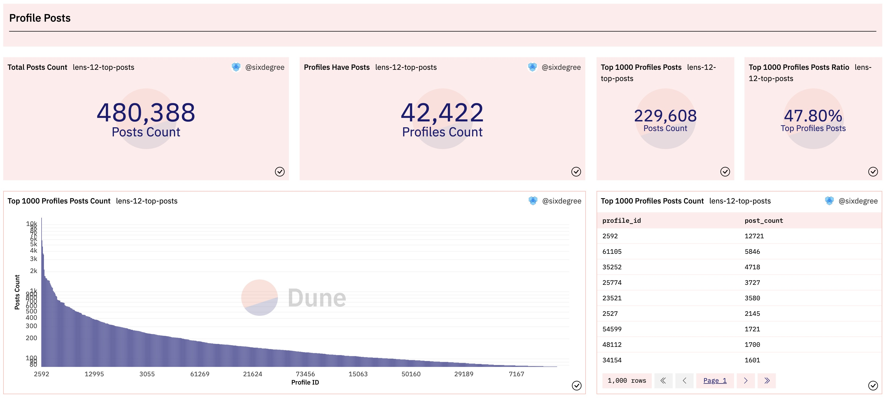
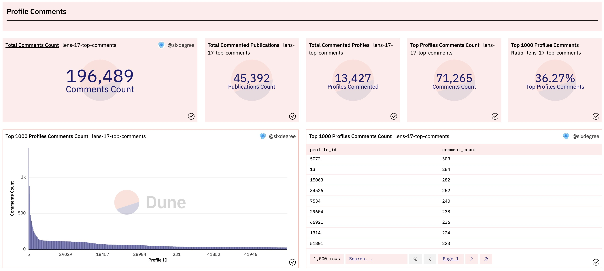
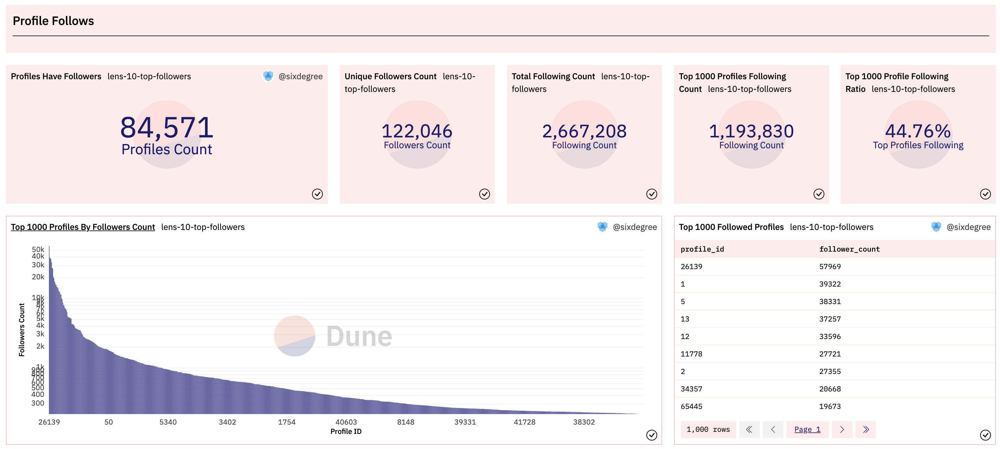

# Practice case: Making Lens Protocol's data dashboard (II)

In the first part of this tutorial, we introduced the Lens protocol to you, and made a preliminary dashboard for it, analyzing the total number of transactions and total users, the number of transactions and the number of unique users by day, creators Profile data analysis, Lens domain name analysis, registered domain name search and other related content. Let's go ahead and add new queries and visualizations to this dashboard. We will analyze and add the following content: create multiple profiles with the same address, follow data, post data, comment data, collection data, mirror data, comprehensive operation of profiles, and comprehensive operation of regular user addresses.

## Create multiple Profiles with the same address

The Lens protocol allows multiple Profiles to be created for a single address. We can write a query to count the data distribution of addresses with multiple profiles created. In the following query, we first use CTE profile_created to obtain the data details of all created profiles, and then use multiple_profiles_addresses to count the number of profiles created for each address. Finally, we use a CASE statement to return aggregated statistics by sorting each address by the number of profiles created.

``` sql
with profile_created as (
    select json_value(vars, 'lax $.to') as user_address,
        json_value(vars, 'lax $.handle') as handle_name,
        replace(json_value(vars, 'lax $.handle'), '.lens', '') as short_name,
        call_block_time,
        output_0 as profile_id,
        call_tx_hash
    from lens_polygon.LensHub_call_createProfile
    where call_success = true    
),

multiple_profiles_addresses as (
    select user_address,
        count(profile_id) as profile_count
    from profile_created
    group by 1
    order by 2 desc
)

select (case when profile_count >= 10 then '10+ Profiles'
            when profile_count >= 3 then '5+ Profiles'
            when profile_count = 2 then '2 Profiles'
            else '1 Profile'
        end) as profile_count_type,
    count(user_address) as user_address_count,
    sum(profile_count) as profile_count
from multiple_profiles_addresses
group by 1
```

When doing this kind of data statistics, we usually also need to get some Counter type statistical values, such as the total number of addresses that have created multiple Profiles, how many Profiles have been created by these addresses, and the proportion of these Profiles in all created Profiles etc. The above CTE subquery code can be shared when querying these data, so we make few changes to it and add two additional CTEs to count the values of these Counter types. Add a visualisation chart for this query and add it to the data dashboard respectively. The display effect is as follows:


Reference link for the above query on Dune:
- [https://dune.com/queries/1562662](https://dune.com/queries/1562662)
- [https://dune.com/queries/1553030](https://dune.com/queries/1553030)


## Profile Posts data analysis

### Top posting accounts daily analysis

The creators of Lens have two ways to post (Post). They have been posting directly with their own accounts, and the other is to entrust other accounts or post via API. Post data is stored in the `LensHub_call_post` and `LensHub_call_postWithSig` tables respectively. The content of each topic Post is stored in the field `vars` in the form of a JSON string, including the author's ProfileID, the URL of the post content, and other information. For JSON content in string form, we can use the : operator to access the value. The following query can get some sample data:

``` sql
select call_block_time,
    call_tx_hash,
    output_0 as post_id,
    json_value(vars, 'lax $.profileId') as profile_id, -- Access element in json string
    json_value(vars, 'lax $.contentURI') as content_url,
    json_value(vars, 'lax $.collectModule') as collection_module,
    json_value(vars, 'lax $.referenceModule') as reference_module,
    vars
from lens_polygon.LensHub_call_post
where call_success = true
limit 10
```

In view of the large number of Profiles posting, we can make a classification and statistics of Profiles with different posting numbers as in the previous analysis of 'creating multiple Profiles at the same address', and also pay attention to the top users, that is, the data of accounts with the most posts. Here we analyze the accounts with the most posts, and compare the number of posts of these accounts with the total number of posts, and output the Counter chart. The complete SQL is as follows:

``` sql
with post_data as (
    select call_block_time,
        call_tx_hash,
        output_0 as post_id,
        json_value(vars, 'lax $.profileId') as profile_id, -- Access element in json string
        json_value(vars, 'lax $.contentURI') as content_url,
        json_value(vars, 'lax $.collectModule') as collection_module,
        json_value(vars, 'lax $.referenceModule') as reference_module,
    from lens_polygon.LensHub_call_post
    where call_success = true
    
    union all
    
    select call_block_time,
        call_tx_hash,
        output_0 as post_id,
        json_value(vars, 'lax $.profileId') as profile_id, -- Access element in json string
        json_value(vars, 'lax $.contentURI') as content_url,
        json_value(vars, 'lax $.collectModule') as collection_module,
        json_value(vars, 'lax $.referenceModule') as reference_module,
    from lens_polygon.LensHub_call_postWithSig
    where call_success = true
),

posts_summary as (
    select count(*) as total_post_count,
        count(distinct profile_id) as posted_profile_count
    from post_data
),

top_post_profiles as (
    select profile_id,
        count(*) as post_count
    from post_data
    group by 1
    order by 2 desc
    limit 1000
)

select profile_id,
    post_count,
    sum(post_count) over () as top_profile_post_count,
    total_post_count,
    posted_profile_count,
    cast(sum(post_count) over () as double) / total_post_count * 100 as top_profile_posts_ratio
from top_post_profiles
inner join posts_summary on true
order by 2 desc
```

Interpretation of the above SQL: Since Post data is stored in two tables separately, in CTE `post_data`, we use `union all` to merge the data taken from the two tables together. We use `posts_summary` to count the number of Profiles and the cumulative number of Posts they have posted. In `top_post_profiles`, we follow the data of the 1000 Profiles with the largest number of posts per Profile. Finally, we query `top_post_profiles` and `posts_summary` in association, and output the account data with the most posts and their comparison with the total post data. After the query results are visualized and added to the data dashboard, the display effect is as follows:



Reference link for the above query on Dune:
- [https://dune.com/queries/1554541](https://dune.com/queries/1554541)

###  New posts count daily statistics

The daily number of new posts by Lens users is an important indicator for observing the trend of overall activity. We write a query to count the number of daily posts. The `post_data` CTE in this query is exactly the same as before, so we omit its details in the code below. Because we also want to accumulate the number of posts per day and return the cumulative number of posts, we define `post_daily_summary` CTE as an intermediate step to make the SQL code easy to understand. The corresponding SQL is as follows:

``` sql
with post_data as (
    -- Get post data from LensHub_call_post and LensHub_call_postWithSig tables
),

post_daily_summary as (
    select date_trunc('day', call_block_time) as block_date,
        count(*) post_count,
        count(distinct profile_id) as profile_count
    from post_data
    group by 1
)

select block_date,
    post_count,
    profile_count,
    sum(post_count) over (order by block_date) as accumulate_post_count
from post_daily_summary
order by block_date
```

The display after visualising the query results and adding them to the data dashboard is shown below:

[image_11.png](img/image_11.png)

Reference link for the above query on Dune:
- [https://dune.com/queries/1555124](https://dune.com/queries/1555124)


###  Top active Profile statistics by posts count 30 days

Similarly, we may be interested in the profiles with the most active postings in the most recent period. To this end, we only need to add date filter conditions to filter the posts in the last 30 days in the aforementioned `post_data` CTE, and then summarize statistics by date. The SQL is as follows:

``` sql
with post_data as (
    select call_block_time,
        call_tx_hash,
        output_0 as post_id,
        json_value(vars, 'lax $.profileId') as profile_id, -- Access element in json string
        json_value(vars, 'lax $.contentURI') as content_url,
        json_value(vars, 'lax $.collectModule') as collection_module,
        json_value(vars, 'lax $.referenceModule') as reference_module
    from lens_polygon.LensHub_call_post
    where call_success = true
        and call_block_time >= now() - interval '30' day
    
    union all
    
    select call_block_time,
        call_tx_hash,
        output_0 as post_id,
        json_value(vars, 'lax $.profileId') as profile_id, -- Access element in json string
        json_value(vars, 'lax $.contentURI') as content_url,
        json_value(vars, 'lax $.collectModule') as collection_module,
        json_value(vars, 'lax $.referenceModule') as reference_module
    from lens_polygon.LensHub_call_postWithSig
    where call_success = true
        and call_block_time >= now() - interval '30' day
)

select profile_id,
    count(*) as post_count
from post_data
group by 1
order by 2 desc
limit 100
```

We can add a histogram to display the number of posts of the 100 accounts with the most posts in the past 30 days, and add a Table type chart to output details. The display effect after the relevant chart is added to the data dashboard is as follows:


Reference link for the above query on Dune:
- [https://dune.com/queries/1559981](https://dune.com/queries/1559981)


## Profile Comments data analysis

### Top Profiles Comments Count analysis 

Lens comment data is similar to post data, which are stored in the `LensHub_call_comment` and `LensHub_call_commentWithSig` tables according to the source of the data. Based on the current functions of the Lens protocol, users must have created their own Profile to comment on other creators' Posts. In the comment data table, it is tracked by the profile ID of the commenter. At the same time, the number of each creator's post is incremented from 1. That is to say, posts from different creators may have the same number. We need to associate the creator's Profile ID with its Publication ID so as to get a unique number. The SQL is as follows:

``` sql
select call_block_time,
    call_tx_hash,
    output_0 as comment_id, -- comment id
    json_value(vars, 'lax $.profileId') as profile_id_from, -- Profile ID of the comment
    json_value(vars, 'lax $.contentURI') as content_url, -- comment content link
    json_value(vars, 'lax $.pubIdPointed') as publication_id_pointed, -- Commented Publication ID
    json_value(vars, 'lax $.profileIdPointed') as profile_id_pointed, -- Profile ID of Creator who were commented on
    json_value(vars, 'lax $.profileIdPointed') || '-' || json_value(vars, 'lax $.pubIdPointed') as unique_publication_id  -- combine to generate unique id
from lens_polygon.LensHub_call_comment
where call_success = true
limit 10
```

We also obtain the total comment data by defining an additional CTE, so that the Counter chart can be output in the same query, and the comment data of the 1000 accounts with the most comments and the comment data of all accounts can be compared. After the query results are visualized and added to the data dashboard, the display effect is as follows:



Reference link for the above query on Dune:
- [https://dune.com/queries/1560028](https://dune.com/queries/1560028)

### Top Publication Comments statistics

Each comment is aimed at a specific object (Publication) (here the author thinks it should be Post, please correct me if there is any misunderstanding). It is of certain value to analyze the Publications that have been commented the most. We write a query to count the top 500 most commented Publications and compare it with all comment data. The SQL is as follows:

``` sql
with comment_data as (
    -- get comment data from LensHub_call_comment and LensHub_call_commentWithSig tables
)

select profile_id_pointed,
    publication_id_pointed,
    unique_publication_id,
    count(*) as comment_count
from comment_data
group by 1, 2, 3
order by 4 desc
limit 500
```

In the same way, we add an additional CTE to obtain the data of all comments, and compare the data of the top 500 most commented Publications with the global data. Add the corresponding visual chart to the data dashboard, the effect is as follows:


Reference link for the above query on Dune:
- [https://dune.com/queries/1560578](https://dune.com/queries/1560578)

## Profile Mirrors data analysis

Mirroring data is highly similar to comment data, and users must first create their own Profile to mirror other people's Publications. We write two queries respectively to count the top 1000 account data with the most mirroring operations and the top 500 publication data with the most mirroring operations. Compare them with the overall mirror data as well. The effect after adding the data dashboard is shown in the following figure:


Reference link for the above query on Dune:
- [https://dune.com/queries/1561229](https://dune.com/queries/1561229)
- [https://dune.com/queries/1561558](https://dune.com/queries/1561558)


## Profiles Collections data analysis

Lens collection data is also stored in the two tables `LensHub_call_collect` and `LensHub_call_collectWithSig` respectively. Unlike comment or mirror data, collecting a Publication does not require the collector to have his own Lens Profile. That is to say, any address (user) can bookmark Publications under other Profiles. So we need to track the specific collection operation through the address of the collector. What's special is that the collector's address data is not saved in the `LensHub_call_collect` table, but the `LensHub_call_collectWithSig` table has this data. We need to link the `LensHub_call_collect` table to the transactions table to obtain the user address of the current operation collection. The SQL example is as follows:

``` sql
select call_block_time,
    t."from" as collector,
    c.profileId as profile_id,
    c.pubId as publication_id,
    cast(c.profileId as varchar) || '-' || cast(c.pubId as varchar) as unique_publication_id,
    c.output_0 as collection_id
from lens_polygon.LensHub_call_collect c
inner join polygon.transactions t on c.call_tx_hash = t.hash -- join the transaction table to get user address
where call_block_time >= date('2022-05-18') -- filter by Lens Contract deployed date to improve the query speed
    and block_time >= date('2022-05-18')
    and c.call_success = true
limit 10
```

Since the transaction table records are quite large, the query time consumption will increase significantly. A rule of thumb is to avoid joining operations on raw data tables (transactions, logs, traces) as much as possible.

The other parts of the collection data analysis SQL are basically the same as the previous example, so I won't repeat them here. Similarly, we also conduct statistical analysis on the most collected Publications. The display effect after adding the relevant visualisation images to the data dashboard is shown in the following figure:


Reference link for the above query on Dune:
- [https://dune.com/queries/1560847](https://dune.com/queries/1560847)
- [https://dune.com/queries/1561009](https://dune.com/queries/1561009)


## Profile Follows data analysis

### Top Profile by followers counts

The follow data of the Lens protocol is still stored in two tables, `LensHub_call_follow` and `LensHub_call_followWithSig` respectively. Any address (user) can follow other Profiles. Similar to favorites, the `LensHub_call_follow` table does not save the addresses of followers, so we also need to get the addresses of users currently operating favorites by associating with the `transactions` table. In addition, there is a special feature of following, that is, multiple profiles can be followed in batches at the same time in one transaction. In the `LensHub_call_follow` table, the followed Profile data is stored in the array type field profileIds, which is relatively easy to handle. In the table `LensHub_call_followWithSig`, it is an array value in JSON string format. An example of the field `vars` is as follows (some contents are omitted):

```json
{"follower":"0xdacc5a4f232406067da52662d62fc75165f21b23","profileIds":[21884,25271,39784],"datas":["0x","0x","0x"],"sig":"..."}
```

Using Dune SQL's JSON functions, you can read array values from JSON strings. We can first use `json_extract()` to extract the required element value from the json string, and then use the `cast()` method to convert it into an array of the specified type. The sample code is as follows:

``` sql
select
json_query(vars, 'lax $.follower') AS follower, -- single value
json_query(vars, 'lax $.profileIds') AS profileIds, -- still string
from_hex(cast(json_extract(vars,'$.follower') as varchar)) as follower2, -- cast to varbinary
cast(json_extract(vars,'$.profileIds') as array(integer)) as profileIds2, -- cast to array
vars
from lens_polygon.LensHub_call_followWithSig
where cardinality(output_0) > 1
limit 10
```

The complete SQL code for reading attention details is as follows:

``` sql
with follow_data as (
    select f.follower, p.profile_id
    from (
        select from_hex(cast(json_extract(vars,'$.follower') as varchar)) as follower, -- cast to varbinary
            cast(json_extract(vars,'$.profileIds') as array(integer)) as profile_ids -- cast to array
        from lens_polygon.LensHub_call_followWithSig
            
        union all
        
        select t."from" as follower,
            cast(f.profileIds as array(integer)) as profile_ids
        from lens_polygon.LensHub_call_follow f
        inner join polygon.transactions t on f.call_tx_hash = t.hash
        where call_block_time >= date('2022-05-18') -- Lens launch date
            and block_time >= date('2022-05-18')
            and call_success = true
    ) f
    cross join unnest(f.profile_ids) as p(profile_id)
)

select * from follow_data
limit 100
```

It's important to note here that we use the `cross join unnest(f.profile_ids) as p(profile_id)` clause to break up the array in the subquery and get the individual ID values that are broken up. Also, since the element type in the lens_polygon.`LensHub_call_follow table` is `uint256`, which is a Dune custom type that we can't use when extracting values from json strings, we use `cast(f.profileIds as array(integer) )` to convert `uint256` to `integer` type.

Similarly, on the basis of the above query, we also add the CTE definition to obtain all the concerned data, so that when obtaining the most concerned proile list, we can compare it with the overall number of concerned. After the query results are visualized and added to the data dashboard, the effect is as follows:



Reference link for the above query on Dune:
- [https://dune.com/queries/1554454](https://dune.com/queries/1554454)

### Profile distribution by number of follow range

We see that almost most of the Profiles are followed, and we can use a query to analyze the distribution of the attention of each Profile. The SQL code is as follows:

``` sql
with follow_data as (
    -- Get follow data from table LensHub_call_follow and LensHub_call_followWithSig
),

profile_follower as (
    select profile_id,
        count(follower) as follower_count
    from follow_data
    group by 1
)

select (case when follower_count >= 10000 then '10K+ Followers'
            when follower_count >= 1000 then '1K+ Followers'
            when follower_count >= 100 then '100+ Followers'
            when follower_count >= 50 then '50+ Followers'
            when follower_count >= 10 then '10+ Followers'
            when follower_count >= 5 then '5+ Followers'
            else '1 - 5 Followers'
        end) as follower_count_type,
    count(profile_id) as profile_count
from profile_follower
group by 1
```

Use a Pie chart to visualize the above query results. After adding it to the data dashboard, the display effect is as shown in the figure below:


Reference link for the above query on Dune:
- [https://dune.com/queries/1554888](https://dune.com/queries/1554888)

### The number of daily new followers count statistics 

The number of daily new followers of Lens users is also an important indicator for observing changes in overall activity. We write a query to count the number of posts per day. The `follow_data` CTE in this query is exactly the same as before. The query processing method is also highly similar to the statistics of the number of daily posts mentioned above, so the details will not be detailed here. Add a visualization chart to the query result and add it to the data dashboard, the display effect is as follows:


Reference link for the above query on Dune:
- [https://dune.com/queries/1555185](https://dune.com/queries/1555185)

## Comprehensive analysis of profile operations

Combining the previous content, it can be seen that creators (users with Profile) can post, comment or mirror the data of other creators, while ordinary users (without creating a Profile) can follow Creators and collections of publications. So we can combine data that creators can manipulate for comprehensive analysis.

We define an `action_data` CTE, and use the method of nested definition CTE to gather related data together. Among them, post_data, comment_data and mirror_data are all exactly the same as the definitions in the previous related queries. We use union all to merge the above data together, and at the same time distribute and specify the corresponding action type to generate a field `action_type` for classification. Then we only need to perform summary statistics according to the classification fields to calculate the number of transactions and the corresponding number of profiles for each operation type. The SQL example is as follows:

``` sql
with action_data as (
    with post_data as (
        -- get post data from relevant tables
    ),
    
    comment_data as (
        -- get comment data from relevant tables
    ),
    
    mirror_data as (
        -- get mirror data from relevant tables
    )
 
    select 'Post' as action_type, * from post_data
    union all
    select 'Mirror' as action_type, * from mirror_data
    union all
    select 'Comment' as action_type, * from comment_data
)

select action_type,
    count(*) as transaction_count,
    count(distinct profile_id) as profile_count
from action_data
group by 1
```

In a similar way, we can create a query that summarizes the daily counts of various operations by date. The sample code is as follows:

```
with action_data as (
    -- same as above query
)

select date_trunc('day', call_block_time) as block_date,
    action_type,
    count(*) as transaction_count
from action_data
group by 1, 2
order by 1, 2
```

Visualize the above query results and add them to the data dashboard, the display effect is as follows:


Reference link for the above query on Dune:
- [https://dune.com/queries/1561822](https://dune.com/queries/1561822)
- [https://dune.com/queries/1561898](https://dune.com/queries/1561898)

## Comprehensive analysis of regular user operations

Similar to creators, we can combine follow and collection operations that ordinary users can perform for analysis. We also write two queries to count the overall distribution of operations and the number of operations by date. The `action_data data` in the query also comes from the collection query and follow query introduced earlier. The SQL example is as follows:

``` sql
with action_data as (
    with follow_data as (
        -- get follow data from relevant tables
    ),
    
    collect_data as (
        -- get collect data from relevant tables
    )

    select 'Follow' as action_type, * from follow_data
    union all
    select 'Collect' as action_type, * from collect_data
)
```

Except for the different data sources, these two queries are basically the same as the comprehensive analysis of creator operations. Visualize the query results and add them to the data dashboard, the display effect is as follows:


Reference link for the above query on Dune:
- [https://dune.com/queries/1562000](https://dune.com/queries/1562000)
- [https://dune.com/queries/1562178](https://dune.com/queries/1562178)


## Summary and Homework

Very good! We have completed an overall analysis of the Lens protocol. However, due to space issues, there are still many indicators worthy of analysis that we have not yet covered, including but not limited to: analysis of relevant data of the three NFTs, analysis of the creator’s income, analysis of the transfer of Profile accounts, etc. This part is left for you to continue to explore.

Please continue to improve your own Lens protocol data dashboard based on the content of the tutorial. You can fork the query in this tutorial to modify it, and make any further extensions according to your own understanding. Please practice actively, create data dashboards and share them with the community. We will record the completion and quality of the homework, and then retroactively provide certain rewards for everyone, including but not limited to Dune community identity, peripheral objects, API free quota, POAP, various cooperative data product members, and blockchain data analysis Job opportunity recommendation, priority registration qualification for community offline activities, and other Sixdegree community incentives, etc.

## About Us

`Sixdegree` is a professional onchain data analysis team Our mission is to provide users with accurate onchain data charts, analysis, and insights. We are committed to popularizing onchain data analysis. By building a community and writing tutorials, among other initiatives, we train onchain data analysts, output valuable analysis content, promote the community to build the data layer of the blockchain, and cultivate talents for the broad future of blockchain data applications. Welcome to the community exchange!

- Website: [sixdegree.xyz](https://sixdegree.xyz)
- Email: [contact@sixdegree.xyz](mailto:contact@sixdegree.xyz)
- Twitter: [twitter.com/SixdegreeLab](https://twitter.com/SixdegreeLab)
- Dune: [dune.com/sixdegree](https://dune.com/sixdegree)
- Github: [https://github.com/SixdegreeLab](https://github.com/SixdegreeLab)