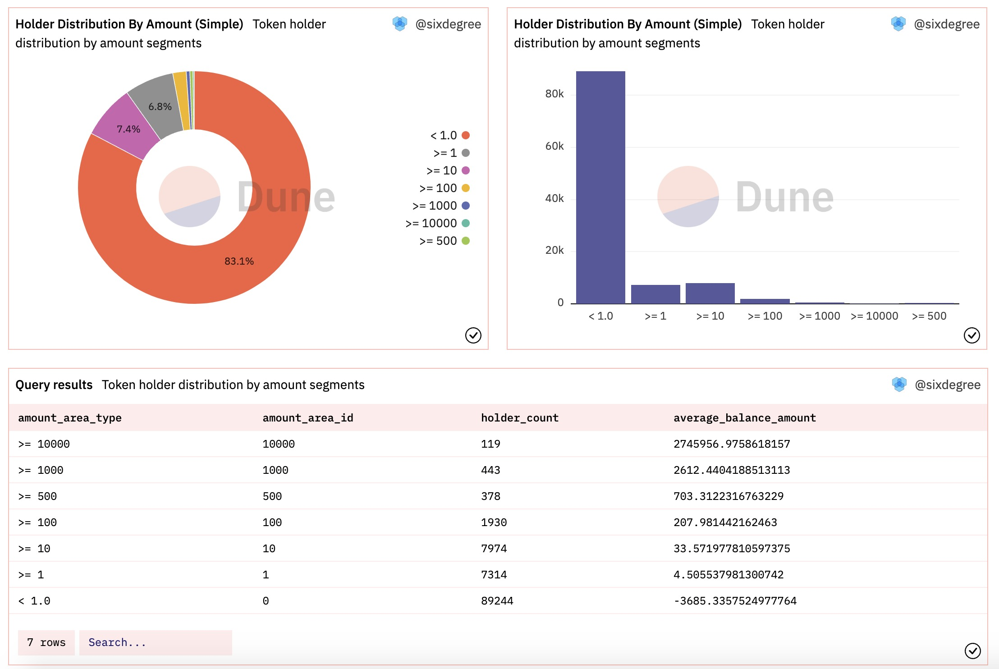
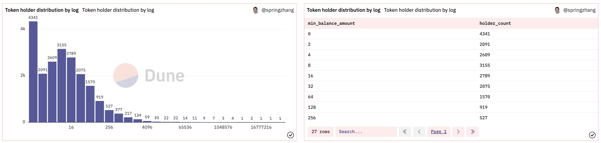
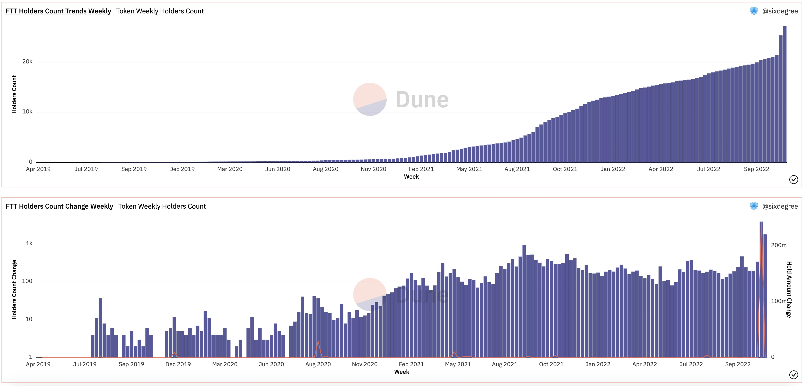

# Useful query part2: Token holders, total supply, account balance

In the useful queries part1, we mainly explained the different ways of querying the price of ERC20 tokens. Usually we also need to query the number of holders of a certain token, the total supply of tokens (circulation), the account balance of each holder (such as the balance of the account with the most holdings), and other related information. Next, we will introduce this part of the content.

Unlike Bitcoin, which tracks account balances through unspent transaction output (UTXO), EVM-compatible blockchains represented by Ethereum use a model of account balances. Each account address has transfer-in records and transfer-out records for each ERC20 token and the current balance of the account can be obtained by summarizing these transfer-in and transfer-out data. Because the blockchain itself does not hold the current balance of each address, we have perform some calculations to retrieve this data. Dune V2's spells tables `erc20_day`, `erc20_latest` (path: Spells/balances/ethereum/erc20/) and organize and update the latest balance and daily balance of each ERC20 token under each address, which can be used for query. However, according to the test, there are currently two problems with the use of these spells tables: one is that there is only the account balance spells table of the Ethereum chain and it does not support querying data of other chains; the other is that the query performance of these tables is not very satisfactory. So we will not introduce the use of these tables here, you can explore by yourself.

To query the account balance information of a single ERC20 token, first we need to know the contract address of the corresponding token. This can be obtained by querying the `tokens.erc20` table. For example, if we want to query the information of FTT Token, we can execute the following query. From the query results, we can get the contract address of FTT Token: 0x50d1c9771902476076ecfc8b2a83ad6b9355a4c9 .

``` sql
select * from tokens.erc20
where symbol = 'FTT'
    and blockchain = 'ethereum'
```

## Query the number of token holders and the total circulation of tokens

As mentioned earlier, whether we want to calculate the balance of a certain token under an account or calculate the balance of all holders of a certain token, we need to combine the transfer-in and transfer-out data together. For the transferred data, we take `to` as the user's addressn and the amount is a positive number. For the transfer data, take `from` as the user address and multiply the amount by `-1` to make it a negative number. Use union all to merge all records together. Use `union all` to merge all records together. The following sample code considers execrestriction:
ution performance issues and deliberately increases the `limit 10` 
``` sql
select * from (
    select evt_block_time,
        evt_tx_hash,
        contract_address,
        "to" as address,
        cast(value as decimal(38, 0)) as amount
    from erc20_ethereum.evt_Transfer
    where contract_address = 0x50d1c9771902476076ecfc8b2a83ad6b9355a4c9

    union all
    
    select evt_block_time,
        evt_tx_hash,
        contract_address,
        "from" as address,
        -1 * cast(value as decimal(38, 0)) as amount
    from erc20_ethereum.evt_Transfer
    where contract_address = 0x50d1c9771902476076ecfc8b2a83ad6b9355a4c9
)
limit 10    -- for performance
```

In the above query, we use `union all` to merge the incoming and outgoing FTT tokens for each account address, and only take 10 samples. Note that we cast the value using `value::decimal(38, 0)` on the `value` field. Since the field is now stored as a string, not doing this would cause some problems in the calculation. The number 38 is currently the largest number of integers supported by Dune's database, and "0" means no decimal places.

The account balance we need to calculate is the summary data, which we can put into a CTE definition based on the preceding query and then perform summary statistics against the CTE. Given that many token holders may have a large number of addresses (tens of thousands or even more), we usually focus on the total number of holders, total circulation, and the portion of addresses with the most holdings. We can also put the query summarized by address into a CTE, which is convenient to do further statistics as needed. Here, we first count the total number of holders and exclude those with a current token balance of 0. The new SQL statement is as follows:

``` sql
with transfer_detail as (
    select evt_block_time,
        evt_tx_hash,
        contract_address,
        "to" as address,
        cast(value as decimal(38, 0)) as amount
    from erc20_ethereum.evt_Transfer
    where contract_address = 0x50d1c9771902476076ecfc8b2a83ad6b9355a4c9
    
    union all
    
    select evt_block_time,
        evt_tx_hash,
        contract_address,
        "from" as address,
        -1 * cast(value as decimal(38, 0)) as amount
    from erc20_ethereum.evt_Transfer
    where contract_address = 0x50d1c9771902476076ecfc8b2a83ad6b9355a4c9
),

address_balance as (
    select address,
        sum(amount) as balance_amount
    from transfer_detail
    group by address
)

select count(*) as holder_count,
    sum(balance_amount / 1e18) as supply_amount
from address_balance
where balance_amount > 0
```
In the above query, we count the account balances by address in the `address_balance` CTE. In the final query we calculate the number of addresses whose current balance is greater than 0 (number of holders) and the sum of all account balances (total in circulation). Since the number of decimal places in the FTT token is `18`, when we calculate `thesupply_amount`, we divide the original amount by `1e18` to convert it to the amount with decimal places. This is the total amount of FTT tokens in circulation. It is important to note that different ERC20 tokens have different decimal places, as returned by the previous query to the `tokens.erc20` table. `1e18` is an equivalent shorthand for `power(10, 18)`, which means finding 10 to the 18th power. Since FTT tokens have more than 20,000 holding addresses, this query is relatively time-consuming and may take several minutes to execute.

The query results are shown in the following figure. Contrast Etherscan's data above [https://etherscan.io/token/0x50d1c9771902476076ecfc8b2a83ad6b9355a4c9](HTTP://https://etherscan.io/token/0x50d1c9771902476076ecfc8b2a83ad6b9355a4c9), the amount of total circulation tokens is essentially consistent, but the number of holders have certain differences. The difference is caused by the criteria used to determine which accounts have very small balances, which can be converted to decimal places when aggregating the balances of each address and ignored when counting the number of holders and total balances in circulation. A rule of thumb is to ignore addresses with balances less than `0.001` or `0.0001`.


An example query: [https://dune.com/queries/1620179](https://dune.com/queries/1620179)

## Query the address holding the most tokens

In the previous Query that queried the number of token holders and the amount in circulation, we have aggregated the current token balance of each holder by address. Therefore, it is easy to query the addresses of the users with the largest number of tokens and their respective holdings. You can either Fork the query to make changes, or you can copy the query code and create a new query. Since we are querying for a single token, we can replace the hard-coded token address with a query parameter `{{token_contract_address}}` and set the contract address of the FTT token above as the default, which gives us the flexibility to query data for any token. The following query returns the 100 addresses with the largest number of tokens:

``` sql
with transfer_detail as (
    select evt_block_time,
        evt_tx_hash,
        contract_address,
        "to" as address,
        cast(value as decimal(38, 0)) as amount
    from erc20_ethereum.evt_Transfer
    where contract_address = {{token_contract_address}}
    
    union all
    
    select evt_block_time,
        evt_tx_hash,
        contract_address,
        "from" as address,
        -1 * cast(value as decimal(38, 0)) as amount
    from erc20_ethereum.evt_Transfer
    where contract_address = {{token_contract_address}}
),

address_balance as (
    select address,
        sum(amount / 1e18) as balance_amount
    from transfer_detail
    group by address
)

select address,
    balance_amount
from address_balance
order by 2 desc
limit 100
```

Using the FTT token contract address default parameters, the above query returns the 100 addresses holding the largest number of FTTS. We can visualize a bar chart comparing the amount held by the top 100 holders. Because the amount difference is obvious, we will log the Y-axis data by checking the Logarithmic option. As shown below:


An example query: [https://dune.com/queries/1620917](https://dune.com/queries/1620917)

## Query the distribution of the amount held by different token holders

If we need to know the distribution of balances across all addresses holding an ERC20 token, there are two alternatives: one uses a rule of thumb to set up partitions, which is coarser, may miss some key features, and is not flexible enough to support analysis of many different tokens at the same time. The other way is more accurate, but also more complex. Let's introduce them separately.

**Distribution by rule of thumb:** Because we are looking at ranges of money (and similarly for quantity distributions), we can choose typical ranges of money: over 10,000, between 1,000 and 10,000, between 500 and 1,000, between 100 and 500, between 10 and 100, between 1 and 10, and less than 1. Of course, you can adjust it to meet the demand based on the total issuance of the specific token being analyzed. The query is as follows:

``` sql
with transfer_detail as (
    -- Same as previous sample
),

address_balance as (
    select address,
        sum(amount / 1e18) as balance_amount
    from transfer_detail
    group by address
)

select (case when balance_amount >= 10000 then '>= 10000'
            when balance_amount >= 1000 then '>= 1000'
            when balance_amount >= 500 then '>= 500'
            when balance_amount >= 100 then '>= 100'
            when balance_amount >= 10 then '>= 10'
            when balance_amount >= 1 then '>= 1'
            else '< 1.0'
        end) as amount_area_type,
        (case when balance_amount >= 10000 then 10000
            when balance_amount >= 1000 then 1000
            when balance_amount >= 500 then 500
            when balance_amount >= 100 then 100
            when balance_amount >= 10 then 10
            when balance_amount >= 1 then 1
            else 0
        end) as amount_area_id,
    count(address) as holder_count,
    avg(balance_amount) as average_balance_amount
from address_balance
group by 1, 2
order by 2 desc
```

A pie chart is the best way to visualize the distribution over a small number of specified intervals, but one drawback of using a pie chart is that the data often is not sorted in the order you expect. So in the above query, we also use another CASE statement to output the field `amount_area_id` used for sorting. In addition to the pie chart, we also output a histogram, because histograms support adjusted sorting (the default ordering, which can be unsorted or reversed), which is more intuitive to compare the number of adjacent ranges. In this histogram, we unsort and invert the result set so that the histogram is plotted from smallest to largest. Here is how the visualization looks when added to the data dashboard:



An example query: [https://dune.com/queries/1621478](https://dune.com/queries/1621478)

**Statistical distribution according to logarithmic partition interval: **

A more reasonable statistical distribution is to divide the data into corresponding partition intervals according to certain rules and then count the number of holder addresses belonging to each interval. For situations like token balances that vary wildly (accounts with small balances can have less than one token,and with large balances can have hundreds of millions of tokens), partitioning using logarithms is a relatively viable solution. If the analysis is the price, transaction amount, and other relative changes in a certain period of time is not particularly drastic, the use of the equal division method is also feasible. Specifically, calculate the difference between the maximum value and the minimum value, divide it into N equal parts, each interval is increased by the corresponding value on this basis. Here we use the `log2()` method to find the logarithm. Depending on the specific characteristics of the data you are analyzing, there may be other partitioning methods that are more appropriate.

``` sql
with transfer_detail as (
    -- Same as previous sample
),

address_balance as (
    select address,
        floor(log2(sum(amount / 1e18))) as log_balance_amount,
        sum(amount / 1e18) as balance_amount
    from transfer_detail
    group by address
    having balance_amount >= pow(10, -4)
)

select (case when log_balance_amount <= 0 then 0 else pow(2, log_balance_amount) * 1.0 end) as min_balance_amount,
    count(*) as holder_count
from address_balance
group by 1
order by 1
```

We use `floor(log2(sum(amount / 1e18)))` to log the balance of all holders and round it down to get an integer value. It also calculates the normal balance and using `having balance_amount >= pow(10, -4)` filters out accounts with a balance less than 0.0001. In the query that outputs the final result, we use a CASE statement that treats the value `log_balance_amount >= 0` as 0, indicating that the account balance is between 0 and 2. For any other value, the `pow()` function is used to restore the normal amount of money. In this way, we realize the number of addresses in different amount intervals by logarithmic partitioning. As shown below, We can visualize the query results as a histogram:



An example query: 
- Statistical distribution by log partition: [https://dune.com/queries/1622137](https://dune.com/queries/1622137)
- Statistical distribution according to equal division method: [https://dune.com/queries/1300399](https://dune.com/queries/1300399)

## Query the number of ERC20 token holders over the date

For smart contracts that have already been parsed, in addition to querying the `evt_Transfer` table, we can also directly query the corresponding Decode table. For example, with regard to the the FTT Token we queried earlier, its contract has already been Decoded. Go to the query editor page of Dune, click "Decoded Projects", search for "ftt", and then select "FTT_Token". You should see a table of type `event` called "Transfer" in the list. Click the double arrow symbol on the right to insert the full table name into the query editor window, which is `ftt_ethereum.FTT_Token_evt_Transfer`. The advantage of using Decode tables is that queries read less data and performs better.

Suppose our goal is to track the number of FTT token holders each week, so we need to figure out how many people hold FTT token balances in each week. Let's start with the query code, followed by an explanation:

``` sql
with transfer_detail as (
    select evt_block_time,
        "to" as address,
        cast(value as decimal(38, 0)) as value,
        evt_tx_hash
    from ftt_ethereum.FTT_Token_evt_Transfer
    
    union all
    
    select evt_block_time,
        "from" as address,
        -1 * cast(value as decimal(38, 0)) as value,
        evt_tx_hash
    from ftt_ethereum.FTT_Token_evt_Transfer
),

holder_balance_weekly as (
    select date_trunc('week', evt_block_time) as block_date,
        address,
        sum(value/1e18) as balance_amount
    from transfer_detail
    group by 1, 2
),

holder_summary_weekly as (
    select block_date,
        address,
        sum(balance_amount) over (partition by address order by block_date) as balance_amount
    from holder_balance_weekly
    order by 1, 2
),

min_max_date as (
    select min(block_date) as start_date,
        max(block_date) as end_date
    from holder_balance_weekly
),

date_series as (
    SELECT dt.block_date 
    FROM min_max_date as mm
    CROSS JOIN unnest(sequence(date(mm.start_date), date(mm.end_date), interval '7' day)) AS dt(block_date)
),

holder_balance_until_date as (
    select distinct d.block_date,
        w.address,
        -- get the last balance of same address on same date or before (when no date on same date)
        first_value(balance_amount) over (partition by w.address order by w.block_date desc) as last_balance_amount
    from date_series d
    inner join holder_summary_weekly w on w.block_date <= d.block_date
),

holder_count_summary as (
    select block_date,
        count(address) as holder_count,
        sum(last_balance_amount) as balance_amount
    from holder_balance_until_date
    where last_balance_amount > 0
    group by block_date
)

select block_date,
    holder_count,
    balance_amount,
    (holder_count - lag(holder_count, 1) over (order by block_date)) as holder_count_change,
    (balance_amount - lag(balance_amount, 1) over (order by block_date)) as balance_amount_change
from holder_count_summary
order by block_date
```

The instructions are as follows: 
1. CTE `transfer_detail` is basically the same as the previous example, except now we read the data from the `FTT_Token_evt_Transfer` table specific to the FTT token, so there is no additional filter.
2. In the `holder_balance_weekly` CTE, we use `date_trunc(`week`, evt_block_time)` to convert the date to the start of each week, and group the balance change for each address in each week. Note that this is the weekly change, not the actual balance at that time.
3. In `holder_summary_weekly`, we based on the `weekly balance changes`, Use `sum(balance_amount) over (partition by address order by block_date)` to sum the balance of each address up to each date. In this case, you get the actual balance value for the specific date.
4. The CTE `min_max_date` is used to find the start and end dates from the previous CTE. Because we want to count the number of holders for each week, we need to generate a date sequence from this date range.
5. Then we use the start and end dates in `date_series` to generate a sequence of dates with 7-day intervals. This gives the start date of each week between the two dates.
6. Then in `holder_balance_until_date`, we do a relational query using the CTE of the date series and the weekly balance to calculate the accumulated balance at each address up to each date in the `date_series`. Note that `from date_series d inner join holder_summary_weekly w on w.lock_date <= d.lock_date `Here, we used` <= `to match all the records in the` holder_summary_weekly `table that are up to and including the current` date_series` date. That is, for each date value in `date_series`, we will match a batch of records in` holder_summary_weekly `. This operation is somewhat similar to the Cartesian product. Also note that in the SELECT substatement, we're getting a `d.lock_date` instead of a `w.lock_date`, which is crucial for summarizing the data correctly.
7. Then, in `holder_count_summary`, we count the number of addresses with a balance greater than 0 by date, so we get the number of addresses with an FTT Token balance in the account for each date (first day of the week).
8. At the end of the query, we use the `lag()` function to output the daily change in the number of holders and the total balance of all accounts.

We visualize the query results into two charts, and add them to the data dashboard as follows: 



An Example on Dune: [https://dune.com/queries/1625278](https://dune.com/queries/1625278)

## Query the account balance for the specified user address

Based on the previous query example, it can be easily modified to query the balance information for a specific user address or a set of user addresses. We just need to add a filter to filter the `address` records that meet the criteria, so there is no example in this case.

## Querying native token holders (ETH)

ETH is the native token of the Ethereum, not an ERC20 token, and its transaction data is not stored in the `evt_Transfer` table, so it cannot be used to calculate information such as ETH balance and holder in the same way as ERC20 tokens. A smart contract can transfer ETH at the same time as calling a method that supports transfer function, or even when a new smart contract is created (deployed) or when a smart contract self-destructs.Moreover, Ethereum blockchain fuel is also paid in ETH. All of these ETH transfers are recorded in the `ethereum. traces` table, while the `ethereum. transactions` table contains only direct transactions.  Therefore, when calculating the ETH balance or counting the number of holders, we have to use `traces` table.  The implementation is similar to calculating the ERC20 token balance, except for the data source.  Here is a data dashboard created earlier to track the balance of ETH account, and the query demonstrates the implementation.

Reference data dashboard: [ETH Whales Tracking](https://dune.com/springzhang/eth-whales-top-1000-eth-holders)

## Recommended References

The "Tips and Tricks for Query and Visualization in Dune V2 Engine" data dashboard board is a collection of tips and tricks for further reading. The follow-up will continue to supplement and update more skills, welcome to collect.

dashboard address: [Tips and Tricks for Query and Visualization in Dune V2 Engine](https://dune.com/springzhang/tips-and-tricks-for-query-and-visualization-in-v2-engine)

## SixdegreeLab introduction

SixdegreeLab([@SixdegreeLab](https://twitter.com/sixdegreelab))is a professional Onchain data team dedicated to providing accurate Onchain data charts, analysis, and insights to users. Our mission is to popularize Onchain data analysis and foster a community of Onchain data analysts. Through community building, tutorial writing, and other initiatives, we aim to cultivate talents who can contribute valuable analytical content and drive the construction of a data layer for the blockchain community, nurturing talents for the future of blockchain data applications.

Feel free to visit[SixdegreeLab`s Dune homepage](https://dune.com/sixdegree).

Due to our limitations, mistakes may occur. If you come across any errors, kindly point them out, and we appreciate your feedback.
