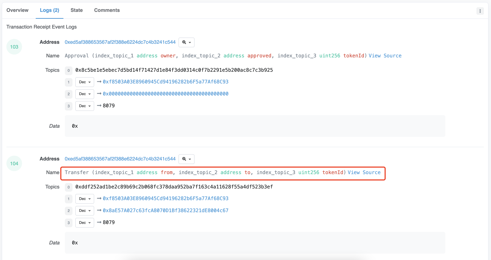

# NFT data analysis

## Background Information

[NFT(Non-Fungable Token)](https://ethereum.org/zh/nft/) Non-Fungable token is a kind of standard token follow [ERC721] (https://eips.ethereum.org/EIPS/eip-721) . compared to follow ERC20 standard in terms of fungable tokens, Traditionally, the most typical characteristics of NFT are that each token is indivisible, irreplaceable, and unique. The common uses of NFT are:


- Digital art/collections
- In-game items
- Domain names
- Tickets or coupons that allow you to attend an event
- Digital identity
- Articles

For example, in digital art, different NFTS have different styles; For example, in the ENS domain name, each domain name is unique and cannot be repeated. As for tickets, each ticket has a fixed seat, and different seats are also different numbers.

With the development of NFT, other standard NFT have been derived:

- ERC-1155: Non-fungible tokens, each token is different, but can do quantity transfer
- SBT: Non-transferable Token
- ERC-3235: Semi-fungible token, each token is different, and supports settlement

|          | ERC20                                                | ERC721                                                                     | ERC1155                                                                                                                                    | ERC3535                                                                                                                                                                                                                                                                                                                                                               |
|----------|------------------------------------------------------|----------------------------------------------------------------------------|--------------------------------------------------------------------------------------------------------------------------------------------|-----------------------------------------------------------------------------------------------------------------------------------------------------------------------------------------------------------------------------------------------------------------------------------------------------------------------------------------------------------------------|
| **features** | fungible tokens(each single token is same as others) | non-fungible tokens(each single token is unique, no one is same as others) | representing fungible, semi-fungible, and non-fungible tokens.                                                                             | Semi-Fungible Token                                                                                                                                                                                                                                                                                                                                                   |
| **esamples** | address A transfer 100ETH to address B               | address A transfer an laser eye BAYC to address.(not glassed or others)    | address A transfer 5 bottles of potion in a game. Not other equipment.  each of the 5 bottles of potion is same. but we can +/- 5 bottles. | A DeFi protocol gives user A a $100 1-year bond, numbered 001. The bond can be split into 2 $50 bonds, numbered 002 and 003, which user A then transfers to holders B and C. The bond can be split into 2 $50 bonds, numbered 002 and 003. The 003 bond can in turn be split into another $20 for the 003 bond, at which point 002 is worth $30 and 003 is worth $70. |
| **scenario** | cryptocurrency                                       | Digital Collections                                                        | In-Game Assets                                                                                                                             | Financial Assets/Contracts                                                                                                                                                                                                                                                                                                                                            |

## Contract description

The contracts related to NFT are usually divided into two categories: one is the contract of the project party, and the other is the contract of the third-party exchange platform used to trade NFT.

### ERC721 contract

We use ERC721 NFT as an example to show the characteristics of contract, the other can according to demand to understand, we in the market of NFT Opensea to [azuki] (https://opensea.io/collection/azuki) on the NFT, for example, that contract contain what events:

```solidity
interface ERC721 {
    /// @dev This event is fired when the ownership of any NFT changes (either way).
    ///  Both at creation time (` from `== 0) and destruction time (` to` == 0), except when the contract is created.
    event Transfer(address indexed _from, address indexed _to, uint256 indexed _tokenId);

    /// @dev Triggered when the approval address of the NFT is changed or confirmed.
    ///  A zero address indicates an address without approval
    ///  When a `Transfer` event occurs, it also means that the approved address (if any) for that NFT is reset to "none" (zero address).
    event Approval(address indexed _owner, address indexed _approved, uint256 indexed _tokenId);

    /// @dev Triggered when the owner enables or disables the operator. (Operator can manage NFTs held by owner)
    event ApprovalForAll(address indexed _owner, address indexed _operator, bool _approved);

    /// @notice Transfer ownership of NFT from one address to another
    /// @dev Throws an exception if `msg.sender` is not the current owner (or approver)
    /// Throw an exception if `_from` is not the owner, `_to` is a zero address, and `_tokenId` is not a valid id.
    ///  When the transfer completes, the function checks if `_to` is a contract, and if so, calls` onERC721Received `of` _to `and checks if the returned value is `0x150b7a02` (That is:`bytes4(keccak256("onERC721Received(address,address,uint256,bytes)"))`)  If it doesn't throw an exception.
    /// @param _from : current owner
    /// @param _to : new owner
    /// @param _tokenId : The token id to transfer.
    /// @param data : Additional parameters (no format specified) are passed to the receiver.
    function safeTransferFrom(address _from, address _to, uint256 _tokenId, bytes data) external payable;

    /// @notice Transfer ownership - The caller is responsible for confirming if `_to` is capable of receiving NFT, otherwise it may be lost permanently.
    /// @dev If `msg.sender` is not the current owner (or approver or operator) that is throwing the exception
    /// Throw an exception if `_from` is not the owner, `_to` is a zero address, and `_tokenId` is not a valid id.
    function transferFrom(address _from, address _to, uint256 _tokenId) external payable;

    /// @notice Change or confirm the approved address of the NFT
    /// @dev A zero address indicates an address without approval
    ///  If `msg.sender` is not the current owner or operator
    /// @param _approved The newly approved controller
    /// @param _tokenId : token id
    function approve(address _approved, uint256 _tokenId) external payable;

    /// @notice Enable or disable a third party (operator) to manage `msg.sender` all assets
    /// @dev To trigger the `ApprovalForAll` event, the contract must allow each owner to have multiple operators.
    /// @param _operator The address to add to the list of approved operators
    /// @param _approved `True` indicates approval and `false` indicates revocation
    function setApprovalForAll(address _operator, bool _approved) external;

    ...
}
```

For data analysis, the most important function is the Transfer event, which is triggered on every transaction and recorded on the chain. In addition to Transfer, there is also the Mint event, which is usually used to mint a new NFT at the time of sale. Dune's spells table provides ERC721, ERC1155 type Transfer tables such as `erc721_ethereum.evt_Transfer `, `erc1155_ethereum.evt_Transfer`, etc. (different names under different blockchains), We can query NFT transfer events for a contract or an EOA address.

In the Transfer event, there are three main parameters: the sender address `from`, the receiver address `to` and the number of the NFT `tokenId`. In the case of transaction, both from and to are a normal address. If `mint`, the from address is all 0, and if `burn`, the address of to is all 0. The `nft.mint` and `nft.burn` tables on Dune also decode this event to get the final transaction information.


### marketplace contracts

Some common marketplace contracts are Opensea, X2Y2, Blur, etc. Let's take Opensea Seaport1.1 contract as an example. All functions related to a transaction will trigger the OrderFulfilled event to record the data on the chain. Dune's nft.trades parses this event to get the final trades. The seaport contract writable functions are as follows:


```solidity
uint256 constant receivedItemsHash_ptr = 0x60;

/*
 *  Memory layout in _prepareBasicFulfillmentFromCalldata of
 *  data for OrderFulfilled
 *
 *   event OrderFulfilled(
 *     bytes32 orderHash,
 *     address indexed offerer,
 *     address indexed zone,
 *     address fulfiller,
 *     SpentItem[] offer,
 *       > (itemType, token, id, amount)
 *     ReceivedItem[] consideration
 *       > (itemType, token, id, amount, recipient)
 *   )
 *
```

For example, Alice  made an order for an Azuki NFT with the number [3638](https://opensea.io/assets/ethereum/0xed5af388653567af2f388e6224dc7c4b3241c544/3638)at 10ETH, then it triggers the 'fulfillBasicOrder' function, and when the transaction succeeds, it triggers the 'OrderFulfilled' event to be logged to the chain.[Etherscan link](https://etherscan.io/tx/0x9beb69ec6505e27f845f508169dae4229e851a8d7c7b580abef110bf831dc338) and[dune link](https://dune.com/queries/1660679).


## Common table Description

- Original base table: located in `Raw`-->`transactions` and `logs`tables;
- Specific project table: located in `Decoded Projects`->Search the name of the specific project table, and the name of the trading platform;
- Aggregate table:
  - Spells-->erc721: Record all transfer records of erc721
  - Spells-->nft: It contains information about trades, mints, transfers, fees, and burns, and the most important of these is the trades table, which aggregates all the trade data from the major exchanges.


The important details of nft.trades table are as follows:

| Field                       | Description                         |
| ------------------------ | ----------------------------------- |
| blockchain               | Most of chain of data gathered in this table           |
| project                  | Trading platform name                   |
| version                  | Trading platform version                   |
| block_time               | Block time                             |
| token_id                 | NFT Token ID                        |
| collection               | NFT collection name                |
| amount_usd               | The dollar value when trading           |
| token_standard           | The standards of the Token                  |
| trade_type               | Transaction type, it is single NFT deal or multiple NFTs trade   |
| number_of_items          | Number of the NFT traded                 |
| trade_category           | Transaction type  (Direct buy, auction, etc...) |
| evt_type                 | Evt type (Trade, Mint, Burn)            |
| seller                   | Seller wallet address                       |
| buyer                    | Buyer wallet address                  |
| amount_original          | The original amount of transactions (under the original units of tokens token)|
| amount_raw               | The raw transaction amount without being numeric |
| currency_symbol          | The token symbol of the transaction (what token is used as the unit of payment)           |
| currency_contract        | The token contract address of the original transaction, <br>use WETH on ETH contract address       |
| nft_contract_address     | NFT contract address                     |
| project_contract_address | Trading platform contract address            |
| aggregator_name          | Aggregation platform name, if the transaction is initiated from the aggregation platform, such as gem          |
| aggregator_address       | Aggregate platform contract address          |
| tx_hash                  | Transaction hash                         |
| block_number             | Block of transaction                     |
| tx_from                  | The address from which the transaction is initiated, usually the buyer                      |
| tx_to                    | The address to which the transaction is to be received, usually the trading platform                 |
| unique_trade_id          | Transaction id                              |

## Key metrics

In general, an NFT project will focus on the following basic metrics:

**Transaction price movement**
  
It is necessary to query the transaction amount of all the trading markets and express all the transactions with a scatter plot. At the same time, different ranges can be selected through the time range, such as the last 24h, the last 7 days, the last 1 month, and so on. It should be noted that for some transactions, the transaction price is too high, you need to filter out these, otherwise you will not be able to clearly show most of the transaction price movement.


Reference Links: https://dune.com/queries/1660237

**Floor price**
  
Because we can only obtain the data of completed transactions on the chain and cannot obtain the data of pending orders in the trading market, we generally use the minimum transaction amount among the last 10 transactions as the floor price, which is not much different from the pending order price, unless the project is particularly unpopular

``` sql
-- Find the 10 most recent transactions for this contract, sorted by time
with lastest_trades as (
    select * 
    from nft.trades 
    where nft_contract_address = 0xed5af388653567af2f388e6224dc7c4b3241c544 -- contract address of azuki NFT
    -- and block_time > now() - interval '24' hour --It can also be sorted by time
    order by block_time desc
    limit 10
)

select min(amount_original) as floor_price --Get the minimum value directly
    -- percentile_cont(.05) within GROUP (order by amount_original) as floor_price --This is done by taking the 5% quantile between the lowest and highest prices to prevent some too low price trading effects
from lastest_trades
where  currency_symbol IN ('ETH', 'WETH')
    and cast(number_of_items as integer) = 1 -- This can be filtered by different chains, different transaction tokens
```

Reference Links: https://dune.com/queries/1660139

**Transaction volume, total transaction quota, total number of transactions, etc., 24 hours /7 days /1 month transaction quota** 
  
``` sql
with total_volume as(
    SELECT
        sum(amount_original) as "Total Trade Volume(ETH)", 
        sum(amount_usd) as "Total Trade Volume(USD)",      
        count(amount_original) as "Total Trade Tx"     
    FROM nft.trades
    WHERE nft_contract_address = 0xed5af388653567af2f388e6224dc7c4b3241c544
        -- AND currency_symbol IN ('ETH', 'WETH') 
),

total_fee as (
    select 
        sum(royalty_fee_amount) as "Total Royalty Fee(ETH)",   
        sum(royalty_fee_amount_usd) as "Total Royalty Fee(USD)", 
        sum(platform_fee_amount) as "Total Platform Fee(ETH)",   
        sum(platform_fee_amount_usd) as "Total Platform Fee(USD)" 
    from nft.fees 
    WHERE nft_contract_address = 0xed5af388653567af2f388e6224dc7c4b3241c544
    -- AND royalty_fee_currency_symbol IN ('ETH', 'WETH') 
)

select * from total_volume, total_fee
```

Reference Links: https://dune.com/queries/1660292
  
**Daily/monthly/weekly volume**

``` sql
with hourly_trade_summary as (
    select date_trunc('day', block_time) as block_date, 
        sum(number_of_items) as items_traded,
        sum(amount_raw) / 1e18 as amount_raw_traded,
        sum(amount_usd) as amount_usd_traded
    from opensea.trades
    where nft_contract_address = 0xed5af388653567af2f388e6224dc7c4b3241c544
    -- and block_time > now() - interval '90' day
    group by 1
    order by 1
)

select block_date, 
    items_traded,
    amount_raw_traded,
    amount_usd_traded,
    sum(items_traded) over (order by block_date asc) as accumulate_items_traded,
    sum(amount_raw_traded) over (order by block_date asc) as accumulate_amount_raw_traded,
    sum(amount_usd_traded) over (order by block_date asc) as accumulate_amount_usd_traded
from hourly_trade_summary
order by block_date
```


Reference Links: https://dune.com/queries/1664420


**Current number of holders, total number of tokens, distribution of holders, etc**
``` sql
with nft_trade_details as ( --Get the buy and sell side detail table for a trade, where the sell side is negative and the buy side is positive
    select seller as trader,
        -1 * cast(number_of_items as integer) as hold_item_count
    from nft.trades
    where nft_contract_address = 0xed5af388653567af2f388e6224dc7c4b3241c544

    union all
    
    select buyer as trader,
        cast(number_of_items as integer) as hold_item_count
    from nft.trades
    where nft_contract_address = 0xed5af388653567af2f388e6224dc7c4b3241c544
),

nft_traders as (
    select trader,
    sum(hold_item_count) as hold_item_count
    from nft_trade_details
    group by trader
    having sum(hold_item_count) > 0
    order by 2 desc
),

nft_traders_summary as (
    select (case when hold_item_count >= 100 then 'Hold >= 100 NFT'
                when hold_item_count >= 20 and hold_item_count < 100 then 'Hold 20 - 100'
                when hold_item_count >= 10 and hold_item_count < 20 then 'Hold 10 - 20'
                when hold_item_count >= 3 and hold_item_count < 10 then 'Hold 3 - 10'
                else 'Hold 1 or 2 NFT'
            end) as hold_count_type,
        count(*) as holders_count
    from nft_traders
    group by 1
    order by 2 desc
),

total_traders_count as (
    select count(*) as total_holders_count,
        max(hold_item_count) as max_hold_item_count
    from nft_traders
),

total_summary as (
    select 
        0 as total_nft_count,
        count(*) as transaction_count,
        sum(number_of_items) as number_of_items_traded,
        sum(amount_raw) / 1e18 as eth_amount_traded,
        sum(amount_usd) as usd_amount_traded
    from opensea.trades
    where nft_contract_address = 0xed5af388653567af2f388e6224dc7c4b3241c544
)

select *
from nft_traders_summary
join total_traders_count on true
join total_summary on true
```

Reference Links: https://dune.com/queries/1300500/2228120


## NFT Comprehensive dashboard example

We made a dashboard where you can enter the address of an NFT contract and see all kinds of information about the project. You can learn more about queries using the query on the dashboard:

https://dune.com/sixdegree/nft-collections-metrics-custom-dashboard 


## Reference

- https://mirror.xyz/0x07599B7E947A4F6240F826F41768F76149F490D5/CHcwsp_d0AINEalFq_0FcqkLeEyeeGpYDDtw82TyMes
- https://github.com/cryptochou/seaport-analysis
- https://dune.com/sixdegree/soulda-nft-soulda16club
- https://dune.com/sixdegree/digidaigaku-nft-by-limit-break

## SixdegreeLab introduction

SixdegreeLab([@SixdegreeLab](https://twitter.com/sixdegreelab))is a professional on-chain data team dedicated to providing accurate on-chain data charts, analysis, and insights to users. Our mission is to popularize on-chain data analysis and foster a community of on-chain data analysts. Through community building, tutorial writing, and other initiatives, we aim to cultivate talents who can contribute valuable analytical content and drive the construction of a data layer for the blockchain community, nurturing talents for the future of blockchain data applications.

Feel free to visit[SixdegreeLab's Dune homepage](https://dune.com/sixdegree).

Due to our limitations, mistakes may occur. If you come across any errors, kindly point them out, and we appreciate your feedback.
