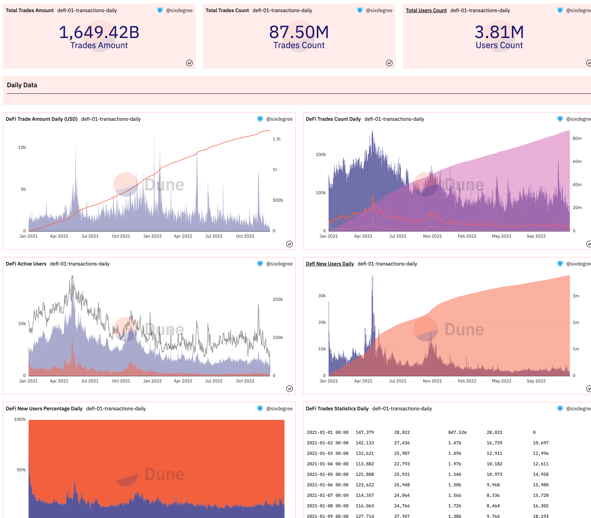
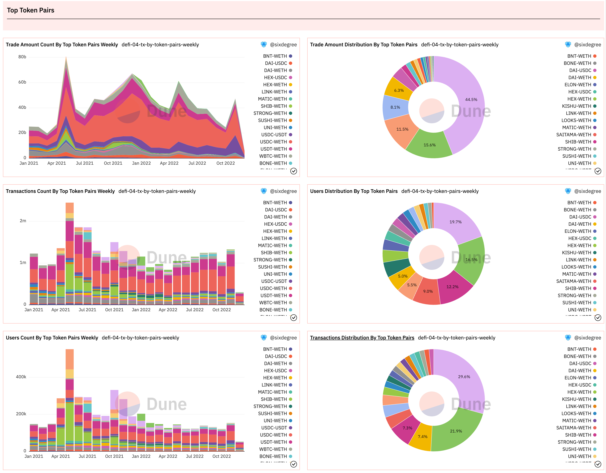

# 14 DeFi Analysis
DeFi refers to Decentralized Finance, which should be the most active field in current blockchain. When we exchange one ERC20 token for another, we can use DeFi to facilitate the exchange. DEX is Decentralized Exchange. Uniswap, PancakeSwap, CurveFi, and others are popular DEXs. In this tutorial, we will explore the analysis methods of DeFi projects using the data on the Ethereum blockchain as a case.

The dashboard for this tutorial please refer [DeFi Analysis Tutorial](https://dune.com/sixdegree/defi-analysis-tutorial)<a id="jump_8"></a>.

## DeFi Spells

Given the importance of DeFi in the Crypto area, the Dune community has established a rich Spells for it. The Spells called `dex.trades` aggregates exchange data from nearly 30 different DEXs such as Uniswap, PancakeSwap, Trader Joe, Velodrome, SushiSwap, etc. By examining the [definition](https://github.com/duneanalytics/spellbook/blob/main/models/dex/dex_trades.sql)<a id="jump_8"></a> of the `dex.trades table`, we can see that its data is sourced from other Spells, such as `uniswap.trades`, `sushiswap.trades`, `curvefi.trades`, and so on. If you analyze the data from a specific DEX, it is recommended to prioritize using the trade-specific Spells for its better query execution performance. Similarly, for DeFi projects like Uniswap, which have released multiple versions of smart contracts (including upgrading contract versions on the same blockchain or deploying contracts on different blockchains), the `uniswap.trades` table is also aggregated from other Spells. If you are only interested in analyzing data from a specific version or chain, you can use the corresponding Spells. For example, if you analyze exchange data from Uniswap V3 on Ethereum, you can directly use the `uniswap_v3_ethereum.trades` table. If you analyze exchange data from CurveFi on the Optimism chain, you can use the `curvefi.trades` Spells.

``` sql
select blockchain, 
    project, 
    project || '_' || blockchain || '.trades' as spell_table_name,
    count(*) as trade_count
from dex.trades
group by 1, 2, 3
order by 1 asc, 4 desc
```

This query lists the projects, their corresponding blockchains, and the names of the corresponding Spells in the current `dex.trades` table. Currently, the related Spells for aggregating data in `dex.trades` are shown in the following image:


Query Link:

[https://dune.com/queries/17500008](https://dune.com/queries/17500008)<a id="jump_8"></a>

We can use `spell_table_name` as the table name to access the trades data Spells for the corresponding project. For example:

``` sql
select * from 
kyberswap_avalanche_c.trades
limit 1
```

## Comprehensive Analysis of the DeFi Industry
### Overview of DeFi
As mentioned above, the Spells aggregates transaction data from over a dozen mainstream DeFi projects, including Uniswap. Let's first take a look at its overview. Considering its educational purposes, we will limit our queries to recent data as an example.

``` sql 
select block_date,
    count(*) as trade_count,
    count(distinct taker) as active_user_count,
    sum(amount_usd) as trade_amount
from dex.trades
where block_date >= date('2022-10-01')
group by 1
order by 1
```

Using the afoementioned query, you can obtain the daily transaction count and the number of unique users. The internal logic of DeFi is complex and the `taker` stores the recipient of the transaction. Using it could reflect the true number of unique users. Additionally, the above-mentioned query is modified to calculate the cumulative transaction count per day, the count of new users per day and its cumulative value, as well as the total transaction count and the number of users. The modified SQL query is as follows:

``` sql
with trade_summary as (
    select block_date,
        count(*) as trade_count,
        count(distinct taker) as active_user_count,
        sum(amount_usd) as trade_amount
    from dex.trades
    where blockchain = 'ethereum'
        and block_date >= date('2021-01-01')
        and token_pair <> 'POP-WETH' -- Exclude outlier that has wrong amount
    group by 1
    order by 1
),

user_initial_trade as (
    select taker,
        min(block_date) as initial_trade_date
    from dex.trades
    where blockchain = 'ethereum'
        and block_date >= date('2021-01-01')
        and token_pair <> 'POP-WETH' -- Exclude outlier that has wrong amount
    group by 1
),

new_user_summary as (
    select initial_trade_date,
        count(taker) as new_user_count
    from user_initial_trade
    group by 1
    order by 1
)

select t.block_date,
    trade_count,
    active_user_count,
    trade_amount,
    new_user_count,
    active_user_count - new_user_count as existing_user_count,
    sum(trade_count) over (order by t.block_date) as accumulate_trade_count,
    sum(trade_amount) over (order by t.block_date) as accumulate_trade_amount,
    sum(new_user_count) over (order by u.initial_trade_date) as accumulate_new_user_count,
    (sum(trade_count) over ()) / 1e6 as total_trade_count,
    (sum(trade_amount) over ()) / 1e9 total_trade_amount,
    (sum(new_user_count) over ()) / 1e6 as total_new_user_count
from trade_summary t
left join new_user_summary u on t.block_date = u.initial_trade_date
order by t.block_date
```

Query interpretation:

1. Putting the original query into the `trade_summary` common table expression (CTE) for smoother utilization with window functions. In the query, we discovered anomalous data for the "POP-WETH" pool, so we directly exclude it here.
2. The CTE `user_initial_trade` calculates the initial trade date for each taker. For the sake of performance, please be aware that the trading date may not strictly represent the true initial trading date.
3. The CTE `new_user_summary` summarizes the daily count of new users based on their initial trade dates, determined by the `user_initial_trade`.
4. In the final output query code, we use the window function syntax `sum(field_name1) over (order by field_name2)` to calculate the cumulative data by date. Additionally, dividing by 1e6 or 1e9 is used to convert large numbers into their corresponding values in millions or billions, respectively.

In this query result, we add the following visualizations:

1. Add Counter-type visualizations for the output values total_trade_count, total_trade_amount, and total_new_user_count.
2. Add Bar Chart-type bar graphs for trade_count and new_user_count.
3. Add Area Chart-type area graphs for trade_amount and active_user_count.
4. Add a percentage-type Area Chart to compare the proportions of new_user_count and existing_user_count.
5. Add a Table-type visualization to display the query results.

Create a new Dashboard and include the relevant charts. As shown in the following image:



Similarly, we can summarize the data on a monthly basis, calculate relevant metrics for each month, and add visualizations to the dashboard.

Query Link:
* [https://dune.com/queries/1661180](https://dune.com/queries/1661180)<a id="jump_8"></a>
* [ttps://dune.com/queries/1663358](ttps://dune.com/queries/1663358)<a id="jump_8"></a>

### Statistical analysis by project

As previously mentioned, the `dex.trades` Spells aggregates transaction data from multiple projects on different blockchains. We can use a query to compare the transaction data of each project and analyze their market share.

``` sql
select block_date,
    project,
    count(*) as trade_count,
    count(distinct taker) as active_user_count,
    sum(amount_usd) as trade_amount
from dex.trades
where blockchain = 'ethereum'
    and block_date >= date('2021-01-01')
    and token_pair <> 'POP-WETH' -- Exclude outlier that has wrong amount
group by 1, 2
order by 1, 2
```

Here, we merely compare the number of active users, transaction count, and transaction amount. Bar charts and pie charts for different fields in the result set are added in the dashboard. You may have noticed that our queries are aggregated by both day and project. When creating a Pie Chart, if we select only the `Project` as the X Column and choose `trade_count` as Y Column 1, without selecting any fields for Group By, the trade_count values for each day will automatically be accumulated together, and the total value will be displayed in the pie chart. Considering this, we don't need to write a separate query to generate the pie chart, which is considered an application technique. The dashboard shows as the following :


Query link:

* [https://dune.com/queries/1669861](https://dune.com/queries/1669861)<a id="jump_8"></a>

### Grouping and summarizing by Token Pair

Almost every DeFi project supports the exchange of multiple tokens, which achieved by establishing separate liquidity pools for different token pairs. For example, Uniswap supports the exchange of various ERC20 tokens by allowing liquidity providers (LPs) to create liquidity pools for any two ERC20 tokens. Regular users can then utilize these pools to exchange tokens by paying a certain proportion of transaction fees. Taking USDC and WETH as an example, under Uniswap V3, there are four different fee tiers. LPs can create a liquidity pool for each fee tier, such as "USDC/WETH 0.3%". Considering that the popularity, circulation volume, supported platforms, and transaction fee rates differ for tokens involved in different trading pairs, it is necessary to analyze which trading pairs are more popular and have higher transaction volumes.

``` sql
with top_token_pair as (
    select token_pair,
        count(*) as transaction_count
    from dex.trades
    where blockchain = 'ethereum'
        and block_date >= date('2021-01-01')
        and token_pair <> 'POP-WETH' -- Exclude outlier that has wrong amount
    group by 1
    order by 2 desc
    limit 20
)

select date_trunc('month', block_date) as block_date,
    token_pair,
    count(*) as trade_count,
    count(distinct taker) as active_user_count,
    sum(amount_usd) as trade_amount
from dex.trades
where blockchain = 'ethereum'
    and block_date >= date('2021-01-01')
    and token_pair in (
        select token_pair from top_token_pair
    )
group by 1, 2
order by 1, 2
```

In the above query, we first define a `top_token_pair` CTE to retrieve the top 20 token pairs based on transaction count. Then, we summarize the transaction count, active user count, and transaction amount for these 20 token pairs on a monthly basis. We add the corresponding visualizations for this query and include them in the dashboard. The display is shown below.



Query link:

* [https://dune.com/queries/1670196](https://dune.com/queries/1670196)<a id="jump_8"></a>

## Analysis of an individual DeFi project

For a specific individual DeFi project, we can analyze relevant data including active trading pairs, new liquidity pool count, trading volume, and active users. Taking Uniswap as an example, we can find the corresponding Spells for Uniswap on the Ethereum blockchain as the `uniswap_ethereum.trades`.

### Transaction count, active users, transaction amount

We can calculate the transaction count, active users, and transaction amount on a daily basis using the following SQL:

``` sql
select block_date,
    count(*) as trade_count,
    count(distinct taker) as active_user_count,
    sum(amount_usd) as trade_amount
from uniswap_ethereum.trades
where block_date >= date('2022-01-01')
group by 1
order by 1
```

Query link:

* [https://dune.com/queries/1750266](https://dune.com/queries/1750266)<a id="jump_8"></a>

### Analysis of active trading pairs
The SQL for analyzing the most active trading pairs (also known as pools or liquidity pools) in a Uniswap project is as follows:

``` sql
with top_token_pair as (
    select token_pair,
        count(*) as transaction_count
    from uniswap_ethereum.trades
    where blockchain = 'ethereum'
        and block_date >= date('2022-01-01')
    group by 1
    order by 2 desc
    limit 20
)

select date_trunc('month', block_date) as block_date,
    token_pair,
    count(*) as trade_count,
    count(distinct taker) as active_user_count,
    sum(amount_usd) as trade_amount
from uniswap_ethereum.trades
where blockchain = 'ethereum'
    and block_date >= date('2022-01-01')
    and token_pair in (
        select token_pair from top_token_pair
    )
group by 1, 2
order by 1, 2
```

Generate an area chart and a pie chart, and add them to the dashboard. We can observe that the "USDC-WETH" trading pair has accounted for 58% of the total transaction amount since 2022. The visualization is shown in the following:


Query link:

* [https://dune.com/queries/1751001](https://dune.com/queries/1751001)<a id="jump_8"></a>

### Analysis of new liquidity pools

In our previous tutorial article, we conducted some query focusing on the liquidity pools of Uniswap V3 in "Creating Your First Dune Dashboard" section. Additionally, we have another dashboard available for monitoring newly created liquidity pools in Uniswap. Please refer to your own familiar.

Please refer to Dashboard:
* [Uniswap New Pool Filter](https://dune.com/sixdegree/uniswap-new-pool-metrics)<a id="jump_8"></a>
* [Uniswap V3 Pool Tutorial](https://dune.com/sixdegree/uniswap-v3-pool-tutorial)<a id="jump_8"></a>

### Analysis of active users
We analyze the monthly active users, new users, churned users, and retained users for Uniswap V3 on the Ethereum blockchain using the `uniswap_v3_ethereum.trades` Spells. The query code is as follows:

``` sql
with monthly_active_user as (
    select distinct taker as address,
        date_trunc('month', block_date) as active_trade_month
    from uniswap_v3_ethereum.trades
),

user_initial_trade as (
    select taker as address,
        min(date_trunc('month', block_date)) as initial_trade_month
    from uniswap_v3_ethereum.trades
    group by 1
),

user_status_detail as (
    select coalesce(c.active_trade_month, date_trunc('month', p.active_trade_month + interval '45' day)) as trade_month,
        coalesce(c.address, p.address) as address,
        (case when n.address is not null then 1 else 0 end) as is_new,
        (case when n.address is null and c.address is not null and p.address is not null then 1 else 0 end) as is_retained,
        (case when n.address is null and c.address is null and p.address is not null then 1 else 0 end) as is_churned,
        (case when n.address is null and c.address is not null and p.address is null then 1 else 0 end) as is_returned
    from monthly_active_user c
    full join monthly_active_user p on p.address = c.address and p.active_trade_month = date_trunc('month', c.active_trade_month - interval '5' day)
    left join user_initial_trade n on n.address = c.address and n.initial_trade_month = c.active_trade_month
    where coalesce(c.active_trade_month, date_trunc('month', p.active_trade_month + interval '45' day)) < current_date
),

user_status_summary as (
    select trade_month,
        address,
        (case when sum(is_new) >= 1 then 'New'
            when sum(is_retained) >= 1 then 'Retained'
            when sum(is_churned) >= 1 then 'Churned'
            when sum(is_returned) >= 1 then 'Returned'
        end) as user_status
    from user_status_detail
    group by 1, 2
),

monthly_summary as (
    select trade_month,
        user_status,
        count(address) as user_count
    from user_status_summary
    group by 1, 2
)

select trade_month,
    user_status,
    (case when user_status = 'Churned' then -1 * user_count else user_count end) as user_count
from monthly_summary
order by 1, 2
```

This query can be interpreted as follows:

1. In the CTE `monthly_active_user,` the date is transformed to the first day of each month, retrieving all user addresses that have transaction records in each month.

2. In the CTE `user_initial_trade,` the query retrieves the initial transaction date for each address and converts it to the first day of the respective month.

3. In the CTE `user_status_detail`:

- * We use Full Join to self-join the `monthly_active_user` by setting the condition to the same transaction user address and adjacent months. The alias "c" represents the current month's data, while the alias "p" represents the previous month's data. Since the date is already processed as the first day of the month, we use `date_trunc('month', c.active_trade_month - interval '5 days') `to subtract 5 days from the original date representing the first day of the month. This ensures that we obtain the "first day of the previous month." Thus, we can associate data from two consecutive months.
- * Also, since we are using a Full Join, `c.active_trade_month` may be null. We use the coalesce() function to add 45 days to the previous month's date as an alternative date to ensure that we always get the correct month.
- * We also associate `user_initial_trade` with a Left Join so that we can determine whether a user made his first trade in a certain month.
- * Multiple CASE conditions are used to determine whether a user is a new user (first trade in the current month), retained user (not a new user with trades in both the current and previous months), churned user (not a new user with no trades in the current month but trades in the previous month), or returning user (not a new user with trades in the current month but no trades in the previous month).
4. In the CTE `user_status_summary,` we count the number of users for each address and their respective status type in a given month.

5. In the CTE `monthly_summary,` we summarize the number of users based on the transaction month and user status.

6. When we finally print the result, we replace the values of "Cburned" (churned users) with a negative value so that it can be compared more easily on the chart.

Two bar charts are added, with one selecting "Enable stacking" to overlay the bars. The charts are added to the dashboard, and we can observe that the number of churned users is quite large. As shown in the picture below:


Query link:

* [https://dune.com/queries/1751216](https://dune.com/queries/1751216)<a id="jump_8"></a>

This query takes inspiration from the query [Uniswap LP-MAU Breakdown](https://dune.com/queries/9796)<a id="jump_8"></a> by [@danning.sui](https://dune.com/danning.sui)<a id="jump_8"></a>. Special thanks to them!

## Analysis of a specific pair

We may also need more in-depth analysis on specific liquidity pools, including their transaction data, liquidity data, etc. Due to space limitations, we cannot provide a detailed introduction here. However, we offer some sample queries and dashboards for your reference:

Query Example:
* [uniswap-v3-poo](https://dune.com/queries/1174517)<a id="jump_8"></a>
* [XEN-Uniswap trading pool overview](https://dune.com/queries/1382063)<a id="jump_8"></a>
* [optimism uniswap lp users](https://dune.com/queries/1584678)<a id="jump_8"></a>

Dashboard Example:
* [Uniswap V3 Pool Structure And Dynamics](https://dune.com/springzhang/uniswap-v3-pool-structure-and-dynamics)<a id="jump_8"></a>
* [Uniswap V3 On Optimism Liquidity Mining Program Performance](https://dune.com/springzhang/uniswap-optimism-liquidity-mining-program-performance)<a id="jump_8"></a>

## About Us

`Sixdegree` is a professional onchain data analysis team Our mission is to provide users with accurate onchain data charts, analysis, and insights. We are committed to popularizing onchain data analysis. By building a community and writing tutorials, among other initiatives, we train onchain data analysts, output valuable analysis content, promote the community to build the data layer of the blockchain, and cultivate talents for the broad future of blockchain data applications. Welcome to the community exchange!

- Website: [sixdegree.xyz](https://sixdegree.xyz)
- Email: [contact@sixdegree.xyz](mailto:contact@sixdegree.xyz)
- Twitter: [twitter.com/SixdegreeLab](https://twitter.com/SixdegreeLab)
- Dune: [dune.com/sixdegree](https://dune.com/sixdegree)
- Github: [https://github.com/SixdegreeLab](https://github.com/SixdegreeLab)
