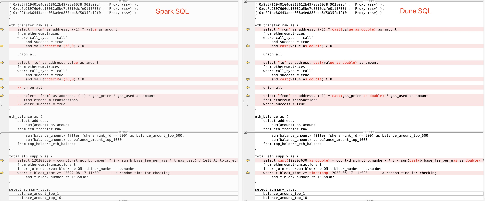

# 15 Introduction to Dune SQL Query Engine

Dune has officially launched its team's self-developed query engine, Dune SQL, based on Trino ([https://trino.io/](https://trino.io/)<a id="jump_8"></a>). This article introduces some common query syntax, considerations, and details of Dune SQL.

Note: as Dune has announced that it will fully transition to the Dune SQL query engine from the second half of 2023, this tutorial upgrades all the original Query to the Dune SQL version.

## Dune SQL Syntax Overview

There are several key points to note in the syntax of Dune SQL:

* Dune SQL uses double quotation marks to quote field names or table names that contain special characters or are keywords, such as `"from"` or `"to"`.
* The string type in Dune SQL is `varchar`, and the commonly used numeric types are `double` and `decimal(38, 0)`.
* Dune SQL does not support implicit type conversions. For example, in Dune SQL, you cannot directly compare `'2022-10-01'` with block_time; you need to use functions like `date('2022-10-01')` to explicitly convert it to a date before comparison. You cannot directly concatenate numeric types and strings; you need to use `cast(number_value as varchar)` to convert them to strings before concatenation.

The Dune documentation provides a detailed syntax comparison table. You can refer to the [Syntax Comparison](https://dune.com/docs/query/syntax-differences#syntax-comparison)<a id="jump_8"></a>  for more information. The following shows a partial comparison of the differences:


## Dune SQL Examples

### Dune SQL uses double quotation marks to quote special field names and table names

Dune SQL uses double quotation marks for this purpose

``` sql
select "from" as address, gas_price, gas_used
from ethereum.transactions
where success = true
limit 10
```

### Date and Time

Dune SQL does not support implicit conversion of string-formatted date values to datetime types. Explicit conversion must be used. Date and time functions or operators can be utilized for this purpose.

1. Using Date Values

Dune SQL utilizes the date() function

``` sql
select block_time, hash, "from" as address, "to" as contract_address
from ethereum.transactions
where block_time >= date('2022-12-18')
limit 10
```
2. Using Date and Time Values

Dune SQL employs the timestamp operator

``` sql
select block_time, hash, "from" as address, "to" as contract_address
from ethereum.transactions
where block_time >= timestamp '2022-12-18 05:00:00'
limit 10
```

3. Using Interval

Dune SQL utilizes the `interval '12' hour` syntax

``` sql
select block_time, hash, "from" as address, "to" as contract_address
from ethereum.transactions
where block_time >= now() - interval '12' hour
limit 10
```

### Address and Transaction Hash

In Dune SQL queries, addresses and hash values can be used without enclosing them in single quotes. In this case, the case sensitivity is not enforced and there is no need to explicitly convert them to lowercase.

``` sql
select block_time, hash, "from" as address, "to" as contract_address
from ethereum.transactions
where block_time >= date('2022-12-18') and block_time < date('2022-12-19')
    and (
        hash = 0x2a5ca5ff26e33bec43c7a0609670b7d7db6f7d74a14d163baf6de525a166ab10
        or "from" = 0x76BE685c0C8746BBafECD1a578fcaC680Db8242E
        )
```

### Dune SQL's String Type varchar and Numeric Type double

In Dune SQL, the string type is `varchar` and the commonly used numeric type is `double`. Integer values in Dune SQL are default to the `bigint` type. When performing multiplication with large numbers, it is prone to overflow errors. In such cases, you can forcefully convert them to `double` type or `decimal(38, 0)` type. Integer division in Dune SQL does not implicitly convert to a floating-point number and perform division; instead, it directly returns an integer. This aspect should also be taken into consideration.

1. Converting to String

Dune SQL

``` sql
select block_time, hash, "from" as address, "to" as contract_address,
    cast(value / 1e9 as varchar) || ' ETH' as amount_value,
    format('%,.2f', value / 1e9) || ' ETH' as amount_value_format
from ethereum.transactions
where block_time >= date('2022-12-18') and block_time < date('2022-12-19')
    and (
        hash = 0x2a5ca5ff26e33bec43c7A0609670b7d7db6f7d74a14d163baf6de525a166ab10
        or "from" = 0x76BE685c0C8746BBafECD1a578fcaC680Db8242E
        )
```

Checking the SQL output above, you can see that when casting a large or small number directly to a string using cast(), it is displayed in scientific notation, which may not be desirable. However, it is recommended to use the `format()` function, which allows for precise control over the output string format.

2. Converting to Numeric Values

Note that the type of the `value` is string in the table `erc20_ethereum.evt_Transfer`. You can use the `cast()` to convert it to the double or decimal(38, 0) numeric types.

``` sql
select evt_block_time, evt_tx_hash, "from", "to", 
    cast(value as double) as amount,
    cast(value as decimal(38, 0)) as amount2
from erc20_ethereum.evt_Transfer
where evt_block_time >= date('2022-12-18') and evt_block_time < date('2022-12-19')
    and evt_tx_hash in (
        0x2a5ca5ff26e33bec43c7a0609670b7d7db6f7d74a14d163baf6de525a166ab10,
        0xb66447ec3fe29f709c43783621cbe4d878cda4856643d1dd162ce875651430fc
    )
```

### Explicit Type Conversion

As mentioned earlier, Dune SQL does not support implicit type conversion. When we compare or perform operations on values of different types, it is necessary to ensure that they are of the same (compatible) data type. If they are not, explicit type conversion should be performed using relevant functions or operators. Otherwise, type mismatch errors may occur. Here's another simple example:

Without type conversion, the following SQL will result in an error in Dune SQL:

``` sql
select 1 as val
union all
select '2' as val
```

Explicit type conversion allows for the execution as the following in Dune SQL:

``` sql
select 1 as val
union all
select cast('2' as int) as val
```

When encountering errors like "Error: Line 47:1: column 1 in UNION query has incompatible types: integer, varchar(1) at line 47, position 1," it is necessary to address the type compatibility issues of the respective fields.

### Converting to double type to resolve numeric range overflow errors

Dune SQL supports integer types such as `int` and `bigint`. However, numeric values can often be very large due to the lack of support for decimals in blockchain systems like EVM. For example, we may encounter errors related to numeric overflow when calculating gas fees. In the following SQL, we intentionally cause an error by multiplying the calculated gas fee by 1000:

``` sql
select hash, gas_price * gas_used * 1000 as gas_fee
from ethereum.transactions 
where block_time >= date('2022-12-18') and block_time < date('2022-12-19')
order by gas_used desc
limit 10
```

Executing the above SQL will result in an error:

``` sql
Error: Bigint multiplication overflow: 15112250000000000 * 1000.
```

To avoid type overflow errors, we can explicitly convert the first parameter to double type. The following SQL will execute correctly:

``` sql
select hash, cast(gas_price as double) * gas_used * 1000 as gas_fee
from ethereum.transactions 
where block_time >= date('2022-12-18') and block_time < date('2022-12-19')
order by gas_used desc
limit 10
```

### Converting to double type resolves the issue of integer division not returning decimal places

Similarly, if two values are of bigint type and their division is performed, the result will be truncated to an integer and discarded the decimal portion. To obtain the decimal portion in the result, the dividend should be explicitly converted to double type.

``` sql
select hash, gas_used, gas_limit,
    gas_used / gas_limit as gas_used_percentage
from ethereum.transactions 
where block_time >= date('2022-12-18') and block_time < date('2022-12-19')
limit 10
```

Executing the above SQL, the value of gas_used_percentage will be either 0 or 1, and the decimal part will be discarded and rounded up. Clearly, this is not the desired outcome. By explicitly converting the dividend gas_used to double type, we can obtain the correct result:

``` sql
select hash, gas_used, gas_limit,
    cast(gas_used as double) / gas_limit as gas_used_percentage
from ethereum.transactions 
where block_time >= date('2022-12-18') and block_time < date('2022-12-19')
limit 10
```

### Converting from Hexadecimal to Decimal

Dune SQL defines a set of new functions to handle the conversion of varbinary type strings to decimal numeric values. The string must start with the prefix `0x`.

``` sql
select bytearray_to_uint256('0x00000000000000000000000000000000000000000000005b5354f3463686164c') as amount_raw
```

For detailed assistance, please refer: [Byte Array to Numeric Functions](https://dune.com/docs/query/DuneSQL-reference/Functions-and-operators/varbinary/#byte-array-to-numeric-functions)<a id="jump_8"></a>.

### Generating Numeric Sequences and Date Sequences

1. Numeric Sequences

The syntax for generating numeric sequences in Dune SQL is as follows:

``` sql
select num from unnest(sequence(1, 10)) as t(num)
-- select num from unnest(sequence(1, 10, 2)) as t(num) -- step 2
```

2. Date Sequences

Dune SQL utilizes the `unnest()` in conjunction with `sequence()` to generate date sequence values and convert them into multiple rows of records.

The syntax for generating date sequences in Dune SQL is as follows:

``` sql
select block_date from unnest(sequence(date('2022-01-01'), date('2022-01-31'))) as s(block_date)
-- select block_date from unnest(sequence(date('2022-01-01'), date('2022-01-31'), interval '7' day)) as s(block_date)
```

### Array Queries

1. Dune SQL utilizes the `cardinality()` to query the size of an array.

    The syntax for array queries in Dune SQL is as follows:

    ``` sql
    select evt_block_time, evt_tx_hash, profileIds
    from lens_polygon.LensHub_evt_Followed
    where cardinality(profileIds) = 2
    limit 10
    ```

2. Dune SQL's array indexing starts counting from 1.

    Accessing Array Elements in Dune SQL:

    ``` sql
    select evt_block_time, evt_tx_hash, profileIds,
        profileIds[1] as id1, profileIds[2] as id2
    from lens_polygon.LensHub_evt_Followed
    where cardinality(profileIds) = 2
    limit 10
    ```

3. Splitting Array Elements into Multiple Rows of Records

    Splitting array elements into multiple rows of records in Dune SQL:

    ``` sql
    select evt_block_time, evt_tx_hash, profileIds,	tbl.profile_id
    from lens_polygon.LensHub_evt_Followed
    cross join unnest(profileIds) as tbl(profile_id)
    where cardinality(profileIds) = 3
    limit 20
    ```

4. Splitting Multiple Array Fields into Multiple Rows of Records
    To split multiple array fields into multiple rows (assuming they have the same length), Dune SQL can include multiple fields within the `unnest()` and output corresponding fields simultaneously.

    Splitting multiple array elements into multiple rows in Dune SQL:

    ``` sql
    SELECT evt_block_time, evt_tx_hash, ids, "values", tbl.id, tbl.val
    FROM erc1155_polygon.evt_TransferBatch
    cross join unnest(ids, "values") as tbl(id, val)
    WHERE evt_tx_hash = 0x19972e0ac41a70752643b9f4cb453e846fd5e0a4f7a3205b8ce1a35dacd3100b
    AND evt_block_time >= date('2022-12-14')
    ```

## Migrating Queries from Spark SQL to Dune SQL - Example

It is a straightforward process to migrate queries written in the existing Spark SQL engine to Dune SQL. You can directly access the Edit interface of the query and switch to "1. v2 Dune SQL" from the left dropdown menu of datasets. Then, make the necessary adjustments to the query content, as described in the previous sections of this article. Here's an example:

Spark SQL Version: [https://dune.com/queries/1773896](https://dune.com/queries/1773896)<a id="jump_8"></a>
Dune SQL Version: [https://dune.com/queries/1000162](https://dune.com/queries/1000162)<a id="jump_8"></a>

Here is a comparison of the modifications during the migration:



## Other Features

Dune SQL also has a potential advanced feature that allows querying based on a saved query (Query of Query). This feature offers a lot of possibilities for simplifying query logic and optimizing cache usage. For example, you can save the base part of a complex query as a query itself and then perform further aggregation and analysis based on that query. However, this feature may still be unstable at times. Nevertheless, you can give it a try.

``` sql
-- original query: https://dune.com/queries/1752041
select * from query_1752041
where user_status = 'Retained'
```


``` sql
-- original query: https://dune.com/queries/1752041
select * from query_1752041
where user_status = 'Churned'
```

## Reference Links

1. [Syntax and operator differences](https://dune.com/docs/query/syntax-differences/#syntax-and-operator-differences)<a id="jump_8"></a>
2. [Trino Functions and Operators](https://trino.io/docs/current/functions.html)<a id="jump_8"></a>

## About Us

`Sixdegree` is a professional onchain data analysis team Our mission is to provide users with accurate onchain data charts, analysis, and insights. We are committed to popularizing onchain data analysis. By building a community and writing tutorials, among other initiatives, we train onchain data analysts, output valuable analysis content, promote the community to build the data layer of the blockchain, and cultivate talents for the broad future of blockchain data applications. Welcome to the community exchange!

- Website: [sixdegree.xyz](https://sixdegree.xyz)
- Email: [contact@sixdegree.xyz](mailto:contact@sixdegree.xyz)
- Twitter: [twitter.com/SixdegreeLab](https://twitter.com/SixdegreeLab)
- Dune: [dune.com/sixdegree](https://dune.com/sixdegree)
- Github: [https://github.com/SixdegreeLab](https://github.com/SixdegreeLab)