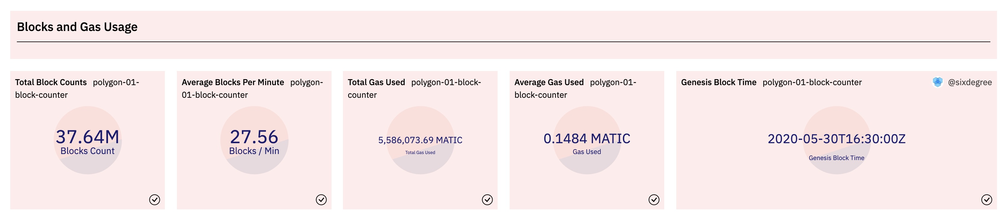
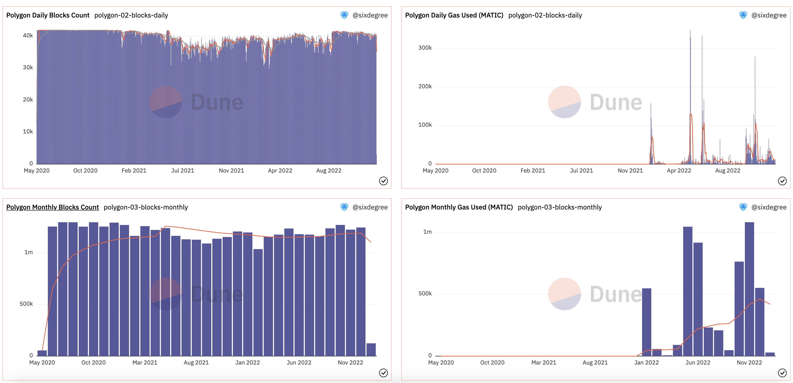
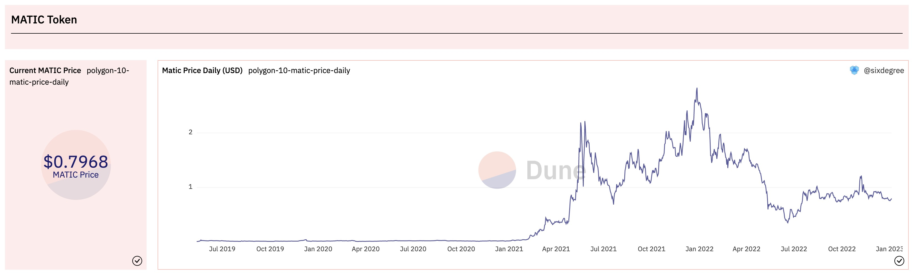
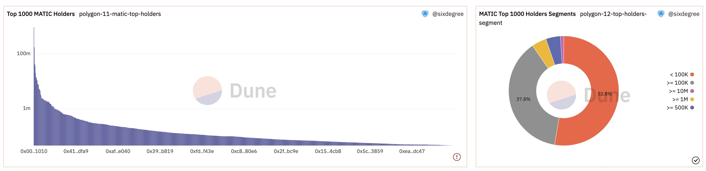
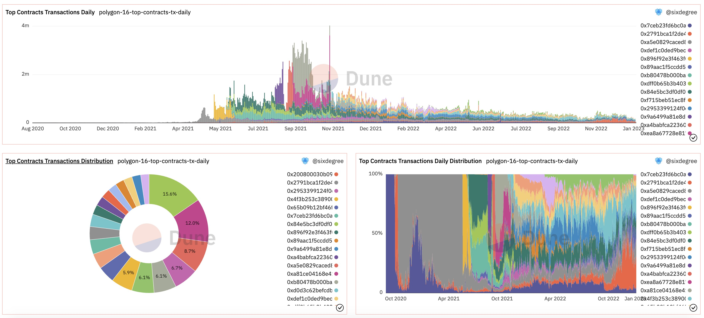
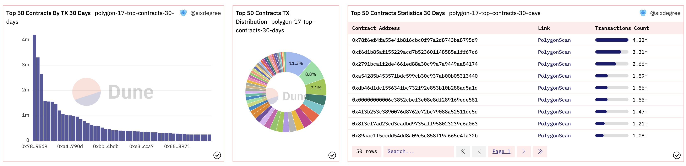

# 16 Analysis of the Polygon Chain Overview

Dune platform has been developing rapidly and currently supports 10 mainstream blockchains, including Layer 1 public chains such as Ethereum, BNB, Polygon, Fantom, and Layer 2 blockchains such as Arbitrum and Optimism that are dedicated to expanding Ethereum. In this tutorial, we will explore how to start analyzing the overview of a blockchain, taking the Polygon blockchain as an example.

Polygon's motto is "Bringing Ethereum to Everyone." Polygon believes that everyone can use Web3. It is a decentralized Ethereum scaling platform that enables developers to build scalable and user-friendly DApps with low transaction fees without compromising security.

Dashboard for this tutorial: [Polygon Chain Overview](https://dune.com/sixdegree/polygOnchain-overview)<a id="jump_8"></a>

## Contents of the Blockchain Overview Analysis

Our goal is to comprehensively analyze the entire Polygon Chain to understand its current development status. The analysis includes:

* **Block Analysis**: total number of blocks, blocks mined per minute, total gas consumption, average gas consumption, daily (monthly) trend of block generation quantity, etc.
* **Transaction and User Analysis**: total transaction volume, total number of users, transaction quantity per block, comparison of successful and failed transactions, daily (monthly) trend of transaction quantity, daily (monthly) trend of active users, daily (monthly) trend of new users, comparison of new users and active users, etc.
* **Native Token MATIC Analysis**: total circulation supply, holder analysis, top holders, price trend, etc.
* **Smart Contract Analysis**: total deployed smart contracts, daily (monthly) trend of new contract deployments, comparison of transaction volume for the most popular smart contracts, and analysis of development trends.

## Block and Gas Consumption Analysis

### Total Number of Blocks and Gas Consumption

To understand the total number of blocks and gas consumption in the Polygon Chain, we can write a simple SQL to retrieve the following information: the total number of blocks, the timestamp of the genesis block, the average number of new blocks per minute, the total gas consumption, and the average gas consumption per block.

``` sql
select count(*) / 1e6 as blocks_count,
   min(time) as min_block_time,
   count(*) / ((to_unixtime(Now()) - to_unixtime(min(time))) / 60) as avg_block_per_minute,
   sum(gas_used * coalesce(base_fee_per_gas, 1)) / 1e18 as total_gas_used,
   avg(gas_used * coalesce(base_fee_per_gas, 1)) / 1e18 as average_gas_used
from polygon.blocks
```

SQL explanation:

1. By using the `to_unixtime()`, we can convert date and time to Unix Timestamp values, which allows us to calculate the number of seconds between two date and time values. We can then use this to calculate the average number of new blocks per minute. The corresponding function is `from_unixtime()`.
2. `gas_used` represents the amount of gas consumed, and `base_fee_per_gas` is the unit price per gas. Multiplying them together gives us the gas cost. The native token of Polygon, MATIC, has 18 decimal places, so dividing by 1e18 gives us the final MATIC amount.

The results of this query can be added as Counter-type visualizations and included in a dashboard. The display is as follows:



Query link:[https://dune.com/queries/1835390](https://dune.com/queries/1835390)<a id="jump_8"></a>

### Daily (Monthly) New Block Generation Trend and Gas Consumption

We can aggregate by date to calculate the daily number of generated blocks and the corresponding gas consumption. To track the change, we first define a CTE to perform daily data statistics. Then, based on this CTE, we use a window function such as avg`(blocks_count) over (order by rows between 6 preceding and current row)` to calculate the 7-day moving average. The SQL is as follows:

``` sql
with block_daily as (
    select date_trunc('day', time) as block_date,
        count(*) as blocks_count,
        sum(gas_used * coalesce(base_fee_per_gas, 1)) / 1e18 as gas_used
    from polygon.blocks
    group by 1
)

select block_date,
    blocks_count,
    gas_used,
    avg(blocks_count) over (order by block_date rows between 6 preceding and current row) as ma_7_days_blocks_count,
    avg(blocks_count) over (order by block_date rows between 29 preceding and current row) as ma_30_days_blocks_count,
    avg(gas_used) over (order by block_date rows between 6 preceding and current row) as ma_7_days_gas_used
from block_daily
order by block_date
```

Add two Bar Chart for the query, displaying "Daily Block Count, 7-day Moving Average, and 30-day Moving Average Block Count" and "Daily Gas Consumption Total and 7-day Moving Average" values. Add them to the dashboard.

Make a Fork of the above query, and modify it slightly to calculate the monthly statistics. Also, change the moving average to consider a period of 12 months. This will give us the monthly new block generation trend.

The visualizations of the two SQL queries added to the dashboard will have the following display. We can observe that the number of new blocks generated remains relatively stable, but the gas fees have significantly increased since 2022, with a brief decline in between and currently approaching the previous high.



Query Link:
* [https://dune.com/queries/1835421](https://dune.com/queries/1835421)<a id="jump_8"></a>
* [ttps://dune.com/queries/1835445](ttps://dune.com/queries/1835445)<a id="jump_8"></a>

## Transaction and User Analysis
### Total Transaction Volume and User Count

We want to calculate the total number of transactions and the total number of unique user addresses. A CTE can be difined to combine the sender addresses `from` and receiver addresses `to` using the UNION ALL, and then count the distinct addresses. It's important to note that we're not excluding contract addresses in this analysis. If you wish to exclude contract addresses, you can add a subquery to exclude those addresses found in the `polygon.creation_traces` table. Since the data volume is large, we'll represent the values in millions (M). Add a Counter visualization chart for each metric and include them in the dashboard.

``` sql
with transactions_detail as (
    select block_time,
        hash,
        "from" as address
    from polygon.transactions

    union all

    select block_time,
        hash,
        "to" as address
    from polygon.transactions
)

select count(distinct hash) / 1e6 as transactions_count,
    count(distinct address) / 1e6 as users_count
from transactions_detail
```

Query Link:
* [https://dune.com/queries/1836022](https://dune.com/queries/1836022)<a id="jump_8"></a>

### Daily (Monthly) Transaction and Active User Analysis

Similarly, by grouping the data by date, we can generate reports for daily transaction volume and the number of active users. By summarizing the data on a monthly basis, we can obtain monthly insights. Below is the SQL query for daily aggregation:

``` sql
with transactions_detail as (
    select block_time,
        hash,
        "from" as address
    from polygon.transactions

    union all

    select block_time,
        hash,
        "to" as address
    from polygon.transactions
)

select date_trunc('day', block_time) as block_date,
    count(distinct hash) as transactions_count,
    count(distinct address) as users_count
from transactions_detail
group by 1
order by 1
```

Add Bar Chart for both daily and monthly transaction data, displaying transaction count and active user count. You can use a secondary Y-axis for the active user count, and choose either Line or Area chart. The resulting visualization on the dashboard would be the following:


Query Link:
* [https://dune.com/queries/1835817](https://dune.com/queries/1835817)<a id="jump_8"></a>
* [ttps://dune.com/queries/1836624](ttps://dune.com/queries/1836624)<a id="jump_8"></a>

### Active User and New User Statistics Analysis

For a public blockchain, the growth trend of new users is a critical analysis that reflects the popularity of the chain. We can start by identifying the first transaction date for each address (`users_initial_transaction` CTE in the query below) and then use it to calculate the number of new users per day. By associating the daily active user data with the daily new user data, we can create a comparative chart. The number of active users for a given day can be obtained by subtracting the number of new users on that day from the daily active user count. Considering the possibility of no new users on certain dates, we use a LEFT JOIN and the `coalesce()` to handle potential null values. The SQL query is as follows:

``` sql
with users_details as (
    select block_time,
        "from" as address
    from polygon.transactions
    
    union all
    
    select block_time,
        "to" as address
    from polygon.transactions
),

users_initial_transaction as (
    select address,
        min(date_trunc('day', block_time)) as min_block_date
    from users_details
    group by 1
),

new_users_daily as (
    select min_block_date as block_date,
        count(address) as new_users_count
    from users_initial_transaction
    group by 1
),

active_users_daily as (
    select date_trunc('day', block_time) as block_date,
        count(distinct address) as active_users_count
    from users_details
    group by 1
)

select u.block_date,
    active_users_count,
    coalesce(new_users_count, 0) as new_users_count,
    active_users_count - coalesce(new_users_count, 0) as existing_users_count
from active_users_daily u
left join new_users_daily n on u.block_date = n.block_date
order by u.block_date
```

FORK this daily user statistics query, adjust the date to monthly statistics using `date_trunc('month', block_time)`. This will enable us to calculate the number of active users and new users per month.

For these two queries, we can add the following visualizations:

1. Bar Chart: display the daily (or monthly) count of active users and new users. Since the proportion of new users is relatively low, set it to use the secondary Y-axis.
2. Area Chart: compare the proportion of new users and existing users.

Adding these visualizations to the dashboard will result in the following display:


Query link:
* [https://dune.com/queries/1836744](https://dune.com/queries/1836744)<a id="jump_8"></a>
* [ttps://dune.com/queries/1836854](ttps://dune.com/queries/1836854)<a id="jump_8"></a>

## Native Token Analysis
### MATIC Price Trend

Dune's Spells `prices.usd` provides price of Polygon chain tokens, including the native token MATIC. Therefore, we can directly calculate the average price on a daily basis.

``` sql
select date_trunc('day', minute) as block_date,
    avg(price) as price
from prices.usd
where blockchain = 'polygon'
    and symbol = 'MATIC'
group by 1
order by 1
```

Since the query results are sorted in ascending order by date, the last record represents the average price for the most recent date, which can be considered as the "current price". We can generate a Counter chart for it, setting the "Row Number" value to "-1" to retrieve the value from the last row. Additionally, we can add a Line to display the daily average price for the MATIC token. After adding these charts to the dashboard, the display will be as shown below:



Query link:
* [https://dune.com/queries/1836933](https://dune.com/queries/1836933)<a id="jump_8"></a>

### Addresses with the highest holdings of the MATIC token

Addresses with the highest holdings of the MATIC token are of interest to us, as they often have the potential to influence the token's price movements. The following query retrieves the top 1000 addresses. `MATIC` is the native token of the Polygon chain and the details of its transfers are stored in the `polygon.traces` table.  Please note that we haven't differentiated between contract and non-contract addresses in this query. Due to the low transaction gas fees on Polygon, we have omitted the calculation of gas consumption for performance reasons.

``` sql
with polygon_transfer_raw as (
    select "from" as address, (-1) * cast(value as decimal) as amount
    from polygon.traces
    where call_type = 'call'
        and success = true
        and value > uint256 '0'
    
    union all
    
    select "to" as address, cast(value as decimal) as amount
    from polygon.traces
    where call_type = 'call'
        and success = true
        and value > uint256 '0'
)

select address,
    sum(amount) / 1e18 as amount
from polygon_transfer_raw
group by 1
order by 2 desc
limit 1000
```

Considerations in the above query: the `value` in the `polygon.traces` is of type `uint256`, which is a custom type in Dune SQL. If you directly compare it with the numerical value 0, you will encounter a type mismatch error that prevents comparison. Therefore, we use syntax like `uint256 '0'` to convert the value 0 into the same type for comparison. Alternatively, you can use type conversion functions like `cast(0 as uint256)`. You can also convert the `value` to double, decimal, bigint, or other types before comparison, but in such cases, be mindful of potential data overflow issues.

We can further analyze the distribution of MATIC token holdings among the top 1000 addresses based on the above query. We can fork the previous query and make slight modifications to achieve this.

``` sql
with polygon_transfer_raw as (
    -- same as above
),

polygon_top_holders as (
    select address,
        sum(amount) / 1e18 as amount
    from polygon_transfer_raw
    group by 1
    order by 2 desc
    limit 1000
)

select (case when amount >= 10000000 then '>= 10M'
             when amount >= 1000000 then '>= 1M'
             when amount >= 500000 then '>= 500K'
             when amount >= 100000 then '>= 100K'
             else '< 100K'
        end) as amount_segment,
    count(*) as holders_count
from polygon_top_holders
group by 1
order by 2 desc
```

Generate a Bar Chart and a Pie Chart for the above two queries respectively. Add them to the dashboard, and the display is as follows:



Query link:
* [https://dune.com/queries/1837749](https://dune.com/queries/1837749)<a id="jump_8"></a>
* [ttps://dune.com/queries/1837150](ttps://dune.com/queries/1837150)<a id="jump_8"></a>
* [ttps://dune.com/queries/1837781](ttps://dune.com/queries/1837781)<a id="jump_8"></a>

## Smart Contract Analysis
### Number of Created and Suicided Contracts

``` sql
select type,
    count(*) / 1e6 as transactions_count
from polygon.traces
where type in ('create', 'suicide')
    and block_time >= date('2023-01-01') -- Date conditions are added here for performance considerations
group by 1
order by 1
```

Since we have restricted the values of the `type` and specified the sorting order, we can ensure that two records are returned and their order is fixed. Therefore, we can generate Counter-type visualizations for the values in the first and second rows respectively.

Query link:
* [https://dune.com/queries/1837749](https://dune.com/queries/1837749)<a id="jump_8"></a>

### Daily (Monthly) Contract Created and Suicided Count

We can calculate the daily (monthly) count of newly created and suicided contracts by date. Considering the cumulative count is also valuable, we first use a CTE to calculate the daily count, and then use the window function `sum() over (partition by type order by block_date)` to calculate the cumulative count by date. The `partition by type` is used to specify separate aggregations based on the contract type.

``` sql
with polygon_contracts as (
    select date_trunc('day', block_time) as block_date,
        type,
        count(*) as transactions_count
    from polygon.traces
    where type in ('create', 'suicide')
    group by 1, 2
)

select block_date, 
    type,
    transactions_count,
    sum(transactions_count) over (partition by type order by block_date) as accumulate_transactions_count
from polygon_contracts
order by block_date
```

Similarly, we can adjust the date to monthly and calculate the count of newly created and suicided contracts on a monthly basis.

The above queries generate Bar Chart and Area Chart respectively. After adding them to the dashboard, the resulting display is as follows:


Query link:
* [https://dune.com/queries/1837749](https://dune.com/queries/1837749)<a id="jump_8"></a>
* [ttps://dune.com/queries/1837144](ttps://dune.com/queries/1837150)<a id="jump_8"></a>
* [ttps://dune.com/queries/1837781](ttps://dune.com/queries/1837781)<a id="jump_8"></a>
### Transaction Count Statistics for Top Smart Contracts

The top smart contracts in each blockchain usually generate the majority of transaction counts. We can analyze the top 100 smart contracts with the highest transaction counts. In the output results, we have added a link field for convenience, allowing you to directly query the transaction list for each smart contract by clicking on the link.

``` sql
with contract_summary as (
    select "to" as contract_address,
        count(*) as transaction_count
    from polygon.transactions
    where success = true
    group by 1
    order by 2 desc
    limit 100
)

select contract_address,
    '<a href=https://polygonscan.com/address/' || cast(contract_address as varchar) || ' target=_blank>PolygonScan</a>' as link,
    transaction_count
from contract_summary
order by transaction_count desc
```

Generating a Bar Chart and a Table Chart for this query. Adding them to the dashboard, the display is as follows:


Query link:
* [https://dune.com/queries/1838001](https://dune.com/queries/1838001)<a id="jump_8"></a>

### Analysis of Daily Transaction Volume for the Most Active Smart Contracts

We can analyze the daily transaction volume for the top smart contracts with the highest cumulative transaction count. This can provide insights into the popularity and lifespan of different smart contracts in different stages. Given the large amount of data, we will only analyze the top 20 contracts.

``` sql
with top_contracts as (
    select "to" as contract_address,
        count(*) as transaction_count
    from polygon.transactions
    where success = true
    group by 1
    order by 2 desc
    limit 20
)

select date_trunc('day', block_time) as block_date, 
    contract_address,
    count(*) as transaction_count
from polygon.transactions t
inner join top_contracts c on t."to" = c.contract_address
group by 1, 2
order by 1, 2
```

We first query the top 20 smart contracts with the highest historical transaction volume. Then, we calculate the daily transaction volume for these smart contracts. We add three different types of visualizations for the query:

1. Bar Chart: displays the daily transaction volume for different smart contracts, stacked together.
2. Area Chart: displays the daily transaction volume for different smart contracts, stacked together. We set "Normalize to percentage" to adjust the chart to display in percentages.
3. Pie Chart: compares the cumulative transaction volume percentages for these top 20 smart contracts.

After adding these charts to the dashboard, the result is shown in the following:



Query link:
* [https://dune.com/queries/1838060](https://dune.com/queries/1838060)<a id="jump_8"></a>

### The most active smart contracts in the last 30 days

In addition to analyzing all historical transaction data, we can also perform a simple analysis on the most active smart contracts in recent. For example, we can analyze the top 50 smart contracts that have been the most active in the last 30 days.

``` sql
select "to" as contract_address,
    '<a href=https://polygonscan.com/address/' || cast("to" as varchar) || ' target=_blank>PolygonScan</a>' as link,
    count(*) as transaction_count
from polygon.transactions
where block_time >= now() - interval '30' day
group by 1, 2
order by 3 desc
limit 50
```

As it is a recent active projects, it may have been newly deployed and launched. Therefore, we have added hyperlinks to the query and created a Table. The display is as follows:



Query link:
* [https://dune.com/queries/1838077](https://dune.com/queries/1838077)<a id="jump_8"></a>

## Summary

Above, we have conducted a preliminary analysis of the Polygon Chain from several aspects, including blocks, gas consumption, transactions, users, native tokens, and smart contracts. Through this dashboard, we can gain a general understanding of the Polygon chain. In particular, through the analysis of top smart contracts, we can identify popular projects. This allows us to choose specific projects of interest for further analysis.

So far, SixdegreeLab has completed overview analyses for multiple blockchains, which you can find here:

* [Blockchain Overview Series](https://dune.com/sixdegree/blockchain-overview-series)<a id="jump_8"></a>

## About Us

`Sixdegree` is a professional onchain data analysis team Our mission is to provide users with accurate onchain data charts, analysis, and insights. We are committed to popularizing onchain data analysis. By building a community and writing tutorials, among other initiatives, we train onchain data analysts, output valuable analysis content, promote the community to build the data layer of the blockchain, and cultivate talents for the broad future of blockchain data applications. Welcome to the community exchange!

- Website: [sixdegree.xyz](https://sixdegree.xyz)
- Email: [contact@sixdegree.xyz](mailto:contact@sixdegree.xyz)
- Twitter: [twitter.com/SixdegreeLab](https://twitter.com/SixdegreeLab)
- Dune: [dune.com/sixdegree](https://dune.com/sixdegree)
- Github: [https://github.com/SixdegreeLab](https://github.com/SixdegreeLab)