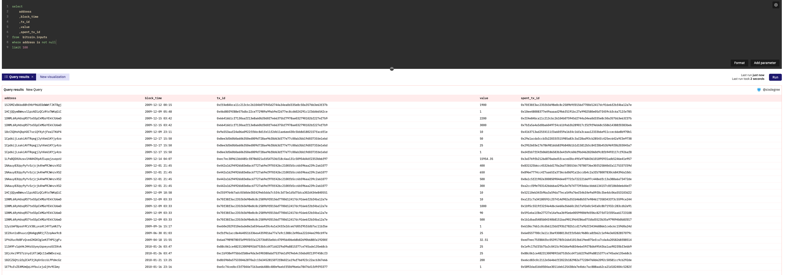
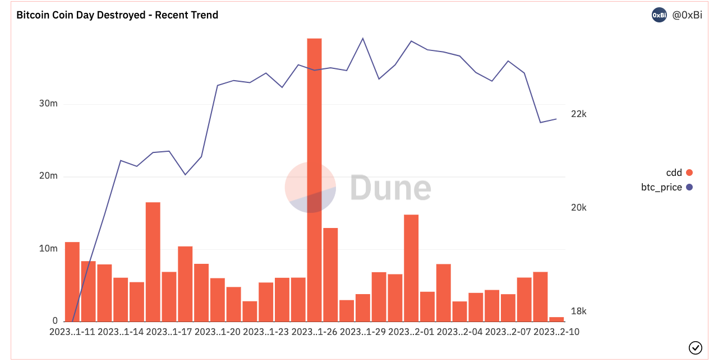

# 21 Bitcoin Analysis
## Introduction to the BTC CDD

### Explanation of the Indicator

CDD stands for Coin Day Destroyed. It is an improved version of the Transaction Volume, with the improvement aimed at considering time in evaluating Onchain activities (Transfers). For tokens that have been in a HODL (Hold On for Dear Life) status for a long time (not transferred to other wallets), a larger weight is given to their movements.

Here we introduce a new concept called Coin Day. `Coin Day = Token Quantity * Number of days the Token is in HODL status`.

All BTC Onchain accumulates Coin Days every day. If a portion of BTC moves (from Wallet A to Wallet B), the accumulated Coin Days for this portion will be destroyed, which is the so-called Coin Day Destroyed.     

    

### Underlying Logic

All indicators are designed to better depict the conditions we want to reflect. In the case of this indicator, it aims to reflect the behavior of long-term holders. From this perspective, it can be considered a Smart Money type of indicator. People tend to think that long-term holders are early participants in BTC, and thus, they have a better and more experienced understanding of BTC and the market. If their tokens (long-term HODL) move, it may very well be that some changes in the market have prompted them to take action (in many cases, this means moving to an exchange or selling through OTC, but there are other scenarios as well, so it can't be generalized).

If you frequently use Glassnode, you'll find that many indicators on Glassnode are designed based on the above logic, which can be considered one of the most important underlying logics in the current BTC Onchain data analysis.

### UTXO Mechanism

Here we need to introduce a basic knowledge about BTC: the UTXO mechanism. Understanding it will help you understand how to use the several tables about BTC on Dune to complete the above calculation.

UTXO stands for Unspent Transaction Output. In the current operation mechanism of BTC, there is actually no concept of Balance. The balance of each wallet is obtained by summing the BTC amounts contained in all UTXOs owned by the wallet.

Here's a link to an article that explains it quite well: https://www.liaoxuefeng.com/wiki/1207298049439968/1207298275932480

## Related Tables in Dune

If you can roughly understand the concepts of Input, Output, and UTXO, it's easy to understand the two tables we need to use on Dune. Here's a brief explanation of the tables and fields we need to use.

### bitcoin.inputs

- Explanation: contains all data related to Input, i.e., for each address, each BTC expenditure/transfer
- Key Fields
  - `address`: wallet address
  - `block_time`: the time when this transfer Transaction occurred
  - `tx_id`: the Tx ID of this transfer Transaction
  - `value`: the BTC amount included in this transfer Transaction
  - `spent_tx_id`: the output that generated this Input (Which incoming payment was used for this expenditure)
    
       

### bitcoin.outputs

- Explanation: contains all data related to Output, i.e., for each address, each BTC incoming record.
- Key Fields
  - `address`: wallet address
  - `block_time`: the time when this incoming Transaction occurred
  - `tx_id`: the Tx id of this incoming Transaction
  - `value`: the BTC amount included in this incoming Transaction
  
    

## Dashboard Design and Implementation

### How to Design a Dashboard
#### General Approach

The design of a Dashboard depends on the final purpose of using it. The ultimate goal of a Dashboard or data is to assist in decision-making. In our view, data can aid decision-making by answering the following two questions. Only if these two questions can be effectively answered, can it be considered a qualified Dashboard.

`[a].`What is XXX? What are its characteristics?

This involves using a series of indicators to reflect the basic characteristics and current status of something (e.g., daily user volume, tx number, and new contract number for Ethereum, etc.).

`[b].`What is the cause for the change in some important indicators reflecting XXX characteristics?

When the indicators in `[a]` change, we analyze the cause of the change, or in other words, look for the reason for the data fluctuation.

#### Fluctuation Analysis

`[a]` is relatively easy to understand, so we won't go into it. The quality of indicator system design depends on your understanding of the thing itself. Each industry or each sub-field within each industry is actually different.

We can discuss the analysis of fluctuations. In my view, analyzing fluctuations is about decomposition. In general, a fluctuation in an indicator can be decomposed from two angles. Here, taking the daily burning quantity of Ethereum as an example, suppose that the destruction of Ethereum increased by 30% one day, how should we analyze it?

**1. Process of the thing's formation**

`Today's ETH burning = Total gas fee consumed today * Burn rate`

- `Total gas fee consumed today = Average gas fee consumed per tx today * Number of tx today`
  - `Number of tx today = Number of active Ethereum users today * Average number of tx issued by active Ethereum users today`
    - `Number of active Ethereum users today = Total number of Ethereum users * Active ratio today`
- `Burn rate: Depends on EIP1559 or whether there are new proposals`    

    

**2. Characteristics of the thing itself**

- Time: distinguish by hour to see which hour of the 24 hours had an increase in gas fee consumption or if it was a general increase across all hours.
- Space: if the IP of each initiating wallet could be obtained, we could see whether gas fee consumption in a certain country increased significantly (not possible in practice).
- Other characteristics: whether it was the gas fee consumption of EOA addresses or contract addresses that increased.
  - If it's an EOA address, whether it was caused by Bot or ordinary EOA addresses; if it's ordinary EOA addresses, whether it was caused by whales or ordinary wallets.
  - If it's a contract address, which type of project (Defi, Gamefi, etc.) had an increase in contract gas fee consumption; if it's a Gamefi project, which specific contract caused it.

The above are two categories of decomposition approaches. By decomposing the main indicator into sub-indicators layer by layer, we can better observe which fluctuations in the sub-indicators caused the fluctuation in the main indicator, and then infer the root cause.

### Design of the Bitcoin - Coin Day Destroyed Dashboard

Back to the main topic, we'll start designing the Bitcoin - Coin Day Destroyed Dashboard.

#### Overall Situation

First, we need a chart to reflect the overall situation. Since there's only the CDD as an indicator, which is quite simple, I've only included a historical trend chart.    

    

However, the time period of this chart is too long and it's difficult to clearly see recent changes in CDD from this chart. Therefore, I've added a trend for the recent period.

     

P.S. Here, you can still see a significant CDD abnormality before this round of downturn.

#### Fluctuation Analysis

Here, I only decomposed along three dimensions:

- Decomposition by time (hour): this way, I know roughly when the indicator abnormality occurred. [Statistics for the latest day].

    

- Decomposition by the wallet address initiating the transaction: this way, I know what caused the indicator abnormality and whether it was caused by a single wallet or multiple wallets, as well as whether it was a small portion of old coins or a large number of new coins. [Statistics for the latest day].

    

- Decomposition down to the very fine granularity of the Transaction_ID: this way, I know specifically which transactions caused the abnormality and can verify this in the blockchain browser. [Statistics for the latest day].

    

- In addition, to facilitate analysis of fluctuations on any given day in history based on the wallet address, I added a tool module that allows you to find the distribution of CDD by wallet for any day in history by entering the date.

    

### Completion

And just like that, a dashboard for monitoring CDD is complete. The final effect is that you can conveniently see the historical trend and recent changes of the indicator. If an abnormality occurs one day, you can quickly pinpoint the time of the abnormality and the associated wallets, as well as the specific transaction_id aids further analysis.

    

Detailed Dashboard can be found at: https://dune.com/sixdegree/bitcoin-coin-day-destroyed-matrix

Adding some more decomposition ideas: 
- Try to decompose by the target address of the transaction, distinguishing between CDD of transactions deposited to exchanges and CDD of ordinary transactions. This way, you will know how much of the CDD is likely intended for selling.

- Try to decompose by the type of wallet. We can attempt to calculate the probability of a price drop following a large CDD abnormality for each wallet, then define some Smart Money. This way, CDD is decomposed into Smart Money CDD & Normal CDD.

If you're interested, you can fork the Dashboard and try to implement it yourself.

## About Us

`Sixdegree` is a professional onchain data analysis team Our mission is to provide users with accurate onchain data charts, analysis, and insights. We are committed to popularizing onchain data analysis. By building a community and writing tutorials, among other initiatives, we train onchain data analysts, output valuable analysis content, promote the community to build the data layer of the blockchain, and cultivate talents for the broad future of blockchain data applications. Welcome to the community exchange!

- Website: [sixdegree.xyz](https://sixdegree.xyz)
- Email: [contact@sixdegree.xyz](mailto:contact@sixdegree.xyz)
- Twitter: [twitter.com/SixdegreeLab](https://twitter.com/SixdegreeLab)
- Dune: [dune.com/sixdegree](https://dune.com/sixdegree)
- Github: [https://github.com/SixdegreeLab](https://github.com/SixdegreeLab)
