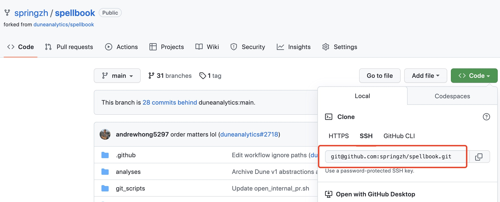
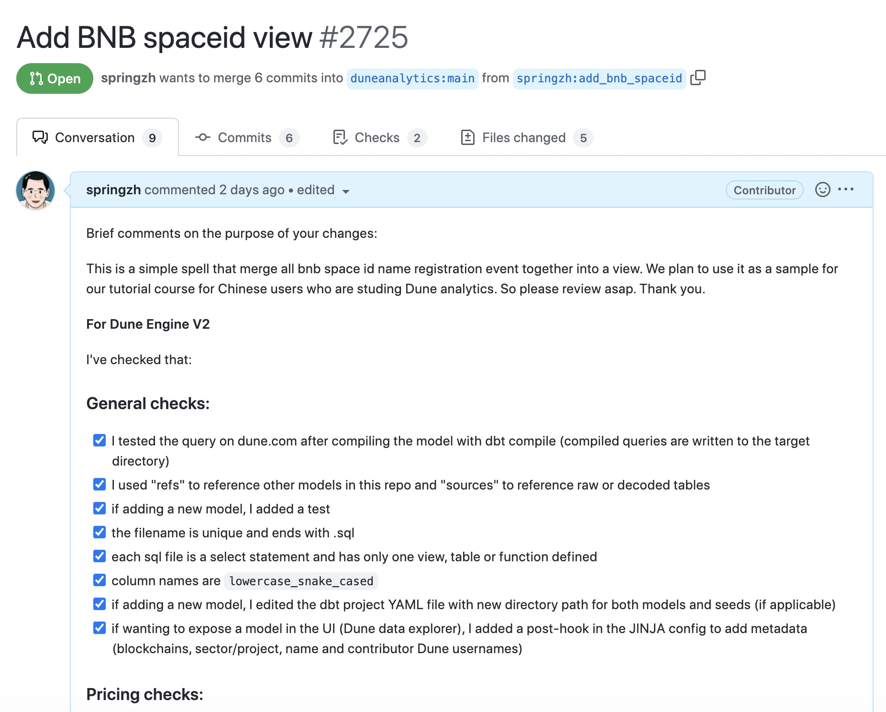

# 22 How to Build a Spellbook

Spellbook is a data transformation layer built collaboratively by the Dune community. Spells are advanced abstract views or tables built jointly by the Dune team and community users.

By building spells, all Dune community users can more easily accomplish data analysis. There are many benefits to building spells. Imagine:

- You have multiple queries that contain the same subqueries or CTEs
- Multiple queries in your reuse very long static data lists
- One of your queries has been forked or copied multiple times
- Your query contains very complex logic that can be reused elsewhere

If one of the above scenarios applies, we can turn this query into a spell by building a view. This can simplify query SQL logic, improve consistency and maintainability, as well as clarify data metrics.

The open source Spellbook project maintained by Dune can automatically build and maintain these spells. Anyone in the community can contribute spells to the Spellbook project. This tutorial attempts to write a simple spell to help everyone get started easily.

## Basic Steps to Build a Spell

In the simplest terms, a spell is essentially a SELECT query statement underneath. But the specific process of building a spell actually involves multiple aspects and multiple steps that must be followed step by step according to the documentation to complete the spell construction successfully.

The basic steps to build a spell include:

- **Determine the data object**: based on the example scenarios mentioned above, in combination with the specific problems and needs you encounter when writing queries, determine the data object to be processed to build and generate the spell, and define the mode (schema) for the output spell.
- **Configure data sources**: the data source refers to the original data tables and parsed data tables on which the spell depends. They must be defined in a YAML file. Each data source needs to be defined only once in the spell.
- **Write tests**: consider the desired query results before writing the spell and write corresponding tests based on the results. Of course, if our spell is just a view of aggregated data, the test can be added after writing the spell.
- **Write the spell**: use a `.sql` file with a certain special format (JINJA template) to build a spell for each spell to be built by writing a `SELECT` query statement. Compile and test the spell.
- **Submit a PR**: after writing the spell, compiling it locally successfully and manually testing it, create a new PR (Pull Request) on GitHub and wait for Dune's technical personnel to review and merge it. After successful merging, we can find the newly built spell in the query editor.

Dune provides more detailed instructions in their online documentation:[Spell guide](https://dune.com/docs/zh/spellbook/getting-started/)

## Preparation before Building the Magic Table

Before you start building the magic table, you need to do some essential preparation work, including familiarizing yourself with the basic usage of the dbt tool, getting acquainted with basic GitHub operations (you must have a GitHub account), and setting up your local working environment. Detailed requirements and instructions for environment setup can be found here:

[Prepare prerequisites and set up Spellbook dbt](https://dune.com/docs/spellbook/1-do-some-prerequisites%20and-set-up-Spellbook-dbt/)

For more information about DBT:

[What is dbt?](https://docs.getdbt.com/docs/introduction)

We assume that you have already configured the relevant software following the instructions in the links above and have forked the Dune Spellbook repository (https://github.com/duneanalytics/spellbook) to your own GitHub account. The following steps will be briefly explained. I am using a Mac operating system locally, so the examples provided here are for the Mac environment. If you are using a Windows environment and encounter any issues during the process, please ask in the group.

Use the `git clone` command to clone the forked repository to your local machine. Create a new working directory on your local machine. Go into that directory and use the following command to clone (copy the address from the forked repository page on GitHub, as shown in the image below):


```
git clone git@github.com:springzh/spellbook.git
```



When you cloned the repo, you will get a new sub-directory called `spellbook`. Enter this directory:

```
cd spellbook
```

After the cloning is completed, you will see a new `spellbook` subdirectory in your working directory. Navigate to this subdirectory:

```
cd spellbook
```

If you haven't previously run `pipenv install` to create the local pipenv environment, you need to execute the installation:

```
pipenv install
```

If the above command gives an error, you can try the following:

```
sudo -H pip install -U pipenv
```

If the command returns the following error:

```
pipenv install returns warning LANG, warning Python 3.9 not found
```

You can try installing again, specifying the Python version:

```
pipenv install --python 3.9.13
```

You can use this command to confirm the Python version installed on your local machine:

```
python3 -version
```

Once the pipenv environment is installed, you can now activate it:

```
pipenv shell
```

Next, run the `dbt init` command to initialize dbt. This command will guide you through the interactive setup of dbt. Detailed instructions can be found in the link provided in the section "Prepare prerequisites and set up Spellbook dbt."

```
dbt init
```

After we finish writing the magic table or make any changes to the related files, we use `dbt compile` to compile the entire dbt project and regenerate the SQL for the magic table.

To avoid confusion, let's list the main steps again:

**First-time initialization and execution steps**:

```
# Install pipenv environment
pipenv install

# Activate pipenv environment
pipenv shell

# Initialize dbt
dbt init

# Add or modify files

# Compile dbt
dbt compile
```

**Subsequent daily execution steps after the initialization**:

```
# Activate pipenv environment
pipenv shell

# Add or modify files

# Compile dbt
dbt compile
```

While writing and debugging a new magic table, you may need to adjust and modify related files repeatedly. In this case, you can execute `dbt compile` multiple times. If there are any compilation errors, make the necessary changes based on the error messages. Once the compilation is successful, copy the generated SQL statements to Dune for actual query testing to ensure that the SQL works correctly and produces the expected results.

##  The Magic Table to Create in This Tutorial

The purpose of this tutorial is to enable everyone to quickly learn how to build a magic table using a simple example. Previously, when the Space ID on the BNB chain launched domain registration, I created a Space ID data dashboard ([SpaceID - BNB Domain](https://dune.com/sixdegree/bnb-domain-spaceid)). At that time, the Space ID only had a limited open Mint permission and users provided a lot of feedback as well as suggestions regarding the Mint rules. In response to this feedback, the SpaceID team continuously improved and upgraded its smart contracts. Within a few days, the contract for domain registration went through five major versions, from V3 to V7. This led to a problem where, to consolidate all currently registered SpaceID domain data, one had to query the data separately from the event log tables of these different contract versions and manually merge them using "Union All" operations. If you check the source code of my data dashboard queries, you'll find that most of them have a long CTE (Common Table Expression) to aggregate and merge domain registration events from different contract versions. For example: https://dune.com/queries/1239514/2124307. To keep it up to date, I had to make numerous modifications to these queries one by one, including incorporating data from new contract versions. In fact, the SpaceID project now has V8 and V9 domain registration contract versions, which are not included in my dashboard, making it outdated. If other users forked my queries and made adjustments, unfortunately, their queries would also be outdated.


In such a case, if we build a magic table for domain registration events (actually a view), all queries can be written directly based on this magic table. When a new smart contract version is released, we only need to modify and update the definition of the magic table and submit a PR (Pull Request) for review. Once the PR is approved and merged, the data in the magic table will be automatically updated. All queries using this magic table will not require any changes. In contrast, without a magic table, my queries, as well as the queries generated by others who forked my queries, would have to be modified one by one. From here, we can see the benefits of building a magic table.

So, what we are going to do here is to build a magic table that includes all Space ID domain registration information on the `bnb` blockchain of the `spaceid` project.

## Creating Directory Structure and Files

Once we have determined what magic table we want to create, we can start working on it. When using Git, it's a good practice to always develop in a separate branch. I recommend everyone follows this approach. Let's create a new working branch called `add_bnb_spaceid` in the local cloned spellbook repository:

```
git checkout -b add_bnb_spaceid
```

Now we are automatically switched to the new git working branch `add_bnb_spaceid`. We can begin creating the directory structure and files required for the magic table.

For project-based magic tables, they are stored in the `/spellbook/models` directory using the format `[project_name]/[blockchain_name]`. All names should be in lowercase, and words should be separated by underscores. For example: `/spellbook/models/[project_name]/[blockchain_name]`. In this case, our project name is `spaceid`, and the blockchain name is `bnb`, so the complete directory structure for our magic table is: `/spellbook/models/spaceid/bnb/`.

Please navigate to the `models` directory and create a subdirectory called `spaceid` within it. Then, go inside this newly created directory and create another subdirectory called `bnb`.

The magic table files should be named as follows:

- For schema files: `[project_name]_[blockchain]_schema.yml`
- For dependency source files: `[project_name]_[blockchain]_sources.yml`
- For the SQL file of the magic table: `[project_name]_[blockchain]_[spell_name].sql`

Here, `spell_name` is the name of the magic table we want to create. We will use `registrations` as the name.

So, we need to create the following three corresponding files (keep the file content empty for now; we will explain each one later) in the `spaceid/bnb/` directory:

- spaceid_bnb_schema.yml
- spaceid_bnb_sources.yml
- spaceid_bnb_registrations.sql

The current directory and file structure should look like this:


Reference document: [Set up your file structure for SQL, schema, and source files](https://dune.com/docs/zh/spellbook/how-to-cast-a-spell/3-set-up-your-file-structure-for-SQL-schema-and-source-files/)

## Defining the Dependency Source File

Here, we only need to use seven different versions of the `RegistrarController` contract that have been deployed by the SpaceID project so far. These tables are under the `spaceid_bnb` schema. The definition of our dependency source file `spaceid_bnb_sources.yml` is as follows:

```
version: 2

sources:
  - name: spaceid_bnb
    description: "bnb decoded tables related to SpaceId contract"
    freshness: # default freshness
      warn_after: { count: 12, period: hour }
      error_after: { count: 24, period: hour }
    tables:
      - name: BNBRegistrarControllerV3_evt_NameRegistered
        loaded_at_field: evt_block_time
      - name: BNBRegistrarControllerV4_evt_NameRegistered
        loaded_at_field: evt_block_time
      - name: BNBRegistrarControllerV5_evt_NameRegistered
        loaded_at_field: evt_block_time
      - name: BNBRegistrarControllerV6_evt_NameRegistered
        loaded_at_field: evt_block_time
      - name: BNBRegistrarControllerV7_evt_NameRegistered
        loaded_at_field: evt_block_time
      - name: BNBRegistrarControllerV8_evt_NameRegistered
        loaded_at_field: evt_block_time
      - name: BNBRegistrarControllerV9_evt_NameRegistered
        loaded_at_field: evt_block_time
```

In the defined dependency source file:

1. `version` is always set to `2`.
2. `name` specifies the schema (Schema name) of the dependency source data tables. We can create a new query on Dune, search for the relevant table, and add the table name to the query editor. The part to the left of the `.` symbol is the schema name of the table. For example, the schema name of the table `spaceid_bnb.BNBRegistrarControllerV3_evt_NameRegistered` is `spaceid_bnb`.
3. `freshness` is used to verify and ensure the automatic update of data in the magic table. If the data is not updated successfully within the specified time, a warning or error will be issued when using the magic table (I personally have not encountered such an error yet, so it may only be sent to the personnel maintaining the magic table module). Keeping the default settings is fine. This setting applies to all data source tables listed under `tables`. Of course, you can also add this setting to individual tables.
4. `tables` lists the data source tables we need to use. These tables should all belong to the schema specified above. If there are tables belonging to different schemas, we would need to add a separate definition with the same structure in the same file. You can refer to the definitions of existing magic table schema files.

- `name` sets the name of the table. Do not include the schema name here.
- `loaded_at_field` specifies the timestamp-type field used to check the loading time of the last few rows of data. This is essential for ensuring the regular update of data in the magic table, in conjunction with the `freshness` setting.

Reference documents:

- [Identify and define sources](https://dune.com/docs/zh/spellbook/how-to-cast-a-spell/4-identify-and-define-sources/)
- [Data Sources](https://dune.com/docs/zh/spellbook/data-sources/)

## Defining the Schema File

The schema file `spaceid_bnb_schema.yml` provides information such as the name, fields, and description of the magic table to be created, as well as corresponding configuration information.

```yml
version: 2

models:
  - name: spaceid_bnb_registrations
    meta:
      blockchain: bnb
      project: spaceid
      contributors: [springzh]
    config:
      tags: ['bnb','spaceid','name','registrations']
    description: >
       SpaceID V3, V4, V5, V6, V7, V8 & V9 Name Registered on BNB
    columns:
      - &version
        name: version
        description: "Contract version"
      - &block_time
        name: block_time
        description: "UTC event block time"
      - &name
        name: name
        description: "Name of the space ID"
        tests:
          - unique
      - &label
        name: label
        description: "Label of the space ID"
      - &owner
        name: owner
        description:  "Owner of the space ID"
      - &cost
        name: cost
        description:  "Cost spent to register the space id"
      - &expires
        name: expires
        description:  "Name expires date and time in Unix timestamp format"
      - &contract_address
        name: contract_address
        description:  "Contract address that called to register the space id"
      - &tx_hash
        name: tx_hash
        description:  "Transaction hash"
      - &block_number
        name: block_number
        description: "Block number in which the transaction was executed"
      - &evt_index
        name: evt_index
        description: "Event index"
```

Since the structure of the `NameRegistered` event tables for different versions of SpaceID is the same, our work is relatively simple. We can use the structure of one of the tables as a reference to define our schema file. To distinguish the source of domain registrations, we add a `version` field to store information about the smart contract version, such as 'v3', 'v4', etc.

As domain names are unique, we add a uniqueness test definition to the `name` field. During compilation, an associated test SQL will be generated to ensure that there are no duplicate values in the magic table data.

The `&field_name` syntax defines field names. The first occurrence of a field name in the file should have a "&" prefix. Later in the same file, other tables' field definitions can use `*field_name` to reference the defined field, making the code more concise.

## Writing the SQL Statement for the Magic Table View

Now we come to the most critical part of creating the magic table – the SQL writing. Open the `spaceid_bnb_registrations.sql` file and enter the following content (with some parts omitted):

``` sql
{{
    config(
        alias='registrations'
        ,materialized = 'incremental'
        ,file_format = 'delta'
        ,incremental_strategy = 'merge'
        ,unique_key = ['name']
        ,post_hook='{{ expose_spells(\'["bnb"]\',
                                    "project",
                                    "spaceid",
                                    \'["springzh"]\') }}'
    )
}}

SELECT 'v3'                    as version,
       evt_block_time          as block_time,
       name,
       label,
       owner,
       cast(cost as double)    as cost,
       cast(expires as bigint) as expires,
       contract_address,
       evt_tx_hash             as tx_hash,
       evt_block_number        as block_number,
       evt_index
FROM {{source('spaceid_bnb', 'BNBRegistrarControllerV3_evt_NameRegistered')}}

WHERE evt_block_time >= date_trunc("day", now() - interval '1 week')


UNION ALL

-- Omitted V4 - V8 parts

UNION ALL

-- There are some records in v9 table that are duplicated with those in the v5 table. So we join to exclude them
SELECT 'v9'                       as version,
       v9.evt_block_time          as block_time,
       v9.name,
       v9.label,
       v9.owner,
       cast(v9.cost as double)    as cost,
       cast(v9.expires as bigint) as expires,
       v9.contract_address,
       v9.evt_tx_hash             as tx_hash,
       v9.evt_block_number        as block_number,
       v9.evt_index
FROM {{source('spaceid_bnb', 'BNBRegistrarControllerV9_evt_NameRegistered')}} v9
LEFT JOIN {{source('spaceid_bnb', 'BNBRegistrarControllerV5_evt_NameRegistered')}} v5
    ON v9.name = v5.name
WHERE v5.name is null
```

Explanations:

- The `config` section at the beginning provides some critical configurations for the magic table. Please always maintain the same format and pay attention to escaping when using single and double quotes. The `alias` specifies the alias for the magic table, which will be the name users use to refer to the magic table in the query editor. It is recommended to use the same name as defined in the schema. The `post_hook` is a configuration for additional operations when the magic table is built and published. `expose_spells` is used to display the magic table in the query editor so that other users can find it. The parameters for this function represent, in order, the applicable blockchain (as an array), the type of magic table (project type or industry type), the name of the project or industry, and a list of contributors (as an array). For our magic table, it is the bnb blockchain, the project type, the name spaceid, and the contributor being your own GitHub account name.
- The main part is a complete SELECT query. The difference from regular queries we write is that we need to use special JINJA template syntax to reference data source tables. For example, `{{source('spaceid_bnb', 'BNBRegistrarControllerV9_evt_NameRegistered')}}` refers to the `BNBRegistrarControllerV9_evt_NameRegistered` table defined in our `spaceid_bnb_sources.yml` file.
- After receiving the review feedback, we adjusted the V9 part of the query to exclude some records that were already present in the V5 table. We did this by adding a LEFT JOIN and a WHERE clause.

Reference documents:

- [Configure Alias and Materialization Strategy](https://dune.com/docs/zh/spellbook/how-to-cast-a-spell/7-configure-alias-and-materialization-strategy/)
- [Write Your Spell as a SELECT Statement](https://dune.com/docs/zh/spellbook/how-to-cast-a-spell/6-write-your-spell-as-SELECT-statement/)

After writing the query, you can use `dbt compile` to try compiling it. If there are errors, make adjustments accordingly and recompile to ensure successful compilation.

After submitting the PR for review, you received feedback suggesting setting the view's materialization strategy to incremental. Therefore, you made adjustments to both the `config` section at the beginning and each sub-query part to accommodate incremental updates. The adjusted example is as follows:

``` sql
{{
    config(
        alias='registrations'
        ,materialized = 'incremental'
        ,file_format = 'delta'
        ,incremental_strategy = 'merge'
        ,unique_key = ['name']
        ,post_hook='{{ expose_spells(\'["bnb"]\',
                                    "project",
                                    "spaceid",
                                    \'["springzh"]\') }}'
    )
}}

SELECT 'v3'                    as version,
       evt_block_time          as block_time,
       name,
       label,
       owner,
       cast(cost as double)    as cost,
       cast(expires as bigint) as expires,
       contract_address,
       evt_tx_hash             as tx_hash,
       evt_block_number        as block_number,
       evt_index
FROM {{source('spaceid_bnb', 'BNBRegistrarControllerV3_evt_NameRegistered')}}

WHERE evt_block_time >= date_trunc("day", now() - interval '1 week')


UNION ALL

-- Omitted
```

With the added incremental update configurations and conditions, when in incremental update mode (i.e., ``), only data from the past week will be queried. The queried new data will be merged into the physical file that holds the view data. The `incremental_strategy = 'merge'` will ensure that existing records are ignored during this merge process.

## Adding the New Model to the dbt_project.yml File

Next, we need to modify the `dbt_project.yml` file located at the root of the `spellbook` repository to include our magic table.

```
    spaceid:
      +schema: spaceid
      bnb:
        +schema: spaceid_bnb
```

Here, we specify the project name and its schema name, as well as the blockchain name and the schema name under that blockchain. With this hierarchical structure, we can handle the magic table creation for each project deployed on different blockchains and further combine the magic tables for the same project on multiple blockchains into a project-level magic table. For specific examples, you can refer to magic tables related to projects like opensea or uniswap.

You can use `dbt compile` again to confirm that the compilation is successful.

Reference documents:

- [Configure Alias and Materialization Strategy](https://dune.com/docs/zh/spellbook/how-to-cast-a-spell/7-configure-alias-and-materialization-strategy/)
- [Defining Models in dbt](https://dune.com/docs/zh/spellbook/defining-models-in-dbt/)

## Writing Tests

To ensure that the generated magic table data is complete and accurate, we need to write appropriate tests. Create a new directory path `spaceid/bnb` under the `spellbook/test` directory and navigate into the bnb subdirectory. In this directory, create a file named `spaceid_registrations_test.sql` with the following content:

``` sql
WITH unit_tests AS (
    SELECT COUNT(*) as count_spell
    FROM {{ ref('spaceid_bnb_registrations') }} AS s
    WHERE version = 'v7'
),

spaceid_v7_registration as (
    SELECT COUNT(*) as count_event_table
    FROM {{source('spaceid_bnb', 'BNBRegistrarControllerV7_evt_NameRegistered')}}
)
SELECT 1
FROM unit_tests
JOIN spaceid_v7_registration ON TRUE
WHERE count_spell - count_event_table <> 0
```

In this test, we use `{{ ref('spaceid_bnb_registrations') }}` to reference the generated magic table. First, we count the number of records for the V7 version from the magic table. Then, we use `{{source('spaceid_bnb', 'BNBRegistrarControllerV7_evt_NameRegistered')}}` to query the number of records from the corresponding V7 event table. Finally, we check if the counts returned by these two CTEs are the same. If they are different, the test will return a single row result. A successful test should not return any results, while returning any records indicates test failure.

Reference document: [Writing Unit Tests for Your Spell](https://dune.com/docs/zh/spellbook/getting-started/tests/)

## Compilation and Debugging

After editing and saving the test file, use `dbt compile` again to compile it. Make any necessary adjustments to fix any errors and ensure successful compilation.

At this point, an important step is to manually test the compiled query code on Dune to verify its functionality.

When the compilation is successful, a `target` subdirectory will be generated in the `spellbook` directory. Navigate to the `compiled/spellbook/models/spaceid/bnb` subdirectory, where you will find the `spaceid_bnb_registrations.sql` file. This is the SQL definition of the view behind the magic table we are building. In the same directory, there is a `spaceid_bnb_schema.yml` subdirectory, which contains automatically generated tests based on the schema definition. We can ignore this part.

For manual testing, copying and running the entire content of the query file directly is not recommended due to the large amount of data. Instead, we can copy the contents of the query file into a CTE definition and then run queries that return only a small amount of data against that CTE.

``` sql
sqlCopy code
with view_registration as (
SELECT 'v3'                    as version,
       evt_block_time          as block_time,
       name,
       label,
       owner,
       cast(cost as double)    as cost,
       cast(expires as bigint) as expires,
       contract_address,
       evt_tx_hash             as tx_hash,
       evt_block_number        as block_number,
       evt_index
FROM spaceid_bnb.BNBRegistrarControllerV3_evt_NameRegistered

-- Omitted remaining code

)

select * from view_registration
limit 1000
```

Complete manual testing query: https://dune.com/queries/2020131

The main purpose of this step is to ensure that the compiled SQL statement can run correctly on Dune. You can modify the final output query statement for more manual testing.

## Submitting the PR

Now we have processed the new magic table and completed the local testing. We are ready to add and commit the newly created and modified code files to the Github repository and submit a PR to Dune.

First, add and commit the newly created and modified code files to the local git repository. Then push the local branch to the remote Github repository:

```
# Check and confirm the newly created and modified files and directories
git status

# Add all newly created and modified files for commit
git add .

# Commit to the local git repository
git commit -m 'Add spaceid view'

# Push the local branch to the remote Github repository
git push -u origin add_bnb_spaceid
```

The `-u origin add_bnb_spaceid` part in the push command is only needed for the first push. After the first push, if you make further modifications to the related files and commit them to the local git repository, the command for pushing to Github will be:

```
git push
```

Next, open the Github website and go to the `spellbook` repository under your personal account. You will see a notification indicating that a new branch `add_bnb_spaceid` has pushed the latest changes and a Pull Request (PR) can be created for it. Click the "Create PR" button to enter the PR creation page.

In this PR page, you need to edit and confirm the following content while ensuring that you have completed the corresponding checks and tests as guided in the documentation. The content editor supports Markdown syntax, and `[ ]` will output an unchecked checkbox, while `[x]` will output a checked checkbox. Adjust these options one by one to confirm that you have completed the corresponding steps and actions.

You also need to provide a brief description of the newly added or modified Spell in the PR, making it easier for reviewers to understand the changes.



After submitting the PR, you need to wait for the review and feedback from relevant parties. Also, pay attention to email notifications from Github. Some notifications can be ignored, such as those about `dbt slim ci (in beta) / dbt-test`. The main focus should be on feedback from the reviewers. If there are modifications to be made, proceed to modify, test, commit the changes to the local git repository, and push to Github (the modifications will automatically appear under the existing PR without creating a new one). Then, wait for another round of review.

If all modifications pass the review smoothly, your PR will be merged into the spellbook main branch and deployed to the Dune production site. After deployment, you can search for and use the magic table you built in the query editor. Congratulations!

## Additional Notes and Special Thanks

Note: as of the time of writing this document, our PR is still under review and has not been approved yet. Further modifications may be made based on feedback. The PR number for reference is 2725, and you can check the details on the PR page.

PR Github link: [add BNB spaceid view](https://github.com/duneanalytics/spellbook/pull/2725)

Special thanks to community member @hosuke (Dune: https://dune.com/hosuke) for assisting with the PR review, providing feedback and improvement suggestions, and helping to modify the materialization strategy of the magic table.

## About Us

`Sixdegree` is a professional onchain data analysis team Our mission is to provide users with accurate onchain data charts, analysis, and insights. We are committed to popularizing onchain data analysis. By building a community and writing tutorials, among other initiatives, we train onchain data analysts, output valuable analysis content, promote the community to build the data layer of the blockchain, and cultivate talents for the broad future of blockchain data applications. Welcome to the community exchange!

- Website: [sixdegree.xyz](https://sixdegree.xyz)
- Email: [contact@sixdegree.xyz](mailto:contact@sixdegree.xyz)
- Twitter: [twitter.com/SixdegreeLab](https://twitter.com/SixdegreeLab)
- Dune: [dune.com/sixdegree](https://dune.com/sixdegree)
- Github: [https://github.com/SixdegreeLab](https://github.com/SixdegreeLab)
