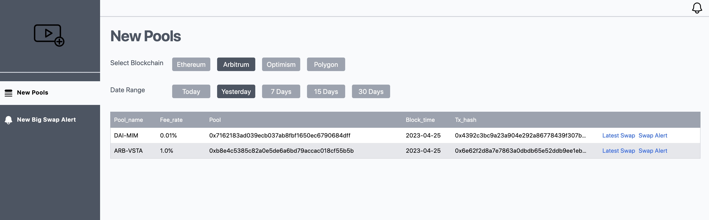

# 23 Creating an Application Using Dune API

## Project Overview

On April 25th, Dune officially opened up API access to all user levels, including free users. Now, even free users can access the Dune API. This tutorial provides a demo that demonstrates how to develop an application around the Dune API.

The demo application is deployed here: [Watcher Demo](https://dev.lentics.xyz/).

The demo application was completed in early March but due to various reasons, the tutorial has been delayed until now. We apologize for the delay. The project code was collaboratively completed by our colleagues George, Ken, and Benny. We extend our thanks to them.

Please note that the above demo application may not work continuously due to API Key limitations. We recommend forking the project and deploying it yourself using your own API Key to further explore.

The user interface of the project is shown in the following image:



## Introduction to Dune API Usage

Dune API is executed and results are obtained based on the Query ID. Each saved Query can automatically be converted into an API access endpoint. In the latest version of the Query Editor interface, you simply need to write the query, test its functionality, save the query, and then click the "API Endpoint" button to obtain the API endpoint URL to access the query results.

```
https://api.dune.com/api/v1/query/2408388/results?api_key=<api_key>
```

This is the simplest way to access the result set of a saved query through the API.


The execution result of a Query is cached by default. If you do not actively execute the Query again, the API endpoint obtained above will provide the cached result of the last execution. Typically, our applications need to actively execute queries to obtain the latest data that meets the conditions, rather than repeatedly obtaining cached result sets. This is especially true for monitoring-type applications. Therefore, we also need to access the "Execute" endpoint to execute the query and the "Status" endpoint to check the status of query execution. After receiving the information that the query has been executed, we can access the "Results" endpoint to obtain the data.

A complete API call process includes executing the query, checking the query execution status, and obtaining the query results. Detailed explanations about Dune API can be found in the API documentation: [Dune API](https://dune.com/docs/api/api-reference/#latest-results-endpoint).

## Project Requirements

In order to demonstrate the complete process of developing a project using Dune API as comprehensively as possible, the following main requirements points have been organized.

The main function of this application is to provide a pure frontend application for monitoring the creation of new liquidity pools based on the Dune API, specifically for Uniswap V3. It uses a database to save the user's choice of monitored pool addresses and implements caching to avoid making API requests for exactly the same data.

The application includes three main functionalities:

1. New Pools

Returns a list of newly created liquidity pools that meet the selected blockchain and date range criteria. When calling the API, the user selects the blockchain name (in all lowercase) and the date parameters (YYYY-MM-DD, converted to specific dates based on user choices).

1. Latest Swaps

Displays the latest 100 swap exchange records for a pool selected from the pool list in a new interface. The user enters this interface by clicking the "Latest Swap" link next to a specific pool from the previous step. When calling the API, the user provides the blockchain name, pool address, and the current hour value (YYYY-MM-DD HH:MI:SS, converted to specific date and hour values, e.g. "2023-02-27 09:00:00"). The API call returns the results, which are displayed in a list format.

1. Large Swap Alerts

Allows the user to input a pool address (prompting the user to copy it from the pool list), and set a threshold for large swaps (e.g.1000USD). The application then calls the API every 5 minutes and generates an on-site alert if there are swap records that meet the specified condition. The user can set the pool address to monitor and the minimum swap amount in USD (currently providing three choices: 1000, 10000, and 100000). If the API returns data, it will be added to the on-site alert. A red badge in the navigation bar will indicate the number of unread alerts, and clicking it will display the list. After clicking on a single alert, it will be marked as read.

## Development Environment Setup

``` bash
Copy code
yarn dev
```

For other commands, refer to the `readme.md` file in the project's source code.

## Development Overview

### Project Creation

The project is based on Next.js, using tailwindcss as the CSS framework, Axios as the fetcher, dexie for front-end data operations, and prisma for back-end data operations.

```
$ yarn create next-app
$ yarn add tailwindcss autoprefixer postcss prisma -D
$ yarn add axios dexie dexie-react-hooks @prisma/client
```

### Initialize Schema

``` bash
$ yarn prisma init --datasource-provider sqlite
$ vim prisma/schema.prisma
generator client {
  provider = "prisma-client-js"
}

datasource db {
  provider = "sqlite"
  url      = env("DATABASE_URL")
}

model DuneQuery {
  id           String   @unique
  execution_id String
  createdAt    DateTime @default(now())
  updatedAt    DateTime @updatedAt
}

$ yarn prisma migrate dev --name init
$ yarn prisma generate
```

### Encapsulate API Calls

Add `lib/dune.ts` to encapsulate the three steps of executing the Dune API:

``` javascript
export const executeQuery = async (id: string, parameters: any) => {
  // Generate a hash for the current execution query key, check and get the corresponding execution_id from sqlite. Remember to handle cache expiration.
  // ...
};

export const executeStatus = async (id: string) => {
  // ...
};

export const executeResults = async (id: string) => {
  // ...
};
```

### Front-end Data Display

In the `pages` directory, add a recursive function to check if `data.result` node exists to use for recursive calls. Trigger it in the `useEffect`.

### Code Deployment

The deployment process is similar to a Next.js project. The initialization of the database is already placed in `package.json`:

``` json
"scripts": {
  "dev": "prisma generate && prisma migrate dev && next dev",
  "build": "prisma generate && prisma migrate deploy && next build",
  "start": "next start"
}
```

### Writing SQL Queries for API

API calls and their corresponding query information:

- New Pools: https://dune.com/queries/2056212
- Latest Swap: https://dune.com/queries/2056310
- Alerts: https://dune.com/queries/2056547

### Important Functionality Points

1. Dune API requires executing `Execute Query ID` to obtain its `execution_id` before performing `status/results`. Handle cache expiration properly.
2. The front-end needs to make recursive calls to the system API to retrieve results.

## Dune API Documentation

- Chinese Documentation: https://dune.com/docs/zh/api/
- Latest Version: https://dune.com/docs/api/

## Project Code Repository

The source code of the project is available here: [Uniswap New Pools Watcher](https://github.com/codingtalent/watcher)

## About Us

`Sixdegree` is a professional onchain data analysis team Our mission is to provide users with accurate onchain data charts, analysis, and insights. We are committed to popularizing onchain data analysis. By building a community and writing tutorials, among other initiatives, we train onchain data analysts, output valuable analysis content, promote the community to build the data layer of the blockchain, and cultivate talents for the broad future of blockchain data applications. Welcome to the community exchange!

- Website: [sixdegree.xyz](https://sixdegree.xyz)
- Email: [contact@sixdegree.xyz](mailto:contact@sixdegree.xyz)
- Twitter: [twitter.com/SixdegreeLab](https://twitter.com/SixdegreeLab)
- Dune: [dune.com/sixdegree](https://dune.com/sixdegree)
- Github: [https://github.com/SixdegreeLab](https://github.com/SixdegreeLab)
