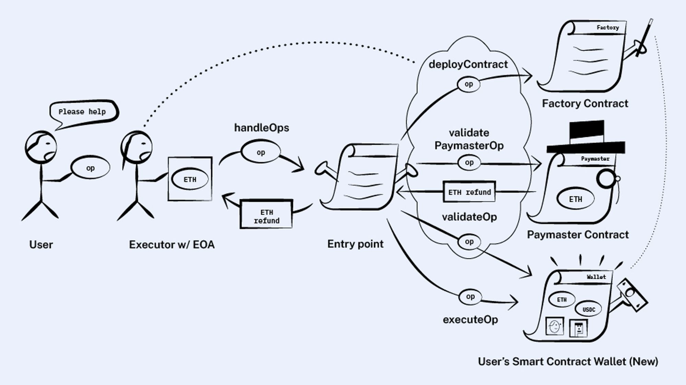
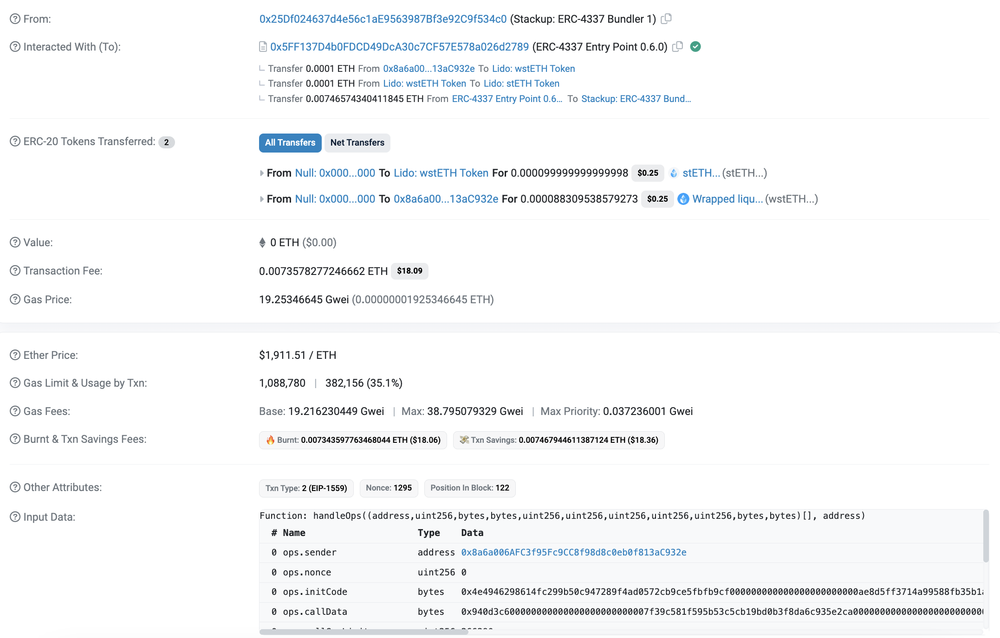
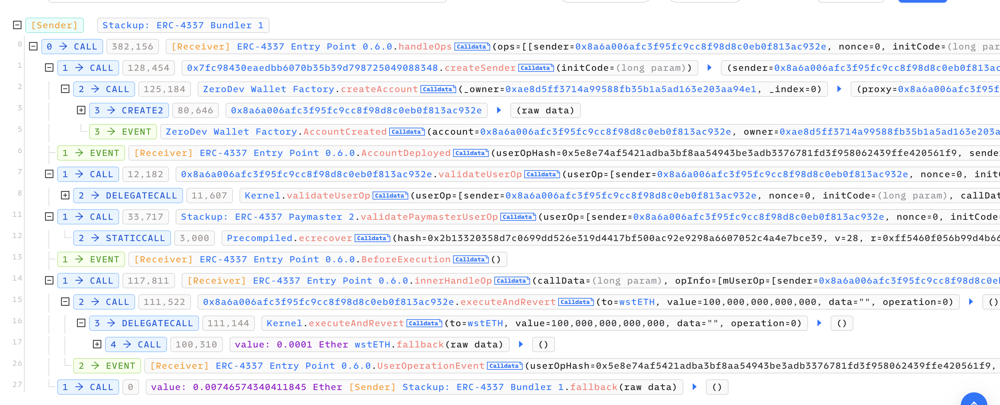
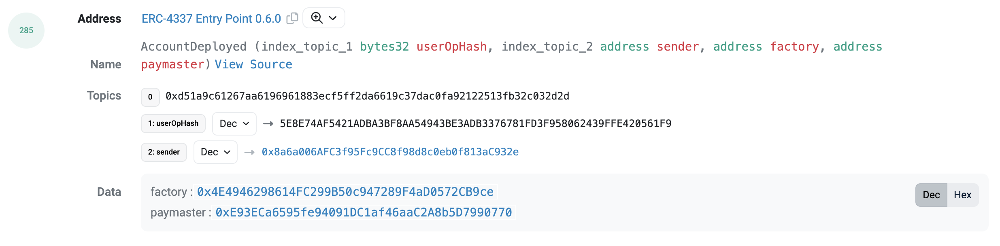
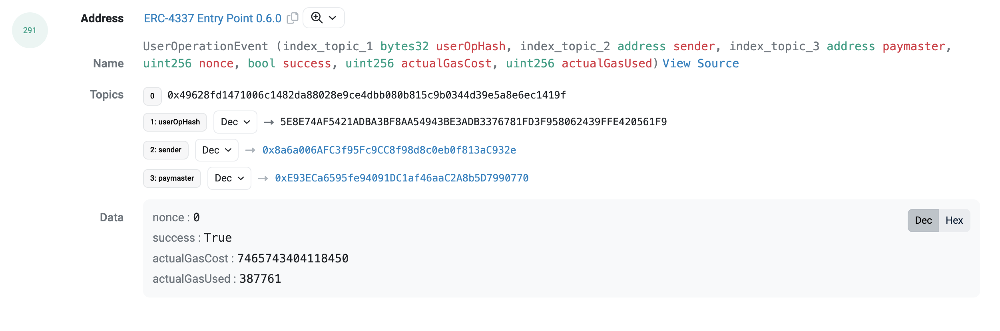

# AA-01 Explanation of Account Abstraction

## Introduction of Account Abstraction

Ethereum has two types of accounts: externally owned account (EOA) and contract accounts (Smart Contract, CA).

- EOAs are user-controlled accounts that can send transactions. EOAs control ownership of the account through their private key, and can execute transactions by signing, thus changing the internal state of the EOA or the state of an external contract account. 
Since the private key (or seed phrase) is the only representation of EOA ownership, EOAs are not suitable for defining complex ownership or transaction logic, such as social login and multisig transactions. The limitations of EOAs lead to poor user experiences: 
some cumbersome steps, such as private key and secret phase management, directly hinder Web2 users from entering Web3. Most popular wallets, like MetaMask, are based on the EOA account model.

- CAs can host arbitrary Solidity code, thus being able to leverage the full Turing completeness of the EVM. Unfortunately, contract accounts cannot send transactions, so their functionality must be triggered by EOAs. 
Smart contract wallets are a type of contract account that are indirectly triggered by their users through the EOA networks of wallet providers, whether through relays or bundlers.

**Account Abstraction (AA)**, the core of which is to decouple the signing authority and ownership of accounts, allowing for more flexible combinations of CAs and EOAs, and enabling features like gas abstraction, programmable permissions, etc through smart contract code. 

The ERC4337 standard is a standard for implementing Account Abstraction without changing the Ethereum consensus layer, and it's also the proposal with the highest feasibility. In the past year, a large number of applications based on this protocol have also emerged. 
The series of account abstraction data analysis articles are all centered around this standard.

## ERC4337 Execution Flow

In the ERC4337 account abstraction standard implementation, there are four roles involved:

- User: The owner of the smart wallet, corresponding to the Smart Wallet Contract.
- Bundler: Responsible for submitting the transaction information submitted by the user to the entry point contract (EntryPoint), these are EOA accounts.
- Paymaster: Responsible for paying gas fees for operations, this is optional, if not set the gas is paid by the smart contract wallet.
- Wallet Factory: Responsible for creating new smart contract wallets.


The specific execution flow is as follows:

1. The user submits User Operations through an account abstraction supported wallet, these User Operations will enter an Alt Mempool;
2. The Bundler monitors this Mempool, retrieves User Operations from it, and submits these Ops to the entry point contract;
3. If there is an initcode field in this wallet, the Factory Contract will be called to deploy a new smart wallet contract;
4. If there is no initcode field, the smart wallet contract will be called to execute the specific operation;
5. In steps 3 and 4, if the user has set a paymaster in the UserOp, then the ETH comes from the paymaster, otherwise the gas is paid by the wallet.




## Details of EntryPoint Contract

From the above flow we can see that all smart contract wallets are executed through the EntryPoint contract. From a data analysis perspective, let's focus on the functions and events involved in the EntryPoint.

| **Function**                 | **Event**                        |
|------------------------------|----------------------------------|
| function addStake            | event AccountDeployed            |
| function balanceOf           | event BeforeExecution            |
| function depositTo           | event Deposited                  |
| function deposits            | event SignatureAggregatorChanged |
| function getDepositInfo      | event StakeLocked                |
| function getNonce            | event StakeUnlocked              |
| function getSenderAddress    | event StakeWithdrawn             |
| function getUserOpHash       | event UserOperationEvent         |
| function incrementNonce      | event UserOperationRevertReason  |
| function innerHandleOp       | event Withdrawn                  |
| function nonceSequenceNumber |                                  |
| function simulateHandleOp    |                                  |
| function simulateValidation  |                                  |
| function unlockStake         |                                  |
| function withdrawStake       |                                  |
| function withdrawTo          |                                  |
| function handleOps           |                                  |
| function handleAggregatedOps |                                  |

### handleOps function
Among all the functions, handleOps is the most important function of the entire contract, all user submitted operations will go through this function.

Let's take a transaction on Ethereum as an example to illustrate. This operation first creates a new smart wallet contract, then it calls Lido's Warpped stETH contract to swap 0.0001 ETH for wstETH.

[0x56971f8e053a236b1700e428f37a6bf9cc197e5f59e36a4571323a84888764eb](https://etherscan.io/tx/0x56971f8e053a236b1700e428f37a6bf9cc197e5f59e36a4571323a84888764eb)




The specific execuate flow is as follows: 
https://phalcon.blocksec.com/explorer/tx/eth/0x56971f8e053a236b1700e428f37a6bf9cc197e5f59e36a4571323a84888764eb




Let's first check the `handleOps` function definition. This function takes in two parameters: an array of `UserOps` called `ops`, and a Bundler's `beneficiary` address for gas payment.

``` solidity
function handleOps(UserOperation[] calldata ops, address payable beneficiary) public nonReentrant {

        uint256 opslen = ops.length;
        UserOpInfo[] memory opInfos = new UserOpInfo[](opslen);

    unchecked {
        for (uint256 i = 0; i < opslen; i++) {
            UserOpInfo memory opInfo = opInfos[i];
            (uint256 validationData, uint256 pmValidationData) = _validatePrepayment(i, ops[i], opInfo);
            _validateAccountAndPaymasterValidationData(i, validationData, pmValidationData, address(0));
        }

        uint256 collected = 0;
        emit BeforeExecution();

        for (uint256 i = 0; i < opslen; i++) {
            collected += _executeUserOp(i, ops[i], opInfos[i]);
        }

        _compensate(beneficiary, collected);
    } //unchecked
}
```


The details of `UserOp` are as follows, with the above example referencing this transaction:

| **#**       | **Name**                 | **Type** | **Explain**                                                                                                                                   | **Example**                                                                                                                                                                                                                                                                                                                                                                                                                                  |
|-------------|--------------------------|----------|-----------------------------------------------------------------------------------------------------------------------------------------------|----------------------------------------------------------------------------------------------------------------------------------------------------------------------------------------------------------------------------------------------------------------------------------------------------------------------------------------------------------------------------------------------------------------------------------------------|
| UserOps     | ops.sender               | address  | the sender account of this request.                                                                                                           | 0x8a6a006AFC3f95Fc9CC8f98d8c0eb0f813aC932e                                                                                                                                                                                                                                                                                                                                                                                                   |
|             | ops.nonce                | uint256  | unique value the sender uses to verify it is not a replay.                                                                                    | 0                                                                                                                                                                                                                                                                                                                                                                                                                                            |
|             | ops.initCode             | bytes    | if set, the account contract will be created by this constructor/                                                                             | 0x4e4946298614fc299b50c947289f4ad0572cb9ce5fbfb9cf000000000000000000000000ae8d5ff3714a99588fb35b1a5ad163e203aa94e10000000000000000000000000000000000000000000000000000000000000000                                                                                                                                                                                                                                                           |
|             | ops.callData             | bytes    | the method call to execute on this account.                                                                                                   | 0x940d3c600000000000000000000000007f39c581f595b53c5cb19bd0b3f8da6c935e2ca000000000000000000000000000000000000000000000000000005af3107a4000000000000000000000000000000000000000000000000000000000000000008000000000000000000000000000000000000000000000000000000000000000000000000000000000000000000000000000000000000000000000000000000000                                                                                                   |
|             | ops.callGasLimit         | uint256  | the gas limit passed to the callData method call.                                                                                             | 266290                                                                                                                                                                                                                                                                                                                                                                                                                                       |
|             | ops.verificationGasLimit | uint256  | gas used for validateUserOp and validatePaymasterUserOp.                                                                                      | 543226                                                                                                                                                                                                                                                                                                                                                                                                                                       |
|             | ops.preVerificationGas   | uint256  | gas not calculated by the handleOps method, but added to the gas paid. Covers batch overhead.                                                 | 54704                                                                                                                                                                                                                                                                                                                                                                                                                                        |
|             | ops.maxFeePerGas         | uint256  | same as EIP-1559 gas parameter.                                                                                                               | 38795079329                                                                                                                                                                                                                                                                                                                                                                                                                                  |
|             | ops.maxPriorityFeePerGas | uint256  | same as EIP-1559 gas parameter.                                                                                                               | 37236001                                                                                                                                                                                                                                                                                                                                                                                                                                     |
|             | ops.paymasterAndData     | bytes    | if set, this field holds the paymaster address and paymaster-specific data. the paymaster will pay for the transaction instead of the sender. | 0xe93eca6595fe94091dc1af46aac2a8b5d79907700000000000000000000000000000000000000000000000000000000064b5b3d9000000000000000000000000000000000000000000000000000000000000000000000000000000000000000000000000000000000000000000000000000000000000000000000000000000000000000000000000000000000000000000000000ff5460f056b99d4b6628a43f0b18567ca8ea2438ead90f1f67bd72cf8080eeea39845e44ad30a33b6604cfac8173816b9d80fd9ed8a17b009f40b459299e03d71c |
|             | ops.signature            | bytes    | sender-verified signature over the entire request, the EntryPoint address and the chain ID.                                                   | 0x4b6f2be4077cfc39fa37270836820bb5e43be4b38dd7bb5a3664a91bc86980d27ee538937bc15e120261b714eee2d48560c7964354cbfa6af55bd2e1898480921c                                                                                                                                                                                                                                                                                                         |
| beneficiary | beneficiary              | address  | the address to receive the fees                                                                                                               | 0x25Df024637d4e56c1aE9563987Bf3e92C9f534c0                                                                                                                                                                                                                                                                                                                                                                                                   |


The above example contains initCode, so the first step will call the Wallet Factory to create a smart wallet contract, 
this example uses ZeroDev's, at this time the transaction will record an event log, containing:

- `userOpHash`: the userOp that deployed this account. UserOperationEvent will follow.
- `sender`: the account that is deployed
- `factory`: the factory used to deploy this account (in the initCode)
- `paymaster`: the paymaster used by this UserOp




Then it starts to execute the Validate operation, but this operation is not designed with too much information, so let's not consider it for now.

Finally, the EntryPoint will call the smart wallet contract to execute some tasks, 
such as transfers, interacting with dex, staking, etc. 
It will finally emit an event log to record the basic information of this Userop, including the following information:

- `userOpHash`: unique identifier for the request (hash its entire content, except signature).
- `sender`: the account that generates this request.
- `paymaster`: if non-null, the paymaster that pays for this request.
- `nonce`: the nonce value from the request.
- `success`: true if the sender transaction succeeded, false if reverted.
- `actualGasCost`: actual amount paid (by account or paymaster) for this UserOperation.
- `actualGasUsed`: total gas used by this UserOperation (including preVerification, creation, validation and execution).




## Reference
- [ERC-4337: Account Abstraction Using Alt Mempool](https://eips.ethereum.org/EIPS/eip-4337)
- [You Could Have Invented Account Abstraction: Part 1](https://www.alchemy.com/blog/account-abstraction)
- [erc4337.io](https://www.erc4337.io/)