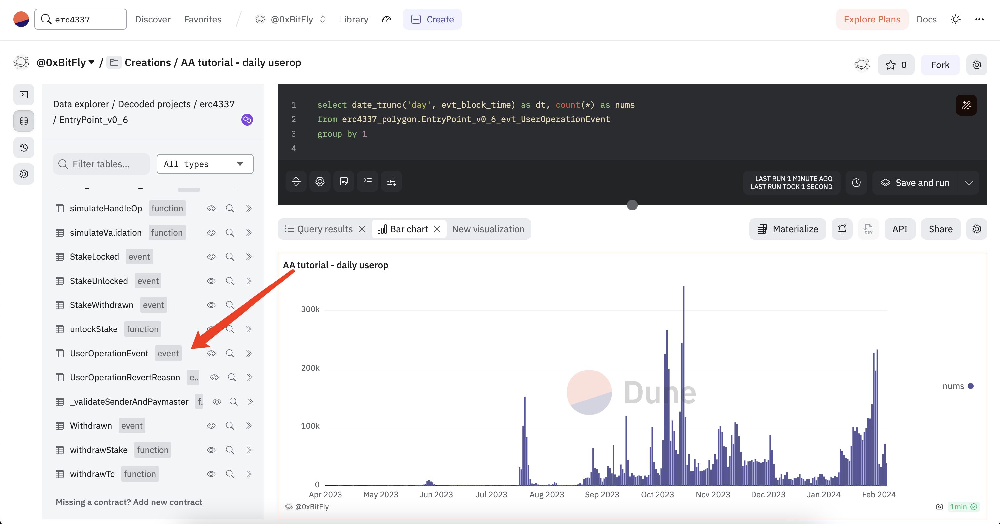
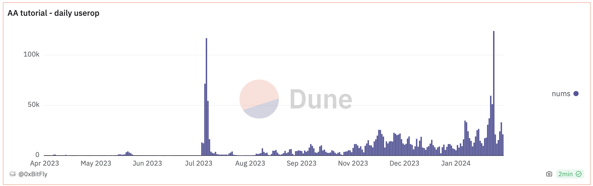
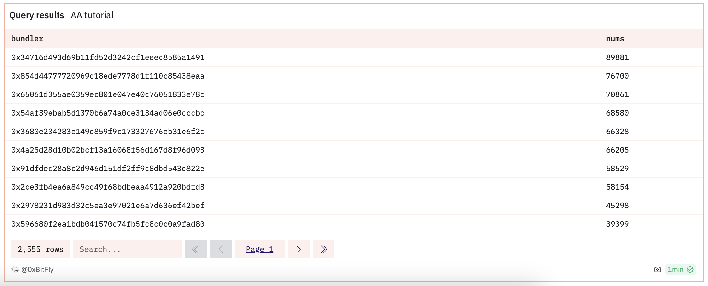
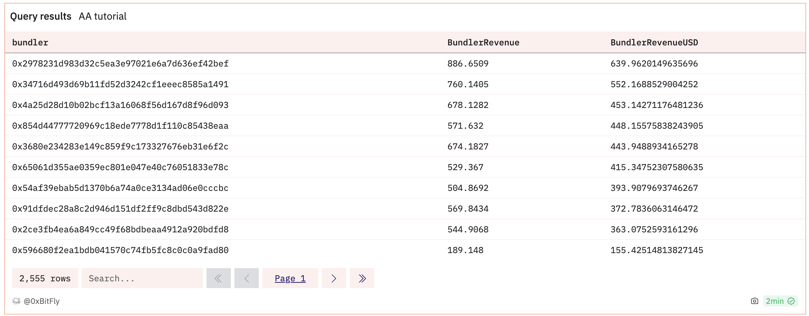
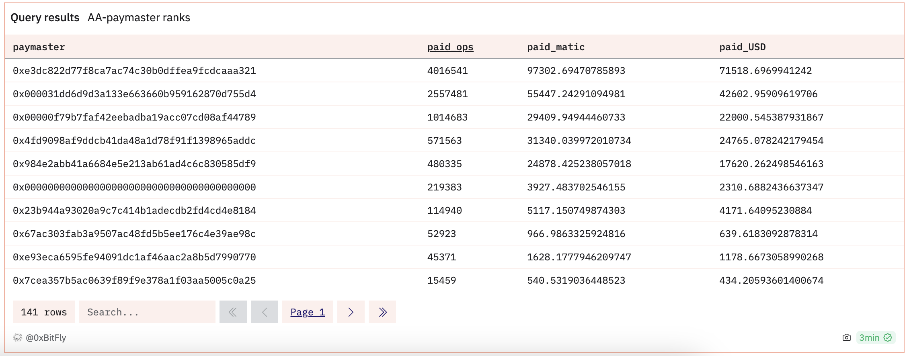
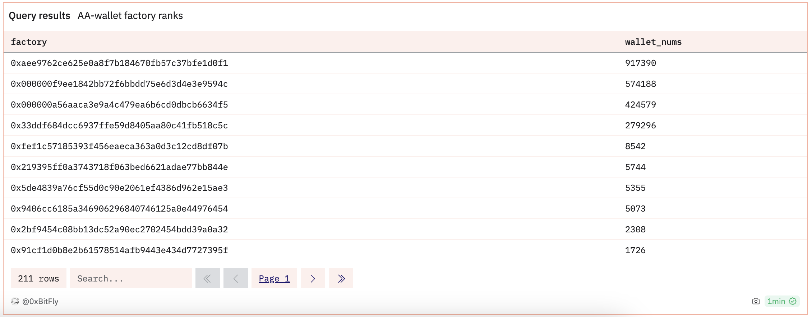

# Account Abstraction Data Analysis

The previous chapter mentions that the account abstraction system implemented by ERC4337 involves ordinary users, packagers, payees, and wallet factories. So when looking at the ecosystem participants' performance in Account Abstraction, it is more about looking at the on-chain metrics of these few participants. Here we use the tables in the decoded EntryPoint on the **[Dune](https://dune.com)** platform to see how to analyze. Here we take the EntryPoint v0.6 version on the Polygon chain as an example. You can find the corresponding table in `Data explorer` -> `Decoded projects` -> `erc4337` on the left side.


## Basic table

- `handleOps(function)`: Execute a batch of UserOperations
- `UserOperationEvent(event)`: An event emitted after each successful request
- `AccountDeployed(event)`: account "sender" was deployed.

## User analysis

Let's start with the simplest - how many User Operations were initiated by users. Each Operation initiated by a user will generate a UserOperationEvent record, so the calculation needs to use the UserOperationEvent table, note that it's not the handleOps table, because as mentioned earlier, handleOps will pass in an array of ops, which means one record in the handleOps table will correspond to multiple records in the UserOperationEvent table.

``` sql
--get the total User Operations
select count(*) from erc4337_polygon.EntryPoint_v0_6_evt_UserOperationEvent

--daily Users Operations count
select date_trunc('day', evt_block_time) as dt, count(*) as nums
from erc4337_polygon.EntryPoint_v0_6_evt_UserOperationEvent 
group by 1
```



Daily new user analysis, that is, calculating how many new wallet addresses are created every day, there are two ways, one is to count through whether the `initCode` field in `handleOps` is not empty, and the other is to count the daily number of new users through the AccountDeployed event.



## Bundler analysis
For **bundlers**, it is usually necessary to analyze which bundler there are and the market share of each bundler, because the `UserOperationEvent` table does not record the Bundler address, so we need to obtain the EOA account address that initiated this transaction through the hash field of the transaction association `polygon.transactions` table. Of course there is another way, which is to obtain its `beneficiary` field as the bundler address by associating with the `handleOps` table. Here we adopt the former.

``` sql
-- total bundler count
with ops as (
       select 'polygon' as chain, 'MATIC' as symbol,'v0.6' as version,evt_block_time, evt_tx_hash, actualGasCost 
       from erc4337_polygon.EntryPoint_v0_6_evt_UserOperationEvent
)
, tx as (
     select 'polygon' as chain, "from" as bundler, hash, block_time, cast(gas_price as double) * gas_used as tx_fee 
     from polygon.transactions 
     where block_time > timestamp '2023-02-15'
)
select count(distinct bundler) from ops left join tx on ops.evt_tx_hash = tx.hash


-- get count each bundler bundled ops 
with ops as (
       select 'polygon' as chain, 'MATIC' as symbol,'v0.6' as version,evt_block_time, evt_tx_hash, actualGasCost 
       from erc4337_polygon.EntryPoint_v0_6_evt_UserOperationEvent
)
, tx as (
     select 'polygon' as chain, "from" as bundler, hash, block_time, cast(gas_price as double) * gas_used as tx_fee 
     from polygon.transactions 
     where block_time > timestamp '2023-02-15'
)
select bundler, count(*) as nums from ops left join tx on ops.evt_tx_hash = tx.hash group by bundler order by 2 desc

```



In addition to submitting `userOp`, the bundler also needs to pay gasfee for this transaction, so it is also necessary to analyze the gas paid by the bundler to see if the bundler is at a loss or making a profit. To do this, on the basis of getting the bundler above, we need to associate the `price` table again to obtain the token price at each time point, so as to calculate the USD revenue of the bundler. The following SQL is used to calculate the actual `op_fee` and `op_fee_usd` paid for an Operation, as well as the `tx_fee` and `tx_fee_usd` paid by the Bundler for this transaction. `op_fee - tx_fee` is the income for the bundler. When calculating the bundler's income, it should be noted that the above sql is calculated on a per-userop basis. For the case where a transaction contains multiple `operations(userOp)`, direct calculation will result in duplicate calculations, and the result will be incorrect. Therefore, this part of the data needs to be excluded.

``` sql
-- get bundler revernue
with ops as (
       select 'polygon' as chain, 'MATIC' as symbol,'v0.6' as version, userOpHash, evt_block_time, evt_tx_hash, actualGasCost 
       from erc4337_polygon.EntryPoint_v0_6_evt_UserOperationEvent
)
, tx as (
     select 'polygon' as chain, "from" as bundler, hash, block_time, cast(gas_price as double) * gas_used as tx_fee 
     from polygon.transactions 
     where hash in (select evt_tx_hash from ops)
     and block_time > timestamp '2023-02-15'
)
, priceUSD as (
    select * from prices.usd where minute > timestamp '2023-02-15'
        and symbol in ('WMATIC')
        and contract_address in (
            0x0d500b1d8e8ef31e21c99d1db9a6444d3adf1270 --polygon wmatic
            )
            -- limit 1000
)
, opsPrice as (
    select ops.chain, ops.symbol, ops.evt_block_time, ops.evt_tx_hash as tx_hash, userOpHash, bundler
        , cast(tx_fee as double)/1e18 as tx_fee
        , cast(tx_fee as double)/1e18 * pu.price as tx_fee_usd
        , cast(ops.actualGasCost as double)/1e18 as op_fee
        , cast(ops.actualGasCost as double)/1e18 * pu.price as op_fee_usd
        -- , cast(tx_fee as double)/1e18 - cast(ops.actualGasCost as double)/1e18  as BundlerRevenue
        
    from ops left join tx on ops.evt_tx_hash = tx.hash
             left join priceUSD pu on date_trunc('minute', ops.evt_block_time) = pu.minute
)
-- select * from opsPrice limit 1000

, agg_ops as (
    select 
      row_number() over (partition by tx_hash order by userOpHash) as rn
    , sum(op_fee) over(PARTITION by tx_hash) as op_fee
    , sum(op_fee_usd) over(PARTITION by tx_hash) as op_fee_usd
    , tx_fee
    , tx_fee_usd
    , chain
    , symbol
    , bundler
    from opsPrice 
    -- where tx_hash in (0x54ce2f1c97921f2ea6e768f350350f211ce29f47096196bbfb68644eeb35e8a9)
)
, revenue as (
    select
        bundler
        , ROUND(sum(op_fee - tx_fee), 4) as BundlerRevenue
        , sum(op_fee_usd - tx_fee_usd) as BundlerRevenueUSD
    from agg_ops
    where rn = 1
    group by bundler
)
select * from revenue order by BundlerRevenueUSD desc


--total revenue in usd;
--, revenue as (
--    select
--        chain
--        , ROUND(sum(op_fee - tx_fee), 4) as BundlerRevenue
--        , symbol
--        , sum(op_fee_usd - tx_fee_usd) as BundlerRevenueUSD
--    from agg_ops
--    where rn = 1
--    group by chain, symbol
--)
--select * from revenue order by BundlerRevenueUSD desc 

```



## Paymaster analysis

The analysis of the paymaster is relatively simpler than that of the bundler. The paymaster information of each operation is recorded in the `paymaster` field in the `UserOperationEvent` table. If the `paymaster` field value is `0000...0000`, it means this operation(userOp) does not use a paymaster. If it is not empty, it stores the contract address of the paymaster. The paymaster usually analyzes information such as how many paymasters it has and how many operations each paymaster has paid for.

``` sql
-- ===== total paymaster count =====
select count(distinct paymaster) from erc4337_polygon.EntryPoint_v0_6_evt_UserOperationEvent;

-- ===== The total number and USD of operations paid by each paymaster ======
with priceUSD as (
    select * from prices.usd where minute > timestamp '2023-02-15'
        and symbol in ('WMATIC')
        and contract_address in (
            0x0d500b1d8e8ef31e21c99d1db9a6444d3adf1270 --polygon wmatic
            )
)
, op_price as (
    select 
        op.paymaster, 
        cast(op.actualGasCost as double)/1e18 as actualGasCost, 
        pu.price, 
        cast(op.actualGasCost as double)/1e18*pu.price as actualGasCostUSD 
    from erc4337_polygon.EntryPoint_v0_6_evt_UserOperationEvent op
    left join priceUSD pu on date_trunc('minute', op.evt_block_time) = pu.minute
)
select paymaster, count(*) as paid_ops,sum(actualGasCost) as paid_matic, sum(actualGasCostUSD) as paid_USD 
from op_price group by paymaster
```



## Wallet factory analysis

When the `wallet factory contract` creates a smart wallet, the information will be recorded in the `AccountDeployed` table. Therefore, we can just use this table for analysis. For example, if you want to know the number of smart wallets created by each wallet factory, you can use the following sql statement:

``` sql
select factory, count(*) as wallet_nums 
from erc4337_polygon.EntryPoint_v0_6_evt_AccountDeployed 
group by 1 order by 2 desc
```



It is worth noting that these bundlers, paymasters and wallet factories may belong to the same entity. When analyzing, we can further associate these addresses entity labels to get results that are closer to the real world. The labels for these addresses can be found here:

https://docs.google.com/spreadsheets/d/1QJEYDOr-AMD2bNAoupfjQJYJabFgdb2TRSyekdIfquM/edit#gid=0

The above analysis only considers the version v0.6 of the EntryPoint contract on Polygon. If you want to analyze information on other chains, you can analyze it in the same way. Of course, you can also use the aggregated tables we provide on Dune for analysis, which will be introduced in detail in the next chapter.

