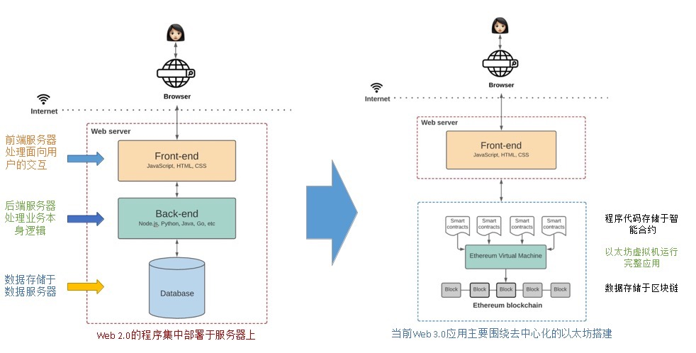
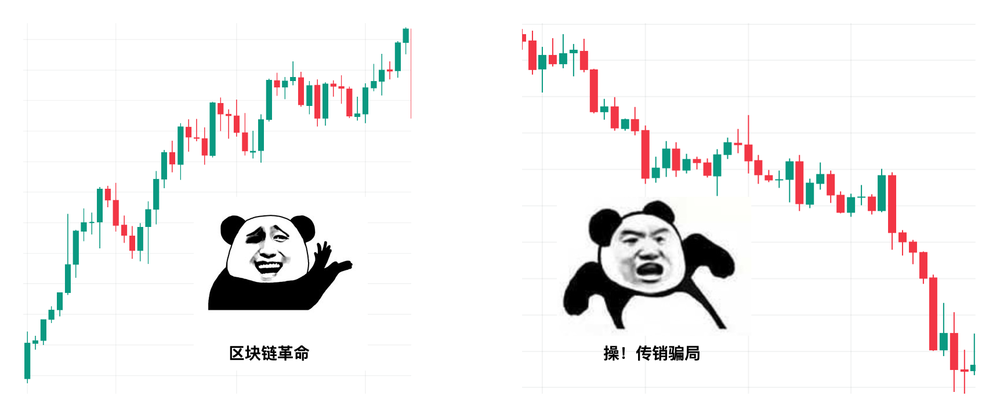
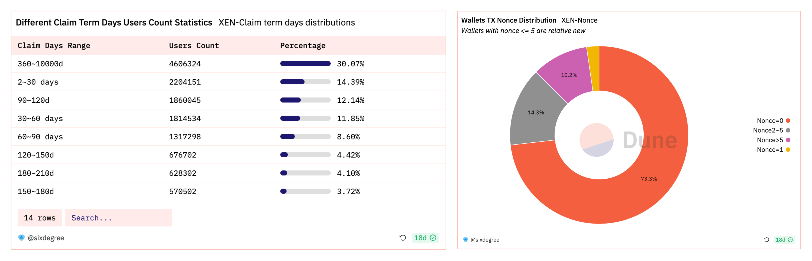

# 成为链上数据分析师#0 
## TL；DR
- 链上数据的丰富源于区块链技术的成熟和项目的创新
- 掌握链上数据视角有助于减少信息差，在黑暗森林里前行多一层保护
- 链上数据真实地反应了价值的流动，因此分析后的洞见更有价值
- 数据分析提供一个可量化的视角最终去支撑决策，分析只是过程而不是目的
- 好的数据分析来源于数据思维，需要加深行业理解，培养抽象事物的能力
## 什么是链上数据
大部分人刚接触区块链时都会得到这样的概念：区块链是个公开的、不可篡改的记账本，一切的转账、交易记录是透明可信的。然而这一功能并不是区块链的全部，只是最初我们从“点对点的电子现金系统”，也就是“记账本”这个角度出发的。随着智能合约的发展，区块链实际上正在成为一个大型的数据库，下图从架构对比了传统web2和web3应用的区别：智能合约代替了后端，区块链也承担起一部分数据库的功能。越来越多的链上项目涌现，我们在链上的交互越来越频繁，比如在DeFi协议里添加了多少流动性，mint了哪些NFT，甚至关注哪个社交账号记录都能上链，我们一切与区块链的交互都将被记录在这个数据库中，这些记录就属于链上数据。

**链上数据大致分为三类：**
1. 交易数据
如收发地址，转账金额，地址余额等

2. 区块数据
例如时间戳，矿工费，矿工奖励等

3. 智能合约代码
即区块链上的编码业务逻辑

链上数据分析就是从这三类数据中提取想要的信息进行解读。 从数据栈角度来看，区块链数据产品可以分为数据源、数据开发工具和数据app三类。

灵活运用各类数据产品，会为我们在crypto世界提供崭新的视角。

虽然我们一直在说链上数据是公开透明的，但是我们很难直接读取那些数据，因为一笔简单的swap交易在链上看起来可能是这样的：

我们能在区块链浏览器里看到一些原始链上数据，但是我的问题是想知道今天UniswapV3成交量是多少，这不解决我问题阿！我想看到的是下面这张图：

链上原始数据并不能给我们答案，我们需要通过索引 (indexing)，处理 (processing)，存储 (storage) 等等一系列数据摄取 (ingestion) 的处理过程，再根据所提问题来聚合运算对应的数据，才能得到问题的答案。

要从头做起，我们可能需要自己搭节点来接区块链数据，再作处理，但是这明显是非常耗时耗力的。还好，有许多数据平台，如Dune，Flipside，Footprint，他们将索引得到的原始链上数据，经过一系列处理后，存入由平台负责更新和管理的数据仓库，也就是说整个区块链数据被他们做成了好多张关系型数据表格，我们要做的就是从表格里选一些我们想要的数据构建我们的分析数据。更进一步地，有Nansen，Messari，DeBank这些数据类产品，不光整理好数据，还按照需求分门别类地封装起来，方便用户直接使用。

|分类 | 应用示例|
|--------|:---------------:|
|数据应用 | Nansen，Messari，DeBank..|
|数据平台 |Dune，FLipside，Footprint.. |
|数据节点 | Infura，Quick Node..|

## 链上数据的重要性
随着链上生态的繁荣，丰富的交互行为带来了海量数据。这些链上数据对应着链上价值的流动，对这些数据的分析和根据分析而得出的洞察和见解变得极为有价值。通过链上透明且不会说谎的数据，我们可以推断交易者，甚至市场整体的心理状态和心理预期，从而帮助自身做更有利的决策，也可以在黑暗森林前行中时为自己提起一盏明灯，照亮前方保护自己。

以大家熟悉的DeFi协议流动性挖矿为例：你添加流动性收获了奖励，池子增加了深度，用户享受了更低的滑点，大家都有光明的未来，你安心地将钱锁在合约里。可是某一天，黑天鹅悄然而至，聪明钱消息灵通立马撤退，而你只是个普通投资者，等你看到负面新闻再想到去提款时，手里的奖励几乎分文不值，猛烈的无常损失让你保本都难，直呼区块链骗局。

但如果你有个链上数据的视角，你可能会发现：协议TVL陡然下降，奖励的代币在Uniswap上抛量激增，换句话说，有聪明人得到消息或者发现不对，池子里的流动性变差钱在逃跑，大家都看跌代币疯狂出售，请问现在应该离场吗？

当然这只是个抽象且简单的举例，但是我想传递给大家的是：**普通投资者在Crypto这片黑暗丛林中，始终处于信息不对称的劣势地位。** 但是链上数据是透明且真实的。为什么大家很执着于追踪Nansen的Smart Money？因为有内幕的人不会把消息告诉你，但是信息会映射到链上行为，被真实地记录下来，我们所要做的就是细心地观察这个数据世界，通过捕捉链上细节，在一定程度上弥补信息差。

DeFi summer之后，我们开始关心协议的锁仓量；Axie爆火，我们研究日增用户数；NFT崛起，我们研究mint数；以太坊上Gas飙升，我们观察是哪个项目这么火热。发现了吗？我们对链上数据与日俱增的了解和敏感度实则上来源于链上活动的繁荣发展，换句话说，**链上数据的重要性来源于区块链技术的成熟和应用的蓬勃。** 越来越多的链上项目给了我们足够丰富的交互空间，同时随着SBT、OAT的成熟和广泛应用，万物上链变为可能，这意味着日后的数据将多到足以支撑每一个用户丰满的链上肖像，届时我们能讲出关于DID，SocialFi更好的故事。

## 链上数据分析谁来做
对于大部分用户来说，成熟的数据产品已经够用，灵活组合多个数据工具就能取到不错的效果。比如使用Nansen帮助用户追踪巨鲸的实时动向；用Token Terminal查看各协议的收入；NFT类的数据监控平台更是五花八门。这些“成品”类数据产品虽然门槛低，使用方便，却也有无法满足高定制化要求的瓶颈。

举个例子， 你通过https://ultrasound.money/ 发现以太坊上Gas消耗突然上涨，是由这个没有听说过的XEN推动的，你敏锐地意识到，这可能是个早期机会！通过推特搜索，你了解了XEN采用PoP（Proof of Participation）挖矿机制，XEN挖矿参与者拥有挖出的XEN代币的所有权，随参与人数增加，挖矿难度加大，供应量降低。你想了解大家的参与情况，光靠个gas消耗可不够，你还想知道参与的人数，趋势，参与者都选择锁仓多久？同时你还发现，他好像没有防女巫？付个gas就能参与，冲进来的科学家多吗？我还有利润吗？分析到这你急需数据来支撑你“冲不冲”的决策，可是正因为早期，数据app中还没有对它的分析，同时数据app也很可能不会对每一个协议都进行监控分析。这就是为什么已经有很多数据产品的情况下，我们仍然需要自己会写一些数据分析：现成的产品难以满足定制化的需求。

通过自己分析数据：https://dune.com/sixdegree/xen-crypto-overview， 我得知了大部分人都选择的是短期质押，且接近百分70的都是新钱包，说明被大家撸坏了，那我就明白了短期抛售压力会非常大，所以我如果想选择参与，就选质押最短的时间，尽快卖出，比谁跑得快。
至此，你已经完成了链上数据分析的整个流程：发现项目，研究项目机制，抽象出评估项目的标准，最后才是动手做数据处理、可视化，辅助决策。

## 如何做链上数据分析
尽管Dune这类的数据分析平台已经为我们做了很多整理工作，我们只要用SQL类的语法从数据表中抽取我们需要的部分进行构建就可以了。大部分人的学习路径我相信都是直奔《3日速成SQL》，拿下之后又开始迷茫，还是不知道如何从毛线团中找到哪根线头。怎么会这样？学习数据分析最重要的是培养数据思维，熟练使用编程语言是次要的。

**数据分析提供一个可量化的视角最终去支撑决策，分析只是过程而不是目的。简单的步骤是厘清三个问题，构建数据思维：** 

**1. 我的目的是什么？**

是判断一个币现在是否是买入的好时机？决定是否为AAVE添加流动性赚取收益？还是想知道现在入场Stepn是否为时已晚？

**2. 我的策略是什么？**

买币的策略就是紧跟Smart money，买啥跟啥，他进我进他出我出；观察如果协议运作情况良好，存款利率满意，就把暂时不动的币存进去吃利息；Stepn最近大火，如果势头仍然向上，那我就参与其中。

**3. 我需要什么数据帮我做决策？**

需要监控Smart money地址的持仓动向，甚至考量代币的交易量和持仓分布；要查一下协议的TVL，未偿债务数额，资金利用率，APR等；考虑每日新增用户数，增长趋势，每日活跃用户数，交易笔数，玩家出入金情况，NFT市场里道具的销售情况。

这三个问题的难度逐渐增加，一二还容易回答，想明白第三个问题需要大量的学习和理解，这也是区分数据分析师们水平高低的小门槛。一名优秀的分析师应该具备以下三种特点：

**1. 对赛道或者协议有理解与认识**

即分析的是什么赛道？这个项目的运行机制是什么？会产生哪些数据，分别代表什么含义？

**2. 抽象事物的能力**

将一个模糊的概念变成可量化的指标，即

>“这个DEX协议好不好” =>“流动性”+“成交量”+“活跃用户量”+“资本利用率”+“协议产生的收益”

再回到上一点，通过你对协议的了解找到对应的数据。

**3. 处理数据的能力**

这里包含取数据（链上数据从哪来），处理数据（怎么筛选想要的滤除无关的），以及数据可视化的能力。

总的来说，数据分析只是支撑研究的工具，不要为了分析而分析。这个过程首先是出于你想对某个项目、概念、赛道进行研究、投资，然后学习、了解项目的运行机制，抽象出对定性概念的定量分析，最后才是找数据，做可视化。

数据分析最重要的始终是数据思维，至于最后动手做这一步，无非是熟练功，可以分为两部分：

- 对区块链数据结构的了解。比如在EVM链中，只有EOA账户能发起交易，但是智能合约在被调用时可以转账ETH，这些内部调用就是通过traces 表来记录的，所以查表时查transactions会遗漏内部调用的交易。
- 掌握Python、SQL等语言。掌握基本的数据库语言，无论是自己接数据或者用数据平台，都可以比较得心应手。

## 最后

网上有关链上数据分析的资料或者教程不少，但是都比较零散，质量也参差不齐。Web3是一所开放的大学，但是很多精力花费在寻找合适的教材上是比较痛苦的，同时大部分高质量的内容都是英文书写，对国内的用户构成一定语言障碍。

因此，Sixdegree团队将推出《成为链上数据分析师》的系列教程，以实际应用为导向，结合区块链数据结构和SQL语法，为大家提供一套上手教材，帮助更多的人掌握链上数据分析技能，最大化利用区块链数据的特性，一定程度上消除信息差。熊市多Build，成为链上数据分析师就从这里开始吧！

## 关于我们
SixdegreeLab是专业的链上数据团队，我们的使命是为用户提供准确的链上数据图表、分析以及洞见，并致力于普及链上数据分析。通过建立社区、编写教程等方式，培养链上数据分析师，输出有价值的分析内容，推动社区构建区块链的数据层，为未来广阔的区块链数据应用培养人才，欢迎大家加入社区交流！

## 参考资料
1. [The Capital Efficiency Era of DeFi](https://blog.hashflow.com/the-capital-efficiency-era-of-defi-d8b3427feae4)
2. [Using On-Chain Data for Policy Research: Part 1](https://policy.paradigm.xyz/writing/using-on-chain-data-for-policy-research-part-1)
3. [IOSG：解析链上数据分析平台现状与前景](https://foresightnews.pro/article/detail/8473)
4. [An Introduction to «On-chain» Analysis](https://www.blockstar.ch/post/an-introduction-to-on-chain-analysis)
5. [The Architecture of a Web 3.0 application](https://www.preethikasireddy.com/post/the-architecture-of-a-web-3-0-application)
6. [Sixdegree Dune Dashborads](https://dune.com/sixdegree)
