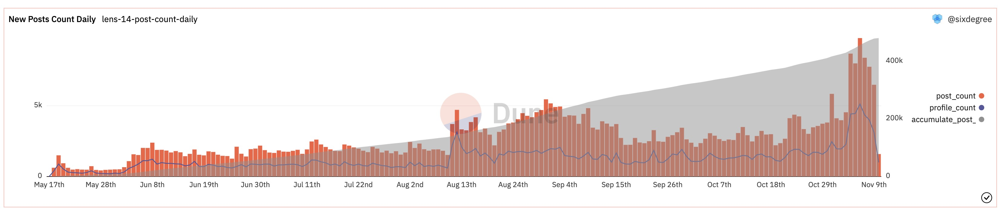
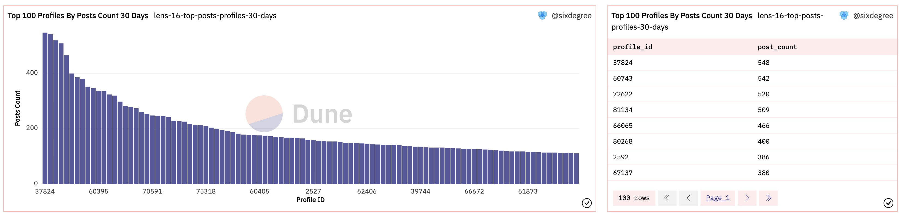
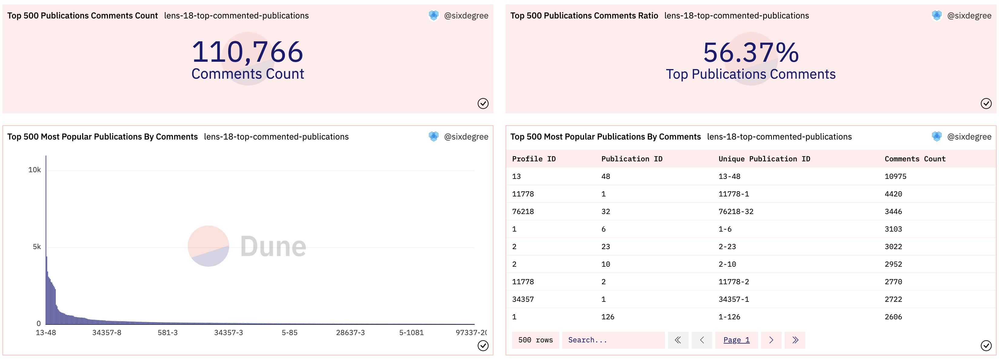
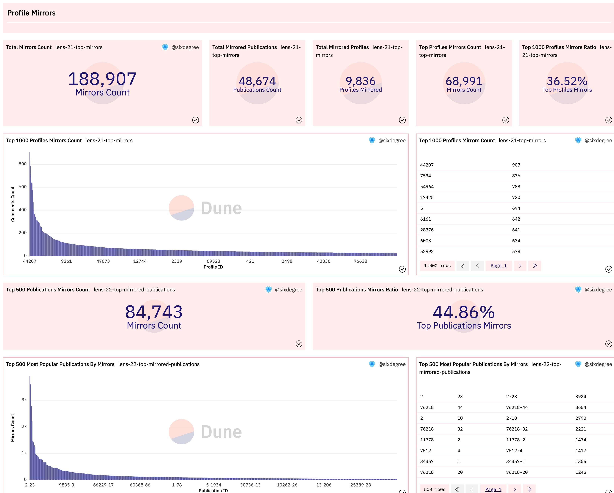
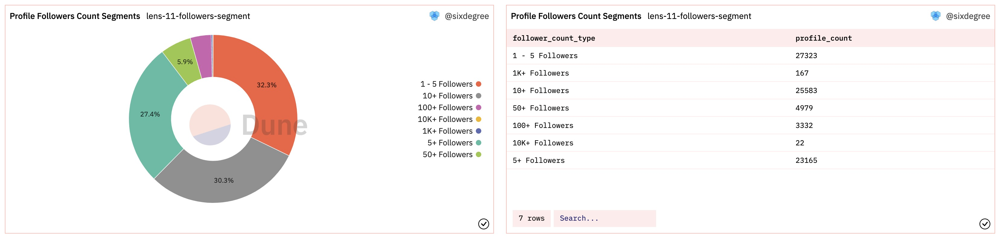
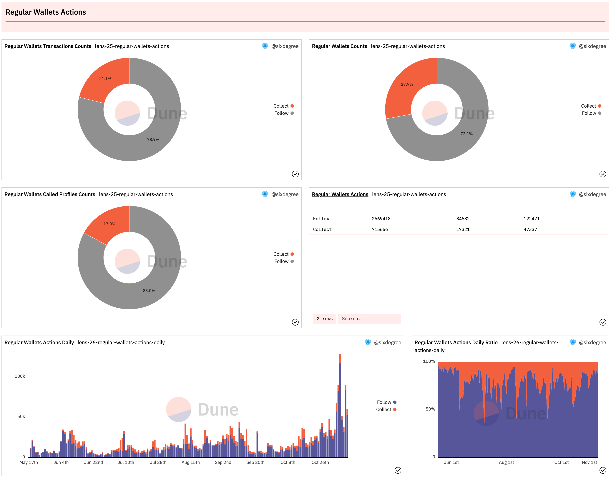

# 实践案例：制作Lens Protocol的数据看板（二）

在本教程的第一部分中，我们给大家介绍了Lens协议，并为其制作了一个初步的看板，分析了包括总交易数量和总用户数量、按天统计的交易数量和独立用户数量、创作者个人资料（Profile）分析、Lens域名分析、已注册域名搜索等相关内容。让我们继续给这个数据看板添加新的查询和可视化图表。我们将分析并添加以下内容：同一个地址创建多个Profile、关注、发帖、评论、收藏、镜像数据,以及创作者的操作综合情况、普通用户地址的操作综合情况。


## 同一个地址创建多个Profile分析

Lens协议允许一个地址创建多个Profile。我们可以编写一个查询来统计创建了多个Profile的地址的数据分布情况。在下面的查询中，我们先用CTE `profile_created`取得所有已创建的Profile的数据详情，然后使用`multiple_profiles_addresses`来统计每一个地址创建的Profile数量。最后，我们使用CASE语句，按每个地址创建的Profile的数量对其进行归类，返回综合的统计数据。

```sql
with profile_created as (
    select json_value(vars, 'lax $.to') as user_address,
        json_value(vars, 'lax $.handle') as handle_name,
        replace(json_value(vars, 'lax $.handle'), '.lens', '') as short_name,
        call_block_time,
        output_0 as profile_id,
        call_tx_hash
    from lens_polygon.LensHub_call_createProfile
    where call_success = true    
),

multiple_profiles_addresses as (
    select user_address,
        count(profile_id) as profile_count
    from profile_created
    group by 1
    order by 2 desc
)

select (case when profile_count >= 10 then '10+ Profiles'
            when profile_count >= 3 then '5+ Profiles'
            when profile_count = 2 then '2 Profiles'
            else '1 Profile'
        end) as profile_count_type,
    count(user_address) as user_address_count,
    sum(profile_count) as profile_count
from multiple_profiles_addresses
group by 1
```

做这类数据统计时，通常我们还需要得到一些Counter类型的统计值，比如创建过多个Profile的地址总数、这些地址一共创建了多少个Profile，这些Profile在所有已创建的Profile中的占比等等。查询这些数据时可以共用上面的CTE子查询代码，所以我们对其少做修改，添加了两个额外的CTE来统计这些Counter类型的数值。为这个查询添加可视化图表并分别加入到数据看板中，显示效果如下：


以上查询在Dune上的参考链接：
- [https://dune.com/queries/1562662](https://dune.com/queries/1562662)
- [https://dune.com/queries/1553030](https://dune.com/queries/1553030)


## 发帖数据分析

### 发帖最多的账号数据分析

Lens的创作者有两种发帖（Post）的方式，一直是直接用自己的账号发布Post，另一种是委托其他账号或者通过API的方式来发布。Post数据分别保存在`LensHub_call_post`和`LensHub_call_postWithSig`表中。每一个主题Post的内容以JSON字符串的形式保存在字段`vars`中，包括作者的ProfileID，帖子内容的URL等信息。对于字符串形式的JSON内容，我们可以使用`:`操作符来访问其中的值。下面的查询可以获得部分示范数据：

```sql
select call_block_time,
    call_tx_hash,
    output_0 as post_id,
    json_value(vars, 'lax $.profileId') as profile_id, -- Access element in json string
    json_value(vars, 'lax $.contentURI') as content_url,
    json_value(vars, 'lax $.collectModule') as collection_module,
    json_value(vars, 'lax $.referenceModule') as reference_module,
    vars
from lens_polygon.LensHub_call_post
where call_success = true
limit 10
```

鉴于发帖的Profile数量很多，我们可以像前面分析“同一个地址创建多个Profile”那样，对不同发帖数量的Profile做一个分类统计，还可以关注头部用户，即发帖最多的那些账号的数据。这里我们对发帖最多的账号进行分析，同时将这部分账号的发帖数量和总体发帖数量的进行对照，输出Counter图表。完整的SQL如下：

```sql
with post_data as (
    select call_block_time,
        call_tx_hash,
        output_0 as post_id,
        json_value(vars, 'lax $.profileId') as profile_id, -- Access element in json string
        json_value(vars, 'lax $.contentURI') as content_url,
        json_value(vars, 'lax $.collectModule') as collection_module,
        json_value(vars, 'lax $.referenceModule') as reference_module,
    from lens_polygon.LensHub_call_post
    where call_success = true
    
    union all
    
    select call_block_time,
        call_tx_hash,
        output_0 as post_id,
        json_value(vars, 'lax $.profileId') as profile_id, -- Access element in json string
        json_value(vars, 'lax $.contentURI') as content_url,
        json_value(vars, 'lax $.collectModule') as collection_module,
        json_value(vars, 'lax $.referenceModule') as reference_module,
    from lens_polygon.LensHub_call_postWithSig
    where call_success = true
),

posts_summary as (
    select count(*) as total_post_count,
        count(distinct profile_id) as posted_profile_count
    from post_data
),

top_post_profiles as (
    select profile_id,
        count(*) as post_count
    from post_data
    group by 1
    order by 2 desc
    limit 1000
)

select profile_id,
    post_count,
    sum(post_count) over () as top_profile_post_count,
    total_post_count,
    posted_profile_count,
    cast(sum(post_count) over () as double) / total_post_count * 100 as top_profile_posts_ratio
from top_post_profiles
inner join posts_summary on true
order by 2 desc
```

以上SQL解读：因为Post数据分别保存在两个表里，在CTE `post_data`中，我们使用`union all`将两个表中取出的数据合并到一起。我们通过`posts_summary`来统计所有发帖的Profile数量和他们累计发布的Post数量。在`top_post_profiles`中，我们按照每个Profile的发帖数量最多的1000个Profile的数据。最后，我们关联查询`top_post_profiles`和`posts_summary`，输出发帖最多的账号数据以及它们和总发帖数据的对比。将查询结果可视化并加入数据看板后的显示效果如下：


以上查询在Dune上的参考链接：
- [https://dune.com/queries/1554541](https://dune.com/queries/1554541)

### 每日新发帖数量统计

Lens用户每日的新发帖数量是观察整体活跃度变化趋势的一个重要指标，我们编写一个查询来统计每天的发帖数量。这个查询中的`post_data` CTE与之前的完全相同，所以我们在下面的代码中省略它的详情。因为我们还希望将每天的发帖数量进行累加返回累计发帖数量，我们定义`post_daily_summary` CTE作为中间步骤，以让SQL代码简单易懂。对应的SQL如下：

```sql
with post_data as (
    -- Get post data from LensHub_call_post and LensHub_call_postWithSig tables
),

post_daily_summary as (
    select date_trunc('day', call_block_time) as block_date,
        count(*) post_count,
        count(distinct profile_id) as profile_count
    from post_data
    group by 1
)

select block_date,
    post_count,
    profile_count,
    sum(post_count) over (order by block_date) as accumulate_post_count
from post_daily_summary
order by block_date
```

将查询结果可视化并加入数据看板后的显示效果如下：



以上查询在Dune上的参考链接：
- [https://dune.com/queries/1555124](https://dune.com/queries/1555124)


### 近30天发帖最活跃的Profile统计

同样，我们可能关心最近一段时间内发帖最活跃的Profile的情况。为此我们只需要在前述`post_data` CTE中，分别添加日期过滤条件来筛选最近30天内的发帖，然后按日期汇总统计即可。SQL如下：

```sql
with post_data as (
    select call_block_time,
        call_tx_hash,
        output_0 as post_id,
        json_value(vars, 'lax $.profileId') as profile_id, -- Access element in json string
        json_value(vars, 'lax $.contentURI') as content_url,
        json_value(vars, 'lax $.collectModule') as collection_module,
        json_value(vars, 'lax $.referenceModule') as reference_module
    from lens_polygon.LensHub_call_post
    where call_success = true
        and call_block_time >= now() - interval '30' day
    
    union all
    
    select call_block_time,
        call_tx_hash,
        output_0 as post_id,
        json_value(vars, 'lax $.profileId') as profile_id, -- Access element in json string
        json_value(vars, 'lax $.contentURI') as content_url,
        json_value(vars, 'lax $.collectModule') as collection_module,
        json_value(vars, 'lax $.referenceModule') as reference_module
    from lens_polygon.LensHub_call_postWithSig
    where call_success = true
        and call_block_time >= now() - interval '30' day
)

select profile_id,
    count(*) as post_count
from post_data
group by 1
order by 2 desc
limit 100
```

我们可以分别添加一个柱状图来显示过去30天内发帖最多的100个账号的发帖数量，同时添加一个Table类型的图表输出详情。相关图表加入数据看板后的显示效果如下：



以上查询在Dune上的参考链接：
- [https://dune.com/queries/1559981](https://dune.com/queries/1559981)


## 评论数据分析

### 评论最多的账号数据分析

Lens的评论数据与发帖数据类似，按数据产生来源不同，分别保存在`LensHub_call_comment`和`LensHub_call_commentWithSig`表中。基于Lens协议目前的功能，用户必须已经创建了自己的Profile才能对其他人创作者对Post进行评论。在评论数据表中，是通过评论者的Profile ID来进行追踪的。同时，每个创作者的发帖，其编号是从1开始累加的。也就是说，不同创作者的发帖，其编号可能相同。我们需要将创作者的Profile ID 和其Publication ID关联起来这样才能得到唯一的编号。SQL如下：

```sql
select call_block_time,
    call_tx_hash,
    output_0 as comment_id, -- 评论编号
    json_value(vars, 'lax $.profileId') as profile_id_from, -- 评论者的Profile ID
    json_value(vars, 'lax $.contentURI') as content_url, -- 评论内容链接
    json_value(vars, 'lax $.pubIdPointed') as publication_id_pointed, -- 被评论的Publication ID
    json_value(vars, 'lax $.profileIdPointed') as profile_id_pointed, -- 被评论的创作者的Profile ID
    json_value(vars, 'lax $.profileIdPointed') || '-' || json_value(vars, 'lax $.pubIdPointed') as unique_publication_id  -- 组合生成唯一编号
from lens_polygon.LensHub_call_comment
where call_success = true
limit 10
```

我们同样通过定义额外的CTE来获取总的评论数据，从而可以在同一个查询中输出Counter图表，对比评论最多的1000个账号的评论数据和所有账号的评论数据。将查询结果可视化并加入到数据看板后的显示效果如下：


以上查询在Dune上的参考链接：
- [https://dune.com/queries/1560028](https://dune.com/queries/1560028)

### 评论最多的Publication统计

每个评论都是针对一个具体的对象（Publication）（这里作者认为应该就是Post，如有理解错误敬请指正）。分析被评论最多的Publication就具有一定的价值。我们编写一个查询来统计前500个被评论最多的Publication，同时将其与所有评论数据进行对比。SQL如下：

```sql
with comment_data as (
    -- get comment data from LensHub_call_comment and LensHub_call_commentWithSig tables
)

select profile_id_pointed,
    publication_id_pointed,
    unique_publication_id,
    count(*) as comment_count
from comment_data
group by 1, 2, 3
order by 4 desc
limit 500
```

如法炮制，我们添加额外的CTE来获取全部评论数据，并将上面统计的前500个评论最多的Publication与全局数据进行对比。添加相应的可视化图表到数据看板，效果如下：



以上查询在Dune上的参考链接：
- [https://dune.com/queries/1560578](https://dune.com/queries/1560578)

## 镜像数据分析

镜像数据与评论数据高度相似，用户也必须先创建自己的Profile才能镜像其他人的Publication。我们分别编写两个查询，统计出镜像操作最多的前1000个账号数据和前500个被镜像最多的Publication数据。同样将它们跟整体镜像数据进行对比。加入数据看板后的效果如下图所示：



以上查询在Dune上的参考链接：
- [https://dune.com/queries/1561229](https://dune.com/queries/1561229)
- [https://dune.com/queries/1561558](https://dune.com/queries/1561558)


## 收藏数据分析

Lens的收藏数据同样分别保存在`LensHub_call_collect`和`LensHub_call_collectWithSig`这两个表里。与评论或镜像数据有所不同的是，收藏一个Publication时并不要求收藏者拥有自己的Lens Profile。也就是说，任何地址（用户）都可以收藏其他Profile下的Publication。所以我们要通过收藏者的地址来跟踪具体的收藏操作。特别之处在于，在`LensHub_call_collect`表中并没有保存收藏者的地址数据，`LensHub_call_collectWithSig`表中则有这个数据。我们需要从`LensHub_call_collect`表关联到`transactions`表，获取当前操作收藏的用户地址。SQL示例如下：

```sql
select call_block_time,
    t."from" as collector,
    c.profileId as profile_id,
    c.pubId as publication_id,
    cast(c.profileId as varchar) || '-' || cast(c.pubId as varchar) as unique_publication_id,
    c.output_0 as collection_id
from lens_polygon.LensHub_call_collect c
inner join polygon.transactions t on c.call_tx_hash = t.hash -- 关联交易表获取用户地址
where call_block_time >= date('2022-05-18') -- Lens合约的发布日期，提升查询效率
    and block_time >= date('2022-05-18')
    and c.call_success = true
limit 10
```

由于交易表记录相当庞大，查询耗时会明显增加。一个经验法则是，能避免针对原始数据表（transactions, logs, traces）的join操作就尽量避免。

收藏数据分析SQL的其他部分跟前面的例子基本相同，这里不再赘述。同样，我们也针对被收藏最多的Publication进行统计分析。相关可视化图片加入数据看板后显示效果如下图所示：


以上查询在Dune上的参考链接：
- [https://dune.com/queries/1560847](https://dune.com/queries/1560847)
- [https://dune.com/queries/1561009](https://dune.com/queries/1561009)


## 关注数据分析

### 关注最多的Profile数据

Lens协议的关注数据仍然是分别保存在`LensHub_call_follow`和`LensHub_call_followWithSig`两个表里。任何地址（用户）都可以关注其他Profile。与收藏类似，`LensHub_call_follow`表里没有保存关注者的地址，所以我们也需要通过关联到`transactions`表来获取当前操作收藏的用户地址。另外，关注还有一个特殊的地方，就是一个交易里面可以同时批量关注多个Profile。`LensHub_call_follow`表中，被关注的Profile数据保存在数组类型字段`profileIds`里，这个相对容易处理。而表`LensHub_call_followWithSig`中，则是JSON字符串格式里面的数组值。其中字段`vars`的一个实例如下（部分内容做了省略）：

```json
{"follower":"0xdacc5a4f232406067da52662d62fc75165f21b23","profileIds":[21884,25271,39784],"datas":["0x","0x","0x"],"sig":"..."}
```

使用Dune SQL的JSON函数，可以从JSON字符串中读取数组值。我们可以先使用`json_extract()`从json 字符串中提取需要的元素值，再使用`cast()`方法将其转换为指定类型的数组。示例代码如下：

```sql
select
json_query(vars, 'lax $.follower') AS follower, -- single value
json_query(vars, 'lax $.profileIds') AS profileIds, -- still string
from_hex(cast(json_extract(vars,'$.follower') as varchar)) as follower2, -- cast to varbinary
cast(json_extract(vars,'$.profileIds') as array(integer)) as profileIds2, -- cast to array
vars
from lens_polygon.LensHub_call_followWithSig
where cardinality(output_0) > 1
limit 10
```

读取关注详情的完整SQL代码如下：

```sql
with follow_data as (
    select f.follower, p.profile_id
    from (
        select from_hex(cast(json_extract(vars,'$.follower') as varchar)) as follower, -- cast to varbinary
            cast(json_extract(vars,'$.profileIds') as array(integer)) as profile_ids -- cast to array
        from lens_polygon.LensHub_call_followWithSig
            
        union all
        
        select t."from" as follower,
            cast(f.profileIds as array(integer)) as profile_ids
        from lens_polygon.LensHub_call_follow f
        inner join polygon.transactions t on f.call_tx_hash = t.hash
        where call_block_time >= date('2022-05-18') -- Lens launch date
            and block_time >= date('2022-05-18')
            and call_success = true
    ) f
    cross join unnest(f.profile_ids) as p(profile_id)
)

select * from follow_data
limit 100
```

这里需要说明一下，我们使用了`cross join unnest(f.profile_ids) as p(profile_id)`子句，将子查询中的数组进行拆解，并获取拆开的单个ID值。同时，因为`lens_polygon.LensHub_call_follow`表中的元素类型为`uint256`，这是一个Dune 的自定义类型，我们无法在从json字符串提取值时使用这个类型，所以我们用`cast(f.profileIds as array(integer))`将`uint256`转换为`integer`类型。

同样，我们也在上面的查询基础上添加获取全部关注数据的CTE定义，从而可以在取得最多关注的Proile列表时，将其与整体关注数量进行对比。查询结果可视化并加入数据看板后的效果如下：


以上查询在Dune上的参考链接：
- [https://dune.com/queries/1554454](https://dune.com/queries/1554454)

### 按关注数量范围统计Profile分布

我们看到几乎绝大部分Profile都有被关注，我们可以用一个查询来对各Profile的关注量的分布情况做一个分析。SQL代码如下：

```sql
with follow_data as (
    -- Get follow data from table LensHub_call_follow and LensHub_call_followWithSig
),

profile_follower as (
    select profile_id,
        count(follower) as follower_count
    from follow_data
    group by 1
)

select (case when follower_count >= 10000 then '10K+ Followers'
            when follower_count >= 1000 then '1K+ Followers'
            when follower_count >= 100 then '100+ Followers'
            when follower_count >= 50 then '50+ Followers'
            when follower_count >= 10 then '10+ Followers'
            when follower_count >= 5 then '5+ Followers'
            else '1 - 5 Followers'
        end) as follower_count_type,
    count(profile_id) as profile_count
from profile_follower
group by 1
```

将以上查询结果使用一个Pie chart饼图进行可视化。加入到数据看板后到显示效果如下图所示：



以上查询在Dune上的参考链接：
- [https://dune.com/queries/1554888](https://dune.com/queries/1554888)

### 每日新增关注数量统计

Lens用户每日的新增关注数量也是观察整体活跃度变化的一个重要指标，我们编写一个查询来统计每天的新增关注数量。这个查询中的`follow_data` CTE与之前的完全相同。查询处理方式也与前面讲过的每日发帖数量统计高度相似，这里不再详述细节。给查询结果添加可视化图表并将其加入数据看板，显示效果如下：


以上查询在Dune上的参考链接：
- [https://dune.com/queries/1555185](https://dune.com/queries/1555185)

## 创作者操作综合分析

结合前述内容可以看出，创作者（拥有Profile的用户）可以发帖（Post）、评论（Comment）或者镜像（Mirror）其他创作者的数据，而普通用户（未创建Profile）则可以关注（Follow）创作者和收藏创作者发布的作品（Publication）。所以我们可以将创作者可以操作的数据合并到一起来进行综合分析。

我们定义一个`action_data` CTE，在其内部使用嵌套CTE的方式将相关数据集中到一起，其中post_data、comment_data和mirror_data的定义与前面相关查询完全相同。我们使用union all将以上数据合并到一起，同时分布指定对应的动作类型，生成一个用于分类的字段`action_type`。然后我们只需按照分类字段进行汇总统计即可计算出每种操作类型的交易数量和相应的Profile数量。SQL示例如下：

```sql
with action_data as (
    with post_data as (
        -- get post data from relevant tables
    ),
    
    comment_data as (
        -- get comment data from relevant tables
    ),
    
    mirror_data as (
        -- get mirror data from relevant tables
    )
 
    select 'Post' as action_type, * from post_data
    union all
    select 'Mirror' as action_type, * from mirror_data
    union all
    select 'Comment' as action_type, * from comment_data
)

select action_type,
    count(*) as transaction_count,
    count(distinct profile_id) as profile_count
from action_data
group by 1
```

我们可以用相似的方法，新建一个按日期汇总每日各种操作数量的查询。示例代码如下：

```
with action_data as (
    -- same as above query
)

select date_trunc('day', call_block_time) as block_date,
    action_type,
    count(*) as transaction_count
from action_data
group by 1, 2
order by 1, 2
```
 
将以上查询结果可视化并加入数据看板，显示效果如下：


以上查询在Dune上的参考链接：
- [https://dune.com/queries/1561822](https://dune.com/queries/1561822)
- [https://dune.com/queries/1561898](https://dune.com/queries/1561898)

## 普通用户操作综合分析

与创作者类似，我们可以将普通用户可执行的关注和收藏操作合并到一起进行分析。我们同样编写两个查询，分别统计总体的操作分布和按日期的操作数量。查询里面的`action_data`数据同样来源于前面介绍过的收藏查询和关注查询，其SQL示例如下：

```sql
with action_data as (
    with follow_data as (
        -- get follow data from relevant tables
    ),
    
    collect_data as (
        -- get collect data from relevant tables
    )

    select 'Follow' as action_type, * from follow_data
    union all
    select 'Collect' as action_type, * from collect_data
)
```

除了数据来源不同，这两个查询与创作者操作综合分析的查询方法基本相同。将查询结果可视化并加入数据看板，显示效果如下：



以上查询在Dune上的参考链接：
- [https://dune.com/queries/1562000](https://dune.com/queries/1562000)
- [https://dune.com/queries/1562178](https://dune.com/queries/1562178)


## 总结与作业

非常好！我们已经完成了对Lens协议的整体分析。不过，由于篇幅问题，仍然有很多值得分析的指标我们尚未涉及，包括但不限于：三种NFT的相关数据分析、创作者的收益分析、Profile账号的转移情况分析等。这部分留给大家去继续探索。

请结合教程内容，继续完善你自己的Lens协议数据看板，你可以Fork本教程的查询去修改，可以按自己的理解做任何进一步的扩展。请大家积极动手实践，创建数据看板并分享到社区。我们将对作业完成情况和质量进行记录，之后追溯为大家提供一定的奖励，包括但不限于Dune社区身份，周边实物，API免费额度，POAP，各类合作的数据产品会员，区块链数据分析工作机会推荐，社区线下活动优先报名资格以及其他Sixdegree社区激励等。

## SixdegreeLab介绍

SixdegreeLab（[@SixdegreeLab](https://twitter.com/sixdegreelab)）是专业的链上数据团队，我们的使命是为用户提供准确的链上数据图表、分析以及洞见，并致力于普及链上数据分析。通过建立社区、编写教程等方式，培养链上数据分析师，输出有价值的分析内容，推动社区构建区块链的数据层，为未来广阔的区块链数据应用培养人才。

欢迎访问[SixdegreeLab的Dune主页](https://dune.com/sixdegree)。

因水平所限，不足之处在所难免。如有发现任何错误，敬请指正。
