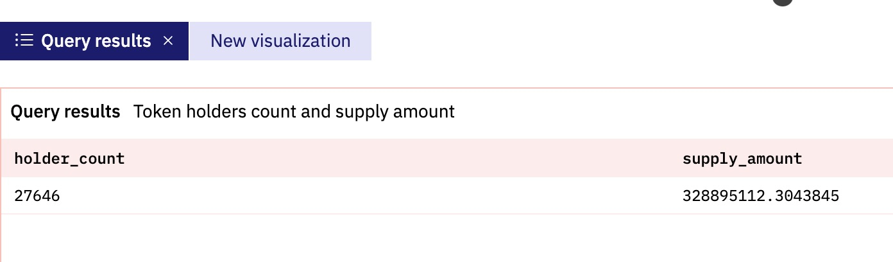

# 常见查询二：代币的持有者、总供应量、账户余额

在常见查询的第一部分中，我们主要讲解了查询ERC20代币价格的各种不同方法。通常我们还需要查询某个代币的持有者数量、代币总供应量（流通量）、各持有者的账户余额（例如持有最多的账号的余额）等相关信息。接下来我们针对这部分内容进行介绍。

与比特币通过未花费的交易产出（UTXO）来跟踪账户余额不同，以Ethereum为代表的EVM兼容区块链使用了账户余额的模型。每个账号地址有针对每种ERC20代币的转入记录和转出记录，将这些转入和转出数据汇总到一起，就可以得到账户的当前余额。因为区块链本身并没有保存每个地址的当前余额，我们必须通过计算才能得到这个数据。Dune V2的魔法表`erc20_day`、`erc20_latest`（路径：Spells/balances/ethereum/erc20/）等将每个地址下每种ERC20代币的最新余额、每天的余额进行了整理更新，可以用于查询。但是根据测试，使用这些魔法表目前存在两个问题：一是目前还只有Ethereum链的账户余额魔法表，尚不支持查询其他链的数据；二是看起来这些表的查询性能并不是很理想。所以我们这里不介绍这些表的使用，大家可以自行探索。

要查询单个ERC20代币的账户余额信息，首先我们需要知道对应代币的合约地址。这个可以通过查询`tokens.erc20`表来获得。比如我们想查询FTT Token的信息，可以执行下面的查询，从查询结果我们得到FTT Token的合约地址是： 0x50d1c9771902476076ecfc8b2a83ad6b9355a4c9 。

```sql
select * from tokens.erc20
where symbol = 'FTT'
    and blockchain = 'ethereum'
```

## 查询代币持有者数量和代币的总流通量

如前所述，不管是要计算某个账户下某个代币的余额，还是计算某个代币全部持有者账户下的余额，我们都需要将转入转出数据合并到一起。对于转入数据，我们取`to`为用户的地址，金额为正数。对于转出数据，则取`from`为用户地址，同时金额乘以“-1”使其变成负数。使用`union all`将所有记录合并到一起。以下示例代码考虑执行性能问题，特意增加了`limit 10`限制条件：

```sql
select * from (
    select evt_block_time,
        evt_tx_hash,
        contract_address,
        "to" as address,
        cast(value as decimal(38, 0)) as amount
    from erc20_ethereum.evt_Transfer
    where contract_address = 0x50d1c9771902476076ecfc8b2a83ad6b9355a4c9

    union all
    
    select evt_block_time,
        evt_tx_hash,
        contract_address,
        "from" as address,
        -1 * cast(value as decimal(38, 0)) as amount
    from erc20_ethereum.evt_Transfer
    where contract_address = 0x50d1c9771902476076ecfc8b2a83ad6b9355a4c9
)
limit 10    -- for performance
```

在上面的查询中，我们使用`union all`将每个账户地址中转入的和转出的FTT Token合并到一起，并且只取了10条样本数据。注意我们使用`value::decimal(38, 0)`对`value`字段对值进行了强制转换，因为现在这个字段是以字符串形式保存的，不做转换会在计算时遇到一些问题。这里的数字38是目前Dune的底层数据库支持的最大整数位数，0表示不含小数位。

这里合并到一起的是明细转账数据，我们需要计算的账户余额是汇总数据，可以在上述查询基础上，将其放入一个CTE定义中，然后针对CTE执行汇总统计。考虑到很多代币的持有人地址数量可能很多（几万甚至更多），我们通常关注的是总持有人数、总流通量和持有量最多的那部分地址，我们可以将按地址汇总的查询也放入一个CTE中，方便在此基础上根据需要做进一步的统计。这里我们首先统计持有者总数，查询时排除那些当前代币余额为0的地址。新的SQL如下：

```sql
with transfer_detail as (
    select evt_block_time,
        evt_tx_hash,
        contract_address,
        "to" as address,
        cast(value as decimal(38, 0)) as amount
    from erc20_ethereum.evt_Transfer
    where contract_address = 0x50d1c9771902476076ecfc8b2a83ad6b9355a4c9
    
    union all
    
    select evt_block_time,
        evt_tx_hash,
        contract_address,
        "from" as address,
        -1 * cast(value as decimal(38, 0)) as amount
    from erc20_ethereum.evt_Transfer
    where contract_address = 0x50d1c9771902476076ecfc8b2a83ad6b9355a4c9
),

address_balance as (
    select address,
        sum(amount) as balance_amount
    from transfer_detail
    group by address
)

select count(*) as holder_count,
    sum(balance_amount / 1e18) as supply_amount
from address_balance
where balance_amount > 0
```

上面的查询中，我们在`address_balance`这个CTE里面按地址统计了账户余额，然后在最后的查询中计算当前余额大于0的地址数量（持有者数量）和所有账户的余额汇总（流通总量）。因为FTT代币的小数位数是18位，我们在计算`supply_amount`时，将原始金额除以`1e18`就换算成了带有小数位数的金额，这个就是FTT代币的总流通量。需要注意，不同的ERC20代币有不同的小数位数，前面查询`tokens.erc20`表的返回结果有这个数据。`1e18`是`power(10, 18)`的一种等价缩写，表示求10的18次方。由于FTT代币有2万多个持有地址，这个查询相对耗时较长，可能需要几分钟才能执行完毕。

查询结果显示如下图所示。对比Etherscan上面的数据[https://etherscan.io/token/0x50d1c9771902476076ecfc8b2a83ad6b9355a4c9](https://etherscan.io/token/0x50d1c9771902476076ecfc8b2a83ad6b9355a4c9)可以看到，代币的流通总量量基本吻合，但是持有人数量有一定的差异。这种差异是由于对余额特别少的账户的判定标准的不同而引起的，我们可以在汇总每个地址的余额时就将其转换为带有小数位数的值，最后统计持有者数量和总流通量时忽略余额特别小的那部分账户。一个经验法则是可以忽略余额小于`0.001`或者`0.0001`的地址。



参考查询示例：[https://dune.com/queries/1620179](https://dune.com/queries/1620179)

## 查询持有代币最多的地址

在前面查询代币持有者数量和流通量的Query中，我们已经按地址汇总统计了每个持有者当前的代币余额。因此可以很容易在此基础上查询出那些持有代币数量最多的用户地址以及他们各自的持有数量。这里可以Fork这个查询进行修改，也可以复制查询代码再新建查询。因为我们查询的是单个代币，我们可以将硬编码的代币地址替换为一个查询参数`{{token_contract_address}}`，并将上面FTT代币的合约地址设置为默认值，这样就可以灵活地查询任意代币的数据了。下面的查询返回持有代币数量最多的100个地址：

```sql
with transfer_detail as (
    select evt_block_time,
        evt_tx_hash,
        contract_address,
        "to" as address,
        cast(value as decimal(38, 0)) as amount
    from erc20_ethereum.evt_Transfer
    where contract_address = {{token_contract_address}}
    
    union all
    
    select evt_block_time,
        evt_tx_hash,
        contract_address,
        "from" as address,
        -1 * cast(value as decimal(38, 0)) as amount
    from erc20_ethereum.evt_Transfer
    where contract_address = {{token_contract_address}}
),

address_balance as (
    select address,
        sum(amount / 1e18) as balance_amount
    from transfer_detail
    group by address
)

select address,
    balance_amount
from address_balance
order by 2 desc
limit 100
```

使用FTT代币合约地址默认参数，上面的查询返回持有FTT数量最多的100个地址。我们可以可视化一个柱状图，对比前100名持有者的持有金额情况。因金额差异明显，我们选择将Y轴数据对数化处理，勾选Logarithmic选项。如下图所示：


参考查询示例：[https://dune.com/queries/1620917](https://dune.com/queries/1620917)

## 查询不同代币持有者的持有金额分布

如果我们需要了解持有某个ERC20代币的所有用户地址的账户余额的分布情况，有两种可选的方式，一种方式使用经验法则设置分区，得到的结果相对比较粗略，可能会错过一些关键特征，而且在需要同时支持分析多种不同的代币时也不够灵活。另一种方式则比较精确，但同时也更加复杂。我们分别进行介绍。

**按经验法则统计分布情况：** 因为统计的是金额的区间分布（统计数量分布时也类似）我们可以选择典型的金额进行分区：10000以上，1000-10000之间，500-1000之间，100-500之间，10-100之间，1-10之间，以及小于1等。当然你可以根据分析的具体代币的总发行量进行调整已满足需求。查询代码如下：

```sql
with transfer_detail as (
    -- Same as previous sample
),

address_balance as (
    select address,
        sum(amount / 1e18) as balance_amount
    from transfer_detail
    group by address
)

select (case when balance_amount >= 10000 then '>= 10000'
            when balance_amount >= 1000 then '>= 1000'
            when balance_amount >= 500 then '>= 500'
            when balance_amount >= 100 then '>= 100'
            when balance_amount >= 10 then '>= 10'
            when balance_amount >= 1 then '>= 1'
            else '< 1.0'
        end) as amount_area_type,
        (case when balance_amount >= 10000 then 10000
            when balance_amount >= 1000 then 1000
            when balance_amount >= 500 then 500
            when balance_amount >= 100 then 100
            when balance_amount >= 10 then 10
            when balance_amount >= 1 then 1
            else 0
        end) as amount_area_id,
    count(address) as holder_count,
    avg(balance_amount) as average_balance_amount
from address_balance
group by 1, 2
order by 2 desc
```

这种按少量指定区间统计分布的情况，最适合的可视化图表是饼图（Pie Chart），但是使用饼图存在一个缺点，就是数据往往不会按照你期望的顺序排序。所以在上面的查询中，我们还用了另外一个小技巧，使用另一个CASE语句输出了一个用于排序的字段`amount_area_id`。在饼图之外，我们也输出一个直方图，因为直方图支持调整排序（默认排序，可以取消排序或者倒转排序），用于对比相邻区间的数量变化更为直观。在这个直方图中，我们取消排序选项同时勾选倒转结果集的选项，这样就可以按金额区间值从小到大顺序绘制直方图。可视化图表加入数据看板后的效果如下：


参考查询示例：[https://dune.com/queries/1621478](https://dune.com/queries/1621478)

**按对数分区区间统计分布情况：**

另一种更合理的统计分布做法是，按一定的规则将数据合理划分为相应的分区区间，然后统计归属于每一个区间的持有者地址数量。对于像代币余额这种金额差别巨大的情况（余额少的账户不到1个代币，余额多的可能有上亿个代币），使用对数来做分区是一个相对可行的方案。如果分析的是某一个时间段内的价格、成交金额等相对变化不是特别剧烈的情况，使用等分方法也可行，具体就是计算最大值和最小值之差，将其均分为N等份，每个区间在此基础上递增相应的值。这里我们使用`log2()`求对数的方法来演示。根据你具体分析的数据的特征，可能有其他更合适的分区方法。

```sql
with transfer_detail as (
    -- Same as previous sample
),

address_balance as (
    select address,
        floor(log2(sum(amount / 1e18))) as log_balance_amount,
        sum(amount / 1e18) as balance_amount
    from transfer_detail
    group by address
    having balance_amount >= pow(10, -4)
)

select (case when log_balance_amount <= 0 then 0 else pow(2, log_balance_amount) * 1.0 end) as min_balance_amount,
    count(*) as holder_count
from address_balance
group by 1
order by 1
```

我们使用`floor(log2(sum(amount / 1e18)))`将所有持有者的余额求对数并向下取整，得到一个整数值。同时也计算正常的余额值并且用`having balance_amount >= pow(10, -4)`过滤掉余额小于0.0001的那些账户。在最后输出结果的查询中，我们使用一个CASE语句，将`log_balance_amount <= 0`的值当作0对待，表示账户余额介于0-2之间。对于其他值，则使用`pow()`函数还原为正常的金额值。这样我们就实现了按对数分区统计不同金额区间的地址数量。将查询结果可视化生成一个直方图，如下所示：


参考查询示例：
- 按对数分区统计分布：[https://dune.com/queries/1622137](https://dune.com/queries/1622137)
- 按等分方法统计分布：[https://dune.com/queries/1300399](https://dune.com/queries/1300399)

## 查询ERC20代币持有者数量随日期的变化情况

对于已经解析的智能合约，除了查询`evt_Transfer`表，我们还可以直接查询相应的解析表。例如，对于我们前面查询的FTT Token，它的合约已经解析，进入Dune的查询编辑器页面，点击“Decoded Projects”后，搜索“ftt”，再选择“FTT_Token“，在列表中可以看到一个叫“Transfer”的`event`类型的表，点击右边的双箭头符号可以将完整的表名插入查询编辑器窗口，这个表的全名是`ftt_ethereum.FTT_Token_evt_Transfer`。使用解析表的好处是查询读取的数据量少所以性能较好。

假设现在我们的目标是要跟踪FTT代币每个星期的持有者数量的变化情况，也就是我们需要计算出每一周分别有多少人持有FTT代币余额。下面先给出查询代码，再加以解说：

```sql
with transfer_detail as (
    select evt_block_time,
        "to" as address,
        cast(value as decimal(38, 0)) as value,
        evt_tx_hash
    from ftt_ethereum.FTT_Token_evt_Transfer
    
    union all
    
    select evt_block_time,
        "from" as address,
        -1 * cast(value as decimal(38, 0)) as value,
        evt_tx_hash
    from ftt_ethereum.FTT_Token_evt_Transfer
),

holder_balance_weekly as (
    select date_trunc('week', evt_block_time) as block_date,
        address,
        sum(value/1e18) as balance_amount
    from transfer_detail
    group by 1, 2
),

holder_summary_weekly as (
    select block_date,
        address,
        sum(balance_amount) over (partition by address order by block_date) as balance_amount
    from holder_balance_weekly
    order by 1, 2
),

min_max_date as (
    select min(block_date) as start_date,
        max(block_date) as end_date
    from holder_balance_weekly
),

date_series as (
    SELECT dt.block_date 
    FROM min_max_date as mm
    CROSS JOIN unnest(sequence(date(mm.start_date), date(mm.end_date), interval '7' day)) AS dt(block_date)
),

holder_balance_until_date as (
    select distinct d.block_date,
        w.address,
        -- get the last balance of same address on same date or before (when no date on same date)
        first_value(balance_amount) over (partition by w.address order by w.block_date desc) as last_balance_amount
    from date_series d
    inner join holder_summary_weekly w on w.block_date <= d.block_date
),

holder_count_summary as (
    select block_date,
        count(address) as holder_count,
        sum(last_balance_amount) as balance_amount
    from holder_balance_until_date
    where last_balance_amount > 0
    group by block_date
)

select block_date,
    holder_count,
    balance_amount,
    (holder_count - lag(holder_count, 1) over (order by block_date)) as holder_count_change,
    (balance_amount - lag(balance_amount, 1) over (order by block_date)) as balance_amount_change
from holder_count_summary
order by block_date
```

上面这个查询说明如下：
1. CTE `transfer_detail`与前面的例子基本相同，区别在于现在我们从FTT代币专属的`FTT_Token_evt_Transfer`表读取数据，因此无需额外添加过滤条件。
2. 在`holder_balance_weekly`这个CTE中，我们使用`date_trunc('week', evt_block_time)`将日期转换为每周开始的日期，结合用户地址，分组统计每一周每个地址的余额变化，注意这里计算出来的是每一周变化的金额，不是当时的实际余额。
3. 在`holder_summary_weekly`中，我们基于每周的余额变化，使用`sum(balance_amount) over (partition by address order by block_date)`汇总得到每个地址截止到每个日期的账户余额。这里得到的是对应具体日期的真正的余额值。
4. CTE `min_max_date` 用于从前一个CTE中找出开始日期和结束日期。因为我们要统计每一周的持有者数量，所以需要用这个日期范围生成一个日期序列。
5. 然后我们在`date_series`中使用开始日期和结束日期生成一个日期序列，以7天为间隔。这样就得到了两个日期之间的每一周的开始日期。
6. 接下来在`holder_balance_until_date`中，我们使用日期序列和每周余额两个CTE做一个关联查询，来计算截止到`date_series`中每一个日期为止时每一个地址的累计账户余额。注意`from date_series d inner join holder_summary_weekly w on w.block_date <= d.block_date`这里的条件，我们使用了 `<=` 来把`holder_summary_weekly`表中所有在当前`date_series`日期之前（包括当天）的记录匹配出来。也就是对于每一个`date_series`的日期值，将匹配到`holder_summary_weekly`中的一批记录。这种操作有点类似于笛卡尔乘积。另外注意，在SELECT子句中，我们取的是`d.block_date`而不是`w.block_date`，这一点对于正确汇总数据非常关键。
7. 然后，在`holder_count_summary`中，我们按日期统计余额大于0的地址数量，这样我们就得到了每一个日期（每周第一天）账户中有FTT Token余额的地址数量。
8. 最后输出查询结果时，我们结合使用`lag()`函数来输出每日持有者数量的变化和所有账户总余额的变化。

将查询结果可视化生成两个图表，加入数据看板后效果如下：


Dune上的示例：[https://dune.com/queries/1625278](https://dune.com/queries/1625278)

## 查询指定用户地址的账户余额

在前面的查询示例基础上，可以很容易的修改来查询指定的某一个用户地址或者一组用户地址的余额信息。我们只需要添加过滤条件来筛选满足条件的`address`记录即可，这里就不再单独举例了。

## 查询原生代币的持有者（ETH）

ETH 属于Ethereum区块链的原生代币，不是ERC20代币，其交易数据没有保存在`evt_Transfer`表中，所以不能用ERC20代币的方式来计算ETH余额和持有者等信息。智能合约可以在调用支持转账的方法时同时进行ETH转账，甚至在创建（部署）新的智能合约时或者智能合约进行自我销毁时，也可能发生ETH的转账。Ethereum区块链的燃料费也是用ETH来支付的。所有这些ETH转账的信息全部记录在`ethereum.traces`表中，而在`ethereum.transactions`表中则只有那些直接转账交易的信息。因此，计算ETH的余额或者统计持有者数量时，我们必须使用`traces`表。除了数据源不同，实现方式跟计算ERC20代币余额是相似的。这里有一个我之前创建的跟踪ETH账户余额的数据看板，里面的相关查询演示了具体的实现。

参考数据看板：[ETH Whales Tracking](https://dune.com/springzhang/eth-whales-top-1000-eth-holders)

## 推荐参考

这个“Tips and Tricks for Query and Visualization in Dune V2 Engine”数据看板收集整理了一些查询技巧，大家可以作为扩展阅读参考。后续还会继续补充更新更多技巧，欢迎收藏。

看板地址：[Dune V2 查询和可视化提示与技巧](https://dune.com/springzhang/tips-and-tricks-for-query-and-visualization-in-v2-engine)

## SixdegreeLab介绍

SixdegreeLab（[@SixdegreeLab](https://twitter.com/sixdegreelab)）是专业的链上数据团队，我们的使命是为用户提供准确的链上数据图表、分析以及洞见，并致力于普及链上数据分析。通过建立社区、编写教程等方式，培养链上数据分析师，输出有价值的分析内容，推动社区构建区块链的数据层，为未来广阔的区块链数据应用培养人才。

欢迎访问[SixdegreeLab的Dune主页](https://dune.com/sixdegree)。

因水平所限，不足之处在所难免。如有发现任何错误，敬请指正。
