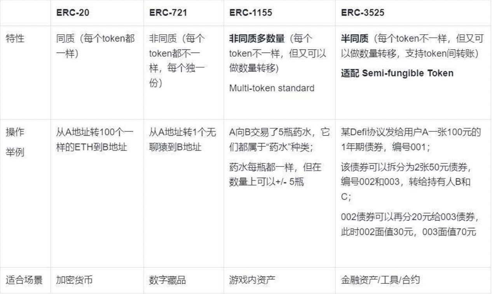
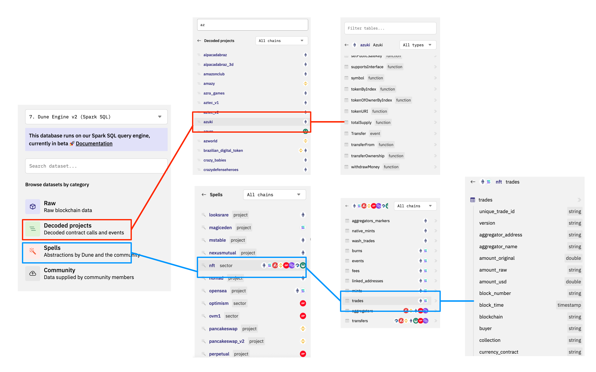

# NFT数据分析

## 背景知识

[NFT(Non-Fungable Token)](https://ethereum.org/zh/nft/)非同质化代币，他是一个遵循[ERC721](https://eips.ethereum.org/EIPS/eip-721)标准的代币，相比于遵从ERC20标准的同质化代币而言，传统上NFT最典型的特点是每个代币都具有不可分割、不可替代、独一无二等特点。NFT的用途一般有：

- 数字艺术品/藏品
- 游戏内物品
- 域名
- 可以参加某项活动的门票或优惠券
- 数字身份
- 文章

比如在数字艺术品中，不同的NFT是具有不同的样式风格的；再比如ENS域名中，每一个域名都是独一无二的，不可重复的；但是对于门票而言，每一张门票都有固定的座位，不同的座位也是不一样的编号。

随着NFT的发展还衍生出了其它标准的NFT：

- ERC-1155：非同质化代币，每个token不一样，但又可以做数量转移
- SBT: 不可转移的Token
- ERC-3235: 半同质化，每个token不一样，又支持结算



## 合约说明

NFT相关的合约通常分为两类：一类是项目方的合约，二是用来交易NFT的第三方交易平台合约。

### ERC721合约

我们以ERC721的NFT为例说明其合约特点，其它可自行根据需求再去深入了解，我们在NFT市场Opensea上以[azuki](https://opensea.io/collection/azuki)这个NFT为例，说明合约都有哪些事件：

```solidity
interface ERC721 {
    /// @dev 当任何NFT的所有权更改时（不管哪种方式），就会触发此事件。
    ///  包括在创建时（`from` == 0）和销毁时(`to` == 0), 合约创建时除外。
    event Transfer(address indexed _from, address indexed _to, uint256 indexed _tokenId);

    /// @dev 当更改或确认NFT的授权地址时触发。
    ///  零地址表示没有授权的地址。
    ///  发生 `Transfer` 事件时，同样表示该NFT的授权地址（如果有）被重置为“无”（零地址）。
    event Approval(address indexed _owner, address indexed _approved, uint256 indexed _tokenId);

    /// @dev 所有者启用或禁用操作员时触发。（操作员可管理所有者所持有的NFTs）
    event ApprovalForAll(address indexed _owner, address indexed _operator, bool _approved);

    /// @notice 将NFT的所有权从一个地址转移到另一个地址
    /// @dev 如果`msg.sender` 不是当前的所有者（或授权者）抛出异常
    /// 如果 `_from` 不是所有者、`_to` 是零地址、`_tokenId` 不是有效id 均抛出异常。
    ///  当转移完成时，函数检查  `_to` 是否是合约，如果是，调用 `_to`的 `onERC721Received` 并且检查返回值是否是 `0x150b7a02` (即：`bytes4(keccak256("onERC721Received(address,address,uint256,bytes)"))`)  如果不是抛出异常。
    /// @param _from ：当前的所有者
    /// @param _to ：新的所有者
    /// @param _tokenId ：要转移的token id.
    /// @param data : 附加额外的参数（没有指定格式），传递给接收者。
    function safeTransferFrom(address _from, address _to, uint256 _tokenId, bytes data) external payable;

    /// @notice 转移所有权 -- 调用者负责确认`_to`是否有能力接收NFTs，否则可能永久丢失。
    /// @dev 如果`msg.sender` 不是当前的所有者（或授权者、操作员）抛出异常
    /// 如果 `_from` 不是所有者、`_to` 是零地址、`_tokenId` 不是有效id 均抛出异常。
    function transferFrom(address _from, address _to, uint256 _tokenId) external payable;

    /// @notice 更改或确认NFT的授权地址
    /// @dev 零地址表示没有授权的地址。
    ///  如果`msg.sender` 不是当前的所有者或操作员
    /// @param _approved 新授权的控制者
    /// @param _tokenId ： token id
    function approve(address _approved, uint256 _tokenId) external payable;

    /// @notice 启用或禁用第三方（操作员）管理 `msg.sender` 所有资产
    /// @dev 触发 ApprovalForAll 事件，合约必须允许每个所有者可以有多个操作员。
    /// @param _operator 要添加到授权操作员列表中的地址
    /// @param _approved True 表示授权, false 表示撤销
    function setApprovalForAll(address _operator, bool _approved) external;

    ...
}
```

对于数据分析，上述函数中最重要的是Transfer这个event事件，在每笔交易时都会触发该事件并记录到链上，除了Transfer，还有Mint事件，一般用在项目发售时期用来铸造一个新的NFT。Dune的魔法表提供了ERC721，ERC1155类型的Transfer表，如`erc721_ethereum.evt_Transfer`，`erc1155_ethereum.evt_Transfer`等（不同区块链下名称不同），我们可以从中查询某个合约或者某个EOA地址的相关NFT传输事件。

在Transfer事件中，主要有三个参数发送方地址`from`, 接收方地址`to`和NFT的编号`tokenId`。交易的情况下，from和to都是一个正常的地址，如果是铸造mint那么from地址则全是0，如果是销毁burn则to的地址全是0，Dune上的nft.mint表和nft.burn表也是通过解析该event事件，得到最终的交易信息。


### 交易市场合约

在交易市场合约中，常见的有Opensea、X2Y2、Blur等，这里我们以Opensea的Seaport1.1合约为例说明，seaport合约的可写函数如下，和交易相关的函数都会触发OrderFulfilled这个event事件，从而将数据记录到链上，Dune上的nft.trades也是通过解析该event事件，得到最终的交易信息。


```solidity
uint256 constant receivedItemsHash_ptr = 0x60;

/*
 *  Memory layout in _prepareBasicFulfillmentFromCalldata of
 *  data for OrderFulfilled
 *
 *   event OrderFulfilled(
 *     bytes32 orderHash,
 *     address indexed offerer,
 *     address indexed zone,
 *     address fulfiller,
 *     SpentItem[] offer,
 *       > (itemType, token, id, amount)
 *     ReceivedItem[] consideration
 *       > (itemType, token, id, amount, recipient)
 *   )
 *
```

比如张三以10ETH挂单了一个编号[3638](https://opensea.io/assets/ethereum/0xed5af388653567af2f388e6224dc7c4b3241c544/3638)的Azuki的NFT，那么他会触发发fulfillBasicOrder函数，交易成功后，会出发OrderFulfilled这个event事件，同时记录到链上，具体信息查看；[Etherscan链接](https://etherscan.io/tx/0x9beb69ec6505e27f845f508169dae4229e851a8d7c7b580abef110bf831dc338https://etherscan.io/tx/0x9beb69ec6505e27f845f508169dae4229e851a8d7c7b580abef110bf831dc338) 和[dune链接](https://dune.com/queries/1660679)。


## 常用表说明

- 原始基础表：在Dune平台中位于`Raw`-->`transactions`和`logs`表中；
- 具体的项目表：在Dune平台中位于`Decoded Projects`-->搜索具体项目表名称，以及交易平台名称；
- 聚合表：
  - Spells-->erc721: 记录erc721所有的transfer记录
  - Spells-->nft: 包含了交易trade、铸造mint、转移transfer、手续费fee和销毁burns等信息，其中最重要的是trades表，它聚合了主流交易所的所有交易数据。



重要的nft.trades表的详情如下：

| 字段                       | 说明                                  |
| ------------------------ | ----------------------------------- |
| blockchain               | 区块链，多个链的数据都聚集到这个表了                  |
| project                  | 交易平台名称                              |
| version                  | 交易平台版本                              |
| block_time               | 区块时间                                |
| token_id                 | NFT Token ID                        |
| collection               | NFT的名称                              |
| amount_usd               | 交易时的美元价值                            |
| token_standard           | Token的标准，                           |
| trade_type               | 交易类型，是单NFT交易还是多NFT交易                |
| number_of_items          | 交易的NFT数量                            |
| trade_category           | 交易类型  (Direct buy, auction, etc...) |
| evt_type                 | evt类型(Trade, Mint, Burn)            |
| seller                   | 卖方钱包地址                              |
| buyer                    | 买方钱包地址                              |
| amount_original          | 交易的原始金额（在原始的代币token单位下）             |
| amount_raw               | 未做数值化的原始交易金额                        |
| currency_symbol          | 交易的代币符号（用什么token作为计价单位支付）           |
| currency_contract        | 原始交易的代币合约地址，<br>ETH的合约地址用WETH       |
| nft_contract_address     | NFT的合约地址                            |
| project_contract_address | 交易平台合约地址                            |
| aggregator_name          | 聚合平台名称，如果交易是从聚合平台发起的，比如gem          |
| aggregator_address       | 聚合平台合约地址                            |
| tx_hash                  | 交易哈希                                |
| block_number             | 交易区块                                |
| tx_from                  | 交易的发起地址，通常是购买者                      |
| tx_to                    | 交易的接受地址，通常是交易平台                     |
| unique_trade_id          | 交易的id                               |

## 重点关注指标

一般来说，一个NFT的项目通常会关注以下基本指标：

**成交价格走势**
  
需要将所有交易市场的交易金额都查询出来，用散点图表达所有成交，同时可以通过时间范围选择不同的范围，比如最近24h，最近7天，最近1月等等。需要注意的是，对于一些成交价格过高的交易，需要把这些过滤掉，不然在散点图上就会挤压其它成交价格，无法凸显大多数的成交价格。


参考链接：https://dune.com/queries/1660237

**地板价**
  
因为我们只能获得链上已经成交的数据，无法获得交易市场的挂单数据，所以一般会用最近10笔交易中的最小成交金额来作为地板价，与挂单价格相差不大，除非特别冷门的项目

```sql
-- 按时间排序，找出该合约最近的10笔交易
with lastest_trades as (
    select * 
    from nft.trades 
    where nft_contract_address = 0xed5af388653567af2f388e6224dc7c4b3241c544 -- azuki NFT的合约地址
    -- and block_time > now() - interval '24' hour --你也可以按时间排序
    order by block_time desc
    limit 10
)

select min(amount_original) as floor_price --直接获取最小值
    -- percentile_cont(.05) within GROUP (order by amount_original) as floor_price --这么做是取最低和最高价之间5%分位数，防止一些过低的价格交易影响
from lastest_trades
where  currency_symbol IN ('ETH', 'WETH')
    and cast(number_of_items as integer) = 1 -- 这里可以按不同的链，不同的交易token进行过滤
```

参考链接：https://dune.com/queries/1660139

**成交量、总成交额度、总交易笔数等、24小时/7天/1月成交额度** 
  
```sql
with total_volume as(
    SELECT
        sum(amount_original) as "Total Trade Volume(ETH)", --总成交量ETH
        sum(amount_usd) as "Total Trade Volume(USD)",      --总成交量USD
        count(amount_original) as "Total Trade Tx"         --总交易笔数
    FROM nft.trades
    WHERE nft_contract_address = 0xed5af388653567af2f388e6224dc7c4b3241c544
        -- AND currency_symbol IN ('ETH', 'WETH') 
),

total_fee as (
    select 
        sum(royalty_fee_amount) as "Total Royalty Fee(ETH)",      --总版权税ETH
        sum(royalty_fee_amount_usd) as "Total Royalty Fee(USD)",  --总版权税USD
        sum(platform_fee_amount) as "Total Platform Fee(ETH)",    --总平台抽成ETH
        sum(platform_fee_amount_usd) as "Total Platform Fee(USD)" --总平台抽成USD
    from nft.fees 
    WHERE nft_contract_address = 0xed5af388653567af2f388e6224dc7c4b3241c544
    -- AND royalty_fee_currency_symbol IN ('ETH', 'WETH') 
)

select * from total_volume, total_fee
```

参考链接：https://dune.com/queries/1660292
  
**每日/每月/每周成交量**

```sql
with hourly_trade_summary as (
    select date_trunc('day', block_time) as block_date, 
        sum(number_of_items) as items_traded,
        sum(amount_raw) / 1e18 as amount_raw_traded,
        sum(amount_usd) as amount_usd_traded
    from opensea.trades
    where nft_contract_address = 0xed5af388653567af2f388e6224dc7c4b3241c544
    -- and block_time > now() - interval '90' day
    group by 1
    order by 1
)

select block_date, 
    items_traded,
    amount_raw_traded,
    amount_usd_traded,
    sum(items_traded) over (order by block_date asc) as accumulate_items_traded,
    sum(amount_raw_traded) over (order by block_date asc) as accumulate_amount_raw_traded,
    sum(amount_usd_traded) over (order by block_date asc) as accumulate_amount_usd_traded
from hourly_trade_summary
order by block_date
```


参考链接：https://dune.com/queries/1664420


**当前持有人数，总token数量，holder的分布等**
```sql
with nft_trade_details as ( --获取交易的买入卖出方详细信息表，卖出方是负数，买入方是
    select seller as trader,
        -1 * cast(number_of_items as integer) as hold_item_count
    from nft.trades
    where nft_contract_address = 0xed5af388653567af2f388e6224dc7c4b3241c544

    union all
    
    select buyer as trader,
        cast(number_of_items as integer) as hold_item_count
    from nft.trades
    where nft_contract_address = 0xed5af388653567af2f388e6224dc7c4b3241c544
),

nft_traders as (
    select trader,
    sum(hold_item_count) as hold_item_count
    from nft_trade_details
    group by trader
    having sum(hold_item_count) > 0
    order by 2 desc
),

nft_traders_summary as (
    select (case when hold_item_count >= 100 then 'Hold >= 100 NFT'
                when hold_item_count >= 20 and hold_item_count < 100 then 'Hold 20 - 100'
                when hold_item_count >= 10 and hold_item_count < 20 then 'Hold 10 - 20'
                when hold_item_count >= 3 and hold_item_count < 10 then 'Hold 3 - 10'
                else 'Hold 1 or 2 NFT'
            end) as hold_count_type,
        count(*) as holders_count
    from nft_traders
    group by 1
    order by 2 desc
),

total_traders_count as (
    select count(*) as total_holders_count,
        max(hold_item_count) as max_hold_item_count
    from nft_traders
),

total_summary as (
    select 
        0 as total_nft_count,
        count(*) as transaction_count,
        sum(number_of_items) as number_of_items_traded,
        sum(amount_raw) / 1e18 as eth_amount_traded,
        sum(amount_usd) as usd_amount_traded
    from opensea.trades
    where nft_contract_address = 0xed5af388653567af2f388e6224dc7c4b3241c544
)

select *
from nft_traders_summary
join total_traders_count on true
join total_summary on true
```

参考链接：https://dune.com/queries/1300500/2228120


## NFT综合看板示例

我们制作了一个可以输入NFT合约地址，查看项目各种信息的看板，大家可以通过此看板的query了解更多查询用法:

https://dune.com/sixdegree/nft-collections-metrics-custom-dashboard 


## 参考

- https://mirror.xyz/0x07599B7E947A4F6240F826F41768F76149F490D5/CHcwsp_d0AINEalFq_0FcqkLeEyeeGpYDDtw82TyMes
- https://github.com/cryptochou/seaport-analysis
- https://dune.com/sixdegree/soulda-nft-soulda16club
- https://dune.com/sixdegree/digidaigaku-nft-by-limit-break

## SixdegreeLab介绍

SixdegreeLab（[@SixdegreeLab](https://twitter.com/sixdegreelab)）是专业的链上数据团队，我们的使命是为用户提供准确的链上数据图表、分析以及洞见，并致力于普及链上数据分析。通过建立社区、编写教程等方式，培养链上数据分析师，输出有价值的分析内容，推动社区构建区块链的数据层，为未来广阔的区块链数据应用培养人才。

欢迎访问[SixdegreeLab的Dune主页](https://dune.com/sixdegree)。

因水平所限，不足之处在所难免。如有发现任何错误，敬请指正。
