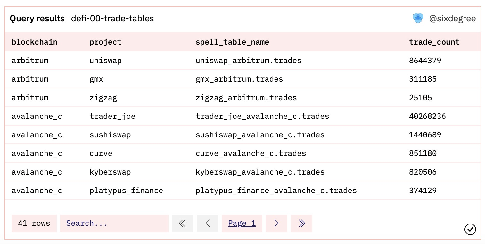
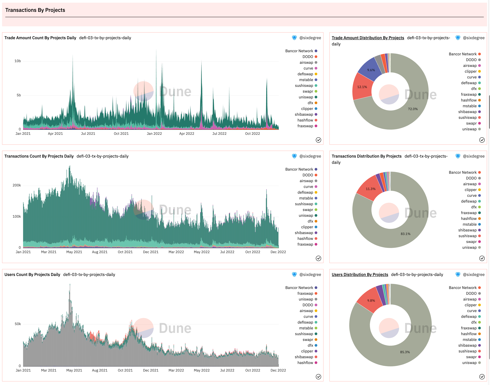
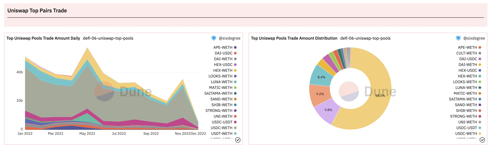

# DeFi数据分析

DeFi指的是Decentralized Finance，即去中心化金融。DeFi应该算是目前区块链是活跃度最高的领域了，当我们需要将一种ERC20代币兑换为另一种时，就可以通过DeFi应用来完成兑换。DEX是指Decentralized Exchange，即去中心化交易所。Uniswap，PancakeSwap，CurveFi等都是很流行的DEX交易所。本篇教程中我们一起来探索一下DeFi项目的分析方法，我们使用Ethereum区块链上的数据来做案例。

本教程的数据看板：[DeFi Analysis Tutorial](https://dune.com/sixdegree/defi-analysis-tutorial)

## DeFi魔法表

鉴于DeFi应用在Crypto领域的重要程度，Dune社区为其建立了丰富的魔法表（Spells）。魔法表`dex.trades`聚合了来自Uniswap、pancakeswap、trader_joe、velodrome、sushiswap等近30个不同DEX应用的交易数据。通过`dex.trades`表的[定义](https://github.com/duneanalytics/spellbook/blob/main/models/dex/dex_trades.sql)我们可以看到其数据来源于其他魔法表，比如`uniswap.trades`、`sushiswap.trades`、`curvefi.trades`等。如果你只是需要分析具体的某个DEX的数据，那么推荐优先使用这些应用独有的trades魔法表，因为会有更好的查询执行性能。与此类似，对于像Uniswap这样已经先后发布过多个版本智能合约（包括同一个区块链上升级合约版本、或者在不同的区块链上部署智能合约）的DeFi项目，它的`uniswap.trades`表也是从其他魔法表聚合生成的。如果我们只是对其中的某个版本或者某个链的数据感兴趣，也可以使用对应的魔法表。比如，如果只想分析Ethereum上的Uniswap V3的交易数据，我们可以直接使用`uniswap_v3_ethereum.trades`表，想分析Optimism链上的CurveFi的交易数据，则可以使用`curvefi.trades`魔法表。

```sql
select blockchain, 
    project, 
    project || '_' || blockchain || '.trades' as spell_table_name,
    count(*) as trade_count
from dex.trades
group by 1, 2, 3
order by 1 asc, 4 desc
```

这个查询列出了当前`dex.trades`表包括的项目及其对应的区块链，对应的数据源魔法表名称。目前`dex.trades`聚合数据的相关魔法表如下图所示：



查询链接：[https://dune.com/queries/1750008](https://dune.com/queries/1750008)

我们可以使用其中的`spell_table_name`的值作为表名来访问对应项目的交易数据trades魔法表。例如：

```sql
select * from 
kyberswap_avalanche_c.trades
limit 1
```

## DeFi行业整体分析

### DeFi概况

如前所述魔法数据表``中聚合了来自Uniswap等十几个DeFi项目的交易数据，基本涵盖了主流的DeFi项目。我们首先看一下概况。考虑只是教学目的，我们的查询中限制只取近期的数据为例。

```sql
select block_date,
    count(*) as trade_count,
    count(distinct taker) as active_user_count,
    sum(amount_usd) as trade_amount
from dex.trades
where block_date >= date('2022-10-01')
group by 1
order by 1
```

使用上面的查询可以得到每天的交易数量和独立用户数。DeFi项目的内部逻辑比较复杂，`taker`字段存贮的是交易的收款人，使用它来计算才能正确反应真正的独立用户数量。我们还希望同时统计出每日交易数量的累计，每日新用户数量及其累计值，以及总交易数量和用户数量，对上面的查询进行修改调整来实现。修改后的SQL如下：

```sql
with trade_summary as (
    select block_date,
        count(*) as trade_count,
        count(distinct taker) as active_user_count,
        sum(amount_usd) as trade_amount
    from dex.trades
    where blockchain = 'ethereum'
        and block_date >= date('2021-01-01')
        and token_pair <> 'POP-WETH' -- Exclude outlier that has wrong amount
    group by 1
    order by 1
),

user_initial_trade as (
    select taker,
        min(block_date) as initial_trade_date
    from dex.trades
    where blockchain = 'ethereum'
        and block_date >= date('2021-01-01')
        and token_pair <> 'POP-WETH' -- Exclude outlier that has wrong amount
    group by 1
),

new_user_summary as (
    select initial_trade_date,
        count(taker) as new_user_count
    from user_initial_trade
    group by 1
    order by 1
)

select t.block_date,
    trade_count,
    active_user_count,
    trade_amount,
    new_user_count,
    active_user_count - new_user_count as existing_user_count,
    sum(trade_count) over (order by t.block_date) as accumulate_trade_count,
    sum(trade_amount) over (order by t.block_date) as accumulate_trade_amount,
    sum(new_user_count) over (order by u.initial_trade_date) as accumulate_new_user_count,
    (sum(trade_count) over ()) / 1e6 as total_trade_count,
    (sum(trade_amount) over ()) / 1e9 total_trade_amount,
    (sum(new_user_count) over ()) / 1e6 as total_new_user_count
from trade_summary t
left join new_user_summary u on t.block_date = u.initial_trade_date
order by t.block_date
```

查询内容解读：
1. 我们将原来的查询放入`trade_summary` CTE中以方便后面使用窗口函数。查询中我们发现“POP-WETH”这个POOL的数据异常，所以这里直接将其排除。
2. CTE `user_initial_trade` 统计计算每一个交易收款人（taker）的初次交易日期。注意这里为了性能考虑限制了交易日期，所以并不是真正意义上的初次交易日期。
3. CTE `new_user_summary` 则在`user_initial_trade`基础上，按用户的初次交易日期进行汇总计算出每天的新增用户数量。
4. 最后输出结果的查询代码中，我们使用`sum(field_name1) over (order by field_name2)`的窗口函数语法计算按日期累加的数据。其中除以 1e6 或者 1e9 是将大数字转换为“百万”、“亿”的对应值。

在这个查询结果中，我们添加如下可视化图表：
1. 为total_trade_count、total_trade_amount、total_new_user_count 三个输出值分别添加Counter类型的可视化图表。
2. 分别针对trade_count、new_user_count 添加Bar Chart类型的条形图。
3. 分别针对trade_amount、active_user_count添加Area Chart类型的面积图。
4. 添加一个对比new_user_count 和 existing_user_count占比的百分比类型面积图。
5. 添加一个Table 类型的可视化图表，输出查询结果。

新建一个Dashboard，将相关图表加入其中。显示效果如下图所示：


类似的，我们可以按月度进行汇总，统计每个月的相关数据并添加可视化图表到数据看板中。

查询链接：
- [https://dune.com/queries/1661180](https://dune.com/queries/1661180)
- [https://dune.com/queries/1663358](https://dune.com/queries/1663358)

### 按项目的统计分析

前面提到，`dex.trades`魔法表汇总了来自多个项目在不同区块链上的交易数据。我们可以用一个查询来对比各项目的交易数据，分析他们的市场占比。

```sql
select block_date,
    project,
    count(*) as trade_count,
    count(distinct taker) as active_user_count,
    sum(amount_usd) as trade_amount
from dex.trades
where blockchain = 'ethereum'
    and block_date >= date('2021-01-01')
    and token_pair <> 'POP-WETH' -- Exclude outlier that has wrong amount
group by 1, 2
order by 1, 2
```

这里只对比活跃用户数量、交易数量和交易金额。分别针对结果集的不同字段添加条形图和饼图，加入数据看板。你可能已经注意到，我们的查询结果数据是按天和项目两个维度进行汇总的。当我们创建Pie Chart 饼图图表时，如果只选择 Project 维度作为 X Column，选择 trade_count 为 Y Column 1，不选择Group By分组的字段，此时每一天的trade_count值会自动被累加到一起，其总和值被展示在饼图中。这样我们就不用单独写一个查询来生成饼图了。这也算是一个应用技巧。数据看板的显示效果如下图：



查询链接：
- [https://dune.com/queries/1669861](https://dune.com/queries/1669861)


### 按代币交易对（Token Pair）进行分类汇总

几乎每一个DeFi项目都支持多种代币之间的兑换，这通常是通过为不同的代币交易对建立单独的交易流动资金池（Pool）来实现的。比如，Uniswap支持多种ERC20代币的相互兑换，流动性提供商（LP，即Liquidity Provider）可以选择任意两种ERC20代币创建流动资金池，普通用户则可以使用流动资金池完成代币的兑换（兑换时支付一定比例的交易手续费）。以USDC和WETH代币为例，在Uniswap V3下，一共有4种不同的费率等级，LP用户可以为这四种费率等级分别创建一个流动资金池，如“USDC/WETH 0.3%”。鉴于组成不同的交易对的Token代币的流行程度不同、流通量不同、支持的平台不同、交易手续费的费率也不同，我们可能需要对比分析哪些交易对更受欢迎、有更高的交易数量。

```sql
with top_token_pair as (
    select token_pair,
        count(*) as transaction_count
    from dex.trades
    where blockchain = 'ethereum'
        and block_date >= date('2021-01-01')
        and token_pair <> 'POP-WETH' -- Exclude outlier that has wrong amount
    group by 1
    order by 2 desc
    limit 20
)

select date_trunc('month', block_date) as block_date,
    token_pair,
    count(*) as trade_count,
    count(distinct taker) as active_user_count,
    sum(amount_usd) as trade_amount
from dex.trades
where blockchain = 'ethereum'
    and block_date >= date('2021-01-01')
    and token_pair in (
        select token_pair from top_token_pair
    )
group by 1, 2
order by 1, 2
```

在上面的查询中，我们首先定义一个`top_token_pair` CTE，按交易数量查出排名前20位的交易对。然后我们针对这20个交易对，按月统计汇总他们的交易数量、活跃用户数量和交易金额。为此查询添加相应的可视化图表并加入数据看板中。显示效果如下图所示。


查询链接：
- [https://dune.com/queries/1670196](https://dune.com/queries/1670196)

## 单个DeFi项目的分析

针对具体的单个DeFi项目，我们可以分析其活跃交易对、新的流动资金池数量、交易量、活跃用户等相关数据指标。以Uniswap 为例，从前面“DeFi魔法表”部分的查询可以找到Uniswap在Ethereum链上对应的魔法表是`uniswap_ethereum.trades`表。

### 交易次数、活跃用户、交易金额

可以按天统计交易次数、活跃用户、交易金额。SQL 如下：

```sql
select block_date,
    count(*) as trade_count,
    count(distinct taker) as active_user_count,
    sum(amount_usd) as trade_amount
from uniswap_ethereum.trades
where block_date >= date('2022-01-01')
group by 1
order by 1
```

查询链接为：
- [https://dune.com/queries/1750266](https://dune.com/queries/1750266)

### 活跃交易对分析

分析Uniswap项目中最活跃交易对（Uniswap中也称为Pool，流动资金池）的SQL如下：

```sql
with top_token_pair as (
    select token_pair,
        count(*) as transaction_count
    from uniswap_ethereum.trades
    where blockchain = 'ethereum'
        and block_date >= date('2022-01-01')
    group by 1
    order by 2 desc
    limit 20
)

select date_trunc('month', block_date) as block_date,
    token_pair,
    count(*) as trade_count,
    count(distinct taker) as active_user_count,
    sum(amount_usd) as trade_amount
from uniswap_ethereum.trades
where blockchain = 'ethereum'
    and block_date >= date('2022-01-01')
    and token_pair in (
        select token_pair from top_token_pair
    )
group by 1, 2
order by 1, 2
```

分别生成一个面积图和饼图，加入数据看板。我们可以看到，2022年以来，“USDC-WETH”交易对的成交金额占比达到了58%。如下图所示：



查询链接为：
- [https://dune.com/queries/1751001](https://dune.com/queries/1751001)

### 新资金池分析

在我们前期的教程文章“创建第一个Dune数据看板”中，我们围绕Uniswap V3的资金池做了一些查询分析。这里不再展开举例。我们另外还有一个数据看板，可供监控Uniswap中新建的流动资金池。大家请自行参考熟悉。

参考数据看板：
- [Uniswap New Pool Filter](https://dune.com/sixdegree/uniswap-new-pool-metrics)
- [Uniswap V3 Pool Tutorial](https://dune.com/sixdegree/uniswap-v3-pool-tutorial)

### 活跃用户分析

我们针对`uniswap_v3_ethereum.trades`魔法表，分析Uniswap V3在Ethereum链上的月度活跃用户、新用户、流失用户、留存用户。先看Query代码：

```sql
with monthly_active_user as (
    select distinct taker as address,
        date_trunc('month', block_date) as active_trade_month
    from uniswap_v3_ethereum.trades
),

user_initial_trade as (
    select taker as address,
        min(date_trunc('month', block_date)) as initial_trade_month
    from uniswap_v3_ethereum.trades
    group by 1
),

user_status_detail as (
    select coalesce(c.active_trade_month, date_trunc('month', p.active_trade_month + interval '45' day)) as trade_month,
        coalesce(c.address, p.address) as address,
        (case when n.address is not null then 1 else 0 end) as is_new,
        (case when n.address is null and c.address is not null and p.address is not null then 1 else 0 end) as is_retained,
        (case when n.address is null and c.address is null and p.address is not null then 1 else 0 end) as is_churned,
        (case when n.address is null and c.address is not null and p.address is null then 1 else 0 end) as is_returned
    from monthly_active_user c
    full join monthly_active_user p on p.address = c.address and p.active_trade_month = date_trunc('month', c.active_trade_month - interval '5' day)
    left join user_initial_trade n on n.address = c.address and n.initial_trade_month = c.active_trade_month
    where coalesce(c.active_trade_month, date_trunc('month', p.active_trade_month + interval '45' day)) < current_date
),

user_status_summary as (
    select trade_month,
        address,
        (case when sum(is_new) >= 1 then 'New'
            when sum(is_retained) >= 1 then 'Retained'
            when sum(is_churned) >= 1 then 'Churned'
            when sum(is_returned) >= 1 then 'Returned'
        end) as user_status
    from user_status_detail
    group by 1, 2
),

monthly_summary as (
    select trade_month,
        user_status,
        count(address) as user_count
    from user_status_summary
    group by 1, 2
)

select trade_month,
    user_status,
    (case when user_status = 'Churned' then -1 * user_count else user_count end) as user_count
from monthly_summary
order by 1, 2
```

此查询解读如下：
1. CTE `monthly_active_user`中将日期转化为每月的第一天，查询出每月有交易记录的所有用户地址。
2. CTE `user_initial_trade`中查询每个地址的初次交易日期，也转换为当月的第一天。
3. CTE `user_status_detail`中：
    - 我们使用Full Join方式将`monthly_active_user`进行自连接，连接条件设置为相同的交易用户地址，月份相邻。用别名“c”代表当前月度的数据，别名“p”代表前一个月度的数据。因为日期已经在前面处理为每个月的第一天了，这里我们使用`date_trunc('month', c.active_trade_month - interval '5 days')`，在代表当前月度数据的表的原有日期（该月第一天）上减去5天然后再转换为当月的第一天，就确保我们得到了“前一个月度的第一天的日期”。于是可以将两个月份的数据关联到一起。
    - 同时，由于使用的是Full Join，`c.active_trade_month`可能是空值，我们使用coalesce()函数将前一月份的日期加上45天作为替代日期，以保证总是能得到正确的月份。
    - 我们也将`user_initial_trade`使用Left Join 的方式关联起来，这样就能判断出某个用户是否在某个月份进行了第一次交易。
    - 我们使用多个不同的CASE条件判断语句，来判断在某个月份中，用户是新用户（当月第一次交易）、留存用户（非新用户，当月和前一个月都有交易）、流失用户（非新用户，当月无交易，前一个月有交易）还是回归用户（非新用户，当月有交易，前一个月无交易）。
4. CTE `user_status_summary`中，我们按交易月份和地址，汇总统计每个地址只当月属于哪种状态类型。
5. CTE `monthly_summary`中，我们按交易月份和用户状态统计用户数量。
6. 最后输出结果时，我们将“Cburned”（流失用户）类型的值换成负数以便在图表上可以更直观对照。

分别添加两个条形图，其中一个选择“Enable stacking”叠加到一起。将图表加入到数据看板，我们可以发现，每个月的流失用户数量还是相当多的。如下图所示：


查询链接为：
- [https://dune.com/queries/1751216](https://dune.com/queries/1751216)


这个查询借鉴了 [@danning.sui](https://dune.com/danning.sui) 的查询[Uniswap LP - MAU Breakdown](https://dune.com/queries/9796)，特此感谢！

## 具体Pair的分析

我们可能还需要针对具体的流动资金池进行更加深入的分析，包括其交易数据、流动性数据等。由于篇幅原因，这里不具体展开介绍，仅提供部分相关的查询和数据看板供大家参考：

查询示例：
- [uniswap-v3-pool](https://dune.com/queries/1174517)
- [XEN - Uniswap trading pool overview](https://dune.com/queries/1382063)
- [optimism uniswap lp users](https://dune.com/queries/1584678)

数据看板示例：
- [Uniswap V3 Pool Structure And Dynamics](https://dune.com/springzhang/uniswap-v3-pool-structure-and-dynamics)
- [Uniswap V3 On Optimism Liquidity Mining Program Performance](https://dune.com/springzhang/uniswap-optimism-liquidity-mining-program-performance)

## SixdegreeLab介绍

SixdegreeLab（[@SixdegreeLab](https://twitter.com/sixdegreelab)）是专业的链上数据团队，我们的使命是为用户提供准确的链上数据图表、分析以及洞见，并致力于普及链上数据分析。通过建立社区、编写教程等方式，培养链上数据分析师，输出有价值的分析内容，推动社区构建区块链的数据层，为未来广阔的区块链数据应用培养人才。

欢迎访问[SixdegreeLab的Dune主页](https://dune.com/sixdegree)。

因水平所限，不足之处在所难免。如有发现任何错误，敬请指正。
