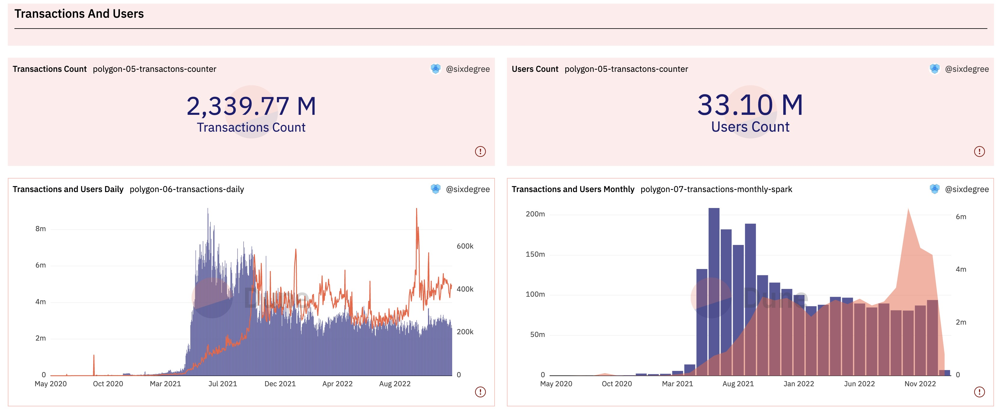
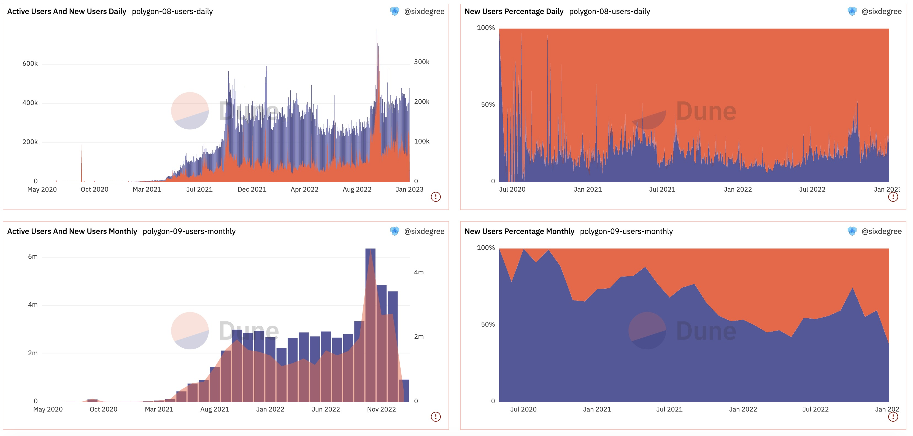
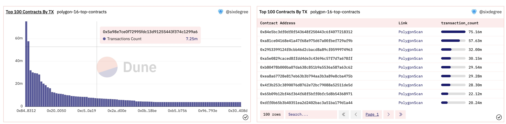

# Polygon区块链概况分析

Dune 平台一直在快速发展之中，目前已经支持10个主流区块链，包括Ethereum，BNB，Polygon，Fantom等Layer 1公链和Arbitrum，Optimism等致力于扩展Ethereum的Layer 2区块链。本教程中我们一起来探讨如何入手分析一个区块链的概况，以Polygon区块链为分析对象。

Polygon的口号是“将世界带入以太坊”，Polygon 相信所有人都可以使用 Web3。Polygon是一个去中心化的以太坊扩展平台，使开发人员能够以低交易费用构建可扩展的用户友好型DAPP，而不会牺牲安全性。

本教程的数据看板：[Polygon Chain Overview](https://dune.com/sixdegree/polygon-chain-overview)

## 区块链概况分析涉及的内容

我们的目标是对整个Polygon区块链进行全面的分析以掌握其当前发展状态。分析内容包括：
- **区块分析**：总区块数、每分钟出块数量、Gas消耗总量、平均Gas消耗、每日（每月）区块生成数量趋势等
- **交易和用户分析**：总交易量、总用户数、每区块交易数量、成功/失败交易对比、每日（每月）交易数量趋势、每日（每月）活跃用户数趋势、每日（每月）每日新用户趋势、新用户与活跃用户对比等
- **原生代币MATIC分析**：流通总量、持有者分析、头部持有者、价格走势等
- **智能合约分析**：已部署智能合约总量、每日（每月）新合约部署量趋势、最热门智能合约交易量对比和发展趋势分析

## 区块和Gas消耗分析

### 区块总数和Gas消耗总量

为了了解整个Polygon区块链目前的总区块数量以及相应的Gas消耗概况，我们可以编写一个简单的SQL，查询总的区块数量、创世区块的出块日期时间、平均每分钟的新区块数量、总的Gas消耗数量，平均每个区块的Gas消耗等。

```sql
select count(*) / 1e6 as blocks_count,
   min(time) as min_block_time,
   count(*) / ((to_unixtime(Now()) - to_unixtime(min(time))) / 60) as avg_block_per_minute,
   sum(gas_used * coalesce(base_fee_per_gas, 1)) / 1e18 as total_gas_used,
   avg(gas_used * coalesce(base_fee_per_gas, 1)) / 1e18 as average_gas_used
from polygon.blocks
```

SQL说明：
1. 使用`to_unixtime()`函数，可以将日期时间转换为Unix Timestamp 数值，我们就能计算出两个日期时间值中间的秒数，然后用它来计算平均每分钟的新区块数量。与之对应的函数是`from_unixtime()`。
2. `gas_used`是消耗的gas 数量，`base_fee_per_gas`是每单位gas的单价，二者相乘可以得到消耗的gas费用。Polygon的原生代币MATIC的小数位数是18位，除以`1e18`则得到最终的MATIC金额。

将此查询结果分别添加为Counter类型的可视化图表。添加到数据看板中。显示效果如下：


查询链接：[https://dune.com/queries/1835390](https://dune.com/queries/1835390)

### 每日（每月）新区块生成趋势和Gas消耗

我们可以按日期汇总，分别统计每天生成的区块数量和对应的Gas消耗。为了跟踪变化趋势，我们首先定义一个CTE来完成每日数据统计，然后在此CTE基础上，使用`avg(blocks_count) over (order by rows between 6 preceding and current row)`这样的窗口函数来统计7天的移动平均值。SQL如下：

```sql
with block_daily as (
    select date_trunc('day', time) as block_date,
        count(*) as blocks_count,
        sum(gas_used * coalesce(base_fee_per_gas, 1)) / 1e18 as gas_used
    from polygon.blocks
    group by 1
)

select block_date,
    blocks_count,
    gas_used,
    avg(blocks_count) over (order by block_date rows between 6 preceding and current row) as ma_7_days_blocks_count,
    avg(blocks_count) over (order by block_date rows between 29 preceding and current row) as ma_30_days_blocks_count,
    avg(gas_used) over (order by block_date rows between 6 preceding and current row) as ma_7_days_gas_used
from block_daily
order by block_date
```

为这个查询结果添加两个Bar Chart类型的图表，分别展示“每日区块数量、7天移动平均和30天移动平均区块数量”和“每日Gas消耗总量和7天移动平均”值。添加到数据看板中。

将以上query做一个Fork，稍作修改，改成按月汇总统计，移动平均值也改成取12个月的值。这样我们就得到了每月新区块生成趋势图。

以上两个SQL的可视化图表添加到数据看板后的显示效果如下图所示。我们可以看到，新区块的出块数量基本稳定，但是Gas费在2022年以来有大幅度的提升，中间短暂回落，目前又接近了前高。


查询链接：
- [https://dune.com/queries/1835421](https://dune.com/queries/1835421)
- [https://dune.com/queries/1835445](https://dune.com/queries/1835445)


## 交易和用户分析

### 交易总量和用户总数

我们希望统计总交易次数和总的独立用户地址数量。可以定义一个CTE，将交易的发起人地址`from`和接受者地址`to`使用union all合并到一起，再统计独立地址的总数。注意这里我们并没有排除合约地址。如果需要排除合约地址，可以加一个子查询，排除那些存在于表`polygon.creation_traces`中的地址。因为数据量比较大大，我们换算为百万（M）单位。添加Counter 可视化图表并分别加入到数据看板。

```sql
with transactions_detail as (
    select block_time,
        hash,
        "from" as address
    from polygon.transactions

    union all

    select block_time,
        hash,
        "to" as address
    from polygon.transactions
)

select count(distinct hash) / 1e6 as transactions_count,
    count(distinct address) / 1e6 as users_count
from transactions_detail
```

查询链接：
- [https://dune.com/queries/1836022](https://dune.com/queries/1836022)


### 每日（每月）交易和活跃用户分析

类似的，只需要按日期进行汇总，即可生成每日交易量和活跃用户数量的统计报表。按月度汇总，则可得到每月的数据。下面是按日统计的SQL：

```sql
with transactions_detail as (
    select block_time,
        hash,
        "from" as address
    from polygon.transactions

    union all

    select block_time,
        hash,
        "to" as address
    from polygon.transactions
)

select date_trunc('day', block_time) as block_date,
    count(distinct hash) as transactions_count,
    count(distinct address) as users_count
from transactions_detail
group by 1
order by 1
```

分别为每日交易数据和每月交易数据添加Bar Chart类型的图表，同时展示交易数量和活跃用户数。活跃用户数可以使用第二个Y轴，图表类型可以选择Line 或者Area类型。加入数据看板后显示效果如下图所示：



查询链接：
- [https://dune.com/queries/1835817](https://dune.com/queries/1835817)
- [https://dune.com/queries/1836624](https://dune.com/queries/1836624)


### 活跃用户和新用户统计分析

对于一个公链，其新用户增长趋势是一个比较关键的分析指标，可以反应区块链受欢迎的程度。我们可以先找出每一个地址的第一笔交易发生的日期（下方查询中的`users_initial_transaction` CTE），然后就可以在此基础上统计出每一天的新用户。将每日的活跃用户数据与每日新用户数据关联到一起，即可生成对照图表。每日活跃用户数量减去当天的新用户数量，就是当天活跃的存量用户数量。考虑到极端情况下，某个日期可能没有任何新用户，所以我们使用LEFT JOIN，同时使用`coalesce()`函数来处理可能出现的空值。SQL 如下：

```sql
with users_details as (
    select block_time,
        "from" as address
    from polygon.transactions
    
    union all
    
    select block_time,
        "to" as address
    from polygon.transactions
),

users_initial_transaction as (
    select address,
        min(date_trunc('day', block_time)) as min_block_date
    from users_details
    group by 1
),

new_users_daily as (
    select min_block_date as block_date,
        count(address) as new_users_count
    from users_initial_transaction
    group by 1
),

active_users_daily as (
    select date_trunc('day', block_time) as block_date,
        count(distinct address) as active_users_count
    from users_details
    group by 1
)

select u.block_date,
    active_users_count,
    coalesce(new_users_count, 0) as new_users_count,
    active_users_count - coalesce(new_users_count, 0) as existing_users_count
from active_users_daily u
left join new_users_daily n on u.block_date = n.block_date
order by u.block_date
```

FORK这个每日用户统计的查询，将日期纬度调整为按月统计，即`date_trunc('month', block_time)`，就可以统计出每月的活跃用户数和新用户数据。

为这两个查询分别添加以下可视化图表：
1. Bar Chart，显示每日（每月）的活跃用户数量和新用户数量。鉴于新用户的占比较低，设置其使用右边的Y轴坐标系。
2. Area Chart，对比新用户和存量用户所占的比例。

将相应可视化图表加入数据看板的显示效果如下图：



查询链接：
- [https://dune.com/queries/1836744](https://dune.com/queries/1836744)
- [https://dune.com/queries/1836854](https://dune.com/queries/1836854)


## 区块链原生代币分析

### MATIC 价格走势

Dune 的魔法表`prices.usd`提供了Polygon链Token的价格数据，其中也包括其原生代币MATIC的数据。所以我们可以直接按天统计平均价格。

```sql
select date_trunc('day', minute) as block_date,
    avg(price) as price
from prices.usd
where blockchain = 'polygon'
    and symbol = 'MATIC'
group by 1
order by 1
```

因为查询结果是按日期升序排序的，最后一条记录就是最新日期的平均价格，可以当作“当前价格”来使用。我们为其生成一个Counter类型的可视化图表，“Row Number”值设置为“-1”，表示取最后一行的值。同时，我们添加一个Line 类型的图表来展示MATIC Token的每日均价走势。图表添加到数据看板后显示如下：


查询链接：
- [https://dune.com/queries/1836933](https://dune.com/queries/1836933)

### 持有最多MATIC Token的地址

我们可能会关注那些持有最多原生代币MATIC的地址，因为他们往往可以影响Token 的价格走势。下面的查询查出前1000个地址。MATIC是Polygon链的原生代币，原生代币的转账跟ERC20代币的转账处理方式不一样，详细信息是存贮在`polygon.traces`表中。注意，这里我们同样没有区分是否为合约地址。因为Polygon的交易Gas费很低，这里出于查询执行性能的考虑，我们也没有计算Gas费的消耗。

```sql
with polygon_transfer_raw as (
    select "from" as address, (-1) * cast(value as decimal) as amount
    from polygon.traces
    where call_type = 'call'
        and success = true
        and value > uint256 '0'
    
    union all
    
    select "to" as address, cast(value as decimal) as amount
    from polygon.traces
    where call_type = 'call'
        and success = true
        and value > uint256 '0'
)

select address,
    sum(amount) / 1e18 as amount
from polygon_transfer_raw
group by 1
order by 2 desc
limit 1000
```

上面查询中的注意事项：`polygon.traces`表中的`value`字段是`uint256`类型，这是Dune SQL自定义的类型，如果直接和数值0进行比较将会遇到类型不匹配不能比较的错误。所以我们用`uint256 '0'`这样的语法将数值0转换为相同类型再比较。也可以用`cast(0 as uint256)`这样的类型转换函数。当然也可以把`value`的值转换为double、decimal、bigint等再比较，但是此时需要注意可能出现数据溢出的问题。

我们还可以在上面查询的基础上，分析一下这头部1000个地址持有MATIC Token 的分布情况。Fork上面的查询，稍作修改。

```sql
with polygon_transfer_raw as (
    -- same as above
),

polygon_top_holders as (
    select address,
        sum(amount) / 1e18 as amount
    from polygon_transfer_raw
    group by 1
    order by 2 desc
    limit 1000
)

select (case when amount >= 10000000 then '>= 10M'
             when amount >= 1000000 then '>= 1M'
             when amount >= 500000 then '>= 500K'
             when amount >= 100000 then '>= 100K'
             else '< 100K'
        end) as amount_segment,
    count(*) as holders_count
from polygon_top_holders
group by 1
order by 2 desc
```

为以上两个查询分别生成 Bar Chart 和 Pie Chart 可视化图表。加入数据看板，显示效果如下：


查询链接：
- [https://dune.com/queries/1837046](https://dune.com/queries/1837046)
- [https://dune.com/queries/1837144](https://dune.com/queries/1837144)


## 智能合约分析

### 创建和已销毁的合约数量

```sql
select type,
    count(*) / 1e6 as transactions_count
from polygon.traces
where type in ('create', 'suicide')
    and block_time >= date('2023-01-01') -- 这里为了性能考虑加了日期条件
group by 1
order by 1
```

因为我们限定了`type`的值，并且指定了排序顺序，可以确保返回两条记录并且顺序固定。所以，可以分别为第一行和第二行记录值生成Counter类型的可视化图表。

查询链接：
- [https://dune.com/queries/1837749](https://dune.com/queries/1837749)

### 每日（每月）合约创建和销毁数量

我们可以按日期统计新创建和已销毁的合约数量。考虑到累计数量也比较有参考价值，我们先用一个CTE统计出每日数据，然后使用窗口函数`sum() over (partition by type order by block_date)`来统计按日期累计的总数。其中的`partition by type`用于指定按类型分别汇总。

```sql
with polygon_contracts as (
    select date_trunc('day', block_time) as block_date,
        type,
        count(*) as transactions_count
    from polygon.traces
    where type in ('create', 'suicide')
    group by 1, 2
)

select block_date, 
    type,
    transactions_count,
    sum(transactions_count) over (partition by type order by block_date) as accumulate_transactions_count
from polygon_contracts
order by block_date
```

同样，我们还可以将统计的日期纬度调整为按月统计，得到每月新创建和销毁的合约数量。

以上查询分别生成Bar Chart和Area Chart类型的图表，添加到数据看板后的效果如下：


查询链接：
- [https://dune.com/queries/1837749](https://dune.com/queries/1837749)
- [https://dune.com/queries/1837150](https://dune.com/queries/1837150)
- [https://dune.com/queries/1837781](https://dune.com/queries/1837781)


### 交易次数最多的智能合约统计

每个公链的头部智能合约往往生成了大部分的交易数量。我们可以分析交易次数最多的前100个智能合约。这里我们在输出结果时，增加了一个链接字段，方便点击链接直接查询该智能合约的交易列表。

```sql
with contract_summary as (
    select "to" as contract_address,
        count(*) as transaction_count
    from polygon.transactions
    where success = true
    group by 1
    order by 2 desc
    limit 100
)

select contract_address,
    '<a href=https://polygonscan.com/address/' || cast(contract_address as varchar) || ' target=_blank>PolygonScan</a>' as link,
    transaction_count
from contract_summary
order by transaction_count desc
```

为这个查询分别生成一个Bar Chart类型的图表和Table类型的图表。加入数据看板，显示效果如下：



查询链接：
- [https://dune.com/queries/1838001](https://dune.com/queries/1838001)


### 最活跃智能合约每日交易数量分析

我们可以针对累计交易数量最多的头部智能合约，对照分析它们的每日交易数量，以此可以看出不同阶段的热门智能合约，以及它们各自的生命周期的长短等信息。考虑到数据量比较大，这里我们只对前20个合约进行分析。

```sql
with top_contracts as (
    select "to" as contract_address,
        count(*) as transaction_count
    from polygon.transactions
    where success = true
    group by 1
    order by 2 desc
    limit 20
)

select date_trunc('day', block_time) as block_date, 
    contract_address,
    count(*) as transaction_count
from polygon.transactions t
inner join top_contracts c on t."to" = c.contract_address
group by 1, 2
order by 1, 2
```

我们先查询得到历史交易量最多的前20个智能合约。然后针对这些智能合约统计它们每日的交易数量。为查询结果添加3个不同类型的可视化图表：
1. Bar Chart，将不同智能合约的每日交易数量叠加显示。
2. Area Chart，将不同智能合约的每日交易数量叠加显示，同时设置“Normalize to percentage”将图表调整为按百分比显示。
3. Pie Chart，对比这20个头部智能合约的累计交易数量占比。

相关图表加入数据看板后，如下图所示：


查询链接为：
- [https://dune.com/queries/1838060](https://dune.com/queries/1838060)

### 最近30天最活跃智能合约

除了针对所有历史交易数据进行分析之外，我们也可以对近期最活跃的智能合约进行简单分析。比如30天内最活跃的Top 50智能合约。

```
select "to" as contract_address,
    '<a href=https://polygonscan.com/address/' || cast("to" as varchar) || ' target=_blank>PolygonScan</a>' as link,
    count(*) as transaction_count
from polygon.transactions
where block_time >= now() - interval '30' day
group by 1, 2
order by 3 desc
limit 50
```

因为是近期活跃项目，有可能是新近刚部署上线，所以我们为这个查询输出超链接，添加一个Table类型的可视化图表。显示效果如下：


查询链接为：
- [https://dune.com/queries/1838077](https://dune.com/queries/1838077)


## 总结

以上我们分别从区块、燃料消耗、交易、用户、原生代币、智能合约几个方面针对Polygon区块链做了一个初步的分析。通过这个数据看板，我们可以对Polygon区块链有一个大致的了解。特别地，通过对头部智能合约的分析，我们可以找到那些热门的项目。然后就可以选择感兴趣的热门项目，进行更有针对性的项目分析。

迄今为止，SixdegreeLab已经完成了多个区块链的概览分析，你可以在这里找到：
- [Blockchain Overview Series](https://dune.com/sixdegree/blockchain-overview-series)


## SixdegreeLab介绍

SixdegreeLab（[@SixdegreeLab](https://twitter.com/sixdegreelab)）是专业的链上数据团队，我们的使命是为用户提供准确的链上数据图表、分析以及洞见，并致力于普及链上数据分析。通过建立社区、编写教程等方式，培养链上数据分析师，输出有价值的分析内容，推动社区构建区块链的数据层，为未来广阔的区块链数据应用培养人才。

欢迎访问[SixdegreeLab的Dune主页](https://dune.com/sixdegree)。

因水平所限，不足之处在所难免。如有发现任何错误，敬请指正。
