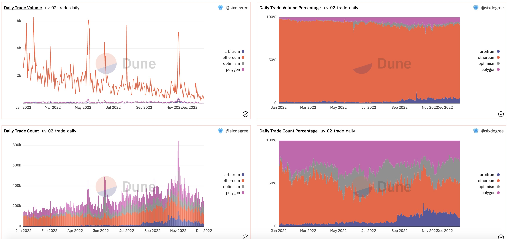
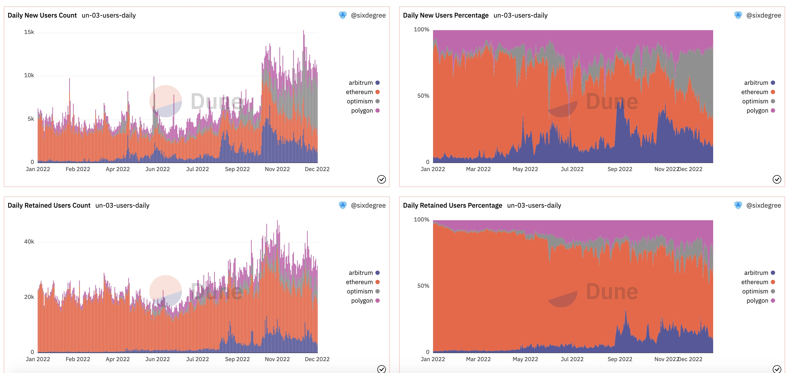
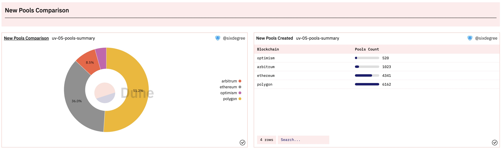
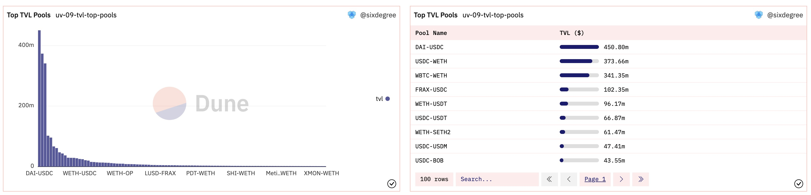

# Uniswap 多链数据对比分析

Uniswap 是DeFi领域领先的DEX之一。Uniswap 智能合约于2018年率先部署在Ethereum区块链，2021年又先后部署到Arbitrum，Optimism和Polygon，2022年扩展到Celo链。近期又有新的提案提议将其部署到BNB链，发展势头不减。本文我们将一起来探讨如何对比分析2022年度Uniswap在多链上的数据表现。由于Dune目前尚未支持Celo链，所以并未包含在内。

本教程的数据看板：[Uniswap V3 Performance In 2022 Multichains](https://dune.com/sixdegree/uniswap-v3-performance-in-2022-multi-chains)

本教程中全部Query都使用Dune SQL引擎完成。

很巧，在编写完善这篇教程期间，2023年1月25日Uniswap Foundation推出了新一期的Bounty活动，其主题正好是分析Uniswap在多链的表现。希望本文可以抛砖引玉，给大家提供一些参考思路，大家可以进一步扩展思路，编写出更好的查询去参加这个Bounty活动。预祝您获得丰厚的奖金。Unigrants活动链接：[Bounty # 21 - Uniswap Multichain](https://unigrants.notion.site/Bounty-21-Uniswap-Multichain-b1edc714fe1949779530e920701fd617)

## 多链数据分析的主要内容

正如“Bounty # 21 - Uniswap Multichain”活动的描述所说，针对Uniswap这类DeFi应用，我们最常见需要分析的指标包括交易量、交易金额、用户、TVL（总锁仓价值）等。Uniswap 部署大量不同Token交易对的流动资金池（Pool）智能合约，流动性提供者（Liquidity Provider，LP）将其资金注入流动性池以获取交易手续费收益，其他用户在相应的流动性资金池兑换自己需要的Token。所以，更深入的分析还可以包括流动性池（Pool）相关、流动性提供者（LP）相关的内容。

本教程中我们将主要讨论如下内容：
- 总交易概况（交易数量、交易金额、用户数量、TVL）
- 每日交易数据对比
- 每日新增用户对比
- 年度新建流动资金池数量对比
- 每日新增流动资金池对比
- TVL对比
- 每日TVL
- TVL最高的流动资金池

Dune社区用户为Uniswap创建了相当完善的交易数据魔法表`uniswap.trades`，其中聚合了来自前面提及的四个区块链的Uniswap相关智能合约的交易数据。我们的大多数查询可以直接使用这个表来实现。对于流动资金池相关的数据，目前还没有相关的魔法表，所以我们需要自己写查询来聚合来自不同区块链的数据，以进行对比分析。

另外需要说明，我们在这个教程中，主要关注2022年度的数据，所以在相关查询中有日期过滤条件。如果要分析全部历史数据，只需移除这些条件即可。

## 总交易概况

可以直接针对表`uniswap.trades`编写一个查询来汇总交易总金额、交易次数和独立用户地址数量。

```sql
select blockchain,
    sum(amount_usd) as trade_amount,
    count(*) as transaction_count,
    count(distinct taker) as user_count
from uniswap.trades
where block_time >= date('2022-01-01')
    and block_time < date('2023-01-01')
group by 1
```

考虑到结果数据的数字都比较大，我们可以将上述查询放入一个CTE中，从CTE输出的时候，可以将数字换算成Million（百万）或Billion（十亿）单位，同时可以很方便地将多个链的数据汇总到一起。

为这个查询添加3个Counter类型的图表，分别展示总的交易金额，交易次数和用户数量。再分别添加3个Pie Chart类型的图表，分别展示各链的交易金额占比，交易数量占比和用户数量占比。另外再添加一个Table类型的图表，展示详细数字。将所有图表添加到数据看板，显示效果如下。


查询链接：[https://dune.com/queries/1859214](https://dune.com/queries/1859214)

## 每日交易数据对比分析

同样使用`uniswap.trades`魔法表，可以编写按日期统计的交易数据查询。SQL如下：

```sql
with transaction_summary as (
    select date_trunc('day', block_time) as block_date,
        blockchain,
        sum(amount_usd) as trade_amount,
        count(*) as transaction_count,
        count(distinct taker) as user_count
    from uniswap.trades
    where block_time >= date('2022-01-01')
        and block_time < date('2023-01-01')
    group by 1, 2
)

select block_date,
    blockchain,
    trade_amount,
    transaction_count,
    user_count,
    sum(trade_amount) over (partition by blockchain order by block_date) as accumulate_trade_amount,
    sum(transaction_count) over (partition by blockchain order by block_date) as accumulate_transaction_count,
    sum(user_count) over (partition by blockchain order by block_date) as accumulate_user_count
from transaction_summary
order by 1, 2
```

这里我们将2022年度的所有交易数据按日期和区块链两个维度进行分类汇总，同时输出按日期累加的数据。需要注意的是，相同的用户会在不同的日期进行交易，所以这里汇总的累计用户数量并不是准确的“累计独立用户数量”，在后面的查询中我们会单独说明统计独立用户数量的方法。

因为我们的目的是对比分析在不同链上的数据表现，我们可以同时关注具体的数值和这些数值的占比。占比分析可以更直观地观察不同链随着时间推移的表现走势。结合数据的特性，我们分别使用Line Chart生成每日交易金额图表，使用Bar Chart生成每日交易数量图表和每日交易用户数量图表，使用面积图生成每日累加的交易金额、交易数量和交易用户数图表，同时使用面积图来展示每日各项交易数据的百分比。将相关图表添加到数据看板后的显示效果如下：



查询链接：
- [https://dune.com/queries/1928680](https://dune.com/queries/1928680)


## 每日新用户对比分析

要对比分析每日的新增用户，我们需要首先统计出每个用户地址的初次交易日期，再按照初次交易日期来汇总统计每日的新增用户数量。在下面的查询中，我们用CTE `user_initial_trade`来统计每个用户地址（即`taker`）的初次交易日期（注意这里不要加日期过滤条件），然后在CTE `new_users_summary`中统计2022年度每天的新增用户数量。同时，我们将每日活跃用户数据统计到CTE `active_users_summary`中。在最后输出查询结果的Query中，我们用每日活跃用户数减去每日新增用户数来得到每日留存的用户数量，这样我们可以生成对比新增用户和留存用户占比的可视化图表。

```sql
with user_initial_trade as (
    select blockchain,
        taker,
        min(block_time) as block_time
    from uniswap.trades
    group by 1, 2
),

new_users_summary as (
    select date_trunc('day', block_time) as block_date,
        blockchain,
        count(*) as new_user_count
    from user_initial_trade
    where block_time >= date('2022-01-01')
        and block_time < date('2023-01-01')
    group by 1, 2
),

active_users_summary as (
    select date_trunc('day', block_time) as block_date,
        blockchain,
        count(distinct taker) as active_user_count
    from uniswap.trades
    where block_time >= date('2022-01-01')
        and block_time < date('2023-01-01')
    group by 1, 2
)

select a.block_date,
    a.blockchain,
    a.active_user_count,
    n.new_user_count,
    coalesce(a.active_user_count, 0) - coalesce(n.new_user_count, 0) as retain_user_count,
    sum(new_user_count) over (partition by n.blockchain order by n.block_date) as accumulate_new_user_count
from active_users_summary a
inner join new_users_summary n on a.block_date = n.block_date and a.blockchain = n.blockchain
order by 1, 2
```

为这个查询结果生成不同的可视化图表，分别展示每日新增用户数量和占比、每日留存用户数量和占比、每日累计新增用户数量已及各链在2022年度新增用户数量的占比。将相关图表加入数据看板后的显示效果如下：



查询链接：
- [https://dune.com/queries/1928825](https://dune.com/queries/1928825)


上面提到我们想要对比每日新增用户和每日留存用户数量及其占比情况。由于我们的查询结果已经按照区块链进行了分组，这种情况下相关可视化图表一次只能展示一项数据，无法在同一个图表中显示每日新增用户数量和每日留存用户数量这两个数据指标。这种情况下，我们可以使用Dune SQL引擎的Query of Query 功能，编写一个新的查询，使用上述查询结果作为数据源，筛选出具体的一个区块链的统计结果。因为不在需要按区块链进行分组，所以我们可以在一个图表中输出多项指标。

```sql
select block_date,
    active_user_count,
    new_user_count,
    retain_user_count
from query_1928825 -- This points to all returned data from query https://dune.com/queries/1928825
where blockchain = '{{blockchain}}'
order by block_date
```

这里我们将要筛选的区块链定义为一个参数，参数类型为List，将支持的4个区块链的名称（小写格式）加入选项列表。为查询结果生成两个图表，分别输出每日新增用户数量及其占比。将图表加入数据看板后的显示效果如下：


查询链接：
- [https://dune.com/queries/1929142](https://dune.com/queries/1929142)

## 年度新建流动资金池对比分析

Dune 目前的魔法表中并未提供流动资金池的数据，我们可以自行编写查询来汇总。欢迎大家去Dune在Github上的Spellbook 库提交PR来生成对应的魔法表。使用`PoolCreated`事件解析数据表，我们将来自4个区块链的数据汇总到一起。由于Uniswap V2只在Ethereum链上部署，所以这里我们没有将其纳入统计范围。

```sql
with pool_created_detail as (
    select 'ethereum' as blockchain,
        evt_block_time,
        evt_tx_hash,
        pool,
        token0,
        token1
    from uniswap_v3_ethereum.Factory_evt_PoolCreated

    union all
    
    select 'arbitrum' as blockchain,
        evt_block_time,
        evt_tx_hash,
        pool,
        token0,
        token1
    from uniswap_v3_arbitrum.UniswapV3Factory_evt_PoolCreated

    union all
    
    select 'optimism' as blockchain,
        evt_block_time,
        evt_tx_hash,
        pool,
        token0,
        token1
    from uniswap_v3_optimism.Factory_evt_PoolCreated

    union all
    
    select 'polygon' as blockchain,
        evt_block_time,
        evt_tx_hash,
        pool,
        token0,
        token1
    from uniswap_v3_polygon.factory_polygon_evt_PoolCreated
)

select blockchain,
    count(distinct pool) as pool_count
from pool_created_detail
where evt_block_time >= date('2022-01-01')
    and evt_block_time < date('2023-01-01')
group by 1
```

可以为这个查询结果生成一个Pie Chart来对比各链在2022年度新建资金池的数量及其占比，同时可以生成一个Table 类型图表输出详细数据。图表加入数据看板后的显示效果如下：



查询链接：
- [https://dune.com/queries/1929177](https://dune.com/queries/1929177)


## 每日新增流动资金池对比

相应地，通过增加一个日期纬度到查询到分组条件中，我们可以统计出各链上每日新增的流动资金池的数据。

```sql
with pool_created_detail as (
    -- 此处SQL同上
),

daily_pool_summary as (
    select date_trunc('day', evt_block_time) as block_date,
        blockchain,
        count(distinct pool) as pool_count
    from pool_created_detail
    group by 1, 2
)

select block_date,
    blockchain,
    pool_count,
    sum(pool_count) over (partition by blockchain order by block_date) as accumulate_pool_count
from daily_pool_summary
where block_date >= date('2022-01-01')
    and block_date < date('2023-01-01')
order by block_date
```

我们可以分别生成每日新增资金池的Bar Chart和显示每日数量占比的Area Chart，再生成一个显示按日累加的新建资金池数量的面积图。将相应可视化图表加入数据看板的显示效果如下图：


查询链接：
- [https://dune.com/queries/1929235](https://dune.com/queries/1929235)

## 总锁仓价值（TVL）对比分析

不同的Token有不同的价格，对比分析TVL时，我们需要通过关联`prices.usd`魔法表将这些Token的锁仓金额（数量）全部换算为USD金额，然后才能进行汇总。每一个交易对（Pair）就是一个独立的流动资金池（Pool），有其专属的合约地址。TVL就是这些合约地址当前持有的所有Token按USD计价的总金额。要计算Pool中当前持有的Token数量，我们可以结合`erc20`魔法表分类下的`evt_Transfer`表来统计每个Pool的转入、转出数量从而得到当前余额。每个Pool都包含两种不同的Token，我们还需要分别获得这些Token的小数位数和对应的价格信息。先看查询代码：

```sql
with pool_created_detail as (
    -- 此处SQL同上
),

token_transfer_detail as (
    select p.blockchain,
        t.contract_address,
        t.evt_block_time,
        t.evt_tx_hash,
        t."to" as pool,
        cast(t.value as double) as amount_original
    from erc20_arbitrum.evt_Transfer t
    inner join pool_created_detail p on t."to" = p.pool
    where p.blockchain = 'arbitrum'

    union all

    select p.blockchain,
        t.contract_address,
        t.evt_block_time,
        t.evt_tx_hash,
        t."from" as pool,
        -1 * cast(t.value as double) as amount_original
    from erc20_arbitrum.evt_Transfer t
    inner join pool_created_detail p on t."from" = p.pool
    where p.blockchain = 'arbitrum'

    union all
    
    select p.blockchain,
        t.contract_address,
        t.evt_block_time,
        t.evt_tx_hash,
        t."to" as pool,
        cast(t.value as double) as amount_original
    from erc20_ethereum.evt_Transfer t
    inner join pool_created_detail p on t."to" = p.pool
    where p.blockchain = 'ethereum'

    union all

    select p.blockchain,
        t.contract_address,
        t.evt_block_time,
        t.evt_tx_hash,
        t."from" as pool,
        -1 * cast(t.value as double) as amount_original
    from erc20_ethereum.evt_Transfer t
    inner join pool_created_detail p on t."from" = p.pool
    where p.blockchain = 'ethereum'

    union all
    
    select p.blockchain,
        t.contract_address,
        t.evt_block_time,
        t.evt_tx_hash,
        t."to" as pool,
        cast(t.value as double) as amount_original
    from erc20_optimism.evt_Transfer t
    inner join pool_created_detail p on t."to" = p.pool
    where p.blockchain = 'optimism'

    union all

    select p.blockchain,
        t.contract_address,
        t.evt_block_time,
        t.evt_tx_hash,
        t."from" as pool,
        -1 * cast(t.value as double) as amount_original
    from erc20_optimism.evt_Transfer t
    inner join pool_created_detail p on t."from" = p.pool
    where p.blockchain = 'optimism'

    union all
    
    select p.blockchain,
        t.contract_address,
        t.evt_block_time,
        t.evt_tx_hash,
        t."to" as pool,
        cast(t.value as double) as amount_original
    from erc20_polygon.evt_Transfer t
    inner join pool_created_detail p on t."to" = p.pool
    where p.blockchain = 'polygon'

    union all

    select p.blockchain,
        t.contract_address,
        t.evt_block_time,
        t.evt_tx_hash,
        t."from" as pool,
        -1 * cast(t.value as double) as amount_original
    from erc20_polygon.evt_Transfer t
    inner join pool_created_detail p on t."from" = p.pool
    where p.blockchain = 'polygon'
),

token_list as (
    select distinct contract_address
    from token_transfer_detail
),

latest_token_price as (
    select contract_address, symbol, decimals, price, minute
    from (
        select row_number() over (partition by contract_address order by minute desc) as row_num, *
        from prices.usd
        where contract_address in ( 
                select contract_address from token_list 
            )
            and minute >= now() - interval '1' day
        order by minute desc
    ) p
    where row_num = 1
),

token_transfer_detail_amount as (
    select blockchain,
        d.contract_address,
        evt_block_time,
        evt_tx_hash,
        pool,
        amount_original,
        amount_original / pow(10, decimals) * price as amount_usd
    from token_transfer_detail d
    inner join latest_token_price p on d.contract_address = p.contract_address
)

select blockchain,
    sum(amount_usd) as tvl,
    (sum(sum(amount_usd)) over ()) / 1e9 as total_tvl
from token_transfer_detail_amount
where abs(amount_usd) < 1e9 -- Exclude some outlier values from Optimism chain
group by 1
```

上述查询代码说明如下：

- CTE `pool_created_detail`取得各链创建的所有流动资金池的数据。
- CTE `token_transfer_detail` 通过关联 `evt_Transfer`表和`pool_created_detail`，筛选出所有Uniswap流动资金池的Token转入、转出数据。
- CTE `token_list` 筛选出所有交易对中用到的Token 列表。
- CTE `latest_token_price` 计算这些Token的当前价格。因为`prices.usd`中价格数据可能会有时间延迟，我们先取出最近1天内的数据，然后结合`row_number() over (partition by contract_address order by minute desc)`计算行号并只返回行号等于1的行，这些就是各个Token的最新价格记录。
- CTE `token_transfer_detail_amount`中我们用`token_transfer_detail`转入转出明细关联`latest_token_price`最新价格数据得到转入转出Token的USD金额。
- 最后输出结果的查询中，我们汇总的每个区块链的当前TVL已经所有链的TVL总和。

分别生成一个Pie Chart 和一个Counter 图表。添加到数据看板后显示如下：


查询链接：
- [https://dune.com/queries/1929279](https://dune.com/queries/1929279)

### 每日TVL对比分析

当需要对比分析每日TVL金额时，我们需要先增加一个日期分组维度。但是此时统计出的其实是每日的TVL变化值，并不是每日余额。我们还需要按日期将余额进行累加，才能得到正确的每日余额。

```sql
with pool_created_detail as (
    -- 此处SQL同上
),

token_transfer_detail as (
    -- 此处SQL同上
),

token_list as (
    -- 此处SQL同上
),

latest_token_price as (
    -- 此处SQL同上
),

token_transfer_detail_amount as (
    -- 此处SQL同上
),

tvl_daily as (
    select date_trunc('day', evt_block_time) as block_date,
        blockchain,
        sum(amount_usd) as tvl_change
    from token_transfer_detail_amount
    where abs(amount_usd) < 1e9 -- Exclude some outlier values from Optimism chain
    group by 1, 2
)

select block_date,
    blockchain,
    tvl_change,
    sum(tvl_change) over (partition by blockchain order by block_date) as tvl
from tvl_daily
where block_date >= date('2022-01-01')
    and block_date < date('2023-01-01')
order by 1, 2
```

我们发现Optmism链存在部分异常数据，所以上面的查询中添加了条件`abs(amount_usd) < 1e9`来排除。为这个查询生成一个Area Chart图表。加入数据看板，显示效果如下：


查询链接：
- [https://dune.com/queries/1933439](https://dune.com/queries/1933439)


## TVL最高的流动资金池

只需按照流动资金池的合约地址进行汇总，我们就可以统计出每个资金池当前的TVL。如果我们想更直观地对比具体的交易对（使用交易对的Token Symbol），可以关联`tokens.erc20`魔法表来组合生成交易对名称。Uniswap支持同一个交易对有多个不同的服务费费率（不同的Pool Address），所以我们需要改成按交易对名称汇总。SQL如下：

```sql
with pool_created_detail as (
    -- 此处SQL同上
),

token_transfer_detail as (
    -- 此处SQL同上
),

token_list as (
    -- 此处SQL同上
),

latest_token_price as (
    -- 此处SQL同上
),

token_transfer_detail_amount as (
    -- 此处SQL同上
),

top_tvl_pools as (
    select pool,
        sum(amount_usd) as tvl
    from token_transfer_detail_amount
    where abs(amount_usd) < 1e9 -- Exclude some outlier values from Optimism chain
    group by 1
    order by 2 desc
    limit 200
)

select concat(tk0.symbol, '-', tk1.symbol) as pool_name,
    sum(t.tvl) as tvl
from top_tvl_pools t
inner join pool_created_detail p on t.pool = p.pool
inner join tokens.erc20 as tk0 on p.token0 = tk0.contract_address
inner join tokens.erc20 as tk1 on p.token1 = tk1.contract_address
group by 1
order by 2 desc
limit 100
```

我们可以分别生成一个Bar Chart图表和一个Table 图表，输出TVL锁仓金额最多的流动资金池数据。



查询链接：
- [https://dune.com/queries/1933442](https://dune.com/queries/1933442)

## SixdegreeLab介绍

SixdegreeLab（[@SixdegreeLab](https://twitter.com/sixdegreelab)）是专业的链上数据团队，我们的使命是为用户提供准确的链上数据图表、分析以及洞见，并致力于普及链上数据分析。通过建立社区、编写教程等方式，培养链上数据分析师，输出有价值的分析内容，推动社区构建区块链的数据层，为未来广阔的区块链数据应用培养人才。

欢迎访问[SixdegreeLab的Dune主页](https://dune.com/sixdegree)。

因水平所限，不足之处在所难免。如有发现任何错误，敬请指正。
