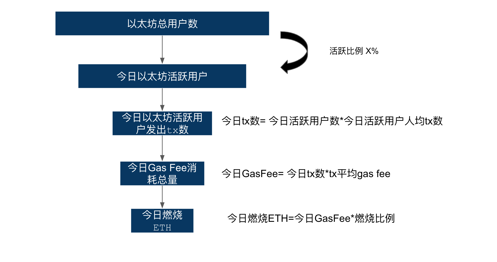
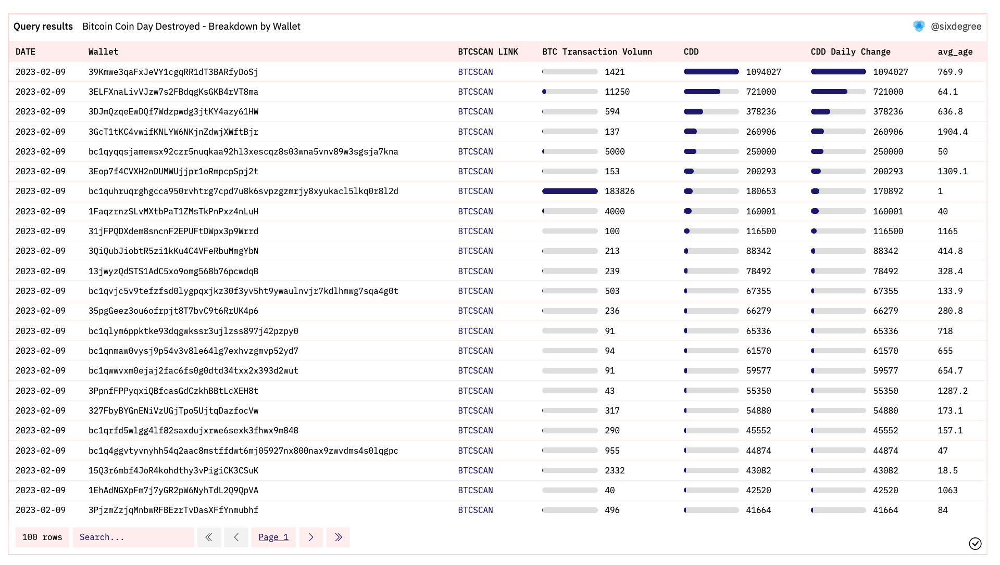

# 如何设计一个Dshboard-以BTC指标CDD(Coin Day Destroyed)为例
## 一、BTC CDD指标介绍

### 1.指标说明

CDD 是 Coin Day Destroyed 的简称，在某种程度上我们可以认为它是对链上交易量指标(Transaction Volumn)做了一些改进。具体的改进就思路就是在评估链上活动(Transfer)的时候引入时间特征：在链上处于长时间HODL状态(没有被转移到其他钱包)的Token发生移动的时候，我们给这次的转账赋予更大的权重。

这里我们引入一个新的概念叫币天(Coin Day)，`币天(Coin Day)  = Token数量 * 该Token保持HODL状态的天数`。

链上的所有BTC每天都在累积币天(Coin Day)，如果其中某一部分BTC发生了移动(从钱包A转移到钱包B)，那么这部分累积币天就会被消耗，这就是所谓的 Coin Day Destroyed 。      

    

### 2.底层逻辑

我们设计所有指标都是为了更好地刻画描述出我们想要反应的状况，对于这个指标来讲，它最终是希望反应长期持有者的一些行为。从这个角度来看这其实是一个Smart Money类型的指标，大家倾向于认为长期持有者是BTC早期的参与者，进而他们对BTC以及市场的理解是更聪明以及有经验的，如果他们的Token(长期处于HODL状态)发生了转移，那么很有可能是市场发生了一些变化促使他们采取了一些行动(在很多情况下是转到交易所或者通过OTC出售，但也存在其他的场景，不能一概而论)。

如果你经常用Glassnode，你会发现Glassnode上非常多的指标都是基于上述逻辑设计的，这个可以算是现有BTC链上数据分析的最重要的底层逻辑之一。

### 3.UTXO机制

这里需要引入关于BTC的一个基本常识：UTXO机制。理解它后才能明白应该如何利用Dune上的关于BTC的几张表完成上述的计算。

UTXO是 Unspent Transaction Output的简称，即未花费的交易产出。BTC现有的运行机制中其实没有Balance的概念，每个钱包的Balance是通过将与该钱包拥有的所有UTXO中包含的BTC数量求和得到的。

搜索到一篇文章感觉讲地比较通俗易懂，这里放一下链接：https://www.liaoxuefeng.com/wiki/1207298049439968/1207298275932480

## 二、 Dune相关表

如果你能大概理解Input，Output，UTXO这几个概念，就很容易能理解Dune上我们需要用到的2个表。这里对需要用到的表以及字段做一个简单的说明。

### 2.1 bitcoin.inputs 

- 说明：包含所有的Input相关的数据，即对于每个地址来说他们的每一笔BTC的消费/转出
- 重要字段
  - `address`：钱包地址
  - `block_time`：这次转出Transaction发生的时间
  - `tx_id`：这次转出Transaction的tx id
  - `value`：这次转出Transaction包含的BTC金额
  - `spent_tx_id`：这次产生Input(花费)是源于那个Output(我这次花的是之前收到哪笔钱)
    
       

### 2.2 bitcoin.outputs 

- 说明：包含所有的Output相关的数据，即对于每个地址来说他们的每一笔BTC的转入记录
- 重要字段
  - `address`：钱包地址
  - `block_time`：这次转出Transaction发生的时间
  - `tx_id`：这次转出Transaction的tx id
  - `value`：这次转出Transaction包含的BTC金额
  
    

## 三、Dashboard设计以及实现

### 1. 如何设计一个Dashboard
#### 1.1 整体思路

如何设计一个Dashbaord取决于我们使用Dashboard的最终目的。Dashbaord或者数据的最终目的是辅助人去做决策。在我看来数据能通过回答以下两个问题来辅助决策，能有效回答这两个问题才算是一个合格的Dashboard。

`[a].`XXX 是什么？ 它有什么特征？

通过一系列指标反映某个事物的基本特征以及现状（比如以太坊每天的用户量，tx数量，新增合约数量....）。

`[b].`反应XXX特征的一些重要指标发生了变化，原因是什么？

当`[a]`中的指标发生变化时我们去分析变化的原因或者说就是去寻找数据波动的原因。

#### 1.2 波动分析

`[a]`比较好理解，就不展开说了，指标体系设计的好坏取决于你对这个事物本身的理解程度，每个行业或者每个行业下每个细分领域其实都不一样。

我们可以说说分析波动，在我看来分析波动就是去做拆解。通常情况下可以从两个角度去拆解一个指标的波动，这里以太坊每天销毁数量的为例，假设某一天以太坊销毁量+30%，我们应该怎么分析？

**1.事物形成的过程**

`今日ETH燃烧 = 今日gas fee消耗总量 * 燃烧比例`

- `今日gas fee消耗总量 = 今日单个tx平均消耗gas fee * 今日 tx数`
  - `今日tx数 = 今日以太坊活跃用户 * 今日以太坊活跃用户平均发出tx数`
    - `今日以太坊活跃用户 = 以太坊总用户数 * 今日活跃比例`
- `燃烧比例：取决于EIP1559 或者是否有新的提案`    

    

**2.事物本身的特征**

- 时间：区分小时来看是24小时中哪个小时gas fee消耗上涨还是所有小时普遍上涨
- 空间：如果能拿到每个发起交易的钱包的ip去看否是是否某个国家的gas fee消耗大幅度上涨（实际做不到）
- 其他特征：是EOA地址的gas fee消耗上涨还是合约地址的gas fee消耗上涨
  - 如果是EOA地址，是BOT造成的，还是普通EOA地址；如果是普通EOA地址，是鲸鱼造成的还是普通钱包造成的
  - 如果是合约地址，是哪个类型的项目(Defi Gamefi...的合约gas fee消耗上涨，如果是Gamefi项目，具体是哪个合约造成的

上述是两大类拆解思路，通过将主指标一层一层拆解成子指标，就可以比较好地观察是那些子指标的波动造成了主指标的波动，进而推测最源头的原因。

### 2. Bitcoin - Coin Day Destroyed Matrix 的设计

回到这次的主题，我们开始设计 Bitcoin - Coin Day Destroyed 这个Dashboard。

#### 2.1 整体状况

首先是需要一张图反映整体的状况，因为只有CDD这一个指标比较简单，我就只放了一张历史趋势图。    

    

但是这个图的时间周期过长，我们很难通过这张图比较明显地看出近期CDD的变化，因此我又增加了一个近期的趋势。

     

PS：这里还是可以看到这轮下跌钱又明显的CDD异动的。

#### 2.2 波动分析

这里我只做了3个纬度的拆解：

- 按照时间(小时)拆解，这样我就指标异动发生在大概什么时间【统计最新一天的数据】    

    

- 按照发起Transaction的钱包地址拆解，这样我就知道指标异动是由什么引起的：是一个钱包还是很多钱包引起的，是一小部分`老币`，还是大量`新币`。【统计最新一天的数据】     

    

- 按照Transaction_ID这个非常细的粒度去拆解，这样我就知道异动具体是由哪些Transaction带来的，也可以去区块链浏览器中去核实。【统计最新一天的数据】    

    

- 除此之外，为了方便按照钱包地址去分析历史上任意一天的波动原因，我新增了一个工具模块，可以通过输入日期来查找历史上任意一天CDD按照钱包的分布    

    

### 3. 完成

就这样一个用于关注CDD的Dashboard就完成了.最终的效果就是你可以比较方便地看到该指标的历史趋势以及近期变化。如果某天发生异动，可以快速地定位到异动发生的时间以及关联钱包，具体的transaction_id辅助进一步分析。  

    

详细Dashboard见：https://dune.com/sixdegree/bitcoin-coin-day-destroyed-matrix  

补充一些更多的拆解思路：
- 尝试按照Transaction的目标地址去拆解，分成转入交易所的Tx的CDD以及普通的tx的CDD。这样你就知道CDD中有多大比例是有明确出售意向的
- 尝试按照钱包的类型去做拆解，我们可以尝试计算每个钱包出现大额CDD异动后价格下跌了的概率，然后定义出一些Smart Money，这样就把CDD拆解成了Smart Money CDD & Normal CDD

感兴趣可以自己fork Dashboard，去尝试去实现。

## SixdegreeLab介绍

SixdegreeLab（[@SixdegreeLab](https://twitter.com/sixdegreelab)）是专业的链上数据团队，我们的使命是为用户提供准确的链上数据图表、分析以及洞见，并致力于普及链上数据分析。通过建立社区、编写教程等方式，培养链上数据分析师，输出有价值的分析内容，推动社区构建区块链的数据层，为未来广阔的区块链数据应用培养人才。

欢迎访问[SixdegreeLab的Dune主页](https://dune.com/sixdegree)。

因水平所限，不足之处在所难免。如有发现任何错误，敬请指正。

