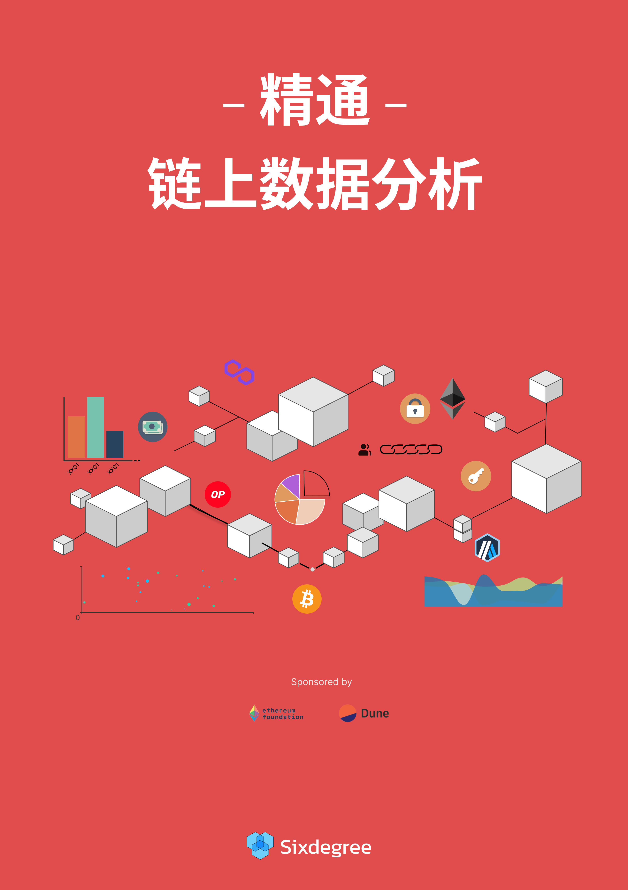

# 精通链上数据分析

  

本教程是一个面向区块链爱好者的系列教程，帮助新手用户从零开始学习区块链数据分析，成为一名链上数据分析师。

- 英文版本: [Mastering Onchain Analytics](https://tutorial.sixdegree.xyz)
- 中文版本: [精通链上数据分析](https://tutorial.sixdegree.xyz/v/zh/)

> 参与贡献: [https://github.com/SixdegreeLab/MasteringChainAnalytics](https://github.com/SixdegreeLab/MasteringChainAnalytics)

# 目录

- **简介**
  - [简介](readme.md)
  - [#0 成为链上数据分析师](ch00/ch00-become-chain-analyst.md)

- **入门教程**
  - [#1 Dune平台简介](ch01/ch01-dune-platform-introduction.md)
  - [#2 数据分析新手上路](ch02/ch02-quickstart.md)
  - [#3 创建第一个Dune数据看板](ch03/ch03-build-first-dashboard.md)
  - [#4 熟悉数据表](ch04/ch04-understanding-tables.md)
  - [#5 SQL基础（一）](ch05/ch05-sql-basics-part1.md)
  - [#6 SQL基础（二）](ch06/ch06-sql-basics-part2.md)
  - [#7 实践案例：制作Lens的数据看板（一）](ch07/ch07-practice-build-lens-dashboard-part1.md)
  - [#8 实践案例：制作Lens的数据看板（二）](ch08/ch08-practice-build-lens-dashboard-part2.md)

- **中级教程**
  - [#9 常见查询一：ERC20代币价格](ch09/ch09-useful-queries-part1.md)
  - [#10 常见查询二：代币的持有者、总供应量、账户余额](ch10/ch10-useful-queries-part2.md)
  - [#11 常见查询三：自定义数据、数字序列、数组、JSON等](ch11/ch11-useful-queries-part3.md)
  - [#12 NFT数据分析](ch12/ch12-nft-analysis.md)
  - [#13 借贷协议数据分析](ch13/ch13-lending-analysis.md)
  - [#14 DeFi数据分析](ch14/ch14-defi-analysis.md)
  - [#15 Dune SQL 查询引擎入门](ch15/ch15-dunesql-introduction.md)
  - [#16 Polygon区块链概况分析](ch16/ch16-blockchain-analysis-polygon.md)
  - [#17 MEV数据分析——以Uniswap为例](ch17/ch17-mev-analysis-uniswap.md)
  - [#18 Uniswap多链数据对比分析](ch18/ch18-uniswap-multichain-analysis.md)
  - [#19 各类常见指标分析](ch19/ch19-useful-metrics.md)

- **高级教程**
  - [#20 区块链网络分析](ch20/ch20-network-analysis.md)
  - [#21 BTC数据分析-以指标CDD为例](ch21/ch21-btc-analysis.md)
  - [#22 如何构建魔法表（Spellbook）](ch22/ch22-how-to-build-spellbook.md)
  - [#23 使用Dune API创建应用程序](ch23/ch23-how-to-build-app-use-dune-api.md)

## 关于我们
`Sixdegree`是专业的链上数据团队，我们的使命是为用户提供准确的链上数据图表、分析以及洞见，并致力于普及链上数据分析。
通过建立社区、编写教程等方式，培养链上数据分析师，输出有价值的分析内容，推动社区构建区块链的数据层，为未来广阔的区块链数据应用培养人才。

- Website: [sixdegree.xyz](https://sixdegree.xyz)
- Email: [contact@sixdegree.xyz](mailto:contact@sixdegree.xyz)
- Twitter: [twitter.com/SixdegreeLab](https://twitter.com/SixdegreeLab)
- Dune: [dune.com/sixdegree](https://dune.com/sixdegree)
- Github: [https://github.com/SixdegreeLab](https://github.com/SixdegreeLab)
